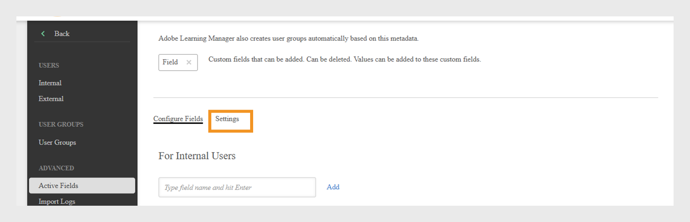

# 活动字段

Adobe Learning Manager中的活动字段是自定义用户属性，可帮助管理员有效地整理和管理用户。 它们允许您捕获有关用户的额外信息，如部门、位置或职务。 管理员可以使用此数据更高效地创建用户组、个性化学习和过滤报告。

用户属性是一些信息，如用户的名字、姓氏和电子邮件地址。 这些属性可帮助管理员：

* 识别用户
* 组用户
* 管理用户权限和访问限制

通过向用户配置文件添加自定义属性，活动字段可以捕获与您的组织相关的其他信息。

>[!INFO]
>
>观看此ALM Academy培训，了解如何添加、自定义和配置活动字段。  

## 添加活动字段

活动字段适用于内部和外部学习者，允许组织为所有用户定义和管理自定义用户属性。

要添加或管理内部用户的活动字段，请执行以下操作：

1. 在管理员主页上，选择&#x200B;**用户**。

2. 选择&#x200B;**活动字段**。

3. 键入活动字段名称，然后选择&#x200B;**添加**。 为外部学习者添加活动字段的流程与为内部学习者添加活动字段的流程相同。

   
   _用于输入用户的新自定义属性名称的字段_

4. 选择&#x200B;**“保存”**。

## 将自定义值添加到活动字段

活动字段可以包括符合您组织结构的预定义值或自定义值。 添加自定义值有助于捕获特定于内部用户的详细信息，例如部门名称、职务级别或地区办事处。

要为内部用户添加自定义值，请执行以下操作：

1. 在&#x200B;**活动字段**&#x200B;部分下选择&#x200B;**查看值**。
2. 在&#x200B;**自定义字段中的值**&#x200B;对话框中：

   * 从&#x200B;**选择字段**&#x200B;下拉菜单中选择活动字段。
   * 在&#x200B;**新值**&#x200B;字段中键入活动字段的值。

   
   _用于输入特定活动字段的自定义值的对话框_

3. 选择&#x200B;**完成**，然后选择&#x200B;**保存**&#x200B;以应用更改。

## 配置活动字段设置

自定义活动字段以帮助用户管理和报告任务，并配置活动字段属性：

* **可分组**：此选项允许您根据活动字段值对学习者进行分组。
* **可报告**：此选项允许您根据活动字段值创建报告用户组，并为仪表板报告中的字段启用报告过滤器。
* **学习者可配置**：此选项允许学习者自行配置字段。
* **可导出**：此选项包括导出的用户组报告中的活动字段。
* **多值**：此选项支持活动字段的多个值。

要配置活动字段设置，请执行以下操作：

1. 选择&#x200B;**设置**&#x200B;选项卡，然后导航到&#x200B;**用户显示**&#x200B;部分。

   
   _选择“设置”选项卡以自定义活动字段_

2. 根据需要，选择一个或两个选项。：

   * **在学习者登录时仅显示未填写的字段：**&#x200B;选择此选项后，学习者将仅看到他们尚未填写的活动字段。 这将提示他们填写个人资料，帮助确保用户数据准确且处于最新状态。 显示这些字段支持完整的学习者配置文件并支持个性化的学习体验。
   * **如果未选中，“填写您的个人资料”页面不会向用户显示：**&#x200B;如果禁用此选项，学习者登录时将看不到&#x200B;**填写您的个人资料**&#x200B;页面。 系统不会提示他们更新或填写任何配置文件信息，他们可以直接访问平台。

   
   _用于控制活动字段显示方式和时间的设置界面_

3. 选择&#x200B;**保存**&#x200B;以应用更改。

>[!NOTE]
>
>分配新角色不会影响自定义用户组。 但是，它将会影响自动生成的用户组，例如所有管理员、所有作者以及类似的基于角色的组。

## 多值活动字段

多值活动字段允许您将多个值分配给单个用户属性，例如位置、职务或项目团队。 这有助于捕获更详细和更灵活的用户信息。

每个帐户最多可以配置三个多值活动字段。 这些应用程序可供内部和外部用户使用。 将字段设置为多值字段后，无法更改回此设置。

要将多个值分配给活动字段，请执行以下操作：

1. 选择&#x200B;**用户**，然后选择&#x200B;**活动字段**。
2. 在&#x200B;**设置**&#x200B;选项卡中，选择&#x200B;**多值**。

_用于控制活动字段显示方式和时间的设置界面_

您可以通过CSV或用户界面添加多个值。 在用户组中使用多值字段后，无法将其更改为单值字段。

## 通过上传CSV来添加活动字段

在通过CSV上传用户时添加活动字段，方法是为每个定义的字段添加匹配的标头。 管理员可以使用CSV文件批量上传用户。 CSV应包含用于定义要导入的用户的新活动字段。 确保文件中的标头名称与系统中设置的活动字段完全匹配，以便数据能够正确映射。 从&#x200B;**用户**&#x200B;部分上传CSV文件。

有关批量添加用户的详细信息，请查看此[文章](/help/migrated/administrators/feature-summary/add-users-user-groups.md)。

## 限制CSV字段的值

**自定义字段中的值**&#x200B;中的&#x200B;**限制选择**&#x200B;选项控制通过CSV文件导入数据的用户是否只能从自定义字段的预定义值中进行选择。 启用后，用户必须从设置的值列表中选择值，确保数据一致性并防止新的或意外的条目。 如果禁用此设置，用户可以输入任何值，从而提供更大的灵活性但对数据准确性的控制更少。

_用于在CSV上传期间启用值限制的复选框_

## 管理用户CSV导入中缺少的活动字段

在某些情况下，管理员希望学习者在登录到Adobe Learning Manager时手动填写某些活动字段。 对于通过CSV文件导入的用户，此功能受支持。 请参阅此[文章](/help/migrated/administrators/feature-summary/add-users-user-groups.md)，了解如何批量添加用户。 根据Box FTP字段值，用户会自动添加到活动字段或基于角色的组中。 无法将它们添加到自定义组。

如果CSV文件不包含所有活动字段，则管理员必须在导入后手动输入缺少的值。

默认情况下，每个活动字段都必须映射到源CSV中的相应字段。 但是，如果您不想将特定的活动字段映射到CSV中的任何列，则可以在Box和FTP导入过程中从下拉列表中选择值&#x200B;**DontImportFromSource**。 通过FTP或Box连接器导入用户时，可使用此选项。 有关连接器的更多信息，请参阅此[文章](https://experienceleague.adobe.com/en/docs/learning-manager/using/integration/connectors)。

