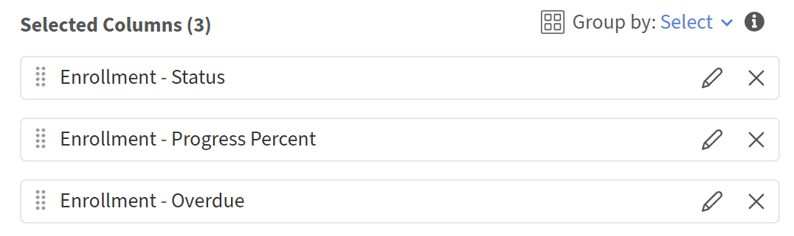
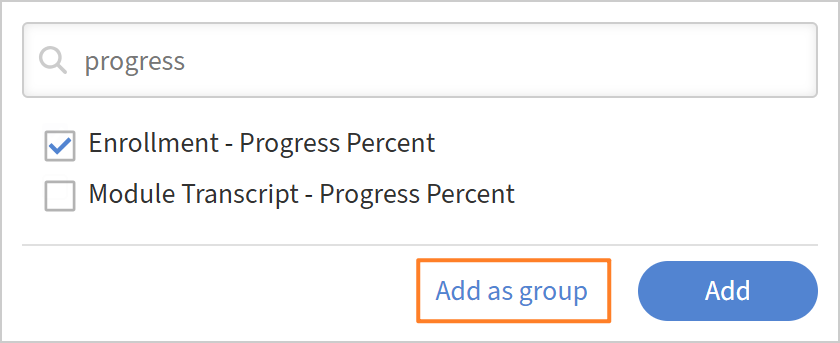

# 在报告中添加和合并过滤器

## 概述

通过过滤器，可将报告范围限定为完全符合您需要的记录。 您可以应用单个过滤器，使用AND或OR逻辑组合多个过滤器，并为复杂条件创建嵌套组。

## 添加滤镜

使用筛选器将报告限制为特定的数据子集，而不是查看所有内容。

例如，您可能希望了解过去365天内注册了课程的学习者数量。 在这种情况下，您可以对注册日期应用日期过滤器，以仅包括最近的活动。

1. 启动Report Builder并选择&#x200B;**创建报告**。
2. 键入报表的名称和说明。
3. 选择以下列： <dataset>:<column name>

   * 注册 — 注册日期
   * 用户 — 名称

   

4. 在“报告”部分，选择&#x200B;**添加筛选器**。
5. 搜索或浏览到要筛选的字段。 在此示例中，选择&#x200B;**注册 — 注册日期**。

   

6. 选择&#x200B;**添加**。
7. 选择一个运算符。 可用的运算符取决于字段的数据类型：

   * 字符串字段 — 包含、等于、开头为
   * 数字字段 — 大于、小于、等于、介于
   * 日期字段 — 等于、之前、之后、介于、过去N天
   * 列表（枚举）字段 — 在，不在

8. 在这种情况下，选择&#x200B;**位于去年**&#x200B;内。

   

9. 选择&#x200B;**保存报告**&#x200B;并选择&#x200B;**操作** > **下载**&#x200B;以下载报告。

下载的报告会列出过去365天内注册学习对象的所有用户。

## 添加多个带有AND/OR逻辑的筛选器

添加第二个筛选器时，筛选器之间的默认关系为AND；两个条件都必须为True，才能显示行。

例如，您可能希望确定过去365天内已注册课程并向特定经理报告的学习者。 在这种情况下，两个条件都必须为true，因此使用AND逻辑组合筛选器。

1. 启动Report Builder并选择&#x200B;**创建报告**。
2. 键入报表的名称和说明。
3. 选择以下列： <dataset>:<column name>

   * 用户 — 名称
   * 用户 — 经理姓名
   * 注册 — 注册日期

4. 按&#x200B;**用户管理器名称**&#x200B;列分组。
5. 在筛选条件部分，选择以下筛选条件：

   * 注册 — 注册日期为去年&#x200B;**月**&#x200B;日之内
   * 用户 — 管理器名称&#x200B;**以** N开头
   * 用户 — 管理器名称&#x200B;**不为空**

     

6. 选择&#x200B;**保存报告**&#x200B;并选择&#x200B;**操作** > **下载**&#x200B;以下载报告。

下载的报告会列出过去365天内注册学习对象的所有用户，**和**&#x200B;向名称以N开头的经理报告。

## 创建嵌套筛选器组

嵌套组使您可以构建具有多个逻辑级别的条件，这相当于公式中的括号。 例如：（目录=安全或目录=卫生条件），完成日期在最近90天内。

当逻辑包含必须一起评估的AND和OR条件组合时，请使用嵌套筛选器组。

例如，使用嵌套筛选逻辑可识别学习者进度低于50%或培训过期的不完整注册，并展示AND和OR条件如何协同工作。

1. 启动Report Builder并选择&#x200B;**创建报告**。
2. 键入报表的名称和说明。
3. 选择以下列： <dataset>:<column name>

   * 注册 — 状态
   * 登记 — 进展百分比
   * 注册 — 过期

     

4. 在&#x200B;**筛选器**&#x200B;部分中，选择以下筛选器：

   * 注册状态&#x200B;**不等于**&#x200B;个注册中的任何一个注册已完成。
   * 选择+.
   * 搜索注册进度百分比。
   * 选择过滤器。
   * 选择&#x200B;**添加为组**。

     

5. 添加注册 — 进度百分比&#x200B;**小于** 50。

   

6. 选择+.
7. 搜索&#x200B;**Enrollment-Overdue**。
8. 选择过滤器。
9. 选择&#x200B;**添加为组**。

   

10. Add Enrollment-Overdue等于TRUE。
11. 将嵌套的AND更改为OR。

    

12. 选择&#x200B;**保存报告**&#x200B;并选择&#x200B;**操作** > **下载**&#x200B;以下载报告。

下载的报告会列出所有正在进行或未开始的注册、其进度百分比低于50%或逾期注册。
