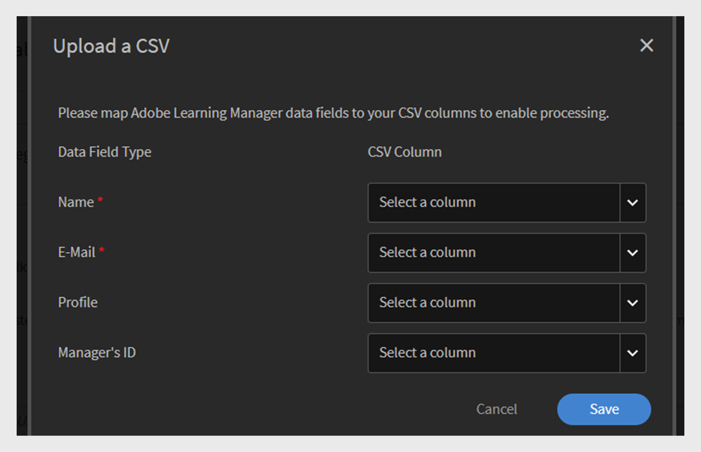

# 在Adobe Learning Manager中添加用户

在Adobe Learning Manager中，用户是使用该平台进行学习或培训的学习者。 用户有两种类型：内部用户和外部用户。

内部用户是您组织中的员工或团队成员。

外部用户是公司外部的学习者，例如客户、合作伙伴、供应商或客户，可以访问您的学习内容。

Adobe Learning Manager (ALM)允许管理员使用多种方法（包括手动输入、CSV上传、自行注册和系统集成）登记和管理内部和外部用户。

## 内部用户

Adobe Learning Manager中的内部用户是指您组织内的员工或团队成员。 可手动添加它们、批量上传它们或通过系统集成导入它们。 添加这些用户后，您可以将其编为组、分配课程并监控其学习进度。

Adobe Learning Manager中的用户可以承担不同的责任，并根据分配的角色管理各种任务。 每个角色（包括管理员、作者、讲师和集成管理员）都提供了一组专门定制的特定功能，以支持用户在平台内的职责。

### 添加内部用户的方法

管理员可以使用以下方法添加内部用户：

* **添加单个用户**：一次手动添加一个用户。
* **自行注册个人资料**：允许学习者使用管理员创建的注册链接，在Adobe Learning Manager中自行注册为学习者。
* **通过CSV批量上传**：上传CSV文件以同时添加多个用户。

### 手动添加内部用户

管理员可以通过提供用户名、电子邮件、唯一标识符和经理姓名手动添加用户。 Adobe Learning Manager中的唯一标识符是管理员在创建用户时分配的必需标识符。 对于每个用户，它必须是唯一的，并且在整个系统中充当一致的参考。

>[!INFO]
>
>观看此ALM Academy培训，了解有关在Adobe Learning Manager中添加单个用户的更多信息。  

要将单个用户添加到Adobe Learning Manager，请执行以下操作：

1. 以管理员身份登录。
2. 选择&#x200B;**用户**，然后选择&#x200B;**内部**。
3. 选择&#x200B;**添加**，然后选择&#x200B;**单个用户**。

   
   _显示手动添加单个内部用户的选项的管理员界面_
4. 在&#x200B;**添加用户**&#x200B;提示下，键入用户的&#x200B;**姓名**、**电子邮件**&#x200B;和&#x200B;**个人资料**（职务）。

   
   _用于为新用户输入姓名、电子邮件、唯一标识符和配置文件的字段_
5. 搜索用户的经理，然后从经理列表中选择名称。
6. 选择&#x200B;**添加**。
用户会收到一封欢迎电子邮件，其中包含用于访问的登录URL。

### 允许内部用户自行注册

自助注册是一种自助入门流程，用户可访问注册URL、输入其详细信息以及自动注册平台。 此方法通过允许用户通过提供的URL自行注册，最大程度地减少了管理工作。

要为用户创建自注册URL，请执行以下操作：

1. 以管理员身份登录。
2. 选择&#x200B;**用户**，然后选择&#x200B;**内部**。
3. 选择&#x200B;**添加**，然后选择&#x200B;**自行注册。**

   
   _用于选择自行注册选项的下拉菜单_
4. 在&#x200B;**添加自行注册个人资料**&#x200B;提示下，在&#x200B;**个人资料名称**（用户的职务）字段中键入个人资料。
5. 通过在&#x200B;**经理的名称**&#x200B;字段中搜索经理来选择用户的经理。 分配给自行注册配置文件的经理应该是Adobe Learning Manager中的注册用户。

   
   _用于设置个人资料名称并将经理分配给自行注册个人资料的输入字段_
6. 使用&#x200B;**添加图像**&#x200B;选项选择图像。 学习者可以在个人资料部分看到此图像。
7. 选择&#x200B;**“保存”**。

   Adobe Learning Manager会创建一个用户配置文件并生成一个自注册URL，该URL可与用户共享以完成其注册。

   
   _指示成功创建自注册URL的确认消息_
8. 与要自行注册的用户共享该URL。

   可以与多个用户共享该URL以进行注册。 例如，您可以为&#x200B;**Sales Associate**&#x200B;配置文件生成一个URL，并与Sales Associate团队共享该URL，以便他们可以自行注册。

_自助注册链接可打开注册页面_

### 查看自行注册URL的列表

要查看自行注册URL的列表，请执行以下操作：

1. 选择&#x200B;**用户**，然后选择&#x200B;**内部**。
2. 选择&#x200B;**自行注册**。

   管理员可以查看自行注册URL的列表。

_显示可供内部用户使用的现有自行注册URL的列表视图_

### 批量上传内部用户

管理员可以通过上传包含用户名、电子邮件地址和经理姓名等用户信息的CSV文件，一次添加多个用户。 与单独添加用户相比，此批量上传功能可节省时间和精力。

>[!INFO]
>
>观看此ALM Academy培训，了解如何通过CSV批量添加用户。   

要添加多个用户，请执行以下操作：

1. 以管理员身份登录。
2. 选择&#x200B;**用户**，然后选择&#x200B;**内部**。
3. 选择&#x200B;**添加**，然后选择&#x200B;**上传CSV**。

   
   _用于上传CSV文件以进行批量用户导入的选项_

4. 准备包含以下字段的CSV文件：

   * 员工姓名*
   * 员工电子邮件*
   * 员工简介/职称
   * 经理的ID/电子邮件\
     (*)必填字段。

5. 在为任何员工添加经理电子邮件ID之前，请确保该经理已作为员工包含在CSV文件中。 例如，在以下快照中看到名为Howard Walters的员工。

   
   _包含所有字段的示例CSV图像_

6. 上传CSV文件并相应地映射数据字段。

   
   _用于使电子表格列与系统字段对齐的CSV映射界面_
7. 选择&#x200B;**保存**&#x200B;以导入用户。

   上传成功后，会显示确认消息。

   
   _图像显示CSV上传状态为成功_

>[!NOTE]
>
>维护所有添加和删除的主CSV。 不支持更新和重新上传现有CSV文件。

上传CSV文件以添加用户时，请务必按正确顺序包含所有相关信息。 如果将经理的电子邮件ID分配给员工，则经理的详细信息必须显示在CSV文件的上面。 这可确保在将经理链接至其团队成员之前，系统将其识别为现有用户。 例如，如果Howard Walters是一名经理，在列出向其报告的员工之前，应在CSV中包含他的完整用户详细信息。

### 管理用户注册

单独或批量添加用户后，您需要注册用户才能激活其帐户。 这允许用户访问Adobe Learning Manager并开始使用平台。

要注册用户，请执行以下操作：

1. 在管理员主页上选择&#x200B;**用户**。
2. 选中要注册的用户名称旁边的复选框。
3. 选择“**操作**”，然后选择“**注册**”。

   
   _“注册”按钮以激活Adobe Learning Manager中的选定用户_

4. 选择&#x200B;**是**&#x200B;以激活该用户。

随后将一封验证电子邮件发给用户。 用户必须选择电子邮件中的链接才能激活其帐户并开始使用Adobe Learning Manager。

## 外部用户

Adobe Learning Manager允许您添加公司以外的用户（例如客户、合作伙伴、供应商或客户）访问学习内容。 添加课程后，您可以将其分组、分配课程并跟踪其学习进度。

在Adobe Learning Manager中添加外部用户涉及以下步骤：

* 创建外部注册个人资料
* 启用注册配置文件
* 与外部用户共享注册链接
* 根据需要暂停或继续配置文件

Adobe Learning Manager支持通过外部注册配置文件注册此类用户。

要创建外部用户，请执行以下步骤：

1. 以管理员身份登录。
2. 选择&#x200B;**用户**，然后选择&#x200B;**外部**。
3. 选择&#x200B;**添加**&#x200B;以创建外部用户的注册。
4. 在&#x200B;**添加外部注册配置文件**&#x200B;对话框中，提供以下内容：

   * **配置文件名称：**&#x200B;键入名称。
   * **经理电子邮件：**&#x200B;键入经理的电子邮件地址。
   * **名额限制：**&#x200B;设置允许的最大注册数。
   * **到期：**&#x200B;定义新注册的最后日期。 过期后，该链接将不再适用于新用户注册。

   
   _用于输入配置文件名称、经理的电子邮件、名额限制和到期日的对话框_

5. 使用&#x200B;**添加图像**&#x200B;选项选择一个图像。 学习者可以在个人资料部分看到此图像。
6. 选择“**高级设置**”部分以将其展开并键入所需的详细信息：
   * **登录要求：**&#x200B;键入天数。 如果学习者在整个学习期内一直处于非活动状态，则将自动将其删除。
   * **允许的域：**&#x200B;键入允许的电子邮件域的逗号分隔列表。 只有电子邮件地址来自获批准的域的用户才能注册。
   * **需要电子邮件验证：**&#x200B;选择此项以在注册期间强制执行电子邮件验证。

   
   _高级设置面板，用于设置登录要求、允许的域和电子邮件验证_

7. 选择&#x200B;**“保存”**。

生成注册URL。

### 启用外部个人资料

要启用外部个人资料，请执行以下操作：

1. 在外部配置文件列表中找到新创建的配置文件。
2. 选择&#x200B;**状态**&#x200B;切换按钮以启用它。

管理员可以与外部合作伙伴共享此URL，以便他们可以使用该URL注册并登录Adobe Learning Manager。

_选择切换开关以启用外部配置文件_

### 复制和共享外部配置文件的注册URL

可以从&#x200B;**外部用户**&#x200B;部分复制外部配置文件的注册URL。

_复制外部配置文件的注册URL_

### 内部和外部用户注册之间的主要区别

内部和外部注册之间存在一些差异：

| 内部用户 | 外部用户 |
|---|---|
| 可以使用Adobe ID或SSO凭据登录。 | 可以使用任何电子邮件ID登录。 |
| 游戏功能可用。 | 游戏功能可用。 管理员必须在[游戏设置](https://experienceleague.adobe.com/en/docs/learning-manager/using/admin/gamification)中为外部学习者启用游戏。 |

### 暂停外部注册配置文件

在Adobe Learning Manager中，管理员可以通过暂停其配置文件来管理外部用户注册。 当您希望暂时禁止新用户使用特定的外部注册配置文件加入时，此功能非常有用。 暂停配置文件会阻止已收到邀请但尚未注册的用户完成注册过程。 此操作不会影响已完成其注册的用户。

暂停外部配置文件：

1. 选择&#x200B;**外部用户**&#x200B;页面右上角的&#x200B;**操作**。
2. 选择“**暂停**”以暂停外部注册配置文件。

这将阻止未接受其邀请的用户进行新注册。 请注意，此操作仅影响尚未完成其注册的用户。

_从“操作”菜单中暂停现有外部注册配置文件的选项_

### 恢复外部注册个人资料

如果外部个人资料之前已暂停，管理员可以恢复该个人资料，以便新用户完成注册。 这将为受邀但未完成注册的用户重新激活注册流程。

恢复外部用户：

1. 选择页面右上角的&#x200B;**操作**。
2. 选择&#x200B;**恢复**&#x200B;以恢复暂停的合作伙伴的访问。

_恢复以前暂停的外部注册个人资料的选项_

### 监控外部座位使用情况

管理员可以在“Adobe学习”中跟踪添加到每个外部个人资料的用户数。

要检查使用的坐席，请执行以下操作：

1. 在外部个人资料列表中选择&#x200B;**使用的坐席**。

您可以查看添加到合作伙伴公司的学习者数量以及学习者是否处于活动状态。

## 管理用户

管理员可以编辑用户详细信息、删除用户、分配角色和删除角色。 这有助于确保每个用户都拥有正确的访问权限和任务。

>[!INFO]
>
>观看此ALM Academy培训，了解如何分配和删除角色、发送欢迎电子邮件以及删除和清除用户。 [！[按钮]](https://content.adobelearningmanageracademy.com/app/learner?accountId=98632#/course/7555586) 

### 编辑用户

使用Adobe Learning Manager中的&#x200B;**编辑用户**&#x200B;选项更新用户的个人资料信息，如姓名、电子邮件地址、唯一标识符、个人资料和经理姓名。 管理员可以作出这些更改，以确保用户数据保持准确且最新。

要编辑用户，请执行以下操作：

1. 在管理员主页上选择&#x200B;**用户**。
2. 从&#x200B;**用户**&#x200B;列表中选择要编辑的用户。
3. 选择&#x200B;**编辑配置文件**。

   
   _“操作”菜单下的“删除用户”选项可将用户从平台中删除_

4. 选择“**是**”以删除该用户。

成功删除用户后，系统会显示一条确认消息。

## 为用户分配角色

Adobe Learning Manager中的用户角色定义了每个人都可以在系统中执行的操作。 每个角色均具有基于用户责任的特定权限。

Adobe Learning Manager支持以下用户角色：

* **管理员**：管理用户和用户组、分配角色并配置系统范围的首选项，如数据源、允许的域和显示选项。 管理员还负责创建和组织学习内容、跟踪学习者进度、生成报告以及设置与外部系统的集成。
* **作者**：创建和管理内容，包括模块和课程。
* **经理**：监督团队学习活动、指定团队成员参加课程、批准请求和提供反馈。
* **集成管理员**：管理ALM和外部平台之间的系统集成和数据连接。
* **自定义角色**：管理员可以创建自定义角色，以根据用户的责任为其提供定制的访问权限。 有关自定义角色的更多信息，请参阅此[文章](/help/migrated/administrators/feature-summary/custom-role.md)。

要将角色分配给用户，请执行以下操作：

1. 在管理员主页上选择&#x200B;**用户**。
2. 选择要分配角色的用户。
3. 选择右上角的&#x200B;**操作**。
4. 选择&#x200B;**分配角色**。
5. 选择所需的角色。

   
   _“分配角色”菜单选项显示所选用户的可用角色_

6. 在确认对话框中选择&#x200B;**是**。

## 删除角色

删除用户角色将撤销该角色授予的权限。

要从用户中删除角色，请执行以下操作：

1. 在管理员主页上，选择&#x200B;**用户**。
2. 选择要删除其角色的用户。
3. 选择&#x200B;**操作**，然后选择&#x200B;**删除角色**。

   
   _用于从“操作”菜单下的用户中删除已分配角色的选项_

4. 在确认对话框中选择&#x200B;**是**。

