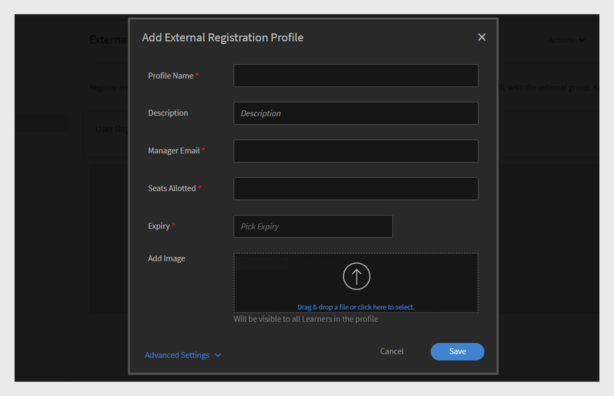

# 在Adobe Learning Manager中添加用户

在Adobe Learning Manager中，用户是使用该平台进行学习或培训的学习者。 用户有两种类型：内部用户和外部用户。

内部用户是您组织中的员工或团队成员。

外部用户是公司外部的学习者，例如客户、合作伙伴、供应商或客户，可以访问您的学习内容。

Adobe Learning Manager (ALM)允许管理员使用多种方法（包括手动输入、CSV上传、自行注册和系统集成）登记和管理内部和外部用户。

## 内部用户

Adobe Learning Manager中的内部用户是指您组织内的员工或团队成员。 可手动添加它们、批量上传它们或通过系统集成导入它们。 添加这些用户后，您可以将其编为组、分配课程并监控其学习进度。

Adobe Learning Manager中的用户可以承担不同的责任，并根据分配的角色管理各种任务。 每个角色（包括管理员、作者、讲师和集成管理员）都提供了一组专门定制的特定功能，以支持用户在平台内的职责。

Adobe Learning Manager支持以下用户角色：

* **管理员**：管理用户和用户组、分配角色并配置系统范围的首选项，如数据源、允许的域和显示选项。 管理员还负责创建和组织学习内容、跟踪学习者进度、生成报告以及设置与外部系统的集成。
* **作者**：创建和管理内容，包括模块和课程。
* **经理**：监督团队学习活动、指定团队成员参加课程、批准请求和提供反馈。
* **集成管理员**：管理ALM和外部平台之间的系统集成和数据连接。
* **自定义角色**：管理员可以创建自定义角色，以根据用户的责任为其提供定制的访问权限。 有关自定义角色的更多信息，请参阅这篇文章。

### 添加内部用户的方法

管理员可以使用以下方法添加内部用户：

* **添加单个用户**：一次手动添加一个用户。
* **自行注册个人资料**：允许学习者使用管理员创建的注册链接，在Adobe Learning Manager中自行注册为学习者。
* **通过CSV批量上传**：上传CSV文件以同时添加多个用户。

### 手动添加内部用户

管理员可以通过输入个人用户的姓名、电子邮件ID、唯一标识符和经理姓名来手动添加个人用户。 Adobe Learning Manager中的唯一标识符是管理员在创建用户时分配的必需标识符。 对于每个用户，它必须是唯一的，并且在整个系统中充当一致的参考。

>[!INFO]
>
>观看此ALM Academy培训，了解有关在Adobe Learning Manager中添加单个用户的更多信息。  

要将单个用户添加到Adobe Learning Manager，请执行以下操作：

1. 以管理员身份登录。
2. 选择&#x200B;**用户**，然后选择&#x200B;**内部**。
3. 选择&#x200B;**添加**，然后选择&#x200B;**单个用户**。

   
   _显示手动添加单个内部用户的选项的管理员界面_
4. 在&#x200B;**添加用户**&#x200B;提示下，键入用户的&#x200B;**姓名**、**电子邮件**&#x200B;和&#x200B;**个人资料**（职务）。

   
   _用于为新用户输入姓名、电子邮件、唯一标识符和配置文件的字段_
5. 搜索用户的经理，然后从经理列表中选择名称。
6. 选择&#x200B;**添加**。
用户会收到一封欢迎电子邮件，其中包含用于访问的登录URL。

### 允许内部用户自行注册

自助注册是一种自助入门流程，用户可访问注册URL、输入其详细信息以及自动注册平台。 此方法通过允许用户通过提供的URL自行注册，最大程度地减少了管理工作。

要为用户创建自注册URL，请执行以下操作：

1. 以管理员身份登录。
2. 选择&#x200B;**用户**，然后选择&#x200B;**内部**。
3. 选择右上角的“**添加**”，然后选择“**自行注册”。**

   
   _用于选择自行注册选项的下拉菜单_
4. 在&#x200B;**添加自行注册个人资料**&#x200B;提示下，在&#x200B;**个人资料名称**（用户的职务）字段中键入个人资料。
5. 通过在&#x200B;**经理的名称**&#x200B;字段中搜索经理来选择用户的经理。 分配给自行注册配置文件的经理应该是Adobe Learning Manager中的注册用户。

   
   _用于设置职称和为经理分配自助注册个人资料的输入字段_
6. 使用&#x200B;**添加图像**&#x200B;选项选择图像。 学习者可以在个人资料部分看到此图像。
7. 选择&#x200B;**“保存”**。

   Adobe Learning Manager会创建一个用户配置文件并生成一个自注册URL，该URL可与用户共享以完成其注册。

   
   _指示成功创建自注册URL的确认消息_
8. 与要自行注册的用户共享该URL。

   可以与多个用户共享该URL以进行注册。 例如，您可以为&#x200B;**Sales Associate**&#x200B;配置文件生成一个URL，并与Sales Associate团队共享该URL，以便他们可以自行注册。

_自助注册链接可打开注册页面_

### 查看自行注册URL的列表

要查看自行注册URL的列表，请执行以下操作：

1. 选择&#x200B;**用户**，然后选择&#x200B;**内部**。
2. 选择&#x200B;**自行注册**。

   管理员可以查看自行注册URL的列表。

_显示可供内部用户使用的现有自行注册URL的列表视图_

### 批量上传内部用户

Adobe Learning Manager允许管理员通过上传包含用户信息（包括姓名、电子邮件ID和经理姓名）的CSV一次添加多个用户。 与单独添加用户相比，此批量上传功能可节省时间和精力。

>[!INFO]
>
>观看此ALM Academy培训，了解如何通过CSV批量添加用户。   

要添加多个用户，请执行以下操作：

1. 以管理员身份登录。
2. 选择&#x200B;**用户**，然后选择&#x200B;**内部**。
3. 选择右上角的&#x200B;**“添加”**，然后选择&#x200B;**“上传CSV”**。

   
   _用于上传CSV文件以进行批量用户导入的选项_

4. 准备包含以下字段的CSV文件：

   * 员工姓名*
   * 员工电子邮件*
   * 员工简介/职称
   * 经理的ID/电子邮件\
     (*)必填字段。

5. 在为任何员工添加经理电子邮件ID之前，请确保该经理已作为员工包含在CSV文件中。 例如，在以下快照中看到名为Howard Walters的员工。

   
   _包含所有字段的示例CSV图像_

6. 上传CSV文件并相应地映射数据字段。

   
   _用于使电子表格列与系统字段对齐的CSV映射界面_
7. 选择&#x200B;**保存**&#x200B;以导入用户。

   上传成功后，会显示确认消息。

   
   _图像显示CSV上传状态为成功_

>[!NOTE]
>
>维护所有添加和删除的主CSV。 不支持更新和重新上传现有CSV文件。

上传CSV文件以添加用户时，请务必按正确顺序包含所有相关信息。 如果将经理的电子邮件ID分配给员工，则经理的详细信息必须显示在CSV文件的上面。 这可确保在将经理链接至其团队成员之前，系统将其识别为现有用户。 例如，如果Howard Walters是一名经理，在列出向其报告的员工之前，应在CSV中包含他的完整用户详细信息。

### 管理用户注册

单独或批量添加用户后，您需要注册用户才能激活其帐户。 这允许用户访问Adobe Learning Manager并开始使用平台。

要注册用户，请执行以下操作：

1. 在管理员主页上选择&#x200B;**用户**。
2. 选中要注册的用户名称旁边的复选框。
3. 选择&#x200B;**操作**，然后选择&#x200B;**注册**。

   
   _“注册”按钮以激活Adobe Learning Manager中的选定用户_

4. 选择&#x200B;**是**&#x200B;以激活该用户。

随后将一封验证电子邮件发给用户。 用户必须选择电子邮件中的链接才能激活其帐户并开始使用Adobe Learning Manager。

## 外部用户

Adobe Learning Manager允许您添加公司以外的用户（例如客户、合作伙伴、供应商或客户）访问学习内容。 添加课程后，您可以将其分组、分配课程并跟踪其学习进度。

在Adobe Learning Manager中添加外部用户涉及以下步骤：

* 创建外部注册个人资料
* 启用注册配置文件
* 与外部用户共享注册链接
* 根据需要暂停或继续配置文件

Adobe Learning Manager支持通过外部注册配置文件注册此类用户。

要创建外部用户，请执行以下步骤：

1. 以管理员身份登录。
2. 选择&#x200B;**用户**，然后选择&#x200B;**外部**。
3. 在右上角，选择&#x200B;**添加**&#x200B;以创建外部用户的注册。
4. 在&#x200B;**添加外部注册配置文件**&#x200B;对话框中，提供以下内容：

   * **配置文件名称：**&#x200B;键入要访问Adobe Learning Manager的合作伙伴组织的名称
   * **经理电子邮件：**&#x200B;键入用户的经理电子邮件地址。
   * **名额限制：**&#x200B;设置允许的最大注册数。
   * **到期：**&#x200B;定义新注册的最后日期。 过期后，该链接将不再适用于新用户注册。

   
   _用于输入配置文件名称、经理电子邮件、名额限制和到期日的对话框_

5. 使用&#x200B;**添加图像**&#x200B;选项选择一个图像。 学习者可以在个人资料部分看到此图像。
6. 选择“**高级设置**”部分以将其展开并键入所需的详细信息：
   * **登录要求：**&#x200B;键入天数。 如果学习者在整个学习期内一直处于非活动状态，则将自动将其删除。
   * **允许的域：**&#x200B;键入允许的电子邮件域的逗号分隔列表。 只有电子邮件地址来自获批准的域的用户才能注册。
   * **需要电子邮件验证：**&#x200B;选择此项以在注册期间强制执行电子邮件验证。

   
   _高级设置面板，用于设置登录要求、允许的域和电子邮件验证_

7. 选择&#x200B;**“保存”**。

生成注册URL。

### 启用外部个人资料

要启用外部个人资料，请执行以下操作：

1. 在外部配置文件列表中找到新创建的配置文件。

2. 选择&#x200B;**状态**&#x200B;切换按钮以启用它。

管理员可以与外部合作伙伴共享此URL，以便他们可以使用该URL注册并登录Adobe Learning Manager。

_选择切换开关以启用外部配置文件_

### 复制和共享外部配置文件的注册URL

可以从&#x200B;**外部用户**&#x200B;部分复制外部配置文件的注册URL。

_复制外部配置文件的注册URL_

### 内部和外部用户注册之间的主要区别

内部和外部注册之间存在一些差异：

| 内部用户 | 外部用户 |
|---|---|
| 可以使用Adobe ID或SSO凭据登录。 | 可以使用任何电子邮件ID登录。 |
| 游戏功能可用。 | 游戏功能可用。 管理员必须在[游戏设置](https://experienceleague.adobe.com/en/docs/learning-manager/using/admin/gamification)中为外部学习者启用游戏。 |

### 暂停外部注册配置文件

在Adobe Learning Manager中，管理员可以通过暂停其配置文件来管理外部用户注册。 当您希望暂停新用户使用特定外部用户配置文件加入时，此功能非常有用。 暂停配置文件会阻止已收到邀请但尚未注册的用户完成注册过程。 此操作不会影响已完成其注册的用户。

暂停外部配置文件：

1. 选择&#x200B;**外部用户**&#x200B;页面右上角的&#x200B;**操作**。
2. 选择“**暂停**”以暂停外部用户配置文件。

这将阻止尚未接受其邀请的用户的注册流程。 请注意，此操作仅影响尚未完成其注册的用户。

_从“操作”菜单中暂停现有外部用户配置文件的选项_

### 恢复外部注册个人资料

如果外部个人资料之前已暂停，管理员可以恢复该个人资料，以便新用户完成注册。 这将为受邀但未完成注册的用户重新激活注册流程。

恢复外部用户：

1. 选择页面右上角的&#x200B;**操作**。
2. 选择&#x200B;**恢复**&#x200B;以恢复暂停的合作伙伴的访问。

_恢复以前暂停的外部用户个人资料的选项_

### 监控外部座位使用情况

管理员可以在“Adobe学习”中跟踪添加到每个外部个人资料的用户数。

要检查使用的坐席，请执行以下操作：

1. 在外部个人资料列表中选择&#x200B;**使用的坐席**。

您可以查看添加到合作伙伴公司的学习者数量以及学习者是否处于活动状态。

## 管理用户

管理员可以编辑用户详细信息、删除用户、分配角色和删除角色。 这有助于确保每个用户都拥有正确的访问权限和任务。

>[!INFO]
>
>观看此ALM Academy培训，了解如何分配和删除角色、发送欢迎电子邮件以及删除和清除用户。 [！[按钮]](https://content.adobelearningmanageracademy.com/app/learner?accountId=98632#/course/7555586) 

### 编辑用户

使用Adobe Learning Manager中的&#x200B;**编辑用户**&#x200B;选项更新用户的个人资料信息，如姓名、电子邮件地址、唯一标识符、个人资料和经理姓名。 管理员可以作出这些更改，以确保用户数据保持准确且最新。

要编辑用户，请执行以下操作：

1. 在管理员主页上选择&#x200B;**用户**。
2. 从&#x200B;**用户**&#x200B;列表中选择要编辑的用户。
3. 选择&#x200B;**编辑配置文件**。

   
   _“操作”菜单下的“删除用户”选项可将用户从平台中删除_

4. 选择“**是**”以删除该用户。

成功删除用户后，系统会显示一条确认消息。

## 为用户分配角色

Adobe Learning Manager中的用户角色定义了每个人都可以在系统中执行的操作。 每个角色均具有基于用户责任的特定权限。

要将角色分配给用户，请执行以下操作：

1. 在管理员主页上选择&#x200B;**用户**。
2. 选择要分配角色的用户。
3. 选择右上角的&#x200B;**操作**。
4. 选择&#x200B;**分配角色**。
5. 选择所需的角色。

   
   _“分配角色”菜单选项显示所选用户的可用角色_

6. 在确认对话框中选择&#x200B;**是**。

## 删除角色

删除用户角色将撤销该角色授予的权限。

要从用户中删除角色，请执行以下操作：

1. 在管理员主页上，选择&#x200B;**用户**。
2. 选择要删除其角色的用户。
3. 选择&#x200B;**操作**，然后选择&#x200B;**删除角色**。

   
   _用于从“操作”菜单下的用户中删除已分配角色的选项_

4. 在确认对话框中选择&#x200B;**是**。
<!--# Add users and create user groups

Learn how to add users or user groups in Learning Manager application.

<!---->

<!--## Overview {#overview}

In Adobe Learning Manager, you can assume the following roles:

* **Administrator:** An Administrator defines the training strategy for the organization. An Administrator can add learners, search required skills for learners, manage and assign courses, create learning plans, certifications, and learning programs, and manage reports for the entire organization.
* **Author:** Authors are Instructional Designers and content creators. An Author can add modules and courses to Learning Manager.
* **Manager:** A Manager manages the learning activities of a team. A Manager can nominate team members to take a course, approve requests from team members, and provide feedback on performance of their team members post-completion of training. Managers can also view reports for their team to track their performance.
* **Learner:** Learners can access courses, learning programs, and certifications assigned to them. Learners can also browse through all the available courses by using a catalog and enroll themselves for either courses, learning programs, or certifications.

As an Administrator, you can add users in three ways:

* Internal
* External
* User groups

## Add a single user {#addasingleuser}

Add internal learners to the Adobe Learning Manager using a single user option.

>[!INFO]
>
>In this training, you will learn how to add internal learners to the Adobe Learning Manager.    

If you're unable to launch the training, write to <almacademy@adobe.com>.

To add users,

1. Log into Adobe Learning Manager as an Administrator. 
1. On the home page, click **[!UICONTROL Add Users]**. On this page, you can add a single user or multiple users at a time using a CSV. You can also create a self-registration link for internal employees or create an external learner profile.
1. To add a single user, click **[!UICONTROL Add]** on the upper-right corner and choose the option **[!UICONTROL Single User]**.

1. To add a single user, click **[!UICONTROL Add]** on the upper-right corner and choose the option **Single User**.

   
   *Add a single internal user*

1. On the **[!UICONTROL Add User]** dialog, enter the details of the learner. For the field **[!UICONTROL Manager's Name]**, pick the name of an existing user in the system.

   
   *Add user dialog box*

1. To add the new user in Learning Manager, click **[!UICONTROL Add]**. After the user is added, the user receives a verification mail. The Learner then activates the account and starts using Learning Manager. This workflow is helpful if you need to add limited number of learners to your Learning Manager Account. But if you're planning to enroll all the employees of a large organization, you can add them in a singe attempt. For more information, see the next section.

## Add users in bulk {#addusersinbulk}

Typically, most organizations work with an HR Management System (HRMS), which maintains all employee records, such as, designation, location, date of joining, or employee hierarchy. You can export this data in a CSV format. To import a CSV, follow the steps below:

1. Click **[!UICONTROL Add]** on the upper-right corner, and choose the option **[!UICONTROL Upload a CSV]**.

   
   *Upload a CSV to add users in bulk*

1. The CSV that you upload consists of the fields, as shown below:

   
   *Structure of the CSV*

   You must maintain a master CSV and perform perform all additions and deletions on the master CSV. The master CSV contains the following fields:

   * name &#42;
   * email &#42;
   * profile
   * manager

   (&#42;) Required field.

1. After you click the option **[!UICONTROL Upload a CSV]**, the following dialog displays.

   
   *Upload a CSV dialog*

1. Choose the CSV or drag-and-drop the file. After you've chosen the file, map the data fields with the ones in the CSV file. Click the required drop-down and choose the right field.

   
   *Map fields in CSV*

1. To start importing the users, click **[!UICONTROL Save]**. You can see a confirmation message.

   
   *Confirmation message for successful upload of the CSV*

1. The new users are now added to your Adobe Learning Manager account. To select the new users, select the check-box next to the names so that everybody is selected. 

   
   *New users added*

>[!NOTE]
>
>For more information, see the FAQ, [Add users in bulk](../add-users-in-bulk.md).

>[!INFO]
>
>In this training, you will learn how to add users in bulk through a CSV.    

If you're unable to launch the training, write to <almacademy@adobe.com>.

## Register a user {#registerauser}

With the user selected, click **[!UICONTROL Actions]** on the upper-right corner and click **[!UICONTROL Register]**.

The selected users receive a Welcome email. If the learners have an existing Adobe ID, they can click this link. If they don't have an existing Adobe ID, they can go ahead and click the Welcome link to create an Adobe ID and link it to their Learning Manager account.

### Manage users

In this training, you will learn how to assign and remove roles, send a welcome email, and delete and purge users. 

If you're unable to launch the training, write to <almacademy@adobe.com>.

## Assign a role {#assignarole}

After adding learners to the Adobe Learning Manager account, if you want to change their roles, click Actions on the upper-right corner of the page. Choose the option **[!UICONTROL Assign Role]**. Here you can decide whether you want to give Author access or Admin access to the learner. After you have assigned a role, this learner has Author access to the account and can add modules and create courses. 

*Assign a role to a user*

## Remove a role {#removearole}

You can also remove Author or Admin access for the users. Select one or more learners, click **[!UICONTROL Actions]**, and select **[!UICONTROL Remove Role]**. Choose an option, for example, **[!UICONTROL Remove Author]**, and the author access gets revoked for this learner. 

>[!NOTE]
>
>You cannot manually assign a Manager role to someone in the system. They automatically get access to the Manager dashboard when one or more employees are added under them.

## Delete a user {#deleteauser}

To delete a user, click **[!UICONTROL Actions]**, and choose **[!UICONTROL Delete User]**. On the confirmation dialog, click **[!UICONTROL Yes]**, and the learner gets deleted.

*Confirmation message to delete a user*

## Edit a user {#editauser}

On the list of users, choose a user, and click the user. On the user details, click the **[!UICONTROL Edit]** ( ) button. On the **[!UICONTROL Edit User]** dialog, make the necessary edits and to save the changes, click **[!UICONTROL Save]**.

*Edit User dialog*

## Active fields

Active Fields in Adobe Learning Manager are customizable metadata fields used to store and manage user-specific information. These fields help define key attributes or characteristics associated with each user in the system.

### Manage user attributes

>[!INFO]
>
>In this training, you will learn how to add, customize, and configure Active Fields.    

If you're unable to launch the training, write to <almacademy@adobe.com>.

Adobe Learning Manager preserves the case sensitivity of the user attribute and its value. **For example**, the case sensitivity of a user attribute is 'location' and its value as 'PARIS' will be preserved and displayed in the same manner. In case of any issues, the Administrator can now edit the attribute name and values to correct any case sensitivity errors. 

The Administrator can do this by visiting **[!UICONTROL Admin app]** > **[!UICONTROL Users]** > **[!UICONTROL User groups]** and clicking on the group name.  

An Admin can add and update allowed attribute values for a learner through UI.

Types of active fields:

* Groupable: Learners would get grouped on the basis of the Values
* Reportable: Reporting user groups would be created based on the active fields
* Exportable: The fields will be seen in exported in user group report.

## Create a self-registration link {#createaselfregistrationlink}

You can also enable employees in your organization to register themselves as Learners to Adobe Learning Manager Account, without taking help from you as an administrator. The administrator can create a Self-Registration link and share with the employees, who can further register to Learning Manager using their Adobe credentials.

On the upper-right corner of the page, click **[!UICONTROL Add]**, and select **[!UICONTROL Self-Registration]**.

*Create link to self-register as learner*

The **[!UICONTROL Add Self-Registration Profile]** dialog appears. Give this profile a name. Then add the manager's name. It's important to know that the manager must already be registered learner in Learning Manager.

*Add profile for self-registration*

After you click **[!UICONTROL Save]**, a URL gets generated, which you can share with the learners, so that they can click the URL and self-register themselves.

## Enroll external learners {#enrollexternallearners}

In Adobe Learning Manager, you can also create Registration links for external partners or agencies with limited access to your account and provide them learning material.

There are a few differences between internal and external registrations.

<table>
 <tbody>
  <tr>
   <td>
    
<b>Internal users</b>
</td>
   <td>
    
<b>External users</b>
</td>
  </tr>
  <tr>
   <td>
    
Log in using Adobe ID or SSO credentials.
</td>
   <td>
    
Log in using any email ID.
</td>
  </tr>
  <tr>
   <td>
    
Gamification is available.
</td>
   <td>
    
Gamification is available. The admin must enable gamification for external learners in the Gamification settings.
</td>
  </tr>
  <tr>
   <td>
    
Learner hierarchies are available.
</td>
   <td>
    
Learner hierarchies are not available.
</td>
  </tr>
 </tbody>
</table>

To enroll external users, follow the steps below:

1. In the left navigation pane, click **[!UICONTROL External]**.

   
   
   *Enroll external users*

1. On the upper-right corner of the page, click **[!UICONTROL Add]**.

1. On the **Add External Registration Profile** dialog, add the following details:

   * The profile name of the partner organization.
   * The email address of the manager of the partner organization.
   * Seat limit for external enrollment for this partner.
   * Expiry date to set a deadline to stop allowing new registrations to this group. After the Expiry date, only the existing registered users can access this training.

   

   *Add External Registration Profile dialog*

   * In the **[!UICONTROL Advanced Settings]** section, enter the following:

     * **[!UICONTROL Login Requirement]:** Specify a value in days. Learners get deleted if they do not login for the above duration.
     * **[!UICONTROL Allowed Domains]:** A comma-separated list of whitelisted email domain names.
     * **[!UICONTROL Email Verification Required]:** Select this option to make email verification mandatory for a learner.

   

   *Enter the details in the Advanced Settings section* 

1. After you click **[!UICONTROL Save]**, you can see the following confirmation message. You must share the URL with your external partner.

   

## Enable an external profile {#enableanexternalprofile}

After an external profile has been created, you must enable its status. From the list of external profiles, choose the required profile, and toggle the status button.

*Enable an external profile*

This enables the External Enrollment link. A welcome email is automatically be sent to the partner. You can also copy the link and share with them by clicking the Copy URL icon (), or you can resend the welcome email to the partner organization by clicking the Mail icon ().

The partner manager can share the link with the employees who must take the training in PrLearning Managerime. When they click the link, they can self-enroll themselves after filling out some details to create their profile on Learning Manager. These users will not appear on the Learners tab along with the internal employees. You can see their names under the **[!UICONTROL External Learners]** tab.

## Pause an external profile {#pause}

After adding an external user group to Learning Manager, you can also pause the external users' registration process. When you pause, the external users' registration process is blocked. However, this process works only when the users haven't registered yet by accepting the invitation.

To pause the external user groups, choose a group or groups, click **[!UICONTROL Actions]** from the upper-right corner of the page, and click **[!UICONTROL Pause]**.

## Resume an external profile {#resumeanexternalprofile}

At any time, you can always revoke the paused state of an external partner and resume normal services. Click **[!UICONTROL Actions]** at the upper-right corner of the page and select **[!UICONTROL Resume]**.

The following states are applicable for external users:

* **Inactive state** - In this state, the external users' registration is expired. Administrators set the expiry date for the external users while adding them through the add user workflow.
* **Active state** - In this state, the external users can register to the Learning Manager application, and log in to the application.
* **Pause** - In this state, the registration process for external users is blocked. However, the existing users can continue to log in.

## Check used seats {#checkusedseats}

On the list of external profiles, click **[!UICONTROL Seats Used]**. You can view the number of learners in the partner organization who have been added.

*Check used seats*

## Delete a user {#Deleteauser-1}

Choose a user, and from the upper-right corner, click **[!UICONTROL Actions]** > **[!UICONTROL Delete User]**.

## Change profile {#changeprofile}

To move a user to another external profile, choose a user, from the upper-right corner, click **[!UICONTROL Actions]** > **[!UICONTROL Change Profile]**. From the list of profiles, choose a profile, and click **[!UICONTROL Change]**.

## Assign a role {#Assignarole-1}

Choose a user, and from the upper-right corner, click **[!UICONTROL Actions]** > **[!UICONTROL Assign Role]** > **Make `<role>`**. The user gets a new role.

## Remove a role {#Removearole-1}

Choose a user, and from the upper-right corner, click **[!UICONTROL Actions]** > **[!UICONTROL Remove Role]** > **Remove `<role>`**. The selected role gets removed from the list of roles that were assigned to the user.

>[!NOTE]
>
>Assigning a new role will not affect custom user groups. However, it will impact auto-generated user groups such as All Admins, All Authors, and similar role-based groups.

## Create user groups {#createusergroups}

A User Group is a set of users who are related to a category. User Groups help administrators to select learners in their organization based on their attributes, and then assign learning content to them. Also, these User Groups enable administrators to assign customized logos and catalogs to learners and show customized reports on their progress.

To access User Groups, on the left navigation pane, click **[!UICONTROL User Groups]**.

*Create user groups*

### Manage user groups

>[!INFO]
>
>In this training, you will learn how to create a user group by names, email IDs, and combining multiple auto-generated user groups.    

If you're unable to launch the training, write to <almacademy@adobe.com>.

There are two types of groups in Adobe Learning Manager, Custom and Auto-generated. When you add learners to your account, some groups are automatically created based on their common properties.

To see the automatically created groups, click the tab **[!UICONTROL Auto-generated]**.

*View Auto-generated groups*

You can see that there are different groups, like All Internal Users, All Managers, groups based on the Cost Center, based on the department, and based on the teams of the managers.

In addition to Auto-generated groups, you can create Custom groups. To add a new Custom Group, on the upper-right corner, click **[!UICONTROL Add]**. 

1. Enter the name, and description for the group.
1. Enter user name or profile in search-as-you-type field and select from the drop-down list, to add users.

1. To add more learners, click **[!UICONTROL Add More Users]**.

1. To create the user group, click **[!UICONTROL Save]**.

This Custom Group is now created and added to the profile. The User Groups that you create are dynamic in nature. If new users are added with similar attributes, they're automatically added to the User Group.

To view the list of groups a user belongs to, navigate to **[!UICONTROL User]** > **[!UICONTROL User Groups]**, search for the user's name, and select it. This will display all the groups the user is part of.

### Download the list of users in a user group

To download the list of users in a specific user group, navigate to **[!UICONTROL User]** > **[!UICONTROL User Groups]**, select the **[!UICONTROL Download icon]** next to the group. This will generate a CSV file containing the list of users in that group.

 

## Exclusion of user groups

At times you would want to exclude a small set of users from a large user group. This is required to enroll this specific set of users into training via Learning Plans or to setup the correct visibility of catalogs. In this release of Learning Manager, you can exclude learners or User Groups when you create a custom user group. In the Add User Group dialog, the Exclude Learners section enables you to achieve so.

*Exclude user groups*

For example, if you want to set up a Learning Plan so that all users belonging to location = California except Store-5 (located in California) get enrolled. 

## Advanced settings {#advancedsettings}

### Data Sources {#datasources}

You can use this feature when you want to import/sync the users or learning data from your organization's database in to the Learning Manager application. You can also set up the frequency of this sync. 

Click **[!UICONTROL Data Sources]** on the left pane under **[!UICONTROL Advanced]** section. 

*Data sources to iport or sync users*

Choose the data source type from the **[!UICONTROL Source]** drop-down, select the update frequency, and click **[!UICONTROL Sync now]** if you need to sync immediately or click **[!UICONTROL Save].** Data source types are SFDC, FTP, and so on for internal users. 

You can add multiple data sources. 

### Active Fields {#activefields}

This feature enables administrators to add more active fields in addition to what has been provided during user registration. 

Click **[!UICONTROL Active Fields]** available inside users page. Learners can only choose from the values given in custom values.

*Active fields*

### Configure Fields {#configurefields}

**Internal users**

You can add custom value for user fields for internal users.

To add  custom values, follow these steps:

1. Click  **[!UICONTROL Modify Values]** for an Internal user. 

   
   *Modify values for internal users*

1. The **Values in Custom field** dialog box appears.

   
   *Values in Custom Fields dialog box*

1. Select the value to add from the **[!UICONTROL Select Field]** drop-down menu.
1. Enter new values in the **[!UICONTROL New Value]** field.
1. Click **[!UICONTROL Done]**. 
1. Click Save on the top right corner to **[!UICONTROL Save]** changes.

**External users**

Add custom values similar to that for internal users.

*Modify values for external users*

### Settings {#settings}

**User Display**

If the option **Show only unfilled fields on Learner login** is enabled, a user only sees the blank fields upon login.

*Show unfilled fields*

Using this option, an Administrator can decide whether he/she wants to show the fields or hide them once these have been populated.

## Restrict Active Fields in reports {#restrictactivefields}

Learning Manager 27.7 introduces two new options- **[!UICONTROL Reportable]** and **[!UICONTROL Exportable]**, for Active Fields.

*Options in Active Fields*

For CSV fields and manually added fields, if an Active Field is marked as **[!UICONTROL Reportable]**, the Active Field becomes searchable in a filter inside a dashboard report.

*Filters in a dashboard report*

If an Active Field is marked as **[!UICONTROL Exportable]**, then the Active Field appears in the Excel file upon downloading any Excel report.

These options appear for both internal and external Active Fields.

You can only delete a custom Active Field.

## User Display

You can hide the entire 'Complete your profile' page from the learners. The page will not pop up once the learner logs in.

Note that the existing default behavior does not change. This is an optional capability now available to Administrators. 

Enable the options below:

*User Display section*

## Support for manual CSV fields by FTP and Box connectors {#import-connector}

Often, users want Active fields to be manually provided when a learner logs in to Learning Manager. This is possible in Learning Manager at present, when the user imports a CSV manually.

The CSV may not contain all the Active fields. For all the Active fields that are not updated in the uploaded CSV, the user needs to enter the data for such Active fields.

Presently, all Active fields must be mapped to some field from the source CSV.

It so happens that sometimes a user does not want to map an Active field to a field specified in the CSV. In such cases, the user can map the Active field to the value **[!UICONTROL DontImportFromSource]**. Select this value from the drop-down list, when importing users from FTP and Box connectors.

## Custom Roles {#customroles}

Add any field of your choice as part of your user information and click **[!UICONTROL Save]**. After adding the fields, you can also cross check the availabilities of the fields in the **[!UICONTROL Edit users]** dialog. 

After adding the fields, you can notice that the fields marked with tick mark are sourced from data source or CSV as mentioned in the below snapshot. Administrator can edit these sourced fields by enabling or disabling the fields. 

**Values for active fields in Learning Manager**

The values for active fields are fetched in the following ways: 

1. Learning Manager application imports metadata from data sources associated with your account. 
1. Metadata captured from the manually imported CSV file. 
1. Learners fill up metadata when they log in
1. Administrator enters data for the users. 

>[!NOTE]
>
>Learning Manager application creates user groups automatically, from these metadata. 

**Add custom value**

You can add custom value for user fields in the Internal and External user fields.

To add  custom values, follow these steps:

Custom fields can be added and deleted, they are applicable to all users. CSV fields can be enabled or disabled, they come into effect only when you upload CSV after making the modifications in Active fields. All internal active fields are applicable to all types of Internal users. External fields are applicable only to external users. If a custom field is present in CSV, on next upload it gets converted to a CSV field automatically and it is enabled. 

## Values for CSV fields {#valuesforcsvfields}

Users can only choose from predefined fields for CSV fields if the **[!UICONTROL Restrict Selection]** check-box is enabled.

*Restrict selection check-box*

## Import Logs {#importlogs}

In this space, you can view the CSV import history for the users the administrator has added using bulk import feature. You can also click **[!UICONTROL Add]** at the upper-right corner of the page to add users using CSV upload feature. 

## Multi-valued Active Fields

With this feature, you can have more than one field for an active field. In an account, there can be at most three multi-valued active fields. The multi-valued active fields are available for both external and internal users.

Once you mark an active field as multi-valued, you cannot convert it back to single valued. This is irreversible.

An existing single valued field cannot be marked as multi-valued field.

To create a multi-valued active field, follow the steps below:

1. Add an active field.

   
   *Add an active field*

1. Click Add.
1. In the Settings tab, mark the new field as multi-valued.

   
   *Mark as multi-valued*

   There is another checkbox, **[!UICONTROL Learner Configurable]**, which when disabled, the learner will not be able to see the field on the Profile page.

1. Add the values using a CSV or by clicking Modify Values.

   
   *Add values*

1. Click [!UICONTROL **Done**].

>[!NOTE]
>
>Once is the user group is created and the field is populated, multi values cannot be converted to single values, and vice versa.

### Add multi-valued active field via CSV

Follow the steps below:

1. Create a CSV with the new active fields as columns (comma-separated or single values).
1. Import the CSV.
1. Mark the fields as multi-valued in the Values in Custom Fields dialog.
1. Import the CSV again.

The CSV must have a column with the same name as that of an active field that was marked as multi-valued.

The CSV contains the fields:

* **[!UICONTROL User]**: User groups created as roles.
* **[!UICONTROL Roles]**: Multi-valued active field with values.

If the CSV is re-uploaded with new values or deleted values, the active fields and groups also get updated accordingly.

### Reports

All reports include the multi-valued active fields and their values.

The Administrator can add auto-generated active fields, and configure user activity and training reports.

The Learner Transcript report contains all the active fields and comma-separated values. The Administrator can then filter the data accordingly.

## User group report

Adobe Learning Manager's new User Group Report helps manage user groups by providing visibility into groups left unmanaged when admins left. Admins can access the reports under the **[!UICONTROL Users]** > **[!UICONTROL User Group]** section. It provides detailed information about each group, including:

* User group type
* Group name
* Description
* Created by (Name)
* Created by (Email)
* Created on (UTC Timezone)
* Number of Users

To download the report, follow these steps:

1. Log in as an **[!UICONTROL Admin]**.
2. Select **[!UICONTROL Users]** > **[!UICONTROL User Group]**.
3. Select **[!UICONTROL Actions]** > **[!UICONTROL Download User Group Report]**.

 
_Download the User Group report_

## Frequently Asked Questions {#faq}

+++How to register users in Learning Manager?

After adding a user and assigning a role to the user, you can register the user by performing the steps below:

1. With the user or users selected, click **[!UICONTROL Actions]** on the upper-right corner, and click **[!UICONTROL Register]**.

1. On the pop-up window, click **[!UICONTROL Yes]**.

The selected user(s) receive a Welcome email. If the learners have an existing Adobe ID, they can click this link. If they don't have an existing Adobe ID, they can go ahead and click the Welcome link to create an Adobe ID and link it to their Learning Manager account.

Clicking one of these links in the email is mandatory for the learners as it helps Learning Manager to verify the learner's account.

+++

+++How to edit user data?

To edit a user, follow the steps below:

1. In the list of users, click the user for who you want to edit the data.
1. Click the pencil icon, as shown below.

In the **Edit User** dialog, update the fields accordingly. To save the changes, click **[!UICONTROL Save]**.

+++

+++How to pause and resume an external user in Learning Manager?

In the list of External Users, choose the user that you want to delete. On the upper-right corner, click **[!UICONTROL Actions]** > **[!UICONTROL Pause]**.

For more information, see [Pause an external profile](add-users-user-groups.md#pause).

After you pause a profile, the external profile displays the status as ***Paused***.

+++

+++How to send welcome email to newly created external profile?

When adding an external user, in the **[!UICONTROL Add External Registration Profile]** dialog, enter the email of the external manager. When you click Save, a welcome email also gets sent to the email address that you had specified. If you want to send the welcome mail again, click the envelope icon, as shown below:

+++

+++How to create Custom User Groups?

Click **[!UICONTROL Users]** > **[!UICONTROL User Groups]** and on the User Groups page, click **[!UICONTROL Add]**. In the Add User Group dialog, add the users both individually and as a team.

+++

+++How to disable already filled active fields?

If you want learners to only see the active fields that are not filled by them, then follow the steps below:

1. Click **[!UICONTROL Users]** > **[!UICONTROL Active Fields]**.  

1. Click **[!UICONTROL Settings]** and enable the option **[!UICONTROL Show only unfilled fields on Learner login]**.

1. Click **[!UICONTROL Save]**.

+++

+++How to prevent learners from entering random values in the active fields.?

You can restrict the selection for learners so that they can only select the values that are pre-defined and not enter any random values. Follow the steps below:

1. Click **[!UICONTROL Users]** > **[!UICONTROL Active Fields]**.
1. Enable the option **[!UICONTROL Restrict Selection]**.
1. Click **[!UICONTROL Done]**.

+++

+++How do I differentiate CSV active fields and Custom Active fields?

You can only enable or disable CSV active fields, but cannot delete them. On the other hand, you cannot enable or disable custom active fields.

+++-->