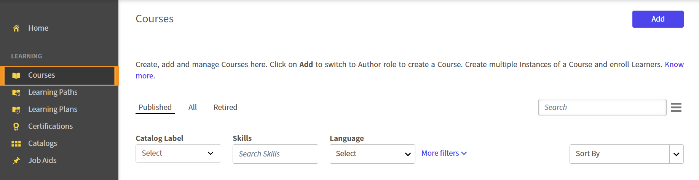
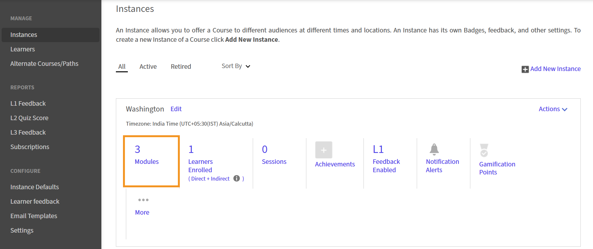

# 在Adobe Learning Manager中设置一键式注册

## 一键式注册的工作原理

一键式注册依赖于两个Adobe Learning Manager (ALM)功能协同工作：
深层链接提供指向ALM中特定课程或学习对象的直接URL。 您可以将这些链接（指向模块的直接URL）嵌入电子邮件、Intranet门户或第三方应用程序中。 如果学习者在单击链接时尚未登录，则ALM会提示他们进行身份验证，然后直接将他们带到课程中。

通常情况下，当学习者正在工作且正在使用Slack或团队版时，或者当他们在旅行或参加会议或销售电话之前需要快速参加两分钟的复习培训时，此功能非常有用。他们可以立即访问内容并接受培训。
与注册相关的服务会在深层链接启动课程播放器之前，自动将学习者注册到课程中。这将删除手动注册步骤，以免中断学习者的体验。

学习者选择一键式注册链接后，ALM会在后台通过API注册该链接，然后使用深层链接将其重定向到课程。 课程播放器会立即打开。

>[!NOTE]
>
>注册仅在课程级别进行，不适用于高阶学习对象（学习路径或认证）。

## 为模块生成深层链接

1. 以管理员身份登录Adobe Learning Manager。
2. 在左侧导览窗格中选择&#x200B;**课程**。
   
3. 选择课程
4. 选择&#x200B;**实例**。
   
5. 选择要复制其模块深层链接的实例的&#x200B;**模块**&#x200B;部分。模块详细信息显示在实例底部的展开部分中。
   
6. 导航到要复制其链接的模块。
   
7. 选择&#x200B;**复制链接**。 深层链接现已复制。 此深层链接是一个链接，可通过该链接打开课程中的特定模块。

您现在可以使用此深层链接将其发送给学习者。
