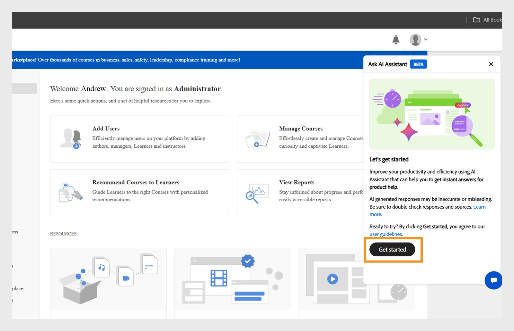

# Adobe Learning Manager中的Admin AI Assistant (Beta)

在复杂的学习设置中，由于菜单复杂和工作流程断开连接，管理员可能难以找到内容或完成任务。 例如，运行报告或访问特定信息等任务可能需要在多个屏幕中导航。 Admin AI Assistant (Beta)可帮助您查找正确的信息，以便了解并高效地完成任务。

Adobe Learning Manager中的Admin AI Assistant (Beta)可使用简单的语言进行提问，从而帮助管理员快速查找常见问题的答案、探索系统功能并了解如何完成关键任务。 无论您是Adobe Learning Manager的初学者还是寻求更快的故障排除方法，Admin AI Assistant (Beta)都通过在平台中直接提供上下文感知帮助来简化您的工作流程。

它使用Adobe的AI功能来实现跨学习内容和系统工作流程的自然语言查询。  管理员可以询问&#x200B;**如何将用户添加到Adobe Learning Manager**&#x200B;或&#x200B;**如何添加学习路径**&#x200B;等问题。 Adobe Learning Manager Admin AI Assistant (Beta)专门针对公开提供的Adobe拥有的文档进行培训，例如，托管在&#x200B;**[!UICONTROL Experience League]**&#x200B;上的资源。 它不学习或访问客户内容、内部培训材料或用户生成的数据。

该助理减少了对于手动导航的依赖，缩短了发现时间，并帮助快速呈现可操作的见解。

<!--## Key benefits

* Perform common administrator tasks faster with conversational guidance.
* Get instant answers without browsing through extensive menus.
* Gain real-time insights and step-by-step guidance for administrative workflows.-->

>[!IMPORTANT]
>
>它仅对管理员可用，目前仅支持英语版本。

## 隐私、安全和治理

Admin AI Assistant (Beta)旨在重点关注安全和数据隐私。 您可以期待以下内容：

* Admin AI Assistant (Beta)不使用任何个人数据，包括培训用途。
* 无权访问存储在Adobe Learning Manager中的学习数据或内容。
* Admin AI Assistant (Beta)不会访问或共享任何个人身份信息(PII)，也不会共享私人或敏感信息。
* 用户提供的任何提示（例如问题或查询）不会与其他客户共享。

>[!IMPORTANT]
>
>Admin AI Assistant (Beta)将分阶段推出，客户将提前两周收到通知。 如需任何帮助，请联系您的客户成功经理(CSM)。

## 如何访问Admin AI Assistant (Beta)

请按照以下步骤启动Admin AI Assistant (Beta)：

1. 以管理员身份登录。
2. 选择聊天图标以启动Admin AI Assistant (Beta)。

   
   _选择聊天气泡以启动Admin AI Assistant (Beta)_

   >[!NOTE]
   >
   >首次启动Admin AI Assistant (Beta)时，必须在使用前提供您的同意。 同意对话框将仅在此初次启动时显示。 对于所有后续启动，您将直接转到Admin AI Assistant (Beta)以输入提示。

3. 选择&#x200B;**[!UICONTROL 开始使用]**。 您现在可以使用Admin AI Assistant (Beta)。

   
   _首次使用前提示接受使用策略_

## 如何使用Admin AI Assistant (Beta)

要使用Admin AI Assistant (Beta)，请执行以下操作：

1. 键入提示并按&#x200B;**[!UICONTROL Enter]**。 响应会显示在Admin AI Assistant (Beta)中。

   
   _来自Admin AI Assistant (Beta)的示例查询和响应_

### 提示示例

以下是管理员可用来有效利用Admin AI Assistant (Beta)的一些示例提示：

* **为用户分配课程**
   * **提示**：“如何将课程分配给用户？”

  
  _对提示的响应：如何将课程分配给用户_

* **最新注册报告**
   * **提示**：显示最新的注册报告。

  
  _对提示的响应向我显示最新的注册报告_

* **删除用户**
   * **提示**：“如何删除用户？”

  
  _提示的响应：如何删除用户_

### 高效使用Admin AI Assistant (Beta)的提示

* **请具体说明您的提示**：在提问时，请说明清楚的上下文和详细信息。 例如，不询问“如何在Adobe Learning Manager中添加用户？”，而询问“如何在Adobe Learning Manager中向用户分配课程？”
* **使用简洁明了的语言**：使您的问题简洁明了，重点突出。 这有助于Admin AI Assistant (Beta)了解您的意图并提供更准确的响应。
* **探索不同功能**：了解注册报告、学习者进度、内容分配或认证跟踪等各种功能，从而了解可用的全部支持。
* **提供反馈**：在收到响应后，请告知我们这样做是否有帮助。 使用拇指向上、拇指向下、报告或评论功能来分享您的反馈。 您的反馈在改进助手方面起着关键作用。

## 针对Admin AI Assistant (Beta)响应提供反馈

您对Admin AI Assistant (Beta)生成的响应的反馈有助于改进其准确性、相关性和整体性能。

### 喜欢或不喜欢响应

* 如果响应有用且准确，请选择&#x200B;**[!UICONTROL 拇指向上]**。
* 如果响应不正确或没有帮助，请选择&#x200B;**[!UICONTROL 拇指朝下]**。

### 标记响应

请按照以下步骤标记响应：

1. 在响应末尾选择&#x200B;**[!UICONTROL 标志]**。

   
   _在Admin AI Assistant屏幕中选择报告_

2. 选择一个或多个原因，根据需要添加注释，然后选择&#x200B;**[!UICONTROL 提交]**。

   
   _管理员使用拇指向上或向下对响应进行评级，并附上可选注释_

Adobe会使用此反馈随时间推移而改进Admin AI Assistant (Beta)。

## 常见问题解答

+++我是否可以使用Admin AI Assistant (Beta)作为学习者？

讨论区创建的帖子数此助理仅适用于管理员。

+++

+++这款软件可以在移动应用程序中下载吗？

暂时不需要。

+++

+++是否可以执行管理操作？

讨论区创建的帖子数Admin AI Assistant (Beta)仅提供指导。

+++

+++它将支持更多语言吗？

Adobe Learning Manager团队正在评估对未来更新的多语言支持。

+++
