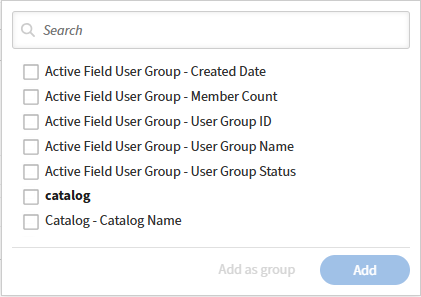

# 开始使用Report Builder模板

模板是Adobe Learning Manager提供的现成的报告配置。 每个模板均针对特定的用例（如注册和完成跟踪、合规性报告或讲师表现）而设计。 您可以直接下载模板或复制模板以创建可编辑副本。

1. 以管理员身份登录Adobe Learning Manager。
2. 在左侧窗格中选择&#x200B;**报表**，然后选择&#x200B;**Report Builder**。
3. 选择“**模板**”选项卡。
4. 浏览可用模板。每个模板均根据其用例命名。
   
5. 选择模板名称以打开其只读预览。 在本例中，选择“Catalog Wise - Course Count MoM”（目录智能型 — 课程数量）模板旁的复制 查看列、应用的筛选器和排序顺序。 复制模板时，Report Builder会打开一个可编辑的副本，并预加载模板的现有配置。 在保存之前，报告名称、说明、列、筛选器和排序均可编辑。

## 命名并描述报告

1. 在&#x200B;**名称**&#x200B;字段中，将默认名称（例如，_目录副本_ - _课程计数MoM_）替换为报表的唯一名称。 需要名称。
2. 在&#x200B;**描述**&#x200B;字段中，输入报告所包含内容的简短摘要。 这有助于其他管理员在查看或编辑报告时了解报告的用途。

## 添加和配置列

**列**&#x200B;部分有两个面板：左侧&#x200B;**选择列**，右侧&#x200B;**选择列**。

### 添加列

1. 在&#x200B;**选择列**&#x200B;面板中，通过选择数据集名称展开数据集。 例如，**目录**&#x200B;或&#x200B;**活动字段用户组**。
2. 选择要添加的列旁边的&#x200B;**+**&#x200B;图标。该列显示在右侧的&#x200B;**选定列**面板中。
   
3. 多次添加同一列。 例如，将两个不同的聚合应用于同一字段。 再次为该列选择&#x200B;**+**。

### 重新排列列

拖动“**所选列**”面板中任何列行左侧的手柄，以将其移动到其他位置。 面板中的列顺序与下载的报告中的列顺序一致。

### 重命名列

1. 在列行上选择&#x200B;**编辑**（铅笔）图标。
   
2. 输入别名。该别名在下载的报告中显示为列标题，而不是默认的字段名。
   

### 删除列

在列行上选择&#x200B;**×**&#x200B;图标以将其从报表中删除。

## 应用分组依据

**分组依据**&#x200B;控件显示在&#x200B;**所选列**&#x200B;面板的顶部。

1. 选择&#x200B;**分组依据：选择**。
   
2. 选择要作为分组依据的列。 您可以选择多个。 在屏幕截图中，报告按&#x200B;_目录_&#x200B;和&#x200B;_创建月份_&#x200B;分组。
3. 每个选定的“分组依据”列在“分组依据”控件下方显示为标记。 要删除分组依据列，请在其标记上选择&#x200B;**×**。

>[!NOTE]
>
>应用group by时，每个不是group-by列的列都必须应用聚合函数。 没有聚合的列将导致错误。

## 将聚合应用于列

1. 在&#x200B;**所选列**&#x200B;面板中的任何非分组依据列上，选择&#x200B;**聚合依据**。
2. 从下拉列表中选择函数。 在屏幕截图中，**学习对象** - **学习对象ID**&#x200B;使用&#x200B;**Count Distinct**（别名ount_of_course）。

可用的集合函数：

| 函数 | 返回的内容 |
|----------|-----------------|
| 计数 | 组中的总行数 |
| 非重复计数 | 组中的唯一值数 |
| 计数（如果） | 与指定值匹配的行数 |
| 求和 | 整个组中的数字字段总数 |
| 分钟 | 组中最低值 |
| Max | 组中的最高值 |
| 平均 | 组的平均值 |

## 应用过滤器

**筛选器**&#x200B;部分位于&#x200B;**列**&#x200B;部分下方。 过滤器可限制报告中显示的行。

1. 要添加筛选器，请选择筛选器部分右侧的&#x200B;**+**&#x200B;图标。
2. 选择要筛选的字段。
   
3. 选择一个运算符并输入或选择一个值。

要编辑现有筛选器，请在筛选器行上选择&#x200B;**铅笔**&#x200B;图标。 要添加嵌套筛选器组，请选择筛选器行右侧带括号的+图标。

## 配置排序

“排序”部分位于“过滤器”部分下方。

1. 选择“**+添加排序**”以添加排序。
2. 选择要排序的列，然后选择&#x200B;**升序**&#x200B;或&#x200B;**降序**。
   
3. 重复此步骤以添加辅助排序。 拖动每个排序行左侧的手柄以更改优先级。

>[!TIP]
>
>始终至少应用一种排序。 如果不排序，同一报告的下载之间的行顺序可能会不同。

## 保存报告

选择右上角的&#x200B;**保存报告**。 报告已保存到您的&#x200B;**报告**&#x200B;选项卡中，可供下载。

## 最佳实践

* 在每列上使用别名，以使下载的报告包含有意义的标题，而不是像&#x200B;_学习对象_ - _学习对象ID_&#x200B;这样的字段名称。
* 需要唯一记录时（例如，每个目录的不同课程而不是总行），请使用“非重复计数”而不是“计数”。
* 保存前应用排序，尤其是要共享或订阅的报告。
* 使描述保持最新。 其他管理员依赖它来了解报告的范围，而无需打开报告。
