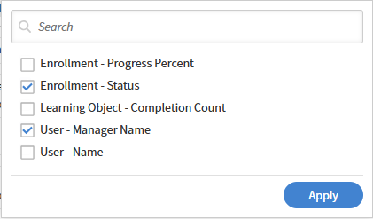
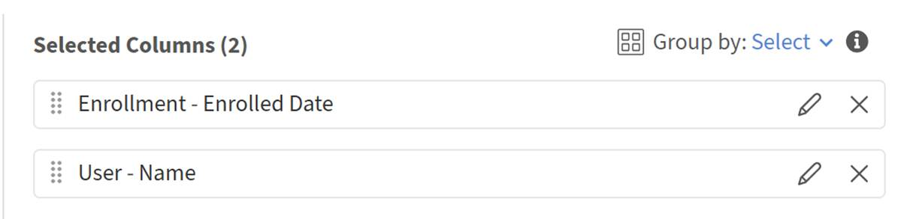

# 在Report Builder中构建趋势报告

趋势报告显示指标（如课程计数、注册计数或完成数）如何随时间变化。 您可以选择日期列和趋势粒度（日、周或月），然后Report Builder按该时间段对数据进行分组。

## 趋势数据的含义

Report Builder中的趋势报表反映了&#x200B;**当前数据快照，按日期**&#x200B;分组。 它们不显示过去每个日期的数据的历史状态。

例如，月度注册趋势显示今天存在的注册数量，这些注册数量分布在创建这些注册的月份中。 如果学习者在1月注册并在之后取消注册，则该注册记录可能不再显示。 报告反映的是目前的记录状况，而不是1月份的状况。

就审计而言，这是一种重要的区别。 如果需要时间点历史数据，请使用此报告进行方向性趋势分析，而不是精确的历史记录。

## 生成课程计数趋势报告

此报告显示每月添加到帐户中的课程数量。

1. 选择“**报告**”>“**Report Builder**”，然后选择“**报告**”选项卡。
2. 选择&#x200B;**创建报告**。 键入名称，例如课程计数MoM。
3. 从&#x200B;**学习对象**&#x200B;数据集添加&#x200B;**学习对象ID**。
4. 从&#x200B;**学习对象**&#x200B;数据集添加&#x200B;**创建日期**。
   
5. 在&#x200B;**创建日期**&#x200B;应用&#x200B;**分组依据**。将趋势粒度设置为&#x200B;**月**。
   
6. 将&#x200B;**计数**&#x200B;应用于&#x200B;**学习对象ID**。输入别名“课程计数”。
   
7. 按&#x200B;**创建日期**&#x200B;升序排序，以按时间顺序显示趋势。
   
8. 选择&#x200B;**保存报告**&#x200B;并选择&#x200B;**操作** > **下载**&#x200B;以下载报告。

下载的文件包含课程创建活动的每月趋势，显示一段时间内的课程创建数量。 它有助于跟踪课程制作模式、峰值、下降和总体内容增长。

## 生成按目录划分的完成趋势报告

此报告显示定义期间内每个目录的每月完成情况总计。

1. 选择“**报告**”>“**Report Builder**”，然后选择“**报告**”选项卡。
2. 选择&#x200B;**创建报告**。 键入名称，如“目录完成计划”。
3. 从&#x200B;**目录**&#x200B;数据集添加&#x200B;**目录名称**。
4. 从&#x200B;**模块成绩单**&#x200B;数据集添加&#x200B;**完成日期**。
5. 从&#x200B;**学习对象**&#x200B;数据集添加&#x200B;**学习对象ID**&#x200B;以计算完成数。
6. 对&#x200B;**目录名称**&#x200B;应用&#x200B;**分组依据**。还在&#x200B;**完成日期**&#x200B;应用&#x200B;**按**&#x200B;分组，间隔为&#x200B;**月**。
   
7. 将&#x200B;**计数**&#x200B;应用于&#x200B;**学习对象ID**。 输入别名“合计完成”。
8. 添加筛选器： **目录**&#x200B;位于安全、POS、传递（或与您的帐户相关的目录）中。
9. 添加筛选器： **完成日期**&#x200B;位于去年内。
   
10. 按&#x200B;**完成日期**&#x200B;升序排序。
    
11. 选择&#x200B;**保存报告**&#x200B;并选择&#x200B;**操作** > **下载**&#x200B;以下载报告。

## 最佳实践

* 使用&#x200B;**完成日期**&#x200B;表示完成趋势，使用&#x200B;**注册日期**&#x200B;表示注册趋势。 使用错误的日期字段会产生误导性结果。
* 添加日期筛选条件以将趋势限制到有意义的窗口，例如，月度趋势的最近12个月或每周趋势的最近8周。
* 用名称中的粒度和日期范围标记您的趋势报告，例如“目录完成时间 — 过去3个月”，以便稍后查看时清晰可见。
