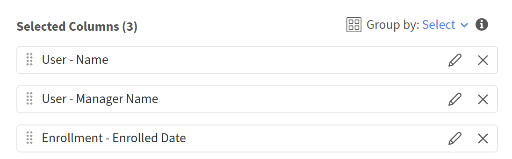

# 在Report Builder中复制和重复使用报告

复制报告会将其所有列、别名、按设置分组、聚合、筛选器以及排序复制到新的可编辑报告中。 如果要为不同的目录、用户组或时间段创建报告版本，请使用此项。

## 复制报告

1. 打开要复制的报告。
2. 选择“**操作**”>“**复制**”。 报告副本将在编辑模式下打开，名称为“[原始报告名称]-Copy”。 例如，跨经理的结构化绩效视图 — Copy
3. 输入报告的新名称。
4. 进行任何更改，例如，更新过滤器、调整列或更改排序。
5. 选择&#x200B;**保存报告**。

复制的报告将保存到您的&#x200B;**报告**&#x200B;选项卡，并且独立于原始报告。

## 复制模板

您还可以从&#x200B;**模板**&#x200B;选项卡复制模板。 复制模板会在&#x200B;**报告**&#x200B;选项卡中创建一个新的可编辑报告。 原始模板将保持不变。

1. 选择“**模板**”选项卡。
2. 找到要复制的模板。
3. 选择&#x200B;**复制**。
   
4. 输入名称，进行调整，然后选择&#x200B;**保存报告**。

## 最佳实践

* 当您需要不同团队、目录或时间段的变化时，可复制经过良好测试的报告作为基础。 这比从头开始构建要快，并且可确保结构一致。
* 立即重命名副本以反映其与原始副本的不同之处，例如，“Compliance by VP - APAC”而不是“Copy of compliance report”。
* 复制模板后，在进行任何其他更改之前更新名称，以便报告可在&#x200B;**报告**&#x200B;选项卡中识别。
