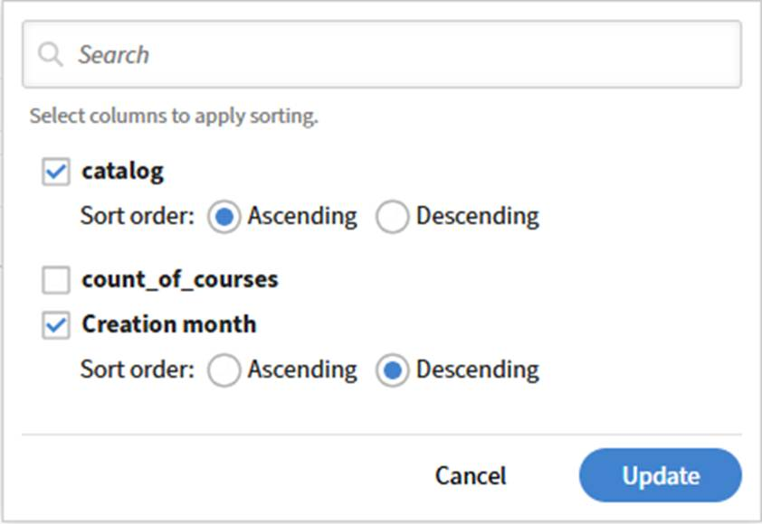
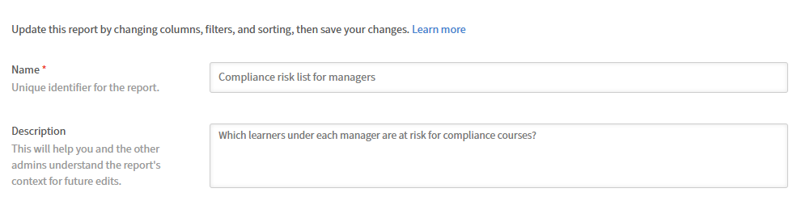

# 在Report Builder中应用分组依据和聚合

“分组依据”和“汇总”允许您生成汇总报告，如每个讲师的完成总数、每个目录的注册计数或按区域的合规性百分比。

## 何时使用分组方式

当您希望每个类别有一行而不是每个记录一行时，请使用分组方式。 例如：

* 每个讲师一行，显示他们教授的课程数量
* 每个目录一行，显示注册总数
* 每个用户组一行，显示符合性百分比

如果要查看单个学习者记录或单个注册行，请勿应用“分组依据”。

在对一列应用group by时，报表中的其他每列都必须应用聚合函数。 您不能在分组列的旁边显示原始字段值，而只能显示计算值（计数、求和、平均值等）。

例如，如果您按&#x200B;**讲师姓名**&#x200B;分组，则无法在它旁边显示单个&#x200B;**会话姓名**&#x200B;值。 相反，您应将&#x200B;**计数**&#x200B;应用于&#x200B;**会话ID**&#x200B;字段，以显示每位讲师所授课的会话数量。

## 应用“分组依据”和“聚合”

在本例中，您将比较不同学习者的注册进度。 使用此报告可以了解不同经理在注册进度和完成方面的表现。

### 选择列

1. 启动&#x200B;**Report Builder**&#x200B;并选择&#x200B;**创建报告**。
2. 键入报表的名称和说明：
a. **名称：**跨用户比较注册进度
b. **描述：**&#x200B;此报告按经理对学习者进行分组并计算摘要指标，如学习者总数、平均进度和注册状态的完成计数=已完成
3. 选择以下列： `<dataset>:<column name>`
a. 用户\管理员名称
b. 用户\名称
c. 注册\状态
d. 注册\进度百分比
e. 学习对象\完成计数

### 选择“分组依据”列

1. 在&#x200B;**分组依据**部分中选择以下列：
a.注册\状态
b.用户\经理姓名
   
2. 选择&#x200B;**应用**。

### 选择要聚合的列

聚合函数可按经理和注册状态汇总学习者注册性能，显示分组培训记录中的不同学习者计数、平均培训进度百分比和平均学习对象完成计数。

1. 为User\Name选择&#x200B;**非重复计数**。
2. 为“注册\进度百分比”选择&#x200B;**平均值**。
3. 为学习对象\完成计数选择&#x200B;**平均值**。
   

### 应用过滤器

应用过滤器以仅包括已完成注册并排除缺少经理姓名的记录，从而确保报告分析有效的学习者数据，以便准确地了解经理培训进度和完成情况。

1. 应用&#x200B;_注册状态_&#x200B;等于&#x200B;_已完成_&#x200B;的筛选器。
2. 应用&#x200B;_User-Manager名称_&#x200B;不为空的第二个筛选器。
3. 使用AND条件组合这两个过滤器，以仅包含有效的已完成学习者记录。

### 保存并下载报告

选择&#x200B;**保存报告**&#x200B;并选择&#x200B;**操作** > **下载**&#x200B;以下载报告。 报告准备就绪后，您将收到以.csv格式下载报告的通知。

CSV包含经理对已完成学习者注册和培训进度的摘要。 每行代表一个经理，包括学习者计数、注册状态、平均进度百分比和平均完成计数。

总体而言，该报告比较不同经理的培训完成情况和学习活动，重点说明学习者参与程度的差异和已完成学习对象的数量。
