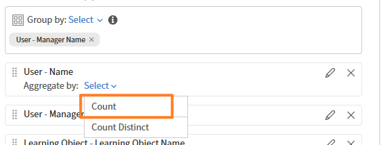

# 在Report Builder中对报表列进行排序

排序决定了已下载报告文件中的行顺序。 只要输出一致就应用排序。

## 添加排序

在本例中，您将找到完成度最高的课程。

1. 启动Report Builder并选择&#x200B;**创建报告**。
2. 键入报表的名称和说明。
3. 选择以下列： `<dataset>:<column name>`
a. 学习对象 — 学习对象名称
b. 学习对象 — 学习对象状态
c. 学习对象 — 完成计数
4. 在“排序”部分，选择&#x200B;**添加排序**。
5. 选择&#x200B;**学习对象 — 完成计数**。
6. 选择排序顺序&#x200B;**升序**&#x200B;或&#x200B;**降序**。
   
7. 选择&#x200B;**添加**。
8. 选择&#x200B;**保存报告**&#x200B;并选择&#x200B;**操作** > **下载**&#x200B;以下载报告。

下载的报告会列出所有记录，并按课程完成数排序。

## 添加多列排序

在本例中，您将生成一个报告来衡量不同经理的绩效。

要按多个列排序，请执行以下操作：

1. 启动&#x200B;**Report Builder**&#x200B;并选择&#x200B;**创建报告**。
2. 键入报表的名称和说明。
3. 选择以下列： `<dataset>:<column name>`
a. 用户 — 名称
b. 用户 — 经理姓名
c. 模块成绩单 — 状态
d. 模块成绩单 — 进度百分比
4. 添加以下聚合：
a.按用户 — 经理姓名分组
b.统计不同的用户 — 名称
c. Count If=COMPLETED Module Transcript — 状态
d.平均模块成绩单 — 进度百分比
   
5. 在&#x200B;**排序**部分中，添加以下多列排序：
a.模块成绩单 — 状态：降序
b.用户 — 经理姓名：升序
   
6. 选择保存报告并选择操作>下载以下载报告。

下载的报告会提供经理范围内的绩效摘要，其中显示不同的学习者计数、基于状态的注册计数和平均进度百分比。 它重点介绍不同经理团队的参与级别和培训进度。
