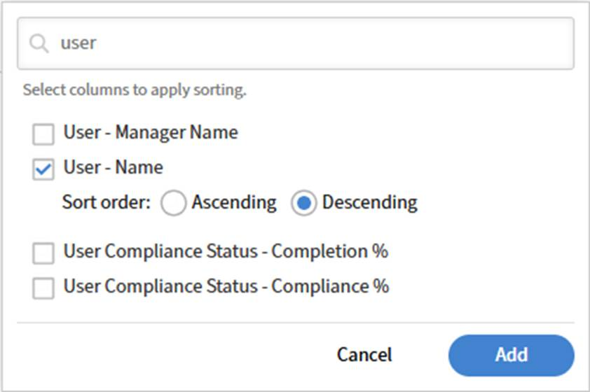

# 在Report Builder中按用户组跟踪参与情况

此报告可帮助培训经理和研发管理员确定哪些用户组最活跃，以及参与趋势如何逐月变化。 它使用带有Group By和聚合函数的&#x200B;**活动字段用户组**&#x200B;和&#x200B;**注册**&#x200B;数据集，每月为每个用户组生成一个摘要行。

## 按用户组生成参与报告

1. 启动&#x200B;**Report Builder**&#x200B;并选择&#x200B;**创建报告**。
2. 键入一个名称，例如，_按用户组MoM_&#x200B;进行的参与。
3. 在&#x200B;**选择列**&#x200B;面板中，展开&#x200B;**活动字段用户组**，然后选择&#x200B;**用户组名称**&#x200B;旁边的&#x200B;**+**。 该列显示在&#x200B;**所选列**&#x200B;面板中。
4. 展开&#x200B;**注册**，然后选择&#x200B;**注册日期**&#x200B;旁边的&#x200B;**+**。
5. 在&#x200B;**花费的时间**&#x200B;旁选择&#x200B;**+**。 选择&#x200B;**编辑**（铅笔）图标并输入别名&#x200B;_总花费时间_。
6. 展开&#x200B;**学习对象**，然后选择&#x200B;**注册用户计数**&#x200B;旁边的&#x200B;**+**。 选择“编辑”图标并输入别名&#x200B;_总注册数_。
7. 选择&#x200B;**分组依据：在**&#x200B;所选列&#x200B;**面板顶部选择**。
8. 选择&#x200B;**注册 — 注册日期**，并将粒度设置为&#x200B;**月**。 选择&#x200B;**活动字段用户组 — 用户组名称**。 这两者均显示为标记： **注册 — 注册日期（月）**&#x200B;和&#x200B;**活动字段用户组 — 用户组名称**。
9. 在&#x200B;**注册 — 花费的时间**&#x200B;行上，选择&#x200B;**聚合方式**&#x200B;并选择&#x200B;**求和**。
10. 在&#x200B;**学习对象 — 注册用户计数**&#x200B;行上，选择&#x200B;**聚合方式**&#x200B;并选择&#x200B;**计数**。
    
11. 选择&#x200B;**添加筛选器**。 选择&#x200B;**注册 — 注册日期**，然后选择相对范围，如&#x200B;**最近3个月**，或输入特定日期范围。
12. 选择“**+”添加排序**。 按&#x200B;**注册 — 注册日期**&#x200B;的升序排序，然后按&#x200B;**总花费时间**&#x200B;的降序添加辅助排序。
13. 选择&#x200B;**保存报告**&#x200B;并选择&#x200B;**操作** > **下载**&#x200B;以下载报告。

该报告将每个用户组每月显示一行，显示该期间所花费的总时间和总注册数。

