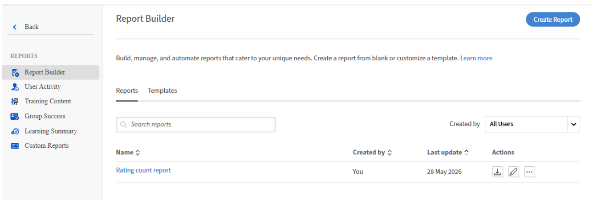

# Adobe Learning Manager中的Report Builder

使用您选择的列、筛选器和数据构建和下载自定义报告，无需使用任何工具进行后期处理。

Adobe Learning Manager的Report Builder为管理员提供了自助式报告画布，以准确创建他们所需的报告。 无需下载固定报告并在电子表格工具中改变其形状，只需从一处选择所需的列、应用滤镜并下载干净的输出。

## 为什么介绍Report Builder

Adobe Learning Manager中的现有报告已修复。 每个报告都有一组不可更改的列，并且筛选选项有限。 需要自定义输出的管理员必须下载多个报告，在Excel中将其加入，手动应用滤镜，然后每周或每月重复此过程。

Report Builder会删除该循环。 只需配置一次报告，然后将其保存，并在需要时下载刷新数据，无需进行重塑。

Report Builder解决了三个具体问题：

* **固定列：**&#x200B;现有报表包含许多您不需要的列，并会排除您需要的列。 通过Report Builder，您只能选择与用例相关的字段。
* **有限筛选：**&#x200B;您现在可以筛选任何支持的字段。 例如，包括注册日期、完成日期、活动字段和目录标签，而不仅仅是状态。
* **数据源不一致：**&#x200B;可以从UI、作业API或连接器提取现有报告，这些报告可能根据时间返回稍有不同的数据。 Report Builder从单个一致的数据源中提取，因此每次下载都反映相同的基础数据。

## Report Builder如何与现有报告配合使用

Report Builder不会替换Adobe Learning Manager中现有的已修复报告。 两者均可用。 将现有报告用于您已依赖的标准输出。 当您需要自定义列、特定筛选器或当前需要后期处理的数据时，请使用Report Builder。

## 在哪里可以找到Report Builder

可在管理员主页找到Report Builder。选择&#x200B;**报表**，然后选择&#x200B;**Report Builder**。您将看到两个选项卡： **模板**&#x200B;和&#x200B;**报告**。

## 谁可以使用Report Builder

管理员可使用Report Builder。

>[!NOTE]
>
>需要为帐户启用Report Builder。 如果您在管理员视图中看不到Adobe客户团队或客户成功经理，请联系他们。

## 最佳实践

* 如果您是Report Builder新手，请先使用模板。 模板已针对最常见的用例预构建，可立即使用。
* 下载之前，请保存每个已配置的报告。 保存的报告可在以后再次下载，而无需重新配置。
