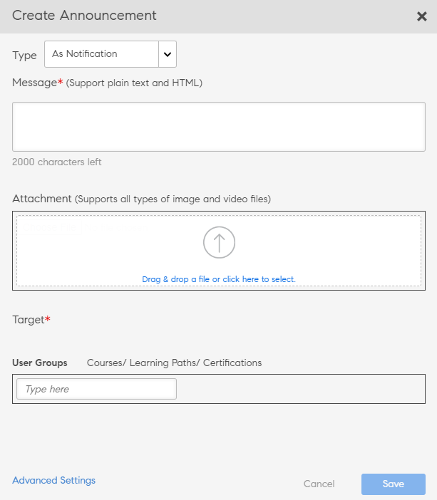

# 公告

公告是一种多媒体消息(文本、图像或视频)，由管理员向一组特定用户进行广播。

管理员可向学习者广播公告，以通知相关事件或活动的发生情况。 公告可以是文本、图像或视频的组合。 您可以将学习对象(例如课程、学习计划和认证)链接到公告。

公告有四种类型：

* 通知
* 刊头
* 推荐
* 电子邮件

## 通知 {#notification}

1. 作为管理员用户，单击左侧窗格中的“公告” 。
1. 单击页面右上角的“添加”。
1. 从“类型”下拉列表中，选择 **“作为通知”** 选项。

*自定义通知*

1. 在“消息”字段中，添加公告内容。 您还可以在此处为公告添加 URL。 但是，您所添加的 URL 必须为 HTML 格式。

   例如，  `code <a href="http://www.w3schools.com" target="_blank">Visit W3Schools</a>.`

   将目标指定为空白后，当用户单击公告的 URL 时，系统将在新选项卡中打开该链接。 若未指定目标，则系统将在同一浏览器中打开链接。

1. 您也可以为公告添加图片或视频文件之类的附件。
1. 选择目标用户组或目标学习对象。 您只能为公告选择其中一个目标。

   在文本框中输入用户组名称，然后在下拉列表中进行选择。同样，在文本框中输入对象名称来选择培训。

1. 单击对话框中的“高级设置”。 您可以执行以下操作：

   * 选中“启用置顶公告”复选框，将此公告设为置顶公告。
   * 选择公告的发布时间。

1. 选择 **[!UICONTROL 在日期]** 如果要计划较晚日期的公告，请单击旁边的文本区域。 此时会显示日历弹出窗口，从中可以选择开始日期。按照相同步骤选择结束日期。
1. 单击&#x200B;**[!UICONTROL “保存”]**。
1. 在“草稿”选项卡中，单击公告旁的设置图标，然后单击发送。

如果多媒体附件较大，则上传时间可能较长。单击“保存”后，您会看到一个弹出窗口，显示正在处理的上传操作。 在附件上传成功后，您会收到通知。

## 刊头 {#masthead}

选择此选项后，您所选的任何媒体文件都会在“学习者”主页中显示为刊头。 刊头可用于指示目标学习者完成相应操作。

*自定义刊头*

1. 浏览并选择用作刊头的图片。 推荐大小为 1280 x 360 像素。
1. 选择您想要添加刊头的区域。 您须为各种语言选择刊头资源。
1. 在 **[!UICONTROL “操作按钮”]** 字段中添加一个 URL，当学习者单击刊头上的按钮时，系统便会将其重定向到该 URL。这是一个可选字段。
1. 选择目标用户组或目标学习对象。 您只能为公告选择其中一个目标。

   在文本框中输入用户组名称，然后在下拉列表中进行选择。同样，在文本框中输入对象名称来选择培训。

1. 在 **[!UICONTROL 高级设置]** 部分，您可以选择以下选项：

   * 点击 **[!UICONTROL 立即]** 如果您想立即发布公告，
   * 点击 **[!UICONTROL 从不]** 如果您不希望公告过期。
   * 选择 **[!UICONTROL 开始]** 和 **[!UICONTROL End]** 公告日期。

   

   *设置刊头显示时间*

**实时“刊头公告”的数量是否有限制？**

您将只看到最近的 10 个刊头公告。

## 推荐 {#recommendation}

选择此选项后，系统会将您所选的全部培训推荐给指定用户组。 推荐由机器学习算法驱动。

*选择要向学习者显示的推荐培训*

1. 选择要向学习者推荐的培训。您至多可添加 10 项培训。

   学习者将仅可查看“由组织推荐”中未注册的培训。 根据目录可见性，学习者拥有查看该培训的权限。

1. 选择目标用户组或目标学习对象。 您只能为公告选择其中一个目标。

   在文本框中输入用户组名称，然后在下拉列表中进行选择。同样，在文本框中输入对象名称来选择培训。

1. 在“高级设置”部分中，您可以选择以下选项：

   * 点击 **[!UICONTROL 立即]** 如果您想立即发布公告，
   * 点击 **[!UICONTROL 从不]** 如果您不希望公告过期。
   * 选择 **[!UICONTROL 开始]** 和 **[!UICONTROL End]** 公告日期。

   <!---->

单击 **[!UICONTROL “保存”]** 后，您可以立即发布公告，也可以稍后发布。 单击“保存”后，该公告将处于草稿状态。

* 刊头/推荐不会触发通知。
* 公告报告中未出现刊头/推荐。

## 草稿、已计划和已发送列表 {#draftscheduledandsentlist}

以管理员身份登录，您可以在“草稿”、“已计划”和“已发送”选项卡中查看所有公告。

<!---->

### “草稿” {#draft}

在“草稿”选项卡中，您可以查看所有由管理员创建但尚未广播或尚未计划广播的公告。

默认情况下，所有公告会设置为立即广播。如果为未计划的公告选择设置>发送选项，则会立即广播该公告。若要计划公告广播，则必须在“高级”设置中选择开始和结束日期。

### “已计划” {#scheduled}

在“已计划”选项卡中，您可以查看所有计划在较晚日期广播的公告。

### 已发送 {#sent}

在“已发送”选项卡中，您可以查看所有已广播的公告。

## 作为电子邮件发送

使用此选项可向选定用户组的学习者或注册特定培训的学习者发送有针对性的临时电子邮件。

*向学习者发送定向临时电子邮件*

*管理员创建电子邮件公告*

1. 选择 **[!UICONTROL 键入为电子邮件]**.
1. 输入电子邮件主题和消息正文。
1. 在“目标”部分，您可以执行以下任一操作：

   * 选择用户组或
   * 选择课程。 如果课程包含多个实例，您可以选择所需的实例。

1. 单击&#x200B;**[!UICONTROL “保存”]**。
