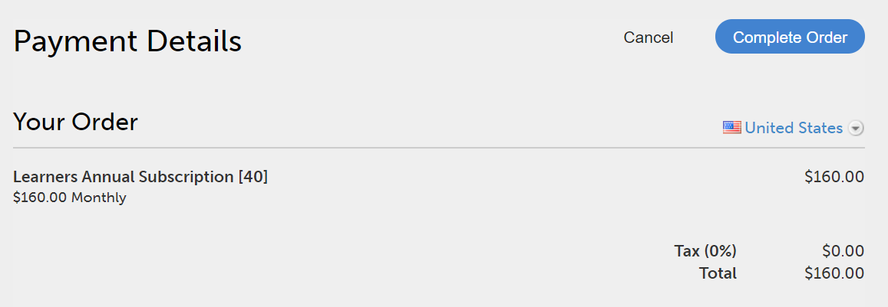
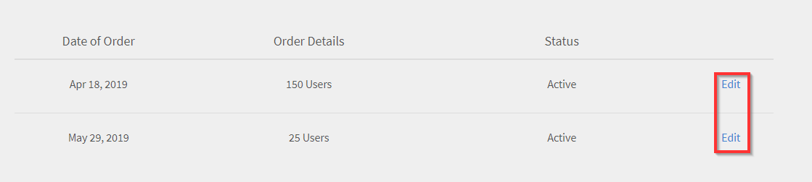

# 管理 Adobe Learning Manager 订单和帐单

基于信用卡的购买仅在[美国地区](http://learningmanager.adobe.com/)提供。

管理 Adobe Learning Manager 帐单、使用信用卡下单、使用采购订单或通过每月活动用户计划进行订阅。

Adobe Learning Manager 采用客户友好和高度灵活的定价模式，可满足多种不同需求，是企业的绝佳之选。 有关更多信息，请参阅 [Adobe Learning Manager](https://www.adobe.com/products/learningmanager.html) 页面。

只有企业的管理员才可管理帐单。

如果希望联系 Adobe 并了解有关 Adobe Learning Manager 订阅和帐单的更多信息，请发送电子邮件至 [learningmanagersales@adobe.com](mailto:learningmanagersales@adobe.com)。

## “帐单”页面

要访问“帐单”页面，请以管理员身份登录Adobe Learning Manager ，然后在左侧导航窗格中选择&#x200B;**[!UICONTROL 帐单]**。

“帐单”页面包含以下选项卡：

| 选项卡 | 目的 |
|---|---|
| **订阅** | 查看帐户详细信息、许可证权利和席位消耗。 管理计划激活。 |
| **订单历史记录** | 查看客户过去的订单。 |

### “Subscription”（订阅）选项卡

**帐户详细信息**

**订阅**&#x200B;选项卡顶部的&#x200B;**帐户详细信息**&#x200B;卡为您的帐户显示四个只读标识符。

| 字段 | 描述 |
|---|---|
| **ECCID** | Adobe的帐户参考号。 联系Adobe支持部门时请引用此内容。 |
| **帐户ID** | 您的唯一Adobe Learning Manager帐户标识符。 |
| **帐户名** | 您的Adobe Learning Manager帐户的显示名称。 |
| **IMS组织ID** | 与此帐户关联的Adobe Admin Console组织。 如果尚未链接，则此项为空。 |

**个许可证**

**许可证**&#x200B;部分列出了帐户上每个有效的许可证或授权。 每个块显示许可证名称、计划说明（如适用）和显示当前合同期间的消耗量的统计行。

统计行列因许可证类型而异：

| 许可证类型 | 显示的列 |
|---|---|
| 付费许可证（例如，Adobe Learning Manager Ultimate） | 已购买/已使用/由配对帐户使用/剩余 |
| 试用许可证（例如，Virtual Coach） | 可用/已用/剩余 |

在统计行下选择&#x200B;**[!UICONTROL 查看使用情况详细信息]**&#x200B;以展开内联细分。 展开的部分显示：

- 一个&#x200B;**选择时段**&#x200B;下拉列表可按合同时段（包括历史时段）进行筛选
- 包含列的&#x200B;**整体使用情况**&#x200B;表：已购买/由此帐户使用/由配对帐户使用/剩余
- **查看帐户分解**&#x200B;链接，以查看各个配对帐户之间的使用情况分布
- **下载详细报告**&#x200B;链接，用于将使用情况数据导出为文件

**代理编排器许可证块**

链接代理Orchestrator许可证时，统计行显示：

| 列 | 描述 |
|---|---|
| **已购买** | 合同期内购买的Gen AI积分总数。 |
| **已使用** | 使用此许可证在所有服务中消耗的积分。 |
| **由ALM使用** | Adobe Learning Manager特别消费的积分。 |
| **剩余** | 积分仍然可用。 |

如果您的组织使用父帐户和子帐户，则父帐户的&#x200B;**许可证**&#x200B;部分会显示一个&#x200B;**由配对帐户使用**&#x200B;列，以反映所有链接子帐户的信用消耗。 子帐户将其分配显示为&#x200B;**已批准的席位**，而不是已购买的席位。

## 将您的Adobe Learning Manager帐户链接到Adobe Admin Console

必须将Adobe Learning Manager帐户连接到Adobe Admin Console组织，才能激活Gen AI功能。 链接后，Adobe Learning Manager会检测Agent Orchestrator许可证并使&#x200B;**积分**&#x200B;选项卡可用。

通过Adobe的标准订购流程购买帐户时，或者使用激活密钥激活帐户时，系统会自动建立链接。 您可以在&#x200B;**订阅**&#x200B;选项卡上验证链接 — 如果已填充&#x200B;**帐户详细信息**&#x200B;中的&#x200B;**IMS组织ID**&#x200B;字段，则该帐户已链接。

### 手动链接帐户

如果您的帐户是独立设置的，并且&#x200B;**IMS组织ID**&#x200B;字段为空，请手动链接。

**先决条件：**
- 您必须是Adobe Learning Manager帐户的管理员。
- 您必须拥有要链接的Adobe Admin Console组织中的系统管理员角色。
- Adobe Admin Console组织必须拥有有效的Agent Orchestrator许可证。

1. 选择“**[!UICONTROL 帐单]**”，然后选择“**[!UICONTROL 订阅]**”选项卡。
2. 在&#x200B;**帐户详细信息**&#x200B;卡中，选择&#x200B;**[!UICONTROL 链接IMS组织]**。
3. 此时会打开一个登录窗口。 输入您的Adobe帐户凭据，然后从列表中选择您的组织。 Adobe Learning Manager确认登录的帐户在Adobe Admin Console组织中拥有系统管理员角色，并且同一帐户在Adobe Learning Manager中拥有管理员角色。
4. 如果两个检查都通过，则建立链接。 **IMS组织ID**&#x200B;字段使用您的组织的标识符更新，剩余信用额度显示在&#x200B;**许可证**&#x200B;部分。
5. 如果任一检查失败，则会显示错误消息。 确认上述先决条件，然后重试。

### 取消帐户链接

取消链接后，所有学习者的Gen AI功能均被禁用，在重新链接帐户之前，**积分**&#x200B;选项卡不可用。

1. 选择“**[!UICONTROL 帐单]**”，然后选择“**[!UICONTROL 订阅]**”选项卡。
2. 在&#x200B;**帐户详细信息**&#x200B;卡中，选择&#x200B;**[!UICONTROL 取消链接IMS组织]**。
3. 再次登录以确认您在组织中的管理员角色。
4. 该链接将被删除。 **IMS组织ID**&#x200B;字段返回为空白，并且&#x200B;**积分**&#x200B;选项卡处于隐藏状态。

要恢复访问，请重复上述手动链接步骤。

## 使用信用卡下单 {#placeordersusingcreditcards}

通过任何单个信用卡付款订单可以购买最多 3500 名学习者的订阅。 帐户中的首个订单必须至少为 10 名学习者。

1. 在管理员应用程序的左侧导航窗格中，单击&#x200B;**[!UICONTROL “帐单”]**。

   

   *启动Adobe Learning Manager计费*

1. 在&#x200B;**[!UICONTROL 帐单信息]**&#x200B;页面上，在&#x200B;**[!UICONTROL 添加用户]**&#x200B;字段中添加用户数。 使用信用卡进行预付费订阅时，您可以看到可以为订阅添加的用户数量。 您可以添加的用户数量不得超过“剩余.1”部分所示数量。

   

   *添加用户数*

1. 指定要添加的用户数量后，单击页面右上角的“下单”。

   

1. 查看屏幕上显示的预估价格。

   

   *下订单*

   年度订阅费根据添加到订阅的用户数量计算得出。 例如，如果添加四名用户，则使用表达式 4 名用户 X$4X$12 计算年费，得出 $192。

   单击&#x200B;**[!UICONTROL “继续”]**。

   *查看预估价格*

1. 您可在“付款详情”页面上查看订单的预估价格。 货币将根据当前区域设置显示。

   

   *查看付款详细信息*

   您也可从下拉列表中选择国家/地区来更改区域设置。

   

   *选择计费国家/地区*

1. 输入联系信息、选择信用卡类型并提供信用卡的详细信息。 输入所需详细信息后，单击&#x200B;**[!UICONTROL 完成订单]**。
1. 下单后，要查看最近订购的包，请单击&#x200B;**[!UICONTROL 帐单]**&#x200B;页面上的&#x200B;**[!UICONTROL 订单历史记录]**&#x200B;选项卡。

   

   *查看订单历史记录*

## 查看订单状态 {#checkorderstatus}

所有订单均可处于以下四种状态中的任一状态：

**活动：**&#x200B;订单处于活动状态，且用户注册成功。

**已暂停：**&#x200B;订单会进入暂停状态的情形包括：

- 信用卡支付的款项收款延迟
- 信用卡过期。
- 任一定期付款周期的款项未支付。

**已发起取消：** Adobe Learning Manager 管理员停用帐户时，订单会进入此状态。 收到订单取消确认后订单会进入取消状态。

## 更新订阅详情 {#updatesubscriptiondetails}

1. 在订单列表中，单击&#x200B;**[!UICONTROL “编辑”]**。

   

   *更新订阅详细信息*

1. 在“订阅”详情页面中，单击&#x200B;**[!UICONTROL 编辑订阅]**。
1. 选择要编辑的项目：

   - 付款方式：使用此选项更新付款详细信息，例如信用卡。
   - 地址：使用此选项更新详细地址信息。

## 取消订阅 {#cancelasubscription}

要取消订单：

1. 在“管理员”页面的左侧窗格中，单击“帐单”。
1. 在“帐单”页面的右上角，选择&#x200B;**[!UICONTROL 操作]** > **[!UICONTROL 停用帐户]**。
1. 管理员停用帐户后，帐户中的所有现有订单从下一个帐单周期起取消。

客户停用帐户后，该帐户在之后的 30 天为试用状态。 帐户所有者会收到三封提醒恢复帐户的电子邮件。 如果所有者未重新激活帐户，除所有者之外的其他用户均无法访问 Adobe Learning Manager。

## 使用采购订单下单 {#placeordersusingpurchaseorder}

您可选择采购订单流程作为替代付款方式。 但前提是，您公司的帐户必须向Adobe注册。 该流程的费用将从您的企业帐户收取。 该帐户将根据学习者的活动收费。 仅学习对象级别的活动才会收取费用。 要使用采购订单下单：

1. 发送电子邮件至 [learningmanagersales@adobe.com](mailto:learningmanagersales@adobe.com) 并在邮件中注明所需学习者数量。
1. Adobe Learning Manager 团队会向您发送激活密钥。
1. 在管理员应用程序的“帐单”页面输入激活密钥。
1. 单击页面右上角的“激活”。

## 查看帐户状态 {#checkaccountstatus}

帐户激活后，帐户可处于以下任一状态：

- **试用** — 您可以创建Adobe Learning Manager帐户，并在30天内免费试用。 在试用期内对注册的学习者数量没有限制。
- **活动** — 在此活动下，帐户中存在活动的学习者订阅，根据订阅订单按月支付费用。
- **非活动** — 帐户将进入非活动状态的情形包括：

  - 试用期之后，帐户中无活动订阅订单。
  - 管理员停用帐户，帐户中的所有现有订单从下一个帐单周期起取消。
  - 即使在收到提醒后，帐户中的活动订单仍未付款。

非活动状态的帐户不会立即取消。 您至少会收到数封Learning Manager团队发送的提醒邮件，要求您提供信用卡的最新信息（如果信用卡已过期）。 在非活动状态下，只有管理员才能登录Adobe Learning Manager帐户。 所有其他用户均无法访问帐户。

- **需要激活** - Learning Manager管理员选择停用帐户后，您的帐户将进入此状态。 帐户中的所有订单均被取消。 从下一个帐单周期起不会就这些订单收取费用。 在最后一个帐单周期日之前，帐户将保持此状态。 在此状态下，所有用户均可在最后一个定期付款日期之前继续使用该应用程序，不受影响。

## 取消订阅 {#Cancelasubscription-1}

要取消活动订阅，请联系 Adobe Learning Manager 支持团队。

## 帐户终止费 {#accountterminationfee}

如果您希望在年度期限结束之前取消订阅，则需要支付提前终止费用。 终止费金额相当于剩余订阅期价格的 50%。

## 每月活动用户 (MAU) 计划 {#monthlyactiveusersmauplan}

您可以选择 MAU 计划作为首选计费方式。 此选项会根据每月唯一活动用户数来生成付费信息。 每月唯一活动用户会从计划激活的当月开始，在 12 个月内累积添加。 此数量用于计费持续时间。

使用以下示例了解 MAU 的计算方式。

假设各月的用户数量如下：

- 第 1 个月 = 50
- 第 2 个月 = 500
- 第 3 个月 = 5000
- 第 4 ~ 12 个月 = 10

计费的每月活动用户总数 = 第 1 个月 + 第 2 个月 + 第 3 个月 + 第 4 ~ 12 个月 = 50 + 500 + 5000 + 90 = 5640。

该周期的帐单数量为 5640 名用户。

12 个月的周期结束后，使用计数重置为零，且新的 MAU 计划周期开始。 您可以添加多个激活密钥以增加购买的名额。

凡执行以下操作或因他人的操作而实现了完成数的用户均视为当月的月度唯一活动用户。

- 使用课程、学习计划或认证。
- 使用、下载工作辅助或课程附件。
- 使用、下载或创建个人备注。
- 通过创建讨论区、帖子或评论参与社交学习。
- 因外部认证提交内容获得批准或参加教室/虚拟教室授课而实现了完成数。

## 查看使用详情 {#viewusagedetails}

1. 要按月查看活动用户数量，请单击&#x200B;**[!UICONTROL 查看使用详情]**。

   

   *按月查看活动用户*

1. 在显示的页面上，您可以查看以下内容：

   - **整体使用情况：**&#x200B;您可以查看活动用户总数、一个月内使用Learning Manager的用户数以及尚未注册任何课程的用户数。
   - **每月使用情况：**&#x200B;您可以查看每月唯一活动用户表。

## 下载使用情况报告 {#downloadusagereport}

您还可按月和年下载活动用户数量的数据。 要进行下载，请单击&#x200B;**[!UICONTROL “下载详细报告”]**。

在&#x200B;**“生成报告请求”**&#x200B;对话框中，输入所需的月份和年份，然后单击&#x200B;**[!UICONTROL “生成”]**。

*下载活动使用情况报告*

如果您关闭浏览器窗口，报告则会在您下次访问 Adobe Learning Manager 时开始下载。

报告会保存在浏览器的下载文件夹内。

## 取消订阅

要取消活动订阅，请联系 Adobe Learning Manager 支持团队。

## Gen AI积分 {#genaicredits}

### Gen AI积分的工作方式

学习者每次与AI支持的功能进行交互时（例如，通过AI Assistant提问或生成个性化学习推荐时），都会使用Gen AI积分。 在每次交互开始之前，Adobe Learning Manager会检查积分是否可用。 如果积分可用，则继续互动。 如果用尽了平衡，学习者会看到一条消息，说明该功能暂时不可用。

积分作为Adobe Experience Platform代理Orchestrator许可证的一部分购买。 该许可证在您的Adobe Admin Console中进行管理，Adobe Learning Manager会自动连接到它以检测可用的积分。

**积分优先级规则：**&#x200B;如果您的Adobe Learning Manager计划包含捆绑的Gen AI积分，并且您还拥有Agent Orchestrator许可证，则捆绑的积分会先被使用。 只有在用完捆绑的积分后，才能使用Agent Orchestrator积分。

**共享积分池：**&#x200B;如果您的组织有多个Adobe Learning Manager帐户全部与同一Adobe Admin Console组织关联，则所有帐户都将从单个共享积分池提取资金。

>[!IMPORTANT]
>
>默认情况下，所有Gen AI功能都处于关闭状态。 您必须启用每项功能并设置信用使用限制，学习者才能访问这些功能。

### 访问“Gen AI积分”选项卡

1. 选择&#x200B;**[!UICONTROL 管理员]** > **[!UICONTROL 帐单]**。
2. 选择“**[!UICONTROL 积分]**”选项卡。

仅当已购买Gen AI积分或帐户历来处于Gen AI积分活动状态时，**积分**&#x200B;选项卡才可见。 如果该选项卡未显示，请验证您的帐户是否已链接到拥有有效Agent Orchestrator许可证的Adobe Admin Console组织。

### Gen AI功能表

**Gen AI功能**&#x200B;表列出了帐户上可用的每个AI功能。

| 列 | 描述 |
|---|---|
| **功能名称** | AI功能的名称。 选择名称以转到该功能的设置页面。 |
| **状态** | 该功能是开启还是关闭。 从其设置页面切换功能。 |
| **最大积分使用限制** | 此功能在合同期内可消耗的最大积分。 必须先设置才能启用该功能。 仅适用于面向学习者的功能。 |
| **个已用积分** | 自合同开始日期以来此功能已使用的积分总数，会实时更新。 |

### 启用通用AI功能

1. 在“**[!UICONTROL 积分]**”选项卡上，在“**代AI功能**”表中找到该功能。
2. 在&#x200B;**最大积分使用限制**&#x200B;列中，输入此功能在合同期内可消耗的最大积分数。
3. 选择功能名称以转到其&#x200B;**功能设置**&#x200B;页面。
4. 在&#x200B;**功能设置**&#x200B;页面上，打开该功能。
5. 完成任何其他配置，例如将学习者和目录分配给AI Assistant。

### 信用额度用完后会发生什么

- 如果功能达到&#x200B;**最大积分使用限制**，学习者会看到一条消息，说明该功能暂时不可用。 随时从&#x200B;**积分**&#x200B;选项卡提高限制。
- 如果帐户积分全部用尽，则在购买额外积分之前，学习者将无法使用所有Gen AI功能。 管理员仍可访问使用情况报告和信用指标。
- 如果学习者在积分耗尽时处于交互中间，则该交互完成。 将阻止所有后续交互。
- 管理员可以设置高于已购买积分数的积分限制。 允许过度分配，并且可以在续订时进行调整。

### 每月积分使用情况图表

在Gen AI功能表下方，**每月积分使用情况**&#x200B;图表显示每月每个功能已使用的积分。 默认情况下，此图表根据客服专员Orchestrator合同开始日期显示当前合同年期。 选择&#x200B;**[!UICONTROL 下载]**&#x200B;以导出所选期间的每月报告。 报告生成是异步的 — 当文件准备就绪时，您会收到应用程序内通知和电子邮件。

### 生成AI使用情况报告

Adobe Learning Manager在&#x200B;**[!UICONTROL 报告]** > **[!UICONTROL AI报告]**&#x200B;下提供两个Gen AI使用情况报告。

**每月积分使用情况报告**

显示每月每项功能已使用的积分。 适用于预算规划和合同续订。

- **列：**&#x200B;个月 |功能 |已用积分
- **筛选器：**&#x200B;选择跨一个或多个合同期的日期范围
- **下载：**&#x200B;异步 — 当文件准备就绪时，您会收到应用程序内通知和电子邮件

**学习者Gen AI积分使用情况报告**

显示哪些学习者使用了哪些功能以及每个互动消耗了多少积分的审核追踪。

- **列：**&#x200B;日期 |学习者姓名 |学习者电子邮件 |功能 |已用积分
- **筛选器：**&#x200B;选择要审核的日期范围
- **下载：**&#x200B;异步 — 当文件准备就绪时，您会收到应用程序内通知和电子邮件

### 信用使用情况警报

当信用消耗量超过关键阈值时，Adobe Learning Manager会自动通知您。 通知可在应用程序内或通过电子邮件发送。

| 触发器 | 通知 |
|---|---|
| 帐户积分达到已购买总积分的90% | 警告 — 帐户级别的积分即将用尽 |
| 帐户积分达到购买总额的100% | 警报 — 学习者将消耗所有积分并停止使用Gen AI功能 |
| 某项功能已达到其个人最高积分使用限制 | 警报 — 命名特定功能；学习者停止使用该功能 |

当您收到90%警告时，请在达到100%阈值之前联系Adobe客户团队以购买额外的积分。

## 常见问题解答 {#frequentlyaskedquestions}

**如何从帐户添加/删除订阅？**

要在帐户中添加订阅，请添加您希望购买订阅的用户数。 然后在右上角单击&#x200B;**[!UICONTROL 下单]**。 查看预估价格，然后单击&#x200B;**[!UICONTROL 继续]**。 输入帐户详细信息以及信用卡详细信息。 然后，要购买订阅，请单击&#x200B;**[!UICONTROL 完成订单]**。

要删除活跃订阅，请联系 Adobe Learning Manager 支持团队。

**如何更改订阅的信用卡？**

在&#x200B;**[!UICONTROL 订单历史记录]**&#x200B;选项卡中，对于活跃帐户，单击&#x200B;**[!UICONTROL 编辑]**。 然后在订阅详情页面上，单击&#x200B;**[!UICONTROL 编辑订阅]**。 输入新信用卡的详细信息，然后单击&#x200B;**[!UICONTROL 更新付款方式]**。

*查看信用卡详细信息*

**如何更新Learning Manager的账单信息？**

要更新帐单信息，请按以下步骤操作：

1. 以&#x200B;**管理员**&#x200B;身份登录，然后单击&#x200B;**[!UICONTROL 帐单]**。
1. 在订单列表中，单击&#x200B;**[!UICONTROL “编辑”]**。
1. 在“订阅”详情页面中，单击&#x200B;**[!UICONTROL 编辑订阅]**。

选择要编辑的项目：

1. **[!UICONTROL 付款方式]：**&#x200B;使用此选项更新付款详细信息，例如信用卡。
1. **[!UICONTROL 地址]：**&#x200B;使用此选项更新地址详细信息。

**是否可以取消订阅中的部分项目？**

否，您无法取消订阅中的部分项目。 如需减少已购买的席位数，您可以在计费周期结束时取消订阅，然后购买所需的席位数。

**如何获取信用卡付款的发票？**

联系 [FastSpring](https://fastspring.com/) 以通过以下方式之一获取付款发票：

- 使用链接`https://questionacharge.com`通过FastSpring创建服务请求。
- 在`orders@fastspring.com`向FastSpring发送电子邮件，请求提供发票。

## 解决Gen AI信用问题

| 问题 | 解决方案 |
|---|---|
| **积分选项卡不可见** | 尚未购买或应用Gen AI积分。 在Adobe Admin Console中验证您的代理Orchestrator许可证，然后确认在&#x200B;**[!UICONTROL 帐单]** > **[!UICONTROL 订阅]** > **帐户详细信息**&#x200B;下链接了组织。 |
| **IMS组织ID字段为空** | 您的帐户尚未关联。 在&#x200B;**帐户详细信息**&#x200B;卡中选择&#x200B;**[!UICONTROL 链接IMS组织]**，并按照上述链接步骤操作。 |
| **链接失败，出现错误** | 确认您在Adobe Learning Manager和您尝试链接的Adobe Admin Console组织中都具有管理员角色。 必须同时通过两项检查才能建立链接。 |
| **应用激活密钥后，IMS组织ID字段为空** | 只有通过Adobe的标准订购流程激活的帐户才会自动链接。 对于独立设置帐户，请在激活密钥后完成上述手动链接步骤。 |
| **取消链接后，Gen AI功能不可用** | 取消链接将删除对所有Gen AI功能的访问权限，并隐藏“积分”选项卡。 将您的帐户重新链接到具有有效Agent Orchestrator许可证的Adobe Admin Console组织以恢复访问。 |

<!-- 
# Manage Learning Manager orders and billing

Credit card-based purchase is only available in the [US region](http://learningmanager.adobe.com/).

Manage Learning Manager billing, place orders by using a credit card, subscribe using a Purchase Order, or via a Monthly Active Users plan.

Adobe Learning Manager has a flexible, customer-friendly, and one of the best pricing models to cater to your organization needs. For more information, see the [Learning Manager](https://www.adobe.com/products/learningmanager.html) page.

Only the Administrators of your organization can manage billing.

If you want to contact Adobe for more information about Learning Manager subscription and billing, write to us at [learningmanagersales@adobe.com](mailto:learningmanagersales@adobe.com).

## Place orders using credit cards {#placeordersusingcreditcards}

You can buy a subscription for a maximum of 3500 learners through any single credit card payment order. The first order in the account must be for a minimum of 10 learners.

1. On the Administrator app, click **[!UICONTROL Billing]** on the left navigation pane.

   

   *Launch Adobe Learning Manager billing*

1. On the **[!UICONTROL Billing Information]** page, add the number of users in the **[!UICONTROL Add Users]** field. When using a credit card for pre-paid subscriptions, you can see the number of users that you can add for the subscription. The number of users you can add must not exceed the number mentioned in the section Remaining.1. 

   

   *Add number of users*

1. After specifying the number of users to add, click Place Order in the upper-right corner of the page.

   

1. Review the estimate that appears on the screen.

   

   *Place an order*

   The annual subscription fee is calculated based on the number of users who are added for the subscription. For example, if four users are being added, the annual fee is calculated using the expression 4 usersX$4X$12, which returns $192.

   Click **[!UICONTROL Proceed]**.

   *Review the estimate*

1. On the Payment Details page, you can view the estimated price of the order. The currency appears based on the current locale.

   

   *View payment details*

   You can also change the locale by choosing the country from the drop-down list.

   

   *Select the country of billing*

1. Enter your contact information, choose the credit card type, and provide the details of the credit card. After you've entered the required details, click **[!UICONTROL Complete Order]**.
1. After you've placed the order, to see the recently ordered packages, click the **[!UICONTROL Order History]** tab on the **[!UICONTROL Billing]** page.

   

   *View order history*

## Check order status {#checkorderstatus}

All orders can have one of the four statuses:

**Active:** An order is active, and users are registered successfully.

**Suspended:** An order moves into suspended state in the following scenarios:

* Delay in receipt of payment from the credit card
* Expiry of the credit card.
* Payment is declined for any recurring payment cycle.

**Canceled initiated:** An order moves into this state when the Learning Manager Administrator deactivates the account. The order then moves into a canceled state after receiving the cancellation confirmation of the order.

## Update subscription details {#updatesubscriptiondetails}

1. In the list of orders, click **[!UICONTROL Edit]**.

   

   *Update subscription details*

1. In the Subscription details page, click **[!UICONTROL Edit Subscription]**.
1. Choose the item that you want to edit:

   * Payment method: Use this option to update payment details, such as, credit card.
   * Address: Use this option to update address details.

## Cancel a subscription {#cancelasubscription}

To cancel an order:

1. In the left pane of the Administrator page, click Billing.
1. In the Billing page, on the upper-right corner, choose **[!UICONTROL Actions]** > **[!UICONTROL Deactivate Account]**.
1. Once the Administrator deactivates the account, all existing orders in the account are canceled from the next billing cycle.

When an account is deactivated by the customer, it enters a trial state for the next 30 days. The account owner receives three reminder emails to revive the account. If the owner does not reactivate the account, none of the users are able to access Learning Manager apart from the owner.

## Place orders using Purchase Order {#placeordersusingpurchaseorder}

You can choose purchase order process as an alternative mode of payment. As a pre-requisite, your organization's account must be registered with Adobe. Your organization account is charged for this process. The account is charged based on a learner's activities. Only Learning Object-level activities are charged. To place an order using PO:

1. Send an email to [learningmanagersales@adobe.com](mailto:learningmanagersales@adobe.com) and mention the number of required learners.
1. The Learning Manager team sends you an activation key.
1. In the Billing page of the Administrator app, enter the activation key.
1. Click Activate in the upper-right corner of the page.

## Check account status {#checkaccountstatus}

After an account gets activated, the account can be in any of the following states:

* **Trial** - You can create an Adobe Learning Manager account and use it without any payment for a period of 30 days. There is no limit on the number of learners registered during the trial period.
* **Active** - In this state, the account has active learner subscriptions with recurring monthly payment as per the subscription order.
* **Inactive** - An account moves into inactive state in the following scenarios:

  * After the trial period if there are no active subscription orders in the account.
  * Administrator deactivates the account, which results in canceling all the existing orders in an account from the next billing cycle of subscription.
  * Payment is declined for active orders in an account even after reminders.

An inactive state does not cancel your account with immediate effect. You receive at least a couple of reminders from the Learning Manager team asking you to provide the latest information about

your credit card if it has expired. In an inactive state, only an administrator can log in to the Captivate

Learning Manager account. All other users cannot access the account.

* **Activation required** - Your account moves into this state when the Learning Manager administrator chooses to deactivate the account. All the orders of this account get canceled. The collection of payment for these orders does not happen from the next billing cycle. The status of the account remains in this state until the day of the last billing cycle. In this state, all users can continue to use the application without any impact until the end of the last recurring payment date.

## Cancel a subscription {#Cancelasubscription-1}

To cancel an active subscription, contact the Learning Manager support team.

## Account termination fee {#accountterminationfee}

If you want to cancel the subscription before the completion of the annual term, an early termination fee is charged. The termination fee is equivalent to 50% of the subscription price of the remaining commitment period.

## Monthly Active Users (MAU) plan {#monthlyactiveusersmauplan}

You can choose a MAU plan as your preferred way of billing. This option generates billing based on the number of monthly unique active users. The monthly unique active users are added cumulatively for a period of 12 months starting from the month of plan activation. This number is used for billing for the period.

Use the following example to understand how MAU is calculated.

Let there be a case where the number of users per month are as follows:

* Month 1 = 50
* Month 2 = 500
* Month 3 = 5000
* Month 4 to 12 = 10

Total Monthly Active Users that are billed = Month 1 + Month 2 + Month 3 + Month 4 to 12 = 50 + 500 + 5000 + 90 = 5640.

The billing for the period would be for 5640 users.

At the end of the 12-month period, the usage count is reset back to zero and a new period for MAU plan starts. You can add multiple activation keys to increase the purchased number of seats.

Any user who performs the following actions or achieves completions due to actions taken by others is considered as a monthly unique active user for that calendar month.

* Consuming a course, learning program or certification.
* Consuming, downloading a Job Aid or course attachments.
* Consuming, downloading or creating personal notes.
* Participating in Social Learning by creating Boards, posts or comments.
* Achieving completions due to External Certificate submission approvals or attendance for a classroom/virtual classroom sessions.

## View usage details {#viewusagedetails}

1. To view the number of active users by month, click **[!UICONTROL View Usage Details]**.

   

   *View active users by month*

1. On the page that displays, you can view the following:

   * **Overall usage:** You can check the total number of active users, users who are consuming Learning Manager in a month, and the number of users who have not yet signed up for any course.

   * **Monthly usage:** You can see a table of unique active users per month.

## Download usage report {#downloadusagereport}

You can also download the data of the number of active users by month and year. To download, click **[!UICONTROL Download Detailed Report]**.

On the **Generate Report Request** dialog, enter the required months and year, and click **[!UICONTROL Generate]**.

*Download active usage report*

If you close the browser window, the download starts the next time you visit Learning Manager.

The reports are saved in the Downloads folder of your browser.

## Cancel a subscription

To cancel an active subscription, contact the Learning Manager support team.

## Frequently Asked Questions {#frequentlyaskedquestions}

+++How to add/remove subscriptions from an account?

To add subscriptions in an account, add the number of users for who you'd like to purchase subscriptions. Then on the upper-right corner, click **[!UICONTROL Place Order]**. Review the estimate and click **[!UICONTROL Proceed]**. Enter your account details and also your credit card details. Then to purchase the subscriptions, click **[!UICONTROL Complete Order]**.

To remove an active subscription, contact the Learning Manager support team.
+++

+++How to change a credit card for subscriptions?

In the **[!UICONTROL Order History]** tab, for an active account, click **[!UICONTROL Edit]**. Then on the Subscription Details page, click **[!UICONTROL Edit Subscription]**. Enter your new credit card details and click **[!UICONTROL Update Payment Method]**.

*View credit card details*
+++

+++How to update the Billing information on Learning Manager?

To update the billing information, follow the steps below:

1. Log in as **Admin** and click **[!UICONTROL Billing]**.
1. In the list of orders, click **[!UICONTROL Edit]**.
1. In the Subscription details page, click **[!UICONTROL Edit Subscription]**.

Choose the item that you want to edit:

1. **[!UICONTROL Payment method]:** Use this option to update payment details, such as, credit card.
1. **[!UICONTROL Address]:** Use this option to update address details.
+++

+++Can I partially cancel a subscription?

No, you cannot cancel a subscription partially. If you need to reduce the number of seats that you have purchased, you can cancel the subscription at the end of the billing cycle and then purchase the number of seats required.
+++

+++How do I get an Invoice for my Credit card payments?

Contact [FastSpring](https://fastspring.com/) to get an invoice for your payments, using one of the following ways:

* Create a service request with FastSpring using the link `https://questionacharge.com`.
* Send an email to FastSpring on `orders@fastspring.com` requesting for the invoice.
-->
