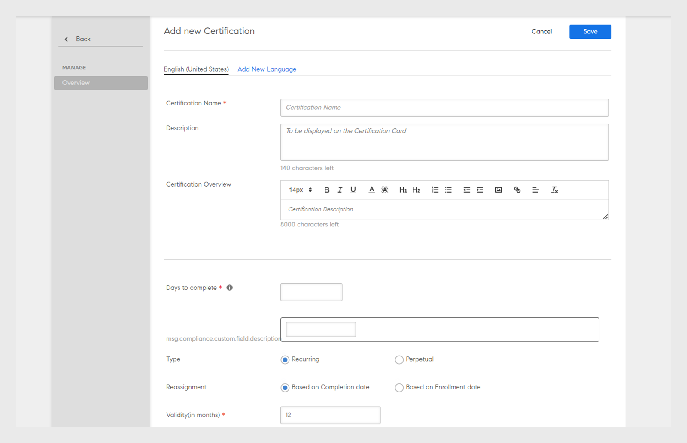

# 认证

了解如何创建认证、注册学习者和编辑已发布的认证。

使用此功能以一次性或循环时间范围来对学习者进行认证。只有管理员可以为学习者定义认证。

作为管理员，您可以创建内部托管或第三方管理的认证计划。 若为内部认证，指定学习者需完成后才能获得认证的课程。 发布计划，然后将计划分配给学习者。

## 创建认证 {#createacertification}

1. 点击 **[!UICONTROL 认证]** 在左侧窗格中。\
   此时会显示一个页面，列出了所有草稿以及已发布状态的认证。

1. 以各种模式查看认证：

   1. 点击 **[!UICONTROL 草稿]** 选项卡以查看所有处于“草稿”状态的认证。 您需要完成创建。
   1. 点击 **[!UICONTROL 已发布]** 查看您发布的所有认证。
   1. 点击 **[!UICONTROL 全部]** 查看所有状态的认证。
   1. 按升序或降序或根据更新日期对认证列表进行排序和查看。

1. 单击“**[!UICONTROL 添加]**”。

   此时会显示新认证页面。

*查看页面以添加认证*

1. 添加证书名称和描述。

<table>
 <tbody>
  <tr>
   <th>字段</th>
   <th>描述</th>
  </tr>
  <tr>
   <td>完成天数</td>
   <td>认证的截止日期。 输入数值。</td>
  </tr>
  <tr>
   <td>类型</td>
   <td>
    
认证类型：

    <ul>
     <li><b>循环</b>- 如果需要在每年、每两年或每三年之后进行认证，请选择此选项。</li>
     <li><b>永久</b>- 如果需要一次性完成认证，请选择此选项。</li>
    </ul></td>
  </tr>
  <tr>
   <td>重新分配</td>
   <td>选择根据完成日期或注册日期重新分配证书。 </td>
  </tr>
  <tr>
   <td>有效期（月）  </td>
   <td>指定证书的有效期。</td>
  </tr>
  <tr>
   <td>课程排序 </td>
   <td>决定学习者是否需要按照顺序参加课程。 </td>
  </tr>
  <tr>
   <td>取消注册 </td>
   <td>启用或禁用允许学习者自行取消注册的选项。</td>
  </tr>
  <tr>
   <td>认证机构 </td>
   <td>
    
选择 <b>内部</b> 如果文件属于您的组织，或者 <b>外部</b> 用于外部组织认证。

    
选择<b>“外部认证”</b>后，您会看到另外两个选项 -

    <ul>
     <li>与批准日期相同 </li>
     <li>由学习者提交 </li>
    </ul>
    
学习者可为外部认证指定正确的完成日期。 在以前的版本中，Prime会根据经理的审批日期默认设置完成日期。 学习者提供的完成日期应晚于证书创建日期。
</td>
  </tr>
  <tr>
   <td>持续时间</td>
   <td>如果已选择“外部认证”，请以分钟为单位指定持续时间。</td>
  </tr>
  <tr>
   <td>标记</td>
   <td>输入要与证书关联的标签。 标签有助于您搜索证书。</td>
  </tr>
  <tr>
   <td>选择目录 </td>
   <td>选择证书所属的目录。</td>
  </tr>
 </tbody>
</table>

从中选择产品、角色和角色级别 **[!UICONTROL 推荐]** 部分，向对这些产品和角色表示感兴趣的用户推荐此学习路径。

*推荐*

选择要添加至认证的课程 **[!UICONTROL 课程]** > **[!UICONTROL 目录]** 选项卡。

将鼠标悬停在每个课程磁贴上，单击+以将其添加到认证中。 点击 **[!UICONTROL 预览]** 在添加课程之前，以学习者身份查看课程。

1. 点击 **[!UICONTROL 课程]** 选项卡以查看/验证您添加的课程列表。
1. 点击 **[!UICONTROL 发布]**.

## 相关认证的课程实例映射 {#courseinstancemappingforcertifications}

要映射相关认证的课程和实例：

1. 单击左侧窗格中的“认证”。
1. 从认证列表中选择要映射课程和实例的认证，并单击“查看认证”。
1. 在左侧窗格中，单击“课程”。 将显示该认证的课程。 单击“编辑”。
1. 将鼠标悬停在要设置实例映射的课程上，选择“课程实例映射”。
1. 从显示的弹出菜单中，选择要为您选择的认证提供的课程实例。
1. 单击“保存”。

管理员可以将教室和虚拟教室类型的课程添加到学习计划中。 作者在课程创建期间所提供的任何会话，都将成为默认实例。 当管理员向学习计划中添加课程时，默认情况下该课程将映射到所有课程的默认实例，但是管理员可以更改实例映射。 在实例页面中也可以看到添加到学习计划中的课程计数，如下所示。

## 启用完全目录控制 {#catalog}

与授予[学习或模块完全目录控制](shared-catalog-full-control.md)一样，您也可以为认证启用完全目录控制。

## 为学习者注册或取消注册认证 {#enrollorunenrolllearnerstothecertification}

有关学习者注册的更多信息和后续步骤，请参阅[“注册学习者”](courses.md#main-pars_header_1058138132)。

## 取消注册学习者 {#unenrollmentforlearners}

在创建认证时，管理员可以选择学习者是否可以取消注册该认证。如果管理员选择该选项，则学习者可自行取消注册。

*选择取消注册学习者*

## 标记完成 {#markcompletion}

管理员可以通过其可用的选项将认证标记为已完成。要将认证标记为完成，请执行以下步骤。

1. 打开 **[!UICONTROL 认证]** > **[!UICONTROL 学习者]**.

   此时将打开学习者页面，其中包含已注册的学习者列表。

1. 使用每个学习者可用的复选框，选择一个/多个/所有学习者，以标记认证完成。
1. 点击  **[!UICONTROL 动作]** > **[!UICONTROL 标记完成。]**

   请注意，如果认证中有多个课程，所有课程都将被标记为完成。

## 外部认证的必修课程 {#mandatory}

在较低版本的 Adobe Learning Manager 中，外部认证的学习者若要完成证书，并不一定需要完成课程。

现在可以通过启用该选项将课程设为必修 **[!UICONTROL 将完成证书所需的课程设为必修]** 在“课程”选项卡中编辑认证。

## 编辑已发布的认证 {#editingapublishedcertification}

管理员可以编辑处于已发布状态的认证。在这种状态下，管理员可以对认证的所有内容进行编辑，然后重新发布。

要编辑已发布的认证，请单击认证卡，然后单击 **[!UICONTROL 编辑]** 在页面的右上角。

在编辑认证的各部分内容时，如果必须移出页面，则需要重新发布认证。此时会显示确认对话框，要求您重新发布认证。

*编辑证书*

## 订阅 {#subscription}

管理员可以提取测验分数和学习者状态等报告。 可以设置报告频率、电子邮件主题和收件人电子邮件 id。 根据设置的频率，收件人会收到内附报告的电子邮件。

*设置报告频率和其他属性*
