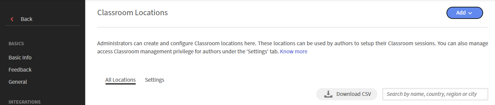
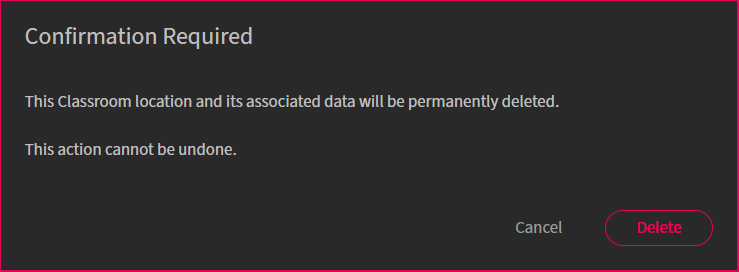

# 添加教室位置

管理员可以创建和管理教室位置库，以便在教室和虚拟教室模块中设置讲师主导的培训活动时重复使用。 您可以为每个位置定义详细信息，例如位置名称、名额限制和其他信息，包括位置URL。 然后，作者可以在创建课程时选择这些预定义的位置。

默认情况下，Adobe Learning Manager使用单字段位置格式。 对于管理多个国家/地区和多种语言的课堂位置的组织，Learning Manager还支持结构化四字段格式，包括&#x200B;**国家/地区**、**省/市/地区**、**城市**&#x200B;和&#x200B;**位置名称**。 此格式提供额外的功能，例如基于位置的过滤和针对各个位置的语言支持。 管理员可以通过一次性迁移切换到四字段格式。

>[!NOTE]
>
>如果未启用四字段位置格式，作者和学习者可以继续照常使用教室位置。 现有的单字段位置格式仍然可用，不需要进行任何更改。 有关详细信息，请查看[迁移到四字段方法](#migrate-classroom-locations-to-the-four-field-format)。

## 配置教室位置设置

管理员可以控制作者是否可以创建和管理教室位置。 使用&#x200B;**教室位置**&#x200B;设置来定义作者可用的访问级别。

要配置&#x200B;**教室位置**&#x200B;设置，请执行以下操作：

1. 以&#x200B;**管理员**&#x200B;的身份登录Adobe Learning Manager。
1. 选择&#x200B;**设置** > **教室位置**。

   这将显示&#x200B;**教室位置**&#x200B;页面。

1. 选择“**设置**”选项卡。

   

   *从&#x200B;**设置**&#x200B;选项卡中为教室和虚拟教室位置启用作者权限。*

1. 选择&#x200B;**“编辑”**。

   此切换开关变为可编辑，允许您更新以下设置：

   | **设置** | **描述** |
   |---|---|
   | **允许作者创建位置** | 启用此选项后，作者可以在创建讲师主导的培训课程时创建教室和虚拟教室模块位置。 |
   | **允许作者修改和删除位置** | 启用此选项以允许作者编辑或删除教室和虚拟教室位置。 |

1. 选择&#x200B;**“保存”**。

## 创建和管理教室位置

管理员可以创建和管理教室位置，作者在创建教室和虚拟教室培训课程时可以重复使用这些位置。 Adobe Learning Manager支持两种位置格式：

* **单字段格式**：每个教室位置都由单个&#x200B;**位置名称**&#x200B;字段标识。 有关详细信息，请查看[使用单字段格式添加教室位置](#add-a-classroom-location-using-a-single-field-format)。
* **四字段格式**：每个教室位置均划分为&#x200B;**国家/地区**、**州/省/地区**、**城市**&#x200B;和&#x200B;**位置名称**，这样可以更轻松地跨多个区域管理位置。 如果您的帐户当前使用单字段格式，请在切换到四字段格式之前完成一次性迁移。 有关详细信息，请查看[迁移到四字段方法](#migrate-classroom-locations-to-the-four-field-format)。

### 使用单字段格式添加教室位置

您可以使用单字段格式添加教室位置：

1. 以&#x200B;**管理员**&#x200B;的身份登录Adobe Learning Manager。
1. 选择&#x200B;**设置** > **教室位置**。
1. 选择&#x200B;**添加** > **新位置**。
1. 在“**教室位置**”对话框中输入以下详细信息：

   1. 键入&#x200B;**位置名称**。 请使用唯一名称； 否则，Adobe Learning Manager 会显示错误消息。
   1. 在&#x200B;**“位置信息”**&#x200B;字段中输入位置描述。 该字段为可选项。
   1. 输入&#x200B;**“位置 URL”**。 学习者可以在教室详细信息中查看此信息。 如有需要，此 URL 也可以是地图位置 URL。 这是一个可选字段。
   1. 键入并选择&#x200B;**位置区域**。 该字段为可选项。
   1. 在&#x200B;**名额限制**&#x200B;字段中键入可用名额数。这表示教室的座席容量。实际创建讲师主导的培训活动时，可更改此值。
      
      *使用单字段格式添加教室位置。*

### 将教室位置迁移到四字段格式

如果您的帐户使用旧版单字段教室位置格式，请在启用四字段格式之前迁移现有的教室位置。 四字段格式将位置数据组织为&#x200B;**国家/地区**、**州/省/地区**、**城市**&#x200B;和&#x200B;**位置名称**，从而更轻松地管理多个区域中的位置。

此迁移是一个一次性过程。 切换到四字段格式后，您将无法将帐户恢复为单字段格式。

迁移现有位置：

1. 导航到&#x200B;**管理员** > **教室位置**，然后选择&#x200B;**设置**&#x200B;选项卡。
1. 在&#x200B;**位置格式迁移**&#x200B;部分中选择&#x200B;**导出**。

   此时将下载包含现有教室位置的CSV文件。 可使用以下列：

   1. **room_id**：位置的唯一标识符。
   1. **区域设置**：已翻译位置名称和位置信息的区域设置。
   1. **名称**：课堂的名称。
   1. **国家/地区**：教室所在的国家/地区。
   1. **州**：教室所在的州、省或区域。
   1. **城市**：教室所在的城市。
   1. **信息**：其他详细信息，例如建筑物名称、楼层或房间编号。
   1. **url**：与位置关联的URL，例如映射链接。
   1. **座位限制**：教室的最大座位容量。

   >[!NOTE]
   >
   >导出的CSV始终包括四字段位置格式列，即使未启用四字段格式也是如此。

   

   *在切换到四字段位置格式之前检查迁移进度。*

1. 对于每个列名称，使用所需信息（例如国家/地区、省/直辖市/自治区和城市）更新CSV文件，以及任何其他所需信息。
1. 选择&#x200B;**导入**，然后上传更新后的CSV文件。

   Adobe Learning Manager会验证数据并更新迁移进度。

1. 当迁移进度条达到100%时，选择&#x200B;**切换到新的4字段格式**。 **位置格式迁移**&#x200B;状态更新为&#x200B;**迁移完成**。

   

   *位置格式迁移将更新为迁移完成状态。*

## 使用四字段格式添加教室位置

完成一次性迁移后，管理员可以四字段格式创建教室位置。 然后，作者可以在创建讲师主导的培训会话时重复使用这些位置。 管理员可以单独添加教室位置，也可以从CSV文件导入多个教室位置。

### 添加教室位置

使用教室位置为作者标准化培训场地并简化会话时间安排。

要添加教室位置，请执行以下操作：

1. 在管理员应用程序中，选择&#x200B;**设置** > **教室位置**。

   

   *选择&#x200B;**所有位置**&#x200B;选项卡以添加教室位置。*

1. 从右上角选择&#x200B;**添加** > **新位置**。

   此时会弹出&#x200B;**教室位置**&#x200B;窗口。

   

   *在“教室位置”弹出窗口中输入详细信息。*

1. 在&#x200B;**教室位置**&#x200B;弹出窗口中，输入以下详细信息：

   | **字段** | **描述** |
   |---|---|
   | **国家/地区** | 选择教室所在的国家/地区。 |
   | **州/省/地区** | 选择省/市/自治区、直辖市或地区。 |
   | **城市** | 选择教室所在的城市。 |
   | **位置名称** | 输入教室或教室的名称。 |
   | **位置信息** | 输入其他详细信息，如建筑名称、楼层或房间编号。 |
   | **位置URL** | 输入位置的URL，如地图链接。 |
   | **名额限制** | 输入教室的最大座位数。 |

1. 选择&#x200B;**“保存”**。

   教室位置已保存并列在&#x200B;**所有位置**&#x200B;选项卡中。

### 批量导入教室位置

使用批量导入功能添加多个教室位置或通过CSV文件更新现有位置。

要批量导入教室位置，请执行以下操作：

1. 在管理员应用程序中，选择&#x200B;**设置** > **教室位置**。
1. 从&#x200B;**所有位置**&#x200B;选项卡中选择&#x200B;**下载CSV**。

   此时将下载包含现有教室位置的CSV文件。 可使用以下列：

   1. **room_id**：位置的唯一标识符。
   1. **区域设置**：已翻译位置名称和位置信息的区域设置。
   1. **名称**：课堂的名称。
   1. **国家/地区**：教室所在的国家/地区。
   1. **州**：教室所在的州、省或区域。
   1. **城市**：教室所在的城市。
   1. **信息**：其他详细信息，例如建筑物名称、楼层或房间编号。
   1. **url**：与位置关联的URL，例如映射链接。
   1. **座位限制**：教室的最大座位容量。

1. 对于每个列名称，使用所需信息（例如国家/地区、省/直辖市/自治区和城市）更新CSV文件，以及任何其他所需信息。
1. 从右上角选择&#x200B;**添加** > **批量导入位置**。

   出现&#x200B;**导入位置CSV**&#x200B;弹出窗口。

   

   *拖放包含更新信息的CSV。*

1. 将更新后的CSV文件拖放到上传区域。
1. 选择&#x200B;**导入**。

   教室位置即会更新。

## 为教室位置添加翻译

为&#x200B;**位置名称**&#x200B;和&#x200B;**位置信息**&#x200B;字段添加翻译，以便以学习者的首选语言显示教室位置详细信息。

要为教室位置添加翻译，请执行以下操作：

1. 从&#x200B;**教室位置**&#x200B;中选择&#x200B;**所有位置** > **添加**。
1. 选择&#x200B;**新位置**。

   此时会弹出&#x200B;**教室位置**&#x200B;窗口。

1. 选择&#x200B;**添加新语言**。

   此时会弹出&#x200B;**添加新语言**&#x200B;窗口。

   

   *从“添加新语言”弹出窗口中选择语言。*

1. 选择&#x200B;**“保存”**。

   翻译会被保存并显示给用户。

>[!NOTE]
>
>只有&#x200B;**位置名称**&#x200B;和&#x200B;**位置信息**&#x200B;字段支持转换。 **国家/地区**、**州/省/地区**&#x200B;和&#x200B;**城市**&#x200B;等位置详细信息未转换。

## 编辑教室位置

要编辑教室位置，请执行以下步骤：

1. 在管理员应用程序中，选择&#x200B;**设置** > **教室位置**。
1. 将鼠标悬停在要编辑的所需教室位置上。

   

   *将鼠标悬停在所需的教室位置上，然后选择“编辑”图标。*

1. 选择&#x200B;**编辑教室位置**&#x200B;图标。

   此时会弹出“教室位置”窗口。

1. 修改教室位置并选择&#x200B;**保存**。

## 删除教室位置

要删除教室位置，请执行以下步骤：

1. 在管理员应用程序中，选择&#x200B;**设置** > **教室位置**。
1. 将鼠标悬停在要删除的所需教室位置上。
1. 选择&#x200B;**“删除教室位置”**&#x200B;图标。

   此时会弹出“需要确认”窗口。

   

   *选择“删除”以确认删除教室位置。*

1. 选择&#x200B;**删除**。

## 常见问题解答

1. **迁移完成后，现有教室位置会发生什么情况？** 
只有在手动或通过CSV上传所有现有位置完成迁移后，您才能启用四字段位置格式。启用四字段格式后，所有使用教室位置的现有课程都会以新格式显示位置。

1. **是否需要手动重新构建导出的CSV以匹配四字段位置格式？** 
否。导出的CSV文件始终使用四字段位置格式，无论当前是否启用它。您只需在导入文件之前更新任何缺少的值。

1. **迁移是否影响Adobe Learning Manager报告？** 
可以。迁移后，包含教室位置信息的报告会以下列格式显示位置：

   **国家/地区>州/省/地区>城市>位置名称**

   此格式将替换以前的单字段位置值。

1. **如果不启用四字段位置格式，会发生什么情况？** 
对于作者或学习者而言，不会发生任何变化。教室位置继续像现在一样显示和运行，使用现有的单字段格式，直到管理员完成迁移并启用四字段格式。
