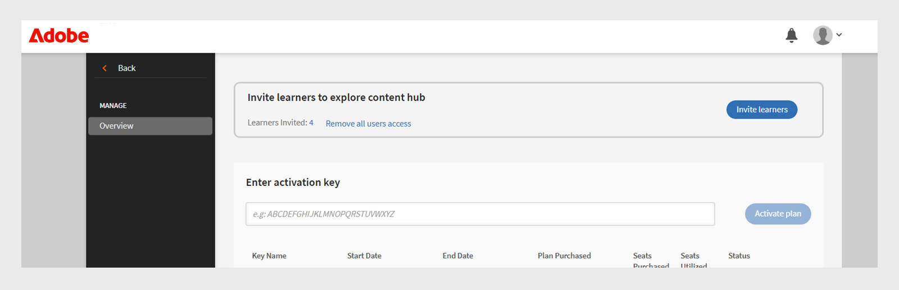

# 内容市场

学习管理员在采购和上传优质内容时经常会遇到难题。 Adobe Learning Manager的内容市场允许受信任的提供商授予高级课程许可，从而实现更快、可扩展的学习交付，从而简化了这项工作。 使用内容市场，管理员可以浏览、预览和许可提供商提供的第三方课程。

内容市场提供以下内容购买计划：

* **[!UICONTROL 高级基本功能]**
* **[!UICONTROL 高级基本功能加]**

| **[!UICONTROL 高级基本功能]** | **[!UICONTROL 高级基本功能加]** |
|---|---|
| 可参加超过90,000门课程 | 可参加超过100,000门课程 |
| 来自250多家提供商的内容 | 包含所有Premium Essentials内容 |
| 来自受信任的提供商的独家内容，例如：<li>易拉玛</li><li>斯基尔舒布</li><li>汤森路透</li><li>Emtran</li><li>Harvard ManageMentor</li> | 顶级提供商提供的独家课程，例如： <li>闪烁</li><li>Pluralsight</li>Skillsoft</li><li>Traliant</li><li>库尔塞拉</li> |

<!--**[!UICONTROL Premium Essentials]**:
A cost-effective solution designed to enhance employee engagement. 

* Access to over 90,000 courses
* Content from more than 250 providers
* Focus on compliance and skill improvement
* Exclusive content from trusted providers such as:
   * EasyLlama
   * Skillshub
   * Thomson Reuters
   * Emtrain
   * Harvard ManageMentor

**[!UICONTROL Premium Essentials Plus]**:

* Access to more than 100,000 courses
* Includes all Premium Essentials content
* Exclusive courses from top providers like:
   * Blinkist
   * Pluralsight
   * Skillsoft
   * Traliant
   * Coursera

Select the plan that best meets your organization's learning goals and budget.-->

## 从提供商处获取内容

要浏览并从内容提供商处获取内容，请执行以下步骤：

1. 从管理员主页选择&#x200B;**[!UICONTROL 内容市场]**。 此时会显示&#x200B;**[!UICONTROL 内容市场]**&#x200B;页面。

   
   _在内容市场页面上查看购买计划_

2. 管理员可以预览和浏览&#x200B;**[!UICONTROL Premium Essentials]**&#x200B;和&#x200B;**[!UICONTROL Premium Essentials Plus]**&#x200B;计划的内容中心。

内容提供商负责管理过时内容的移除，确保不提前通知即停止使用任何学习材料。

<!--Learning Manager now offers Content Marketplace for you to explore and purchase trainings. Explore 70,000+ courses that cover a wide range of topics, available in multiple formats. Choose from curated playlists that cater to a vast variety of roles and meet your learning and upskilling needs.

In the Administrator app, there is a new option **[!UICONTROL Content Marketplace]**, which you'll find on the left panel.

Users can purchase from curated playlists covering various topics or purchase the entire catalog. 

On the page, you can see two tiles, Enterprise Training and Creative Cloud Training. The first tile launches the marketplace, using which you can acquire courses for your learners. The latter launches the content catalog.

The Enterprise Training page in the Administrator app enables you to invite users and download the Express Interest report, and also purchase the entire catalog or curated playlist.-->

## 请求报价

管理员可以选择一个计划（例如Premium Essentials或Premium Essentials Plus），指定所需的名额数，并生成可下载的报价请求表单。 完成后，表单将发送给Adobe Learning Manager销售团队进行处理。 “询价”流程还允许Adobe根据公司的需要提供定制的定价。

要下载询价，请执行以下步骤：

1. 从管理员主页中选择&#x200B;**[!UICONTROL 内容市场]**。

2. 选择许可证类型并在&#x200B;**[!UICONTROL 请求报价]**&#x200B;部分中键入要生成报价的席位数。

3. 选择&#x200B;**[!UICONTROL 下载询价]**&#x200B;以下载报价。

_选择计划后下载询价_

将报价发送至[learningmanagersales@adobe.com](mailto:learningmanagersales@adobe.com)以激活您的许可证。 您也可以联系您的Adobe客户成功经理以开始购买流程。

## 邀请学习者加入内容中心

邀请学习者进入内容市场以浏览内容并表示关注。 作为管理员，您可以邀请帐户中的所有学习者或邀请选定的学习者。 必须先邀请学习者，然后才能浏览内容。 有关内容中心的详细信息，请查看[文章](/help/migrated/administrators/feature-summary/content-marketplace.md#content-hub)。

要邀请学习者，请执行以下操作：

1. 从管理员主页中选择&#x200B;**[!UICONTROL 内容市场]**。
2. 选择&#x200B;**[!UICONTROL 邀请学习者]**&#x200B;并选择所需的学习者。
3. 选择&#x200B;**[!UICONTROL 邀请学习者]**。

管理员还可以通过选择&#x200B;**[!UICONTROL 删除所有用户访问权限]**&#x200B;链接来撤销对&#x200B;**[!UICONTROL 内容中心]**&#x200B;的访问权限。 撤销访问权限后，学习者将不再在其学习者应用程序中看到“内容中心”页面。

_邀请用户访问内容中心_

默认情况下，对所有新帐户启用此选项。 对于现有帐户，管理员必须手动邀请学习者访问内容市场。

<!--## Purchase

You get unlimited access to the entire library of courses. Click the **[!UICONTROL Purchase]** button to download a Purchase Request form.

*Enter the number of seats to purchase*

Specify the number of seats for which you want to purchase the courses for. Download the purchase request form and then send the form to the sales team of Learning Manager.

The team will then validate the information and then generate a key, which will be provided to you. This is the activation key using which you'll grant access to your users to the content offering.

After the key is generated by the CSAM team, the Administrator can use the key to import the courses, and migrate the courses into the existing catalog or the new catalog.

During migration of courses, the status displays as **[!UICONTROL Importing Courses]**. Once the migration completes, the Administrator gets a notification that migration is complete and successful.

The **[!UICONTROL Licenses]** section then displays all the licenses that are acquired for the account.

The Administrator can see the links of the purchased catalogs in the Catalog Overview page.

Once the courses are added to the catalog, the Administrator can then grant access to the trainings to various user or user groups.

*Grant access to training to users and user groups*-->

<!--## Express interest report

When a learner clicks Express interest to Catalog in the Learner app, the interest is recorded in an Express interest report. The Administrator can download the report. The report (csv) contains the following fields:

* Name of the catalog
* Number of users expressing interest
* Email of the user expressing interest-->

## 内容中心

内容中心允许管理员从学习者应用程序中将所需的播放列表列入候选清单。 管理员随时可通过学习者角色查看“内容中心”页面，以便轻松将播放列表列入候选清单。 为帮助将正确的播放列表列入候选清单，管理员可允许其帐户中的行业专家访问此页面，但可访问人数受限。

Adobe Learning Manager会定期与内容中心同步，确保新的添加和更新会自动反映在平台中。

所有内容都映射到支持的语言，从而允许管理员根据语言首选项更有效地筛选和管理内容。

## 电子邮件模板

Adobe Learning Manager提供预配置的电子邮件模板，可通知管理员和学习者有关内容购买、系统更新和学习活动的信息。

您可以使用三个电子邮件模板：

1. **[!UICONTROL 内容激活成功]：**&#x200B;在成功购买第三方内容后发送给管理员。 此通知确认激活已完成，购买的内容现已可在系统中用于学习者分配。
2. **[!UICONTROL 自动用户上传失败]：**&#x200B;通过CSV自动导入用户失败时触发。 此警报可帮助管理员快速确定计划用户更新中的问题，以便采取更正操作。
3. **[!UICONTROL 邀请用户浏览内容]：**&#x200B;当管理员从市场购买内容后，会向学习者发送一封邀请电子邮件。 之后，用户可以立即开始学习旅程。

<!--Purchased courses cannot be added in recurring certificates.
Purchased courses cannot be shared to peer accounts.
Purchased courses can be consumed by all users who get access to it. Configure the catalog visibility to restrict the visibility of purchased courses to limited users.
Purchased courses cannot be consumed once the activation key expires. Please purchase/activate another key to allow consumption.-->

<!--## Content Hub in Content Marketplace

Content Hub allows Administrators and Subject Matter Experts (SMEs) to shortlist required playlists from learner app. Once shortlisted, Admins can download the Purchase Request Form and share it with the Adobe Sales agent.

An Admin can invite SMEs to shortlist the playlist which they are interested in. 

*Launch Content Hub from the marketplace*

Content Hub is available in Learner role for all Administrators. Administrators allow SMEs to shortlist the playlist which they are interested in purchasing.

The Content Hub page is visible to Administrators in their learner role all the time as it allows them to shortlist playlists easily. To help you in shortlisting the right playlist, Admins can make this page accessible to limited Subject matter experts in their account. Just visit the Enterprise Training page on Admin side and take steps to provide access.  

*View resources in the Content hub*

Learning Manager also enables Administrators to download a shortlisted playlist and share it with Adobe Sales team. Before downloading the shortlist, visit the Content Hub and shortlist a playlist by adding a playlist to your library. 

Then as Administrator, click **[!UICONTROL Content Marketplace]** > **[!UICONTROL Enterprise Training]** > **[!UICONTROL Purchase section]** > **[!UICONTROL Curated Playlists]**. Click the **[!UICONTROL Purchase]** button to download the Purchase request form which contains the details of your shortlisted playlist.

*Download the Purchase Request form*

The courses and Playlist which you see in the Content Hub are the same as what you see in the Content Marketplace. Content Hub simply provides an ability for Administrators and limited SMEs to shortlist playlist easily for purchase.-->
