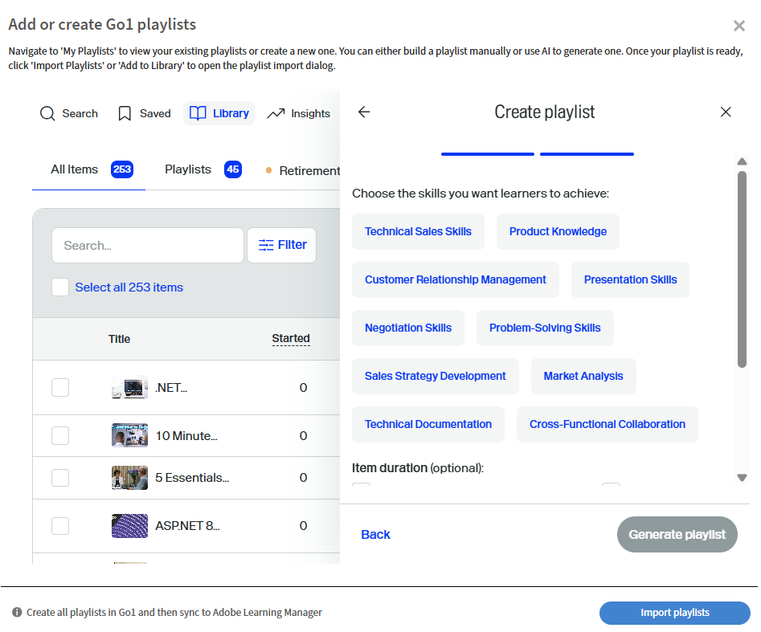

# 在学习路径中策划Go1课程

管理员通常需要从多个存储库或目录中策划课程，这会导致很难确定最佳选项。 这对于Go1尤其具有挑战性，因为该平台提供数千门课程。 为简化此流程，我们直接在学习路径创建流程中提供AI支持的监管功能。 这有助于管理员快速发现和选择最相关的课程

直接将Go1课程添加到“学习路径”和“认证”。 创建包含Go1课程的学习路径，以便学习者可以在培训中访问选定的Go1课程。

>[!INFO]
>
>您需要拥有有效的Go1许可证才能将Go1课程添加到学习路径或认证。 查看此[文章](/help/migrated/administrators/feature-summary/content-marketplace.md)，了解有关Go1许可证详细信息的更多信息。

## 创建学习路径

要使用Go1课程创建学习路径，请执行以下操作：

1. 以管理员身份登录Adobe Learning Manager。
2. 在左侧导览窗格中选择&#x200B;**[!UICONTROL 学习路径]**。
3. 选择&#x200B;**[!UICONTROL 添加]**。

   
   _在“学习路径”部分选择“添加”，为学习者创建和组织新的结构化培训方案_

4. 键入所需的详细信息，然后选择&#x200B;**[!UICONTROL 保存]**。 有关详细信息，请查看此[文章](/help/migrated/administrators/feature-summary/learning-paths.md)。
5. 您可以通过以下方式向学习路径添加课程：

   * **[!UICONTROL 添加课程或学习路径]**：添加Adobe Learning Manager中可用的现有课程或学习路径。
   * **[!UICONTROL 从Go1监管内容]**：从Go1平台添加课程。
6. 从Go1 **[!UICONTROL 中选择]**&#x200B;监管内容。

   
   _将Go1课程添加到您的销售工程师技能开发播放列表中，以使用精选的第三方内容扩展学习选项_
7. 管理员可以通过以下方式创建播放列表：

   * 使用&#x200B;**[!UICONTROL Go1 AI Assistant]**。 有关详细信息，请查看[Go1 AI助手](/help/migrated/administrators/feature-summary/content-marketplace/curate-go1-playlist.md#go1-ai-assistant)。
   * 在&#x200B;**[!UICONTROL 库]**&#x200B;中，选择&#x200B;**[!UICONTROL 创建播放列表]**，然后选择以下选项之一：
a. **[!UICONTROL 使用AI]**：借助AI创建播放列表。 有关详细信息，请查看此[部分](/help/migrated/administrators/feature-summary/content-marketplace/curate-go1-playlist.md#create-a-playlist-with-ai)。
b. **[!UICONTROL 我自己]**：手动向播放列表添加课程来创建播放列表。 有关详细信息，请查看此[部分](/help/migrated/administrators/feature-summary/content-marketplace//curate-go1-playlist.md#create-a-playlist-manually)。

### Go1 AI Assistant

Adobe Learning Manager提供AI支持的帮助，让管理员能够更轻松地管理课程。 借助内容中心页面上提供的AI Assistant，管理员可以提出问题、获得个性化推荐并立即创建播放列表。 此外，还将AI支持集成到学习路径创建流程中，帮助管理员从大型目录（如Go1）中快速识别最相关的课程。 这些功能简化了监管流程，节省了时间，并确保学习者获得了最佳内容。

要使用AI创建播放列表，请执行以下操作：

1. 在Go1内容中心上选择&#x200B;**[!UICONTROL 使用AI聊天]**&#x200B;选项。

   
   _显示“使用AI聊天”选项的内容中心屏幕，管理员可在此处与AI Assistant交互以提出问题_

2. 键入问题，然后选择&#x200B;**[!UICONTROL 发送]**。

   
   _AI Assistant屏幕，管理员可在其中键入问题、获取课程推荐并立即创建适合其需求的播放列表_
3. 选择技能，然后选择&#x200B;**[!UICONTROL 编译到一个列表]**。

   
   _AI Assistant屏幕，显示选择和编译到播放列表中的相关技能_
4. 选择&#x200B;**[!UICONTROL 转换为播放列表]**。

   
   _显示“转换为播放列表”选项的AI Assistant屏幕，可将所有课程编译到播放列表中_

5. 选择&#x200B;**[!UICONTROL 查看播放列表]**。

   
   _显示“查看播放列表”选项的AI Assistant屏幕，用于发布播放列表并将其导入学习路径_

6. 选择&#x200B;**[!UICONTROL Publish]**&#x200B;以创建播放列表。 您可以在Go1中创建其他播放列表并将其添加到学习路径。
7. 在确认提示中选择&#x200B;**是**。
8. 从&#x200B;**[!UICONTROL 选择要导入提示的播放列表]**&#x200B;中选择播放列表。

   
   _从Adobe Learning Manager的Go1库中选择并导入Sales Engineer Skills Enhancement播放列表_

9. 选择&#x200B;**[!UICONTROL 将播放列表添加到学习路径]**，然后选择&#x200B;**[!UICONTROL Publish]**。

播放列表中的课程将添加到“学习路径”中。 管理员随后可以注册学习者，以便立即开始课程。

### 使用AI创建播放列表

管理员可以在AI提示中键入播放列表说明。 AI将监管相关课程，并根据要求创建播放列表。 AI会通过解释用户提供的学习目标或提示来生成播放列表。 创建播放列表时，管理员可以选择使用AI技术监管内容，以便系统使用大型语言模型来了解指定的学习目标和内容首选项，例如持续时间和类型。 然后，AI会在内容库中搜索与这些条件匹配的相关学习对象。

1. 选择&#x200B;**[!UICONTROL 创建播放列表]**，然后选择&#x200B;**[!UICONTROL 使用AI]**。

   
   _使用AI创建精选播放列表，以便根据学习者的需求自动推荐课程_

2. 在&#x200B;**[!UICONTROL 输入学习目标]**&#x200B;文本字段中键入有关播放列表的简短说明。 例如，_创建面向销售工程师的精选学习播放列表，重点是增强产品知识、技术沟通、客户参与和解决方案销售_。

   
   _键入您的学习目标以创建自定义播放列表，以帮助Adobe Learning Manager推荐适合您学习者需求的目标课程_

3. 选择&#x200B;**[!UICONTROL 下一步]**。 系统提示会显示所需的技能、课程时长和课程类型以供选择。
4. 选择所需的技能。

   
   _从列表中选择技能，为销售工程师策划课程_

5. 选择播放列表的课程持续时间和类型。
   
   _选择为销售工程师策划课程的持续时间和类型_

6. 选择&#x200B;**[!UICONTROL 生成播放列表]**。 创建播放列表时，系统会提供跨两页的10个课程，管理员可使用播放列表创建学习路径。

   
   _查看Adobe Learning Manager中精选的销售工程师技能增强播放列表_

7. 通过选择&#x200B;**[!UICONTROL 选择图像]**&#x200B;浏览图像并将其添加到播放列表中。
8. 使用可用的AI选项更改标题：

   * **[!UICONTROL 改善写作]**：优化现有标题使其更清晰。
   * **[!UICONTROL 生成字幕]**：自动根据内容或上下文创建新字幕。

   
   _带有AI选项的Go1播放列表创建屏幕，用于增强播放列表标题_

9. 使用可用的AI选项更改描述：
   * **[!UICONTROL 改善写作]**：优化现有描述使其更清晰。
   * **[!UICONTROL 生成描述]**：自动根据内容或上下文创建新描述。
   * **[!UICONTROL 使其更短]**：缩短文本或标题，同时保留主要观点。

   
   _带有AI选项的Go1播放列表创建屏幕，用于增强播放列表描述_

10. 选择&#x200B;**[!UICONTROL 添加项目]**&#x200B;以向播放列表中添加更多课程。

11. 选择&#x200B;**[!UICONTROL Publish]**&#x200B;以创建播放列表。 您可以在Go1中创建其他播放列表并将其添加到学习路径。
12. 在确认提示中选择&#x200B;**是**。
13. 从&#x200B;**[!UICONTROL 选择要导入提示的播放列表]**&#x200B;中选择播放列表。

   
   _从Adobe Learning Manager的Go1库中选择并导入Sales Engineer Skills Enhancement播放列表_

14. 选择&#x200B;**[!UICONTROL 将播放列表添加到学习路径]**，然后选择&#x200B;**[!UICONTROL Publish]**。

播放列表中的课程将添加到“学习路径”中。 管理员随后可以注册学习者，以便立即开始课程。

>[!NOTE]
>
>管理员还可以直接从内容中心页面创建播放列表。 有关详细信息，请查看[内容中心](/help/migrated/administrators/feature-summary/content-marketplace.md#content-hub)。

## 手动创建播放列表

手动选择最符合学习者要求的课程，并策划其他相关课程。

手动创建播放列表：

1. 选择&#x200B;**[!UICONTROL 创建播放列表]**，然后选择&#x200B;**[!UICONTROL 我自己]**。

   
   _手动创建播放列表，以便管理员根据特定学习者需求完全控制课程设置_

2. 通过选择&#x200B;**[!UICONTROL 选择图像]**&#x200B;浏览图像并将其添加到播放列表中。
3. 键入播放列表的标题和说明。

   
   _在Adobe Learning Manager中为播放列表添加标题和描述，以清楚地定义播放列表的目的并帮助学习者进行有针对性的技能开发_

4. 选择&#x200B;**[!UICONTROL 创建]**。
5. 选择&#x200B;**[!UICONTROL 添加项]**&#x200B;以添加相关课程。

   
   _在Adobe Learning Manager中将项目添加到销售工程师技能开发播放列表中，以策划目标课程_

6. 搜索并选择所需课程。
7. 选择&#x200B;**[!UICONTROL Publish]**。 已创建包含相关课程的播放列表。
8. 在确认提示中选择&#x200B;**是**。
9. 从&#x200B;**[!UICONTROL 选择要导入提示的播放列表]**&#x200B;中选择播放列表。
10. 选择&#x200B;**[!UICONTROL 将播放列表添加到学习路径]**，然后选择&#x200B;**[!UICONTROL Publish]**。

播放列表中的课程将添加到“学习路径”中。 管理员随后可以注册学习者，以便立即开始课程。

## 管理Go1播放列表

管理员可以通过复制、共享或删除已创建的Go1播放列表来管理它们。

### 复制播放列表

要复制播放列表，请执行以下操作：

1. 以管理员身份登录Adobe Learning Manager。
2. 选择&#x200B;**[!UICONTROL 内容市场]**。
3. 选择&#x200B;**[!UICONTROL 内容中心]**，然后选择&#x200B;**[!UICONTROL 库]**。
4. 选择播放列表，然后选择&#x200B;**[!UICONTROL 编辑]**。
   
   _Go1播放列表屏幕，显示编辑播放列表的选项_
5. 选择省略号，然后选择&#x200B;**[!UICONTROL 复制]**。
   
   _播放列表管理屏幕，突出显示“重复”选项_

选定的播放列表将被复制并添加到Go1内容库中

### 删除播放列表

要删除播放列表，请执行以下操作：

1. 以管理员身份登录Adobe Learning Manager。
2. 选择&#x200B;**[!UICONTROL 内容市场]**。
3. 选择&#x200B;**[!UICONTROL 内容中心]**，然后选择&#x200B;**[!UICONTROL 库]**。
4. 选择播放列表，然后选择&#x200B;**[!UICONTROL 编辑]**。
   
   _Go1播放列表屏幕，显示编辑播放列表的选项_
5. 选择省略号，然后选择&#x200B;**[!UICONTROL 删除播放列表]**。
   
   _播放列表管理屏幕，突出显示“删除播放列表”选项_

选中的播放列表将从Go1库中删除。

### 共享播放列表

与Adobe Learning Manager的Go1集成不支持“共享播放列表”选项。 此选项将在下一个版本中从UI中删除。

## 已超过课程限制

将Go1课程添加到学习路径时，如果新添加的课程尚未同步到Adobe Learning Manager，管理员可能会看到错误。 这些课程将在48至72小时内提供。

如果您现在添加播放列表，则只会包含已同步的课程。

如要包含所有课程，建议等到同步完成后，再将播放列表添加到“学习路径”。

## 认证中的Go1课程

管理员可以在Adobe Learning Manager中的认证计划中添加Go1课程。 创建认证时，管理员可以从Go1内容目录中搜索和选择课程。 通过Go1计划导入的所有Go1课程均可在认证工作流程中选取。

包含Go1课程的认证可配置为永久认证或重复认证。 如果重复认证，证书将在规定的时间间隔后自动续订，从而使学习者可以重新参加Go1课程并保持其认证状态。

有关创建证书的详细信息，请查看[证书](/help/migrated/administrators/feature-summary/certifications.md)。
