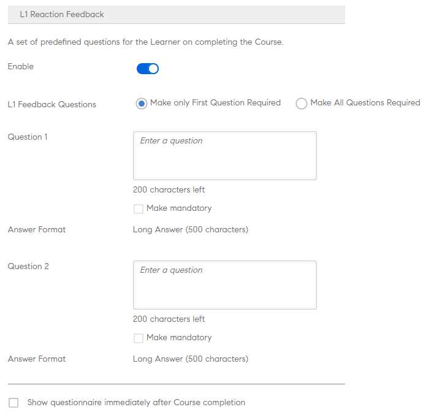

# 创建课程实例和学习路径

此文档中包含的“帮助”可用于创建课程模块、实例和管理员角色课程。

作者可以创建课程。学习者可以参加课程，管理员可根据课程的参加情况跟踪学习者的表现。

## 概述 {#overview}

作者可以创建课程。学习者可以参加课程，管理员可根据课程的参加情况跟踪学习者的表现。管理员可查看作者创建的课程并执行本部分中解释的一些活动。作为管理员，您可以为学习者创建包含预定义课程集的专属学习计划。

## 创建课程实例 {#createinstanceofacourse}

### 管理实例

>[!INFO]
>
>在本培训中，您将了解如何编辑实例详细信息和实例属性。    

如果您无法启动培训，请写入<almacademy@adobe.com>。

### 如何创建实例

作者创建课程后，您可以创建该课程的实例。 您可以通过创建课程实例，在不同时间段向学习者提供相同课程。 学习者可以选择任何实例并进行注册。 您可以对每个实例进行配置，实现个性化的徽章、反馈和其他设置。

要创建实例，

1. 在管理员的 Web 应用程序中，单击左侧窗格中的&#x200B;**[!UICONTROL “课程”]**。
1. 在课程列表中，选择所需课程，然后单击&#x200B;**[!UICONTROL “查看课程”]**。

   

   *查看课程*

1. 要创建实例，请单击左侧窗格中的&#x200B;**[!UICONTROL “实例”]**。 默认情况下，每个课程都有一个实例。 您可以修改默认实例或添加实例。 您无法删除此课程实例。
1. 要创建示例，单击课程信息右上角的&#x200B;**[!UICONTROL “添加新实例”]**。此时会显示课程的新实例。
1. 输入实例的属性：

   * 在&#x200B;**[!UICONTROL 实例名称]**&#x200B;字段中，输入要与该课程关联的实例的名称。 确保对实例使用唯一的名称。
   * 指定实例的完成截止日期。 学习者必须在此日期之前达到课程完成状态。
   * 单击&#x200B;**[!UICONTROL 显示更多选项]**&#x200B;以显示其他截止日期选项。
   * **[!UICONTROL 注册截止日期]：**&#x200B;这是学习者在自助注册的情况下注册学习对象的日期。
   * **[!UICONTROL 取消注册截止日期]：**&#x200B;您可以通过取消注册截止日期来选择限制学习者自行取消注册。
   * **[!UICONTROL 时区]：**&#x200B;搜索，然后从下拉列表中选择&#x200B;**[!UICONTROL 时区]**。

   管理员可根据需求决定课程或学习计划的完成截止日期。不过，建议在教室/虚拟教室培训中使用一个。

   

   *设置完成截止日期*

### 查看实例的属性 {#viewpropertiesoftheinstance}

*查看实例的属性*

1. **模块：**&#x200B;课程作者创建的模块数
1. **注册的学习者：**&#x200B;由管理员注册到课程的学习者数量。
1. **会话：**&#x200B;课程中虚拟教室和教室模块的数量。
1. **反馈已启用：**&#x200B;显示是否为此课程启用 L1、L2 和 L3 反馈。

>[!NOTE]
>
>管理员可以转至“Instances”（实例）>“Sessions”（会话）并选择“Cancel Session”（取消会话）来取消会话。

### 弃用实例 {#retireaninstance}

要弃用实例，请执行以下步骤；

1. 在实例上，单击下拉菜单并选择选项&#x200B;**[!UICONTROL “弃用实例”]**。

   

   *注销实例*

1. 要搜索所有已弃用的实例，请单击“实例”页面上的&#x200B;**[!UICONTROL “已弃用”]**&#x200B;选项卡。

### 恢复实例 {#restoreaninstance}

要将已弃用的实例恢复为激活状态，请执行以下步骤：

1. 在实例上，单击下拉菜单并选择选项&#x200B;**[!UICONTROL “重开实例”]**。

   

   *还原实例*

1. 该实例现在恢复为活动模式。

### 删除实例

管理员可以在创建后立即使用&#x200B;**删除此实例**&#x200B;选项删除该实例。 如果存在与之链接的会话或任何学习者已注册该会话，则无法删除实例。

*删除实例*

>[!NOTE]
>
>不能删除默认实例。

### 发送实例级电子邮件

如需向已注册的学习者发送实例级电子邮件，请执行以下操作：

1. 在&#x200B;**[!UICONTROL 实例]**&#x200B;页面上，选择任意实例上的选项，然后单击&#x200B;**[!UICONTROL 向已注册的学习者发送电子邮件]**。

*向已注册实例的学习者发送电子邮件*

1. 在“**[!UICONTROL 创建公告]**”对话框中，将“类型”选为“电子邮件”。 指定主题、输入消息，然后单击&#x200B;**[!UICONTROL “保存”]**。 系统会自动选择培训。

   

   *将公告创建为电子邮件*

1. 单击&#x200B;**[!UICONTROL “保存”]**&#x200B;后，您将看到公告已成功创建的确认消息。 如需发布公告，请单击&#x200B;**[!UICONTROL “立即发布”]**。

   

## 将学习者注册到课程

在本培训中，您将学习如何注册、取消注册和重新注册学习者。

如果您无法启动培训，请写入<almacademy@adobe.com>。

### 在各种实例中注册学习者

1. 从课程列表中选择课程。
1. 在左侧面板中选择&#x200B;**[!UICONTROL 学习者]**。
1. 选择&#x200B;**[!UICONTROL 注册]**。

   

   *Publish课程*

1. 在&#x200B;[!UICONTROL **注册学习者**]&#x200B;对话框中，您可以：

   * 在“选择实例”下拉列表中，选择要注册学习者的实例。
   * 在“包含学习者”字段中选择用户或用户组，或同时选择两者。
   * 在“排除学习者”字段中选择要从实例中排除的学习者。
   * 如果希望一或多名学习者在所选实例中注册，请在对话框底部选择“是”。

1. 选择&#x200B;**[!UICONTROL “继续”]**。

   

   *继续注册学习者*

### 查看实例的注册报告

1. 从课程列表中选择课程。
1. 在左侧面板中选择&#x200B;**[!UICONTROL 学习者]**。
1. 选择&#x200B;**[!UICONTROL 操作]** > **[!UICONTROL 导出]**。

Excel 文件包含每个实例的工作表。 工作表中包含以下字段：

* 学习者
* 电子邮件
* 用户唯一 ID
* 课程名称
* 学习对象唯一 ID
* 状态
* 选择标准
* 注册日期/取消注册日期（UTC 时区）
* 完成日期（UTC 时区）
* 截止日期（UTC 时区）
* 开始日期（UTC 时区）
* 测试分数
* 经理姓名
* 地址
* 用户状态
* 专业领域
* 注释
* 访问次数
* 访问日期
* 时间戳（UTC 时区）
* 耗时（分钟）

>[!NOTE]
>
>启用多注册后，系统会将多行添加到每个课程的学习者成绩单报告中（每个实例占一行）。
>
>如果报告自动化设置预期每个课程仅有一行，则必须在启用多注册功能之前对报告自动化进行必要的调整。

### 管理一门课程的学习者名单 {#managelearnerslistforacourse}

1. 单击课程缩略图上的课程名称。
1. 在左侧窗格中，单击&#x200B;**[!UICONTROL 学习者]**。

*选择课程中的学习者*

从“学习者”页面可执行以下操作：

* 选择要删除的学习者，然后单击&#x200B;[!UICONTROL **操作**] > [!UICONTROL **删除**]。
* 选择要标记出勤情况的学习者，然后单击“[!UICONTROL **操作**]”>“[!UICONTROL **标记完成**]”。

若要允许学习者重置模块并再次继续使用模块，请单击&#x200B;[!UICONTROL **重置**]。 从弹出式对话框中，单击“是”以确认重置。 已完成的模块不能重置。 只有未通过或未完成的模块才能重置。

您也可以将学习者列表导出到 Excel 表格中。 要导出学习者列表，请单击&#x200B;[!UICONTROL **操作**] > [!UICONTROL **导出**]。

>[!NOTE]
>
>如果一门课程存在多个实例，则在各标签下单独提供Excel格式的学习者列表。 学习者列表包括学习者姓名、状态和选择条件。 学习者状态可以是&#x200B;**未开始**、**进行中**&#x200B;或&#x200B;**已完成**。

### 导出处于待审批状态的学习者

管理员、经理或自定义管理员可以导出处于待审批注册状态的学习者的数据。 您可以通过&#x200B;**“课程”>“学习者”**&#x200B;选项卡导出数据，然后单击“操作”下拉列表。

当没有学习者注册/等待经理审批的课程，并且将生成空报告时，系统将显示此选项。 当学习者处于待审批状态、已注册状态、待定状态和未注册状态时，您也可以导出。

报告包含活动、已删除和已挂起用户的数据（如果这些用户正在等待审批）。 此外，报告还包含处于待审批状态的内部和外部用户的数据。

如果学习者之前处于待审批状态、未注册，则报告中将不显示其记录。 此外，如果之前处于待审批状态的学习者通过管理员/经理/自定义管理员注册了该课程，则其记录会显示在报告中。

## 轮候表

当教室课程名额有限时，轮候表部分允许学习者根据其注册顺序进行轮候。 管理员可以通过选择轮候学习者并分配超过初始限制的名额来管理这种情况。 管理员分配名额后，学习者即可立即注册该课程。

## 导出学习者的出勤率 {#attendance}

对于教室和虚拟教室课程，您可以下载参加此课程的学习者列表（针对任何实例）。

在课程详细信息页面上，单击右侧窗格中的&#x200B;**[!UICONTROL “出勤和得分”]**。

在页面右上角，单击&#x200B;**[!UICONTROL “操作”]**&#x200B;下拉列表。 然后单击&#x200B;**[!UICONTROL “导出学习者列表 (PDF)”]**&#x200B;选项。

*将学习者列表导出为PDF*

在 PDF 中，您可查看的学习者与讲师可查看的相同。

下载 PDF 时，您可看到创建课程时使用的时区 (UTC)。

## 添加 L1 和 L3 反馈 {#addl1andl3feedback}

您可以在创建课程时添加 L1 和 L3 反馈选项：

1. 以管理员身份登录后，单击左侧窗格中的“课程”。所有课程的列表将显示在右侧页面中。
1. 单击要为其添加L1或L3反馈的课程磁贴。
1. 单击左侧窗格中的“实例默认值”。
1. 单击 L1 或 L3 反馈旁的切换按钮上的圆圈以将其启用。
1. 在 L3 问题下的文本区域中添加 L3 反馈问题。

### 强制性 L1 反馈 {#mandatory-l1-feedback}

您可以将L1反馈中的所有问题或第一个问题设为必答题。

*将L1反馈中的所有问题或第一个问题设为必答题*

现在，您可以创建问题，而这些问题均会成为必答题。

*创建问题*

如果由于某种原因，两个必填问题没有任何文本，则问题将不会出现在反馈表单中。

>[!NOTE]
>
>仅在学习计划实例中启用这些设置是不够的。 您还必须在“课程实例”级别为“学习计划”中的每门课程启用这些设置。

在“实例默认值”页面中，如果启用&#x200B;**[!UICONTROL “将所有问题设为必填”]**，则此后创建的所有新实例都将继承这些设置。

*查看实例默认值页面*

### 课程级别 L1 反馈 {#l1-feedback-course-level}

在之前版本的 Adobe Learning Manager 中，管理员可以为“学习计划”启用 L1 反馈。

在当前版本的 Adobe Learning Manager 中，管理员可就“学习计划”囊括的所有课程发送 L1 反馈。管理员必须确保为课程实例级别的所有课程启用L1反馈。

1. 要为每个课程启用L1反馈，请在管理员应用程序中单击&#x200B;**[!UICONTROL 学习计划]** > **[!UICONTROL 查看学习计划]**。

1. 单击&#x200B;**[!UICONTROL 实例]** > **[!UICONTROL 已启用L1反馈]**。

1. 启用选项&#x200B;**[!UICONTROL 为每门课程启用]**。

   

   *启用课程反馈*

   仅在“学习计划”级别启用此切换开关时，不会触发针对此计划内课程的L1反馈。 要启用L1反馈，请前往“学习计划”中的每门课程，并启用L1反馈切换功能。

   

   *为每门课程启用L1反馈*

   若为所有课程启用L1反馈，但在“学习计划”实例中禁用此反馈，系统将不会为课程触发L1反馈。

### 特定于语言的测试报告

测试报告有助于评估学习者在完成学习计划或课程后的表现。

Adobe Learning Manager 目前支持 13 种界面语言和 32 种内容语言的学习。尽管对学习者而言，此选项操作轻松，并且能够方便地支持我们全球的学习者，但对管理员来讲，要获取不同区域的测试报告并不容易。

如果课程以多种语言提供，则测试报告也会以不同的语言显示数据。 到目前为止，管理员生成的报告会依序逐一显示回应，而不考虑参与测试时使用的语言为何。 **例如**，如果用户以荷兰语参与测试，管理员每次只能查看用户以荷兰语完成测试的报告。 将英语作为界面语言的管理员无法同时查看所有用户的报告，与参与的区域无关。

这种情况得到了纠正，管理员现在能够一次性查看学习者参与测试所用语言的所有报告，而与所选择的内容区域无关。 用不同语言参与的测试将作为额外列添加到测试报告中。

### 在帐户级别启用 L1 反馈 {#l1-feedback-account-level}

*在帐户级别启用L1反馈*

管理员可以在帐户级别启用此设置，以便为新创建的课程和学习计划启用L1反馈。 但是，启用此设置不会影响现有课程和学习计划

如果启用，所有新培训和新实例都将默认启用反馈。 如果作者/管理员访问实例，实例将默认启用反馈，在手动关闭此设置后，设置将恢复原样。

要启用L1反馈，请在管理员应用中单击&#x200B;**[!UICONTROL 设置]** > **[!UICONTROL 反馈]**。

*查看“反馈设置”页面*

单击右上角的&#x200B;**[!UICONTROL “编辑”]**&#x200B;并切换选项以启用L1反馈。

作者创建课程时，在管理员应用程序的“实例”页面上，将自动为新课程启用&#x200B;**[!UICONTROL L1反馈]**。

<!---->

您还可以通过切换&#x200B;**[!UICONTROL 启用]**&#x200B;选项来禁用L1反馈，如下所示：

*启用或禁用L1反馈*

### 添加 L1 和 L3 反馈的描述性问题 {#descriptive}

Adobe Learning Manager 11 月版本中提供了一个新选项，用户可以通过该选项添加描述性问题。管理员可以选择是否将这些问题添加给学习者。此配置是 Adobe Learning Manager 所提供默认问题集的补充。如果需要，还可以选择问题下方的选项来将其设为必选项。

您可为 L1 反馈添加两个描述性问题，为 L3 反馈添加一个描述性问题。

启用 L1 反馈后，可以查看如下快照中所示的选项。

*为L1和L3反馈添加描述性问题*

如果想让学习者在完成课程后立即看到问卷，您可以选择相应的选项。

以下 L1 问卷的示例输出供您参考。学习者可以查看以下格式的问卷。“测试-1”和“测试-2”为描述性问题。

*示例课程反馈问题*

启用L3反馈后，您可以查看以下快照中显示的选项：

*启用L3反馈*

“问题 2”为 L3 反馈的描述性问题。您可以单击问题下方的相应选项来将其设为必选项。

以下 L3 问卷的示例输出供您参考。学习者可以查看以下格式的问卷。

*查看L3反馈输出*

### 设置 L1 和 L3 反馈问卷 {#setupl1andl3feedbackquestionnaire}

您可以设置 L1 和 L3 反馈问卷，还可以在帐户级别设置提醒。

1. 以管理员身份登录后，单击左侧窗格中的&#x200B;**[!UICONTROL 设置]**&#x200B;和&#x200B;**[!UICONTROL 反馈]**。\
   此时会显示反馈设置页面，其中包含两个选项卡：**[!UICONTROL L1反馈]**&#x200B;和&#x200B;**[!UICONTROL L3反馈]**。\
   **[!UICONTROL L1反馈]**&#x200B;选项卡包含教室和自学课程的默认&#x200B;**[!UICONTROL L1反馈]**&#x200B;问卷列表以及提醒设置。 在&#x200B;**[!UICONTROL L3反馈]**&#x200B;选项卡中，可查看L3反馈默认语句和提醒设置。

1. 单击页面右上角的“编辑”以修改现有问卷。\
   在&#x200B;**[!UICONTROL L1反馈]**&#x200B;选项卡中，可单击“是/否”切换按钮来启用/禁用每个问题。\
   在&#x200B;**[!UICONTROL L3反馈]**&#x200B;选项卡中，可修改默认反馈语句。\
   单击页面底部的&#x200B;**[!UICONTROL 添加新提醒]**&#x200B;并选择发送提醒的时间。

1. 单击页面右上角的&#x200B;**[!UICONTROL “保存”]**。

在 L1 反馈中，您可以看到两组问卷和一个默认问题。第一套问卷针对自学的课程（也可用于基于活动的课程）。第二套问卷可用于教室和虚拟教室类课程。

## 查看 L1 和 L3 反馈 {#viewl1andl3feedback}

您可以查看学习者就课程提供的 L1 反馈，以及经理就学习者提供的 L3 反馈。

1. 单击“课程”列表中的任何课程磁贴。
1. 单击左侧窗格中的 L1 反馈或 L3 反馈，查看收到的反馈。
1. 从下拉列表中选择实例以查看该特定实例的反馈。

## 讨论区

“讨论区”功能允许学习者查看课程讨论。 作为管理员，您可以根据需要删除任何注释。 管理员可以在课程设置下启用此选项。

## 课程审阅 {#coursemoderation}

每当作者添加、更新或删除模块并重新发布课程时，所有管理员均会收到关于相同内容的通知。管理员随后可单击该链接来查看更改内容以及比较新旧内容，并相应地批准或拒绝更改。

要启用课程审阅，请单击&#x200B;**[!UICONTROL 设置]** > **[!UICONTROL 常规]**。 选择&#x200B;**[!UICONTROL “课程审阅”]**&#x200B;复选框以启用此功能。

*启用课程审阅*

单击通知以查看作者对课程所做的更改。随后可以批准或拒绝作者对课程的更新。如果您选择批准，课程将重新发布。如果您拒绝更新，课程的前一个版本将继续存在。在这两种情况下，均会向作者发送通知。

*作者请求课程更新*

如果有多个作者正在更新相同的课程，则管理员的通知中将反映最近执行更新的作者或最近执行的更改。您随后可批准或拒绝最近执行的更改。

## 导出核对表数据 {#export-checklist-data}

从课程列表中，打开包含核对清单的课程。 在左侧窗格中，您将看到一个选项“清 **[!UICONTROL 单”]**。

*导出清单数据*

单击该选项，然后在课程页面上执行以下操作：

1. 选择实例和模块。
1. 单击“**[!UICONTROL 操作]**”>“**[!UICONTROL 导出]**”，然后导出学习者核对清单报告。

在&#x200B;**[!UICONTROL 清单]**&#x200B;页面上，讲师可以从&#x200B;**[!UICONTROL 操作]**&#x200B;下拉列表中导出清单报告。

CSV报告包含以下字段：

* 用户名
* 用户电子邮件
* 经理姓名和电子邮件
* 培训名称
* 培训实例
* 教师姓名和电子邮件
* 提交日期
* 评估状态
* 与实际文本一起提问
* 用户状态
* 资料
* 活动字段

如果您在选择状态筛选器之后下载报告，则下载的“学习者成绩单”报告将包含应用状态筛选器后筛选出的学习者数据。 在“自定义管理员”和“经理”准备生成“学习者成绩单”时，亦会看到这个已添加的筛选器。

## 查看课程 {#viewingcourses}

作为管理员，您可以查看所有可用课程的列表。   单击左侧窗格中的&#x200B;**[!UICONTROL 课程]**&#x200B;以查看包含搜索和筛选选项的课程列表。 您还可以在课程缩略图中查看每门课程的课程效果百分比。

>[!NOTE]
>
>在学习者使用完课程后或者在任何特定的课程发布后您想要搁置该课程时，可以弃用课程。 您仅可弃用处于已发布状态的课程。单击&#x200B;**[!UICONTROL 已弃用]**&#x200B;选项卡可查看所有弃用的课程。

## 查看测验分数 {#viewquizscores}

1. 单击课程缩略图上的课程名称。
1. 单击左侧窗格上的测验分数。

您可以根据用户名或基于每个问题查看任何特定课程的测验分数。 相应地按用户或按问题选择选项卡。 

从下拉列表中选择实例类型，按课程实例查看分数。

## 默认实例

管理员可以在&#x200B;**[!UICONTROL 默认实例]**&#x200B;页面中设置默认徽章、游戏设置和提醒。 若要修改默认实例设置，请选择&#x200B;**[!UICONTROL 默认实例]** > **[!UICONTROL 编辑]**。

* **[!UICONTROL 徽章]**：从下拉菜单中选择默认徽章。
* **[!UICONTROL 游戏]**：配置游戏设置，包括完成点数、提早完成点数和及时完成点数。 管理员可以选择帐户级别设置或自定义此实例的游戏点数。
* **[!UICONTROL L1反应反馈]**：为学习者完成课程时的反馈启用预定义问题，并提供将问题设为必答的选项。
***[!UICONTROL L3行为更改反馈]**：在学习者的经理完成课程后启用反馈问题。
***[!UICONTROL 提醒设置]**：设置和管理截止日期的提醒，并提供升级选项。

### 设置上报级别 {#escalation}

要发送电子邮件通知，管理员必须明确选择升级级别以：

* 经理
* 管理器和跳过级别管理器

*设置升级级别*

## 预览课程 {#previewcourses}

管理员可以在查看课程模块时单击&#x200B;**[!UICONTROL “学习者预览”]**&#x200B;选项来预览课程。

1. 以管理员身份登录后，单击左侧窗格中的&#x200B;**[!UICONTROL 课程]**。
1. 单击页面上课程列表中的任何课程磁贴。
1. 单击左窗格中的“学习者预览”，然后单击页面上的模块名称，在播放器预览课程模块。

## 课程效果 {#courseeffectiveness}

通过评估课程效果来了解课程对于学习者是否有帮助。它结合了学习者针对课程内容提出的反馈、学习者的课程测试结果以及经理根据学习者的课程学习情况提供的评估反馈。

管理员可以在课程缩略图中查看课程效果评分，如下图所示。您可以看到此课程的评分为 100。

<!---->

综合 L1、L2 和 L3 反馈值，得出课程效果评分值。 要查看各个反馈详情，单击课程效果值。 此时会显示弹出窗口，如下所示。

*查看L1、L2和L3反馈的课程效果*

在这个示例截图中，1 名用户（共 1 名）收到了全部三个反馈，因此得分为 100/100。 从这张表格中，您可以发现，如果一门课程缺少三项反馈（L1、L2 和 L3）中的任何一项，就会对总体效果产生负面影响。 单击弹出窗口右下角的向下箭头，可查看课程效果的计算方式。

*课程效果计算*

根据上面显示的饼图，经理提供的 L3 反馈的权重更大。

## 搜索课程和学习计划 {#searchingcoursesandlearningprograms}

Adobe Learning Manager 可让您更轻松快速地找到所选择的课程/学习计划。您可以通过两种方式搜索课程：

1. 使用“搜索”字段。单击右上角显示的搜索图标。此时会显示搜索字段。输入课程名称或与课程关联的任意关键字来查找课程/学习计划。 您也可以使用预定义的标签(如Captivate、C、Java和HTML)进行搜索。 标签可在搜索字段中进行搜索，也就是说标签会在您输入时显示在搜索字段中。
1. 使用过滤器过滤课程/学习计划列表。 您可以按状态过滤课程，例如“全部”、“已发布”、“草稿”和“已弃用”。在管理员模式下，不会显示草稿过滤器。

您可以单击“能力”并进行选择，然后根据能力进行搜索。管理员可以通过四种方式排序课程，以便查找所需课程。 单击“排序方式”并选择字母升序、字母降序、课程更新日期或课程效果。

<!---->

您可以通过三种方式对学习计划进行排序：字母升序、字母降序和基于更新日期。

## 注册学习者 {#enrollinglearners}

您可以按照相同的步骤为学习者注册课程、学习计划和认证。经理也可以使用以下步骤来注册其学习者。

管理员可以根据企业要求为学习者注册必修课程：

1. 将鼠标悬停在任何已发布的课程资料磁贴上，然后单击“注册”学习者。\
   或者，单击任何已发布的课程表，然后单击左侧窗格上的学习者。 此时会显示一个页面，列出了学习者名单。 单击“注册”。\
   此时会显示注册学习者对话框。

1. 从“选择实例”下拉列表中选择实例。下拉列表列出了所有实例，包括活动、已停用和已到期的实例。

>[!NOTE]
>
>管理员可单击学习者页面上的下拉箭头并单击&#x200B;**[!UICONTROL “操作”]**>**[!UICONTROL “删除”]**&#x200B;来删除课程的任何已注册学习者。

*注册学习者时添加注释*

*注册学习者*

## 用户

+++包含学习者

选择您希望包含的用户组和个别学习者（使用电子邮件 ID 或姓名）。将所有用户组添加到同一个集下的交集中。要将另一个用户组添加到并集中，请使用新包含集。

+++

+++排除学习者

选择您希望排除的用户组和个别学习者（使用电子邮件 ID 或姓名）。将所有用户组添加到同一个集下的交集中。要将另一个用户组添加到并集中，请使用新包含集。

+++

## 用户电子邮件 ID

+++电子邮件ID

复制粘贴您想要注册的学习者的电子邮件 ID（用分号、逗号或行距分隔）。使用&#x200B;**[!UICONTROL “验证电子邮件 ID”]**&#x200B;选项验证条目。所有无效条目均将显示为红色。删除或更正这些条目，然后单击&#x200B;**[!UICONTROL “继续”]**&#x200B;以继续。

*注册学习者*

将显示摘要对话框，其中含有包含集、排除集和已注册课程实例的用户数量。

+++

### 注册学习者时添加注释 {#enroll-comments}

<!----->

作为管理员或经理，您可以在课程中注册学习者时添加注释。 您可以提及有关注册课程的用户群的其他信息。 此数据会导出到课程报告中。

该注释是&#x200B;**不**&#x200B;向学习者显示的。

当管理员生成学习者的课程报告时，任何注释（如果添加）都会显示在报告中。 将显示摘要对话框，其中含有包含集、排除集和已注册课程实例的用户数量。

在&#x200B;**[!UICONTROL “注册学习者”]**&#x200B;对话框中，展开&#x200B;**[!UICONTROL “高级选项”]**&#x200B;选项。 在&#x200B;**[!UICONTROL 其他注释]**&#x200B;字段中，输入所需的注释。

*为学习者添加注释*

## 搜索注册用户 {#searchforusers}

使用预键入搜索在“学习对象”的“学习者”部分中搜索注册用户。使用预键入搜索，您可以使用名称、电子邮件 ID 和 UUID 来逐步搜索注册用户。

*搜索注册用户的演练*

这种类型的搜索有时也称为自动完成、增量搜索、随打即搜、内联搜索或即时搜索。

当您在搜索字段键入一个学习者或一个用户组时，引擎会找到一个或多个搜索词匹配项并立即呈现给您。

该过程查找内容的方式比连续执行多次搜索更快、更简单。

搜索后会显示所有实例中的学习者或用户组。对于每个学习者，学员注册参加的实例显示在&#x200B;**[!UICONTROL 实例]**&#x200B;列中。

*查看搜索结果*

使用预搜索查找，您可以：

* 查看已注册的所有用户，无论实例如何。
* 查看具有一个或多个注册用户的所有用户组。

执行搜索后，您无法按实例过滤学习者。从&#x200B;**[!UICONTROL 选择实例]**&#x200B;下拉列表中选择实例的选项被禁用。

此外，还可以使用搜索结果选择学习者或用户组，并执行以下操作：

* 取消注册
* 标记完成
* 重置模块

执行搜索时，“操作”下拉列表中的“取消注册>批量”选项对“课程/学习计划”禁用。

## 分享二维码供学习者注册、完成或两者 {#shareqrcodewithlearnerstoenrollcompleteorboth}

Adobe Learning Manager 管理员可以向学习者分享二维码，以便快速注册该课程。三个不同的二维码用于标记课程的“注册”、“完成”或“注册并完成”状态。

学习者可便捷地使用 Adobe Learning Manager 设备应用程序扫描相应的二维码。

**要下载二维码，请执行以下操作**：

1. 单击左侧导航面板中“学习”部分的&#x200B;**[!UICONTROL 课程]**。
1. 选择课程> **[!UICONTROL 查看课程]**。
1. 单击&#x200B;**[!UICONTROL 实例]** > **[!UICONTROL 更多]** > **[!UICONTROL 二维码]**。

   <!---->

1. 启用二维码，然后单击“注册”、“完成”和“注册并完成”下载图标以下载包含各二维码的 pdf 文件。管理员随后便可以向学习者分享二维码。

   

   *与查找器共享二维码*

## 课程生命周期 {#courselifecycle}

典型的课程生命周期如下所示：

**草稿** — 作者完成创建并保存课程。 在此状态下，学习者尚无法使用该课程。 在此状态下，您可以删除课程。

**已发布** — 作者完成课程发布。 在此状态下，学习者可注册课程。

**已弃用** — 发布课程后，如果作者不希望课程继续显示在学习者的课程目录中，可将其移动至弃用状态。 在此状态下，您也可以重新发布或删除课程。

**已删除** — 课程从Adobe Learning Manager应用程序中完全移除后，即显示为删除状态。 课程只有处于草稿状态时，作者才能将其删除。您还可以从已弃用状态中删除课程。

*课程生命周期的工作流程*

## 通知设置 {#notificationsettings}

管理员可调整通知设置。有关更多信息，请参阅[通知](user-notifications.md)。

## 常见问题解答 {#frequentlyaskedquestions}

+++如何以管理员身份重置模块？

在课程的“学习者”页面上，选择学习者或组，单击“**[!UICONTROL 操作]**”>“**[!UICONTROL 重置模块]**”。

*查看重置模块的选项*

单击该选项后，将重置所有选定学习者的模块状态。 已完成的模块不会重置。

+++

+++如何添加课程URL，以便学习者直接重定向到课程？

将鼠标悬停在课程卡上，然后单击&#x200B;]**“复制 URL”**[!UICONTROL 。复制 URL 后，学习者可以直接使用 URL 访问课程。

+++

+++如何重新打开实例？

要重新打开已停用的实例，请单击该实例中的下拉菜单，然后单击&#x200B;**[!UICONTROL “重新打开实例”]**。

+++
