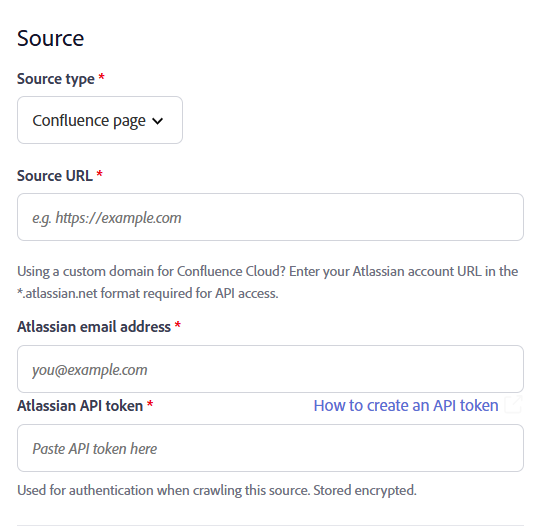
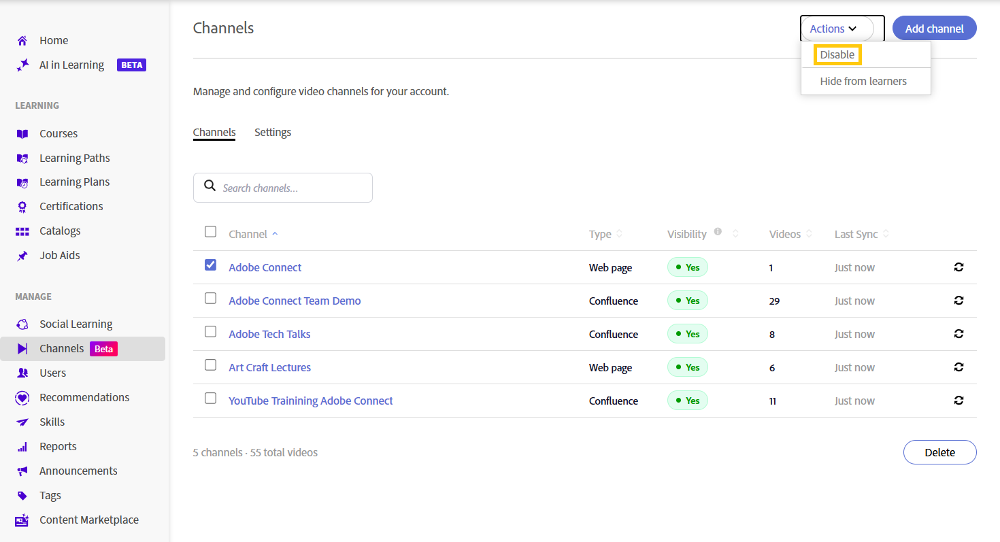
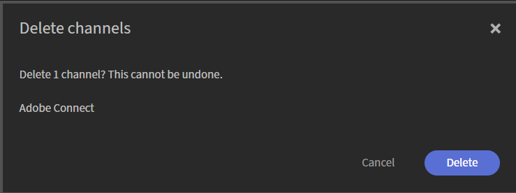

# 创建渠道(Beta)

组织经常跨精选的非正式学习内容Web和Confluence Cloud页面存储知识共享会话、培训录制内容和其他视频内容。 渠道可将Adobe Learning Manager连接到这些内容源，以便更轻松地发现和使用视频，而无需学习者在多个系统中导航。 渠道可帮助您在一个可搜索的位置组织和共享企业网页和Confluence Cloud页面中基于视频的学习内容。 学习者可以直接从Adobe Learning Manager发现并访问相关录制，而无需跨多个内部网站进行搜索。 查看[发现并参与频道](../../learners/feature-summary/discover-and-engage-with-channels.md)以了解更多信息。

作为管理员，您可以创建和管理频道、配置可见性设置、将内容与其源同步以及在使学习者可访问频道之前验证视频是否可用。 本文说明如何执行这些渠道管理任务。

**主要优点**

- 将来自多个内部源的基于视频的学习内容整合到一个位置。
- 将来自多个内部网点的视频内容整理到网页中，然后这些网页在ALM中显示为渠道。
- 使学习者无需导航到多个站点即可查找、播放内容并与内容互动。
- 使内容与其原始源保持同步。

## 启用通道

渠道是管理员为帐户开启的一项功能。 启用后，您可以创建连接到企业网页和包含视频内容的Cloud Confluence页面的渠道。

通道Crawler可靠地从源页面中提取视频，这些源页面以以下格式显示其内容：

- 表
- 项目符号列表
- 文章

要启用&#x200B;**通道**&#x200B;功能，请执行以下操作：

1. 以管理员身份登录Adobe Learning Manager。

1. 从左侧导航栏中选择&#x200B;**声道**。
    将打开&#x200B;**通道**&#x200B;页面。

1. 选择“**设置**”选项卡。

   

   *在&#x200B;**设置**&#x200B;选项卡中启用频道功能，以便管理员为帐户创建频道。*

1. 启用&#x200B;**频道功能**。

    已为帐户启用频道。

## 创建通道

创建通道以定义Adobe Learning Manager扫描视频的内容源，并自定义通道和视频页面外观。

1. 导航到&#x200B;**频道**&#x200B;选项卡，然后选择&#x200B;**添加频道**。
    将打开&#x200B;**创建频道**&#x200B;页面。

   

   *创建频道时定义内容源并配置可见性和同步选项。*

1. 在&#x200B;**频道**&#x200B;部分中，输入&#x200B;**频道名称**&#x200B;和&#x200B;**描述**。

1. 从下拉菜单中选择&#x200B;**源类型**。 您可以选择以下选项：

   1. **网页**：选择此选项可爬网网页，并导入视频链接及其相关元数据。

   1. **Confluence页面**：选择此选项以从Confluence Cloud页面检索视频链接和元数据。 要连接到Confluence Cloud，请提供以下详细信息：
      - **Atlassian电子邮件地址**：输入与您的Atlassian帐户关联的电子邮件地址。
      - **Atlassian API令牌**：输入从您的Atlassian帐户生成的API令牌。 选择&#x200B;**如何创建API令牌**&#x200B;以获取有关生成令牌的说明。 此令牌用于在搜索源时进行身份验证，并且以加密方式存储。

      

      *输入用于在Confluence Cloud中进行身份验证的Atlassian电子邮件地址和API令牌。*

1. 输入所选源类型内容的&#x200B;**源URL**。

1. 在&#x200B;**状态**&#x200B;部分中，配置以下选项：

   1. **学习者可见**：启用此选项后，渠道可供学习者使用。 禁用此选项可在继续配置或测试通道时隐藏通道。

   1. **自动同步**：启用此选项可在向源添加新视频时自动更新频道。 如果要手动同步频道，请将其禁用。

1. （可选）选择&#x200B;**显示高级设置**，然后根据需要配置以下选项：

   1. **通道主题颜色**：选择一种颜色以自定义通道的视觉外观。

   1. **爬网深度**：输入链接页面的爬网深度，以扫描视频内容。 它支持的最大爬网深度为&#x200B;**2**。

   1. **爬网频率（小时）**：输入Adobe Learning Manager检查源中新内容或更新内容的频率。

      

      *选择“显示高级设置”以配置通道主题颜色、爬网深度和爬网频率。*

1. 选择&#x200B;**立即测试**&#x200B;以验证源。 从配置的源中检索并显示示例视频。

   

   *使用&#x200B;**立即测试**，在创建频道之前确认从源检索到的视频。*

1. 选择&#x200B;**创建频道**。 已创建通道并将其添加到&#x200B;**通道**&#x200B;列表。

## 搜索渠道

使用搜索框可按名称快速查找频道。

1. 选择“**频道**”选项卡。
1. 选择“**搜索频道**”框。
1. 在&#x200B;**搜索频道**&#x200B;框中输入频道名称或其一部分。
    列表筛选器仅显示与您的搜索匹配的频道。

   

   *在搜索框中输入频道名称以筛选&#x200B;**频道**&#x200B;列表。*

## 管理渠道可见性

使用“**操作**”菜单可同时禁用或隐藏一个或多个通道。

### 禁用声道

禁用一个或多个频道以防止学习者在保留频道配置的同时访问其内容。

要禁用声道，请执行以下操作：

1. 导航到&#x200B;**频道**。
1. 选中一个或多个频道旁边的复选框，然后选择&#x200B;**动作**。

   
   *从“操作”菜单中选择“禁用”以禁用一个或多个选定的通道。*
1. 选择&#x200B;**禁用**.  出现&#x200B;**禁用频道**&#x200B;弹出窗口。
1. 选择&#x200B;**禁用**.  将禁用所选通道。

### 对学习者隐藏频道

隐藏一个或多个频道，使学习者无法在不删除这些频道的情况下使用这些频道。

要对学习者隐藏渠道，请执行以下操作：

1. 导航到&#x200B;**频道**。
1. 选中一个或多个频道旁边的复选框，然后选择&#x200B;**动作**。
1. 选择“**对学习者隐藏**”。  此时会弹出&#x200B;**对学习者隐藏**&#x200B;窗口。

   
   *在不删除频道配置的情况下对学习者隐藏频道。*

1. 选择“**对学习者隐藏**”。
    对学习者隐藏所选频道。

## 编辑频道

您可以编辑现有通道以更新其配置和设置。

要编辑频道：

1. 从&#x200B;**通道**&#x200B;列表中选择所需的通道。
    “**编辑频道**”页面将打开，并显示当前的频道配置。

1. 根据需要更新频道设置。

   

   *从&#x200B;**编辑频道**&#x200B;页面更新频道的名称、描述、源和设置。*

1. （可选）选择&#x200B;**立即测试**。

1. 选择&#x200B;**保存更改**。
    已保存更新的频道设置。

## 删除频道

您可以删除一个或多个不再需要的通道。

1. 导航到&#x200B;**频道**&#x200B;选项卡。

1. 选中要删除的每个频道旁边的复选框。

1. 从通道列表的右下角选择&#x200B;**删除**。  此时会弹出&#x200B;**删除频道**&#x200B;窗口。

   

   *确认对话框列出了您选择的渠道。*

1. 选择&#x200B;**删除**。
    所选频道将被永久删除。 此操作无法撤消。
