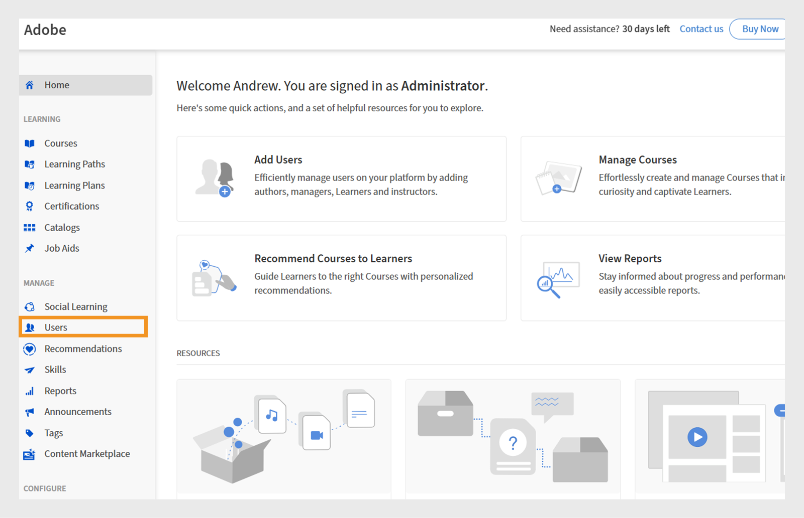

# 具有限定范围的公告权限的自定义角色

管理员可以创建自定义角色，公告权限仅限于特定目录和用户组。 这样可以确保发布具有针对性、相关性和仅对预期学习者可见。 规定范围的公告可确保适当用户收到相关公告，而无需向他人发送详细信息。

## 创建具有特定范围的自定义角色

管理员可以创建自定义角色，公告权限仅限于特定目录和用户组。

要创建具有特定范围的自定义角色，请执行以下操作：

1. 以管理员身份登录Adobe Learning Manager。
2. 在左侧导览窗格中选择&#x200B;**[!UICONTROL 用户]**。

   
   _为用户分配自定义角色，以在Adobe Learning Manager中获取目标权限和职责_

3. 选择“自定义角色”。
4. 选择创建自定义角色。

   
   _为用户分配自定义角色以自定义权限并简化特定用户组或目录的管理控制_

5. 键入自定义角色的名称和说明。
6. 在“Account Privileges”（帐户权限）下选择“Announcement”（公告）。

   
   _在“帐户权限”下启用公告权限，以允许自定义管理员管理作用域内的目标通信_

7. 在“功能权限范围”下选择“根据目录设置访问权限” ，然后选择相应目录。
8. 在同一部分中，选择按用户组设置访问权限，然后选择所需的
用户组。

   
   _设置用户组和目录范围，以确保自定义管理员只能在其分配的范围内管理权限和访问权限_

9. 选择并添加要分配此自定义角色的用户。 已分配用户可以为其范围创建公告。

自定义管理员可创建仅限于其分配的用户组和目录的公告，确保消息送达正确的受众，并防止不必要的通知。 对于通知和电子邮件公告，管理员可以添加额外的用户组，但只有定义范围内的用户才能接收它们。 对于推荐和刊头公告，您只能选择分配范围内的用户组。

## 为分配的范围创建公告

自定义管理员可创建仅限于其分配的用户组和目录的公告，确保消息送达正确的受众，并防止不必要的通知。

要为分配的范围创建公告，请执行以下操作：

1. 以自定义管理员身份登录Adobe Learning Manager。
2. 在左侧导航窗格中选择&#x200B;**[!UICONTROL 公告]**。
3. 选择&#x200B;**[!UICONTROL 添加]**。

   
   _Adobe Learning Manager中的公告页面，管理员可以在其中为目标用户组创建和管理公告_

4. 从下拉菜单中选择&#x200B;**[!UICONTROL 公告类型]**。
a. **[!UICONTROL 作为通知]**
b. **[!UICONTROL 作为刊头]**
c. **[!UICONTROL 作为建议]**
d. **[!UICONTROL 作为电子邮件]**
5. 选择&#x200B;**[!UICONTROL 作为刊头]**。
6. 选择语言并上传刊头的图像。
7. （可选）添加操作按钮的URL。

   
   _创建公告屏幕，允许管理员设置公告类型、上传附件和添加操作按钮_

   已分配的作用域已在&#x200B;**[!UICONTROL 作用域]**&#x200B;部分中预先选定，自定义管理员无法对其进行修改。

   >[!NOTE]
   >
   >对于&#x200B;**[!UICONTROL 通知]**&#x200B;和&#x200B;**[!UICONTROL 电子邮件]**&#x200B;公告，如果它们与其分配的范围重叠，则它们可包括其他用户组和目录。

8. 选择&#x200B;**[!UICONTROL “保存”]**。

只有自定义管理员范围内的学习者才能查看公告。 请参阅此[文章](/help/migrated/administrators/feature-summary/announcements.md)，了解如何创建多种类型的公告。

## 由自定义管理员重置范围

如果管理员更改了已发布公告的范围，自定义管理员可以重置其范围。 重置范围后，更新后的范围会应用于公告，只有新范围内的学习者才能看到公告。

要重置范围，请执行以下操作：

1. 以自定义管理员身份登录Adobe Learning Manager。
2. 在左侧导航窗格中选择&#x200B;**[!UICONTROL 公告]**。
3. 选择“**[!UICONTROL 已发布]**”选项卡。
4. 选择任意公告，然后选择设置图标。
5. 选择&#x200B;**[!UICONTROL “编辑”]**。

   
   _公告屏幕，显示带有编辑、发布和其他选项的已发布公告_

6. 选择&#x200B;**重置**。

   
   _显示范围更改通知的公告，自定义管理员可选择重置和更新范围选择以反映新的访问权限_

范围将会更新，只有更新范围内的用户才能查看公告。

## 通过管理员用户界面编辑公告

管理员可以编辑和管理由自定义管理员创建的所有公告。 如果管理员尝试编辑由特定范围的自定义管理员创建的公告，则公告上会显示一条范围为&#x200B;**[!UICONTROL 删除]**&#x200B;的警告消息。 管理员可以删除这一范围，使公告对所有人都可用。 在这种情况下，自定义管理员会收到一条警告，指出该公告的范围已更改。

通过管理员UI编辑公告：

1. 以管理员身份登录Adobe Learning Manager。
2. 在左侧导航窗格中选择&#x200B;**[!UICONTROL 公告]**。
3. 选择“**[!UICONTROL 已发布]**”选项卡。
4. 选择任意公告，然后选择设置图标。
5. 选择&#x200B;**[!UICONTROL “编辑”]**。

   
   _公告屏幕，显示带有编辑、发布和其他选项的已发布公告_

6. 选择&#x200B;**[!UICONTROL 删除]**。

   
   _公告屏幕，指示必须删除作用域以允许管理员编辑为作用域用户组创建的公告_

删除范围后，管理员可以编辑公告。
