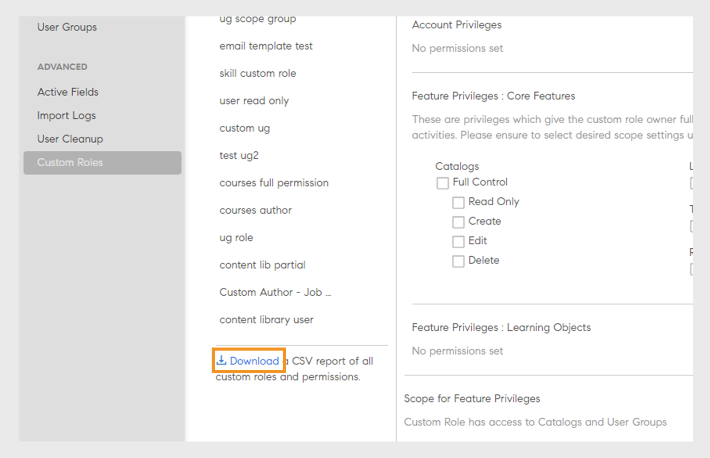

# 自定义角色

此功能可帮助您定义自定义角色并将特定责任分配给一组用户。 利用此功能，您可以分配个人现有角色权限之外的责任。

您可以创建自定义角色并提供仅限于特定目录的创作功能。 您还可以创建专用于报告管理的角色。 然后将此类角色分配给需要承担这些职责的个人。

>[!NOTE]
>
>添加新自定义角色不会影响现有自定义用户组或任何基于角色的组，例如所有管理员、所有作者等。

管理员可以创建自定义管理员角色和自定义作者角色，并为每个角色定制权限。 以下是与每个角色关联的权限概述：

**自定义作者角色权限**

自定义作者可以执行以下任务：

* 访问内容库以添加、编辑或删除核心内容。
* 创建、编辑和删除：
   * 课程
   * 工作辅助
   * 认证
   * 学习路径
   * 学习方案

管理员和作者（包括自定义管理员和自定义作者）能够将学习对象(LO)共享至外部共享目录。 创建学习对象(LO)时，管理员和作者应能搜索外部共享目录。

**自定义管理员角色权限**

自定义管理员角色复制一组管理员职责，包括对帐户级别权限的访问权限。 自定义管理员被授予管理与学习活动相关的关键功能的权限，例如：

* 学习方案
* 目录
* 报告
* 标记

此外，自定义管理员还可以：

* 管理课程和工作辅助，包括注册和删除用户。
* 创建、编辑和删除认证、学习路径和学习计划。
* 访问所有学习对象(LO)的报告和注册功能。

管理员现在可以在Adobe Learning Manager中查看CSV创建的权限。 “筛选依据”选项可筛选按管理员创建和通过CSV导入的自定义角色。 选择自定义角色后，可以看到其权限。

_筛选自定义角色_

## 创建自定义角色 {#create-role}

1. 以管理员身份登录。 打开&#x200B;**[!UICONTROL 用户]** > **[!UICONTROL 自定义角色]**。
2. 选择&#x200B;**[!UICONTROL 创建角色]**。 将打开&#x200B;**[!UICONTROL 创建新角色]**&#x200B;选项卡。

   

   *创建自定义角色*

3. 在&#x200B;**[!UICONTROL 角色名称]**&#x200B;字段中输入名称。
4. **[!UICONTROL 帐户权限]**：这些权限授予角色所有者访问特定系统配置方面的权限，这些权限作用于整个帐户。 选择访问权限。 用户可完全掌控所分配的权限。

   管理员可以为“用户”部分授予详细权限，该部分包含“内部/外部用户”、“用户组”和“高级用户”。

   >[!NOTE]
   >
   >   范围不适用于这些权限。

   

   *设置作用域*

5. **功能权限 — 核心功能**：用于授予特定功能的访问权限，以便管理学习活动。 可以使用此选项授予对以下功能的权限。

   管理员可提供目录的详细权限，如只读、创建、编辑和删除权限。

   * 目录
   * 报告
   * 标记

   

   *设置目录、报表和标记的作用域*

6. **功能权限 — 学习对象：**&#x200B;使用此选项可访问学习对象相关功能。 管理员可提供所有学习对象的详细权限，包括课程、学习路径、认证和工作辅助。 他们可以为用户分配权限，如创建、编辑、删除或只读访问权限。

   * 认证
   * 课程
   * 工作辅助
   * 学习计划

   您还可以授予学习对象特定的操作控制权。 权限可以是下列选项之一：

   * 只读
   * 创建
   * 编辑
   * 删除
   * 注册
   * 报告

   您还可以授予学习对象的完全控制权。

   

   *授予特定权限*

7. **功能权限范围：**&#x200B;分配给此角色的功能权限范围可以限制为特定的用户组或一个或多个目录。

   目录：使用单选按钮提供对&#x200B;**[!UICONTROL “所有目录”]**&#x200B;的控制，或使用&#x200B;**[!UICONTROL “设置每个目录的访问权限”]**&#x200B;选项提供对特定目录的访问。 您也可以选择多个目录。

   用户组：提供对&#x200B;**[!UICONTROL “所有用户组”]**&#x200B;的访问权限，或使用&#x200B;**[!UICONTROL “设置每个用户组的访问权限”]**&#x200B;选项提供对特定用户组的访问权限。 只能指定单个用户组。

   >[!NOTE]
   >
   >如果您在“帐户权限”下选择了“公告”、“游戏”、“电子邮件模板”、“技能”和“用户”，则默认情况下会向所有用户组提供用户组访问权限，并且禁用此选项。

   如果您在“帐户权限”下选择了“学习计划”，则默认情况下将提供对所有目录和用户组的访问权限，并且“范围”下的这些选项将被禁用。

   

   *定义权限范围*

>[!NOTE]
>
>   在 Adobe Learning Manager 27.6 中，您可以创建一个自定义角色，其范围可涵盖多个目录，每个目录都被授予不同的权限集。

要向目录授予各种权限，请执行以下步骤：

1. 单击&#x200B;**[!UICONTROL “设置每个目录的访问权限”]**&#x200B;选项。
1. 选择目录，您可以看到每个目录的权限级别。 权限如下所示：

   <table>
        <tbody>
        <tr>
          <td>
          
<b>权限</b>
</td>
          <td>
          
<b>描述</b>
</td>
        </tr>
        <tr>
          <td>
          
完全控制
</td>
          <td>
          
授予对所有学习对象的完全控制权。 权限包括添加、编辑、删除、读取、注册和报告。 
</td>
        </tr>
        <tr>
          <td>
          
报告
</td>
          <td>
          
仅授予对“学习对象”的“报告”选项卡的访问权限。
</td>
        </tr>
        <tr>
          <td>
          
注册
</td>
          <td>
          
仅授予学习对象的注册权限。
</td>
        </tr>
        <tr>
          <td>
          
只读
</td>
          <td>
          
仅授予查看目录中学习对象的权限。
</td>
        </tr>
        </tbody>
      </table>

1. 根据您的要求启用或禁用权限。
1. 要保存更改，请单击&#x200B;**[!UICONTROL “确定”]**。然后，要保存对自定义角色的更改，请单击&#x200B;**[!UICONTROL “保存”]**。

例如，请考虑以下情形。

由此生成的权限（自定义用户对学习对象拥有的权限）是学习对象权限和目录权限的交集。

自定义用户对课程具有完全权限，对目录 A 仅具有只读访问权限，而对目录 B 则具有完全权限。结果是对目录 A 课程拥有只读访问权限，对目录 B 课程拥有完全控制权限。

具有自定义角色的用户可以：

* 仅查看自己有权访问的目录中的内容。
* 根据学习对象所属目录的权限访问任何学习对象。

  作为管理员，您可以：

* 为自定义角色选择多个目录。
* 随时修改目录的权限。
* 从您不再希望授予权限的范围中删除目录。
* 当您向目录授予权限时，将隐式地授予目录的只读权限。

  下表说明了如何授予权限。

  <table>
    <tbody>
     <tr>
      <td>
       
<strong> </strong>
</td>
      <td>
       
<strong>目录级权限</strong>
</td>
     </tr>
     <tr>
      <td>
       
<strong>学习对象级权限</strong>

       
<strong>（例如：课程）</strong>
</td>
      <td>
       
完全控制
</td>
      <td>
       
注册
</td>
      <td>
       
报告
</td>
      <td>
       
只读
</td>
     </tr>
     <tr>
      <td>
       
完全控制
</td>
      <td>
       
完全控制
</td>
      <td>
       
注册
</td>
      <td>
       
报告
</td>
      <td>
       
只读
</td>
     </tr>
     <tr>
      <td>
       
注册
</td>
      <td>
       
注册
</td>
      <td>
       
注册
</td>
      <td>
       
只读
</td>
      <td>
       
只读
</td>
     </tr>
     <tr>
      <td>
       
编辑和删除
</td>
      <td>
       
编辑和删除
</td>
      <td>
       
只读
</td>
      <td>
       
只读
</td>
      <td>
       
只读
</td>
     </tr>
     <tr>
      <td>
       
报告
</td>
      <td>
       
报告
</td>
      <td>
       
只读
</td>
      <td>
       
报告
</td>
      <td>
       
只读
</td>
     </tr>
    </tbody>
   </table>

1. **用户：**&#x200B;使用此选项确定向哪些用户分配了此角色。 您可以使用搜索框选择一个或多个用户。

   **将用户添加到自定义角色CSV上传：**&#x200B;要通过上传的CSV添加用户，请将CustomRole列添加到管理员用于导入用户的.csv文件。 在要为其分配自定义角色的用户的CustomRole列下输入用户的角色。 要上传CSV文件，请单击&#x200B;**[!UICONTROL 添加>上传CSV]**。

   * 您无法搜索用户组。
   * 您无法搜索已为其分配了管理员角色的用户。
   * 为用户分配新的自定义角色将覆盖用户先前的自定义角色。

   <!---->

   * 具有设置权限的自定义管理员将能够配置计划，以从数据源同步或同步用户，即使他们不具有对用户实体的权限。
   * 如果自定义管理员对用户实体具有权限，则他们可以将管理员角色分配给自己并成为标准管理员。

## 为用户分配多个自定义角色

您可以使用以下方式向用户分配多个自定义角色：

* 使用UI：您可以直接从Adobe Learning Manager界面为用户分配多个自定义角色。
* 使用CSV上传：您可以上传CSV文件，以便同时为多个用户分配多个自定义角色。

这样可以更轻松地管理整个系统的用户访问和控制权限。

### 通过用户界面分配多个自定义角色

通过Adobe Learning Manager中的Admin Console分配多个自定义角色是一种快速、直观的选项，非常适合登入、权限调整或较小的更新。 可以直观地分配角色，而无需上传CSV，这降低了错误风险并提供实时可见性。 此方法支持在责任转移时进行快速更新，并且可以根据需要允许角色切换和委派。

要为用户分配多个自定义角色，请执行以下步骤：

1. 以管理员身份登录，然后选择&#x200B;**[!UICONTROL 用户]**。
2. 在左侧面板上选择&#x200B;**[!UICONTROL 自定义角色]**。
3. 创建新的自定义角色并添加帐户权限、目录、学习对象或范围。 请参阅[此处](#create-a-custom-role)提到的步骤。
4. 将用户添加到自定义角色。

   
   _将用户分配给自定义角色_

5. 选择&#x200B;**[!UICONTROL “保存”]**。

根据需要为用户选择多个自定义角色。 每个用户最多可以有50个自定义角色分配。 可用角色的数量随每个分配的增加而减少。

将用户分配给其他自定义角色后，您可以查看每个用户仍有多少角色分配可用。

>[!NOTE]
>
>您最多可以为每个用户分配50个角色，并为每个角色添加最多500个用户。

### 使用CSV分配多个自定义角色

通过在Adobe Learning Manager中上传CSV文件，可以高效地批量分配自定义角色。 此流程对于管理大量员工、重组团队或更新新培训的访问权限尤其有用。 导入CSV可节省手动操作、确保分配一致并减少错误。 在合并、部门更新或全球培训推广期间，此方法尤为有用。 此方法可帮助管理员节省时间、标准化角色和维护治理。

现在，您可以通过将两个文件上传到Box来通过CSV导入为用户分配多个角色：

* role.csv
* user_role.csv。

user_role.csv文件包含“自定义角色”和“用户ID”字段。

role.csv文件包含字段、自定义角色、创建源以及目录、用户、课程、学习路径等的详细信息。

如果CSV文件包含的数据不正确或超出限制（每个用户50个角色，每个角色500个用户），则会出现一条消息，显示错误。

_自定义角色的错误通知_
在分配角色时，用户会收到电子邮件通知，包括角色的名称。

### 管理自定义角色

随着责任的变化，管理员可以在Adobe Learning Manager中更新、添加或删除用户的自定义角色。 这可确保访问与当前角色保持一致，并且不影响学习历史记录或注册数据。 在&#x200B;**[!UICONTROL 用户]**&#x200B;页面中，管理员可以使用“管理自定义角色”选项搜索用户、查看用户角色以及调整用户。 此引导式界面允许方便地添加或删除角色，同时维护公司治理和安全性。

>[!NOTE]
>
>自定义管理员无法管理自定义角色（添加或删除自定义角色）或将自己提升为管理员角色。

为用户分配自定义角色后，您可以在&#x200B;**[!UICONTROL “用户”]**&#x200B;页面中添加或删除自定义角色。

1. 在&#x200B;**[!UICONTROL 用户]**&#x200B;页面上搜索用户。

   
   _在“用户”页面中搜索用户_

2. 选择显示用户名的行末尾的下拉箭头，然后选择&#x200B;**[!UICONTROL 管理自定义角色]**。

   
   _选择“在用户页面中管理自定义角色”_

3. 此时会显示一个对话框，其中显示了分配给用户的自定义角色的列表。 选择&#x200B;**[!UICONTROL 添加/删除角色]**&#x200B;以添加或删除分配给用户的自定义角色。

   
   _在“管理自定义角色”提示中选择“添加/删除角色”_

4. 搜索要分配给用户的其他自定义角色。 找到自定义角色后，选择该自定义角色。

   
   _选择自定义角色_

5. 选择&#x200B;**[!UICONTROL 保存]**。 此时会显示自定义角色更改的确认对话框。 选择&#x200B;**[!UICONTROL 是]**。

   
   _在确认提示中选择“是”_

第三个自定义角色被分配给用户。

要删除自定义角色，请执行以下步骤：

1. 在&#x200B;**[!UICONTROL 用户]**&#x200B;页面上搜索用户。
2. 选择用户旁边的下拉列表并选择&#x200B;**[!UICONTROL 管理自定义角色]**。
3. 选择&#x200B;**[!UICONTROL 添加/删除角色]**&#x200B;以添加或删除自定义角色。
4. 选择&#x200B;**[!UICONTROL 移除图标]**&#x200B;以删除自定义角色。

   
   _删除自定义角色_

### 切换自定义角色

要查看并选择分配给您的任何自定义角色，请使用&#x200B;**[!UICONTROL 切换自定义角色]**&#x200B;选项。

_选择自定义角色_

为用户分配自定义角色时，用户会收到电子邮件通知。 电子邮件中现在包含角色名称，以更好地说明问题。

## 下载自定义角色报告

管理员可以下载CSV报告，列出所有自定义角色及其关联权限。 该报告会指明每个角色是手动创建还是通过CSV上传创建的，并提供分配给每个角色的访问权限和权限的摘要。

要下载报告，请执行以下步骤：

1. 以&#x200B;**[!UICONTROL 管理员]**&#x200B;身份登录。
2. 选择&#x200B;**[!UICONTROL 用户]** > **[!UICONTROL 自定义角色]**。
3. 选择&#x200B;**[!UICONTROL 下载]**&#x200B;选项以下载CSV报告。

_下载自定义角色的报告_

报告包含两个CSV文件：role.csv和user_role.csv。 role.csv文件包括：

* 自定义角色
* 用户Id
* 创建源。

user_role.csv文件包含字段、自定义角色、创建源以及目录、用户、课程、学习路径等的详细信息。

## 自定义角色的审计追踪

管理员可以下载自定义角色审核报告以跟踪对自定义角色所做的所有更改，包括创建、修改和删除自定义角色及其关联的功能访问权限。

有关更多信息，请参阅这篇文章[自定义角色的审核记录](/help/migrated/administrators/feature-summary/reports.md#audit-trail-for-custom-roles)。

## 限制自定义作者的文件夹访问权限 {#folder-custom-author}

Learning Manager已支持使用自定义角色授予内容库访问权限。 所有已经有权访问内容库的自定义作者将继续有权访问所有内容文件，即使在配置内容文件夹后也是如此。 此举是为保持旧有惯例。 如果管理员希望继续当前行为，则无需进行任何更改。

如果管理员希望限制对这些自定义作者的访问，则需要编辑现有的自定义角色，并通过仅提供特定内容文件夹的访问权限来配置它们。

*限制自定义作者的文件夹访问权限*

创建自定义作者时，您现可为该作者分配内容文件夹。 选择选项&#x200B;**所选文件夹**。

单击该选项后，随即会打开一个新对话框，您可使用该对话框向自定义作者分配文件夹。

*选择自定义作者的文件夹*

选择文件夹，然后单击&#x200B;**[!UICONTROL 确定]**。

## 适用于自定义管理员的学习摘要信息板 {#custom-admin-dashboard}

自定义管理员可以查看的视图与管理员看到的视图相同。 自定义管理员可能提供超出其范围的数据。 仅当自定义管理员具有完整范围时，此项才适用。 要在创建自定义管理员时授予完整范围，请在帐户摘要报告中启用选项&#x200B;**[!UICONTROL “完全控制”]**。

*创建自定义角色*

因此，**[!UICONTROL 所有目录]**&#x200B;和&#x200B;**[!UICONTROL 所有用户组]**&#x200B;选项将被选中，其余选项则将禁用。

*定义权限范围*

## 隐式权限 {#implicitpermissions}

为用户赋予特定实体的角色时，有时可能需要访问其他实体，并且能够在被授予的实体上执行任务。 例如，如果为用户提供了“课程”实体的“创建”访问权限，则用户需要访问“技能”和“标签”实体，以便将其与正在创建的课程相关联。 此表提供了此类隐式权限的信息。

<table>
 <tbody>
  <tr>
   <th>访问类型</th>
   <th>管理员授予的实体权限</th>
   <th>隐式实体权限</th>
   <th>隐式访问</th>
  </tr>
  <tr>
   <td>管理</td>
   <td>用户</td>
   <td>组</td>
   <td>Crud</td>
  </tr>
  <tr>
   <td>注册</td>
   <td>所有学习对象（课程、工作辅助、学习计划、认证）</td>
   <td>用户 
     学习计划</td>
   <td>读取</td>
  </tr>
  <tr>
   <td>创建</td>
   <td>
    
内容组 
      工作辅助 
</td>
   <td>标签</td>
   <td>读取</td>
  </tr>
  <tr>
   <td>创建</td>
   <td>课程</td>
   <td>内容组 
     标记 
     技能 
     徽章 
     工作辅助</td>
   <td>读取全部</td>
  </tr>
  <tr>
   <td>创建</td>
   <td>学习计划 
     认证 </td>
   <td>课程 
     标记 
     技能 
     徽章</td>
   <td>读取</td>
  </tr>
  <tr>
   <td>创建</td>
   <td>学习计划</td>
   <td>目录 
     组 
     技能 
     所有日志（课程、工作辅助、学习计划、认证）</td>
   <td>读取</td>
  </tr>
  <tr>
   <td>创建</td>
   <td>公告</td>
   <td>用户 
     组 
     所有日志（课程、工作辅助、学习计划、认证）</td>
   <td>读取</td>
  </tr>
  <tr>
   <td>创建</td>
   <td>游戏</td>
   <td>品牌推广</td>
   <td>写入</td>
  </tr>
  <tr>
   <td>*</td>
   <td>用户</td>
   <td>计费</td>
   <td>读取</td>
  </tr>
  <tr>
   <td>*</td>
   <td>目录</td>
   <td>组 
     所有日志（课程、工作辅助、学习计划、认证）</td>
   <td>读取</td>
  </tr>
  <tr>
   <td>*</td>
   <td>设置</td>
   <td>品牌 
     用户</td>
   <td>读取</td>
  </tr>
  <tr>
   <td>*</td>
   <td>品牌推广</td>
   <td>设置</td>
   <td>读取</td>
  </tr>
  <tr>
   <td>*</td>
   <td>帐单 
     游戏</td>
   <td>用户</td>
   <td>读取</td>
  </tr>
 </tbody>
</table>

## 访问自定义角色 {#accessacustomrole}

管理员分配自定义角色时，您会收到电子邮件通知。

注意：如果您已用自定义角色登录到 Adobe Learning Manager，则需要重新登录 Adobe Learning Manager 才能访问新角色。

要在角色之间切换，单击 Adobe Learning Manager 右上角的个人资料图标，然后选择角色。

## 学习计划的范围可由可配置角色进行界定 {#scopeconfigure}

在 Adobe Learning Manager 的早期版本中，任何拥有创建学习计划权限的自定义角色的管理范围均涵盖所有类型的用户组和学习对象的学习计划。

授予学习计划访问权限时曾禁用范围设置，默认情况下，这允许用户访问“所有目录”和“所有用户组”。

默认情况下，管理员创建的所有学习计划均适用于所有用户。 还可为用户分配任何学习对象。 另一方面，拥有自定义角色的用户有权访问完整范围，例如所有目录、学习对象或用户组。 这意味着管理员无法按预期创建自定义角色，导致范围受限的用户无法访问学习计划。

在此次 Adobe Learning Manager 更新中，您可以为学习计划创建自定义角色，以对用户和学习对象的范围进行界定。换言之，可以创建范围有限的学习计划，具体范围由自定义管理员的角色范围派生。

现在，管理员在授予学习计划管理访问权限时可以定义或限制其范围。

自定义管理员可以创建范围有限的学习计划，具体范围由自定义管理员可配置角色的范围决定。 只有具有相同角色的自定义管理员才能访问此类学习计划，普通管理员也可访问。 此外，自定义管理员无法看到帐户中的任何其他学习计划。

有权访问学习计划的现有自定义管理员将始终具有完整范围（根据定义）。 他们将有权访问帐户中的所有学习计划，就像普通管理员一样。 使用完整范围创建的新自定义角色以及添加到这些角色的新自定义管理员将继续有权访问所有学习计划。

由管理员和全范围自定义管理员创建的学习计划将照常创建，不受范围限制。

在&#x200B;**“功能权限的范围”**&#x200B;部分中，向自定义角色授予对用户组和/或目录的访问权限。

*向自定义角色的用户组和/或目录授予访问权限*

将用户分配给自定义角色。

*为用户分配自定义角色*

用户现在以自定义管理员身份登录Learning Manager，并添加学习计划。

添加新学习者后，自定义管理员只能从可配置角色的范围目录中选择培训。

现在，只有将用户添加到学习计划范围内用户组中的时，此学习计划才适用于学习者。 所有其他学习者均无需遵循此学习计划。

## 学习者被添加到组 {#learnergetsaddedtothegroup}

<!---->

自定义管理员可以选择包含来自该角色范围内用户组的用户的任何用户组。

当用户被添加到指定的组时，只有那些已属于学习计划范围内用户组并且被添加到指定用户组的用户才会被分配学习对象。

## 在范围中更改 {#changeinscope}

当管理员更改自定义角色的范围时，此更改也会级联到自定义管理员。 当自定义管理员选择的学习计划的范围已受之前的自定义角色限制时，系统会显示一条消息，如下所示：

*作用域更改后的消息*

自定义管理员现在必须将以前的范围更新或刷新为新范围。

单击&#x200B;**[!UICONTROL “刷新范围”]**&#x200B;可更新范围。 此时将显示一条警告消息。

刷新作用域后&#x200B;*出现警告消息*

单击&#x200B;**[!UICONTROL “是”]**&#x200B;将更新范围。

## 向自定义角色添加游戏报告 {#gamification-custom}

管理员可以为自定义用户启用游戏报告。

1. 在&#x200B;**[!UICONTROL “自定义角色”]**&#x200B;页面，输入自定义角色的名称。
1. 在&#x200B;**[!UICONTROL 功能权限：核心功能]**&#x200B;部分中，为类别&#x200B;**[!UICONTROL 报告]**&#x200B;启用选项&#x200B;**[!UICONTROL 完全控制]**。

1. 在&#x200B;**[!UICONTROL “用户”]**&#x200B;部分中，选择将分配新创建的自定义角色的用户。
1. 单击&#x200B;**[!UICONTROL “保存”]**。

当用户以自定义管理员身份登录并单击左侧窗格上的&#x200B;**[!UICONTROL 报告]**&#x200B;时，会显示成绩单，如下所示：

*下载游戏成绩单*

单击&#x200B;**[!UICONTROL “游戏成绩单”]**，选择用户，然后生成报告。

如果管理员更改了级别点数，则报告将根据当前点数显示级别。

重置游戏不会重置级别获得日期。

## 常见问题解答 {#frequentlyaskedquestions}

+++如何创建自定义角色？

自定义角色类似于作者或管理员角色的子集。 允许一项或多项权限，定义范围，并向用户分配角色。

单击&#x200B;**[!UICONTROL 用户]** > **[!UICONTROL 自定义角色]**。 在“自定义角色”页面，单击&#x200B;**[!UICONTROL “创建角色”]**。 输入自定义角色的姓名并设置角色权限。 有关更多信息，请参阅[创建自定义角色](custom-role.md#create-role)。
+++

