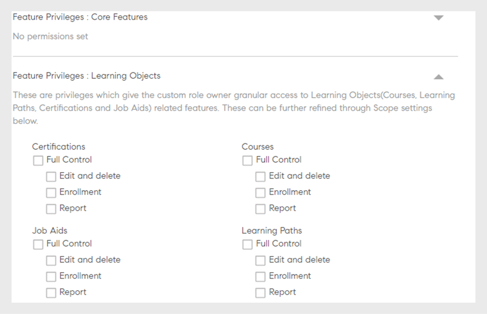

# 自定义角色

此功能可帮助您定义自定义角色并将特定责任分配给一组用户。 利用此功能，您可以分配个人现有角色权限之外的责任。

您可以创建自定义角色，以提供仅限于特定目录的创作功能。 您还可以创建专门管理报告的角色。 然后，可将这种角色指派给应承担这些具体责任的个人。

## 创建自定义角色 {#create-role}

1. 以管理员身份登录。 打开 **[!UICONTROL 用户]** > **[!UICONTROL 自定义角色]**.
1. 选择 **[!UICONTROL 创建角色]**. 该 **[!UICONTROL 创建新角色]** 选项卡打开。

   

   *创建自定义角色*

1. 在 **[!UICONTROL 角色的名称]** 字段。
1. **[!UICONTROL 帐户权限]**：这些权限允许角色所有者访问特定的系统配置方面，以及作用于整个帐户的权限。 选择访问权限。 用户可以完全控制分配的权限。

>[!NOTE]
>
>   范围不适用于这些权限。

*设置范围*

1. **功能权限 — 核心功能**：用于授予特定功能管理学习活动的访问权限。 可以使用此选项授予对以下功能的权限。

   * 目录
   * 报告
   * 标记

   

   *设置目录、报告和标签的作用域*

1. **功能权限 — 学习对象：**  使用此选项可提供对学习对象相关功能的访问权限。 您可以通过访问以下学习对象。

   * 认证
   * 课程
   * 工作辅助
   * 学习计划

   您还可以授予学习对象特定的操作控制。 该权限可以是下列之一：

   * 完全控制
   * 编辑和删除
   * 注册
   * 举报

   

   *授予特定权限*

1. **功能权限范围：** 分配给此角色的功能权限范围可以限制为特定用户组或一个或多个目录。

   目录：使用单选按钮提供对以下内容的控制 **[!UICONTROL 所有目录]** 或使用 **[!UICONTROL 按目录设置访问权限]** 提供对特定目录的访问。 您还可以选择多个目录。

   用户组：提供对 **[!UICONTROL 所有用户组]** 或使用 **[!UICONTROL 按用户组设置访问权限]** 用于提供对特定用户组的访问权限。 只能指定单个用户组。

   >[!NOTE]
   >
   >如果您在“帐户权限”下选择了“公告”、“游戏”、“电子邮件模板”、“技能”和“用户”，则默认情况下会向所有用户组提供用户组访问权限，并且禁用此选项。

   如果您在“帐户权限”下选择了“学习计划”，则默认情况下会提供对所有目录和用户组的访问，并且“范围”下的这些选项处于禁用状态。

   

   *定义权限范围*

>[!NOTE]
>
>   在Learning Manager 27.6中，您可以创建一个自定义角色，其范围可涵盖多个目录，每个目录都被授予不同的权限集。

要授予目录各种权限，请执行以下步骤：

1. 单击该选项 **[!UICONTROL 按目录设置访问权限]**.
1. 选择目录，即可看到每个目录的权限级别。 权限如下：

   <table>
        <tbody>
        <tr>
          <td>
          
<b>权限</b>
</td>
          <td>
          
<b>描述</b>
</td>
        </tr>
        <tr>
          <td>
          
完全控制
</td>
          <td>
          
授予对所有学习对象的完全控制权。 权限包括添加、编辑、删除、读取、注册和报告。 
</td>
        </tr>
        <tr>
          <td>
          
举报
</td>
          <td>
          
仅授予对学习对象的“报告”选项卡的访问权限。
</td>
        </tr>
        <tr>
          <td>
          
注册
</td>
          <td>
          
授予仅注册学习对象的权限。
</td>
        </tr>
        <tr>
          <td>
          
只读
</td>
          <td>
          
授予仅查看目录中的学习对象的权限。
</td>
        </tr>
        </tbody>
      </table>

1. 根据您的要求启用或禁用权限。
1. 要保存更改，请单击 **[!UICONTROL 确定]**. 然后，要保存自定义角色的更改，请单击 **[!UICONTROL 保存]**.

例如，请考虑以下场景。

生成的权限（自定义用户对学习对象的权限）是学习对象权限和目录权限的交集。

自定义用户对课程具有完全权限，对目录A仅具有只读访问权限，而对目录B则具有完全权限。结果是：对目录A的课程具有只读访问权限，对目录B的课程具有完全控制权限。

具有自定义角色的用户可以：

* 仅查看他/她有权访问的目录中的内容。
* 根据学习对象所属的目录权限访问任何学习对象。

作为管理员，您可以：

* 为自定义角色选择多个目录。
* 随时修改目录的权限。
* 从不想再向其授予权限的作用域中删除目录。
* 当您授予目录的权限时，将隐含地授予该目录的只读权限。

下表说明了如何授予权限。

<table>
    <tbody>
     <tr>
      <td>
       
<strong> </strong>
</td>
      <td>
       
<strong>目录级权限</strong>
</td>
     </tr>
     <tr>
      <td>
       
<strong>学习对象级权限</strong>

       
<strong>（例如：课程）</strong>
</td>
      <td>
       
完全控制
</td>
      <td>
       
注册
</td>
      <td>
       
举报
</td>
      <td>
       
只读
</td>
     </tr>
     <tr>
      <td>
       
完全控制
</td>
      <td>
       
完全控制
</td>
      <td>
       
注册
</td>
      <td>
       
举报
</td>
      <td>
       
只读
</td>
     </tr>
     <tr>
      <td>
       
注册
</td>
      <td>
       
注册
</td>
      <td>
       
注册
</td>
      <td>
       
只读
</td>
      <td>
       
只读
</td>
     </tr>
     <tr>
      <td>
       
编辑和删除
</td>
      <td>
       
编辑和删除
</td>
      <td>
       
只读
</td>
      <td>
       
只读
</td>
      <td>
       
只读
</td>
     </tr>
     <tr>
      <td>
       
举报
</td>
      <td>
       
举报
</td>
      <td>
       
只读
</td>
      <td>
       
举报
</td>
      <td>
       
只读
</td>
     </tr>
    </tbody>
   </table>
1. **用户：**使用此选项可确定向哪些用户分配了此角色。 您可以使用搜索框选择一个或多个用户。

**将用户添加到自定义角色CSV上传：** 要通过CSV更新添加用户，请将CustomRole列添加到管理员用于导入用户的.csv文件。 在要为其分配自定义角色的用户的CustomRole列下输入用户的角色。 要上传CSV文件，请单击  **[!UICONTROL 添加>上传CSV]**.

CustomRole列注意：

* 您无法搜索用户组。
* 无法搜索已分配管理员角色的用户。
* 为用户分配新的自定义角色将覆盖用户先前的自定义角色。

<!---->

* 具有设置权限的自定义管理员将能够配置计划，以从数据源同步或同步用户，即使他们不具有对用户实体的权限。
* 如果自定义管理员对用户实体拥有权限，则他们可以将管理员角色分配给自己并成为标准管理员。

## 限制自定义作者的文件夹访问权限 {#folder-custom-author}

Learning Manager已支持使用自定义角色授予内容库访问权限。 所有已经有权访问内容库的自定义作者将继续有权访问所有内容文件，即使在配置内容文件夹后也是如此。 这是为了维护旧版行为。 如果管理员希望继续当前行为，则无需进行任何更改。

如果管理员希望限制对这些自定义作者的访问，则需要编辑现有的自定义角色，并通过仅提供特定内容文件夹的访问权限来配置它们。

*限制自定义作者的文件夹访问权限*

在创建自定义作者时，您现在可以将内容文件夹分配给作者。 选择选项 **选定的文件夹**.

单击该选项后，将打开一个新对话框，您可以在其中将文件夹分配给自定义作者。

*为自定义作者选择文件夹*

选择文件夹，然后单击 **[!UICONTROL 确定]**.

## 自定义管理员的学习摘要信息板 {#custom-admin-dashboard}

自定义管理员可以查看的视图与管理员看到的视图相同。 自定义管理员可能提供超出其范围的数据。 仅当自定义管理员具有完整范围时，此项才适用。 要在创建自定义管理员时授予完整权限范围，请启用该选项 **[!UICONTROL 完全控制]** 在帐户汇总报表中。

*创建自定义角色*

因此，选项 **[!UICONTROL 所有目录]** 和 **[!UICONTROL 所有用户组]** 将被选中，其余部分将被禁用。

*定义权限范围*

## 隐式权限 {#implicitpermissions}

为用户赋予特定实体的角色时，有时可能需要访问其他实体，并且能够在被授予的实体上执行任务。 例如，如果为用户提供了“课程”实体的“创建”访问权限，则用户需要访问“技能”和“标签”实体，以便将其与正在创建的课程相关联。 此表提供了此类隐式权限的信息。

<table>
 <tbody>
  <tr>
   <th>访问类型</th>
   <th>管理员授予的实体权限</th>
   <th>隐式实体权限</th>
   <th>隐式访问</th>
  </tr>
  <tr>
   <td>管理</td>
   <td>用户</td>
   <td>群组</td>
   <td>Crud</td>
  </tr>
  <tr>
   <td>注册</td>
   <td>所有日志（课程、工作辅助、学习计划、认证）</td>
   <td>用户 
     学习计划</td>
   <td>读取</td>
  </tr>
  <tr>
   <td>创建</td>
   <td>
    
内容分组 
      工作辅助 
</td>
   <td>标记</td>
   <td>读取</td>
  </tr>
  <tr>
   <td>创建</td>
   <td>课程</td>
   <td>内容分组 
     标记 
     技能 
     徽章 
     工作辅助</td>
   <td>全部阅读</td>
  </tr>
  <tr>
   <td>创建</td>
   <td>学习计划 
     认证 </td>
   <td>课程 
     标记 
     技能 
     徽章</td>
   <td>读取</td>
  </tr>
  <tr>
   <td>创建</td>
   <td>学习计划</td>
   <td>目录 
     群组 
     技能 
     所有日志（课程、工作辅助、学习计划、认证）</td>
   <td>读取</td>
  </tr>
  <tr>
   <td>创建</td>
   <td>公告</td>
   <td>用户 
     群组 
     所有日志（课程、工作辅助、学习计划、认证）</td>
   <td>读取</td>
  </tr>
  <tr>
   <td>创建</td>
   <td>游戏</td>
   <td>品牌化</td>
   <td>写入</td>
  </tr>
  <tr>
   <td>*</td>
   <td>用户</td>
   <td>计费</td>
   <td>读取</td>
  </tr>
  <tr>
   <td>*</td>
   <td>目录</td>
   <td>群组 
     所有日志（课程、工作辅助、学习计划、认证）</td>
   <td>读取</td>
  </tr>
  <tr>
   <td>*</td>
   <td>设置</td>
   <td>品牌化 
     用户</td>
   <td>读取</td>
  </tr>
  <tr>
   <td>*</td>
   <td>品牌化</td>
   <td>设置</td>
   <td>读取</td>
  </tr>
  <tr>
   <td>*</td>
   <td>计费 
     游戏</td>
   <td>用户</td>
   <td>读取</td>
  </tr>
 </tbody>
</table>

## 访问自定义角色 {#accessacustomrole}

当管理员分配自定义角色时，您会收到电子邮件通知。

注意：如果您已使用自定义角色登录Learning Manager，则需要重新登录Learning Manager才能访问新角色。

要在角色之间切换，请单击Learning Manager右上角的配置文件图标，然后选择角色。

## 学习计划的范围可由可配置角色进行界定 {#scopeconfigure}

在早期版本的Learning Manager中，任何有权创建学习计划的自定义角色都可以界定所有类型用户组和学习对象的学习计划。

授予学习计划访问权限时曾禁用范围设置，默认情况下，这允许用户访问“所有目录”和“所有用户组”。

默认情况下，管理员创建的所有学习计划均适用于所有用户。 您还可以为用户分配任何学习对象。 另一方面，具有自定义角色的用户可以访问完整范围，例如，所有目录、学习对象或用户组。 这意味着管理员无法按预期创建自定义角色，从而允许范围受限的用户访问学习计划。

在此Learning Manager更新中，您可以为学习计划创建自定义角色，以对用户和学习对象的范围进行界定。 换言之，可以创建范围有限的学习计划，具体范围由自定义管理员的角色范围派生。

现在，管理员在授予学习计划管理访问权限时可以定义或限制其范围。

自定义管理员可以创建范围有限的学习计划，具体范围由自定义管理员可配置角色的范围决定。 除了普通管理员可以访问之外，只有具有相同角色的自定义管理员才能访问此类学习计划。 此外，自定义管理员无法在帐户中看到任何其他学习计划。

有权访问学习计划的现有自定义管理员将始终拥有全范围授权（根据定义）。 他们将有权访问帐户中的所有学习计划，就像普通管理员一样。 使用完整范围创建的新自定义角色以及添加到这些角色的新自定义管理员将继续有权访问所有学习计划。

管理员和完整范围自定义管理员创建的学习计划将照常创建，不受范围限制。

本节内容 **功能权限范围**，向自定义角色的用户组和/或目录授予访问权限。

*为自定义角色授予用户组和/或目录的访问权限*

为用户分配自定义角色。

*为用户分配自定义角色*

用户现在以自定义管理员身份登录Learning Manager，并添加学习计划。

添加新学习者后，自定义管理员只能从可配置角色的范围目录中选择培训。

现在，只有将用户添加到学习计划范围内用户组中的时，此学习计划才适用于学习者。 所有其他学习者均免于使用此学习计划。

## 学习者被添加到组 {#learnergetsaddedtothegroup}

<!---->

自定义管理员可以从角色的范围用户组中选择拥有用户的任何用户组。

将用户添加到指定组后，只有已属于学习计划范围内用户组并已添加到指定用户组的用户才会被分配学习对象。

## 作用域的更改 {#changeinscope}

当管理员更改自定义角色的范围时，更改也会级联到自定义管理员。 当自定义管理员选择的学习计划的范围已受之前的自定义角色限制时，系统会显示一条消息，如下所示：

*范围更改后的消息*

自定义管理员现在必须将以前的范围更新或刷新为新范围。

点击 **[!UICONTROL 刷新范围]** 更新范围。 此时会显示一条警告消息。

*刷新范围后出现警告消息*

点击 **[!UICONTROL 是]** 更新范围。

## 向自定义角色添加游戏报告 {#gamification-custom}

管理员可以为自定义用户启用游戏报告。

1. 在 **[!UICONTROL 自定义角色]** 页面中，输入自定义角色的名称。
1. 在 **[!UICONTROL 功能权限：核心功能]** 部分，启用该选项 **[!UICONTROL 完全控制]** 类别 **[!UICONTROL 报告]**.

1. 本节内容 **[!UICONTROL 用户]**&#x200B;中，选择将为其分配新创建自定义角色的用户。
1. 点击 **[!UICONTROL 保存]**.

当用户以自定义管理员身份登录并单击 **[!UICONTROL 报告]** 在左侧窗格中，会显示成绩单，如下所示：

*下载游戏成绩单*

点击 **[!UICONTROL 游戏成绩单]**，选择用户，然后生成报告。

如果管理员更改了级别点数，报告会根据当前点数显示级别。

重置游戏不会重置级别实现日期。

## 常见问题解答 {#frequentlyaskedquestions}

+++如何创建自定义角色？

自定义角色类似于作者或管理员角色的子集。 允许一项或多项权限，定义范围，并将角色分配给用户。

点击 **[!UICONTROL 用户]** > **[!UICONTROL 自定义角色]**. 在“自定义角色”页面中，单击 **[!UICONTROL 创建角色]**. 输入自定义角色的名称并设置该角色的权限。 有关详细信息，请参阅 [创建自定义角色](custom-role.md#create-role).
+++
