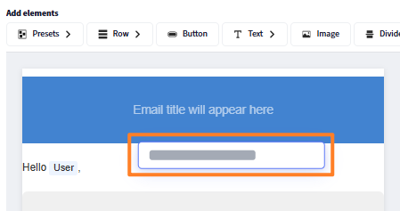
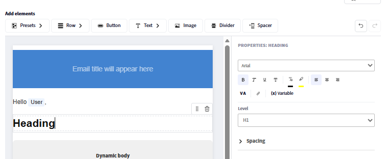
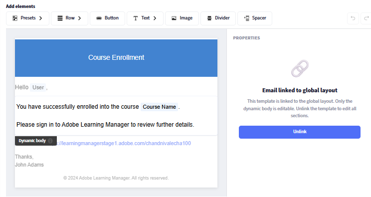

## 基于组件的电子邮件生成器

Adobe Learning Manager包含一个基于组件的电子邮件生成器，该生成器允许管理员和作者使用现代可视编辑器创建完全品牌化的企业级电子邮件，而无需编写HTML。 您的组织发送的每封电子邮件，从注册确认到会话提醒，都可以准确匹配您的品牌外观。

**对于管理员：**&#x200B;设计一次全局布局*一个可重复使用的页眉和页脚，自动包装每封电子邮件，然后根据需要自定义各个模板。 使用富组件（具有完整富文本格式的文本、图像、横幅、按钮、社交媒体链接、分隔符等）在内联拖放编辑器中撰写电子邮件。

**对于作者：**&#x200B;将相同的编辑功能应用于范围涵盖特定课程和实例的电子邮件，以便可以根据每个学习体验定制培训通信，而不会影响帐户范围的设置。

构建器支持分层模型：可以在实例、课程或帐户级别配置相同的电子邮件模板。 如果模板未单独进行编辑，则会自动继承其父级别的设置。 当您需要完全自定义的设计时，取消模板链接并完全控制模板。 内置预览功能可让您在发送电子邮件之前，准确地检查电子邮件在收件人收件箱中的显示方式。

## 电子邮件模板系统工作原理

Adobe Learning Manager中的每封传出电子邮件都由三个结构部分组成：

* **标题：**&#x200B;横幅图像或颜色以及组织名称
* **正文：**&#x200B;每个电子邮件类型特有的动态内容区域；包含消息文本和变量占位符
* **页脚：**&#x200B;帐户URL、电子邮件签名、帮助链接和其他元素

**全局布局**&#x200B;是同时应用于所有130多个电子邮件模板的主设计。 更新全局版面时，每个仍然链接到全局版面的模板都会自动反映这一更改。 模板可随时与全局布局取消链接，以进行独立自定义。

### 电子邮件层次结构

设置和设计将通过继承从较高级别流转到较低级别。 每个级别都可以覆盖或完全自定义其继承的内容。

| 级别 | 谁对其进行配置 | 默认状态 | 可编辑内容 |
| --- | --- | --- | --- |
| **全局布局** | 管理员 | 根；无父级 | 完整版面：所有部件、所有组件 |
| **帐户电子邮件模板** | 管理员 | 链接到全局布局 | 仅正文（链接）；完整版面（未链接） |
| **作者 — 学习对象布局** | 作者 | 链接到帐户模板 | 学习对象范围的完整版面 |
| **作者 — 学习对象电子邮件模板** | 作者 | 链接到学习对象版面 | 仅正文（链接）；完整版面（未链接） |
| **作者 — 实例电子邮件模板** | 作者 | 链接到学习对象模板 | 仅正文（链接）；完整版面（未链接） |

### 核心继承规则

* 每个级别都开始与其直接父级关联，直到显式更改为止。
* 编辑模板的&#x200B;**正文**&#x200B;不会取消其链接。 页眉和页脚继续反映主页。
* 编辑&#x200B;**布局**&#x200B;或选择&#x200B;**取消链接**&#x200B;将只中断该模板的父连接。
* **恢复到原始版本**&#x200B;将模板重新链接到其父版本，并将布局和正文重置为父版本。
* 在一个级别上取消链接对高于或低于该级别的级别没有影响。

## 设置全局布局

全局布局定义流入每个链接电子邮件的共享页眉、页脚和结构包装器。 首先对其进行配置，以便所有模板一开始都使用一致的品牌。

### 打开全局布局编辑器

1. 以管理员身份登录Adobe Learning Manager 。
2. 在左侧导航栏中，选择&#x200B;**电子邮件模板**。
3. 选择“**全局布局**”选项卡。

   编辑器画布随当前全局布局一起加载。 **动态正文**&#x200B;区域在中部显示为占位符，表示每个模板的唯一消息内容所在的区域。 无法从全局布局中编辑动态主体。

   

### 配置电子邮件容器

电子邮件容器是每个电子邮件的最外层包装。 它的设置会影响所有内容周围的视觉框架。

1. 在&#x200B;**全局电子邮件布局**&#x200B;附近选择&#x200B;**编辑**
2. 在画布上选择电子邮件容器。
3. 在右侧的&#x200B;**属性**&#x200B;面板中，设置：
   * **背景颜色：**&#x200B;所有电子邮件内容背后的颜色

   

   * **边框：**&#x200B;外边框的样式、宽度和颜色

   

   * **间距：**&#x200B;在电子邮件内容方向周围填充

   

   * **行间距：**&#x200B;应用于版面中所有行之间的垂直间距

   

### 使用行和列

电子邮件编辑器中的所有内容都放在&#x200B;**行**&#x200B;中。 每行包含一个或多个&#x200B;**列**，并且每列包含一个或多个&#x200B;**组件**。

要添加行，请执行以下操作：

1. 选择画布顶部的&#x200B;**行**。

   

2. 选择列布局： **1列**、**2列**、**3列**&#x200B;或&#x200B;**4列**。

   

   新行将出现在画布上，可供组件使用。

要配置行：

1. 在画布上选择行。

   

2. 在&#x200B;**属性**&#x200B;面板中，设置：
   * **背景颜色：**&#x200B;行级背景，覆盖此行的容器颜色
   * **边框：**&#x200B;行边框样式、宽度和颜色
   * **间距：**&#x200B;此行中列之间的水平间距

   

**要重新排序行：**

* 通过拖动任意行的手柄（悬停在左边缘时显示）来向上或向下移动该行。

**删除行：**

* 选择该行，然后在行工具栏中选择&#x200B;**删除**&#x200B;图标。

### 添加和排列组件

组件是电子邮件内容的构建块。 将它们从顶部的&#x200B;**组件**&#x200B;面板拖放到任意列单元格中。 使用左侧的&#x200B;**属性**&#x200B;面板自定义所选组件。

拖放组件时，蓝色的“+”指示器将显示组件可以放置的位置。

**添加组件：**

1. 在组件面板中，找到所需的组件。

   

2. 将其拖到画布上的列单元格中。

   

3. 该组件即被添加到该单元格。 选择它以在右侧面板中打开其属性。

   

**要移动组件：**

* 通过元件的手柄将元件拖动到不同的列或行位置。

**删除组件：**

* 选择该组件，然后在组件工具栏中选择&#x200B;**删除**&#x200B;图标。

### 编辑预设组件

**全局布局**&#x200B;包含与电子邮件设置中配置的共享字段对应的内置预设组件。 可以在画布上直接编辑预设组件或完全删除预设组件。

| 预设组件 | 默认内容 | 可以删除？ |
| --- | --- | --- |
| **横幅** | 默认横幅图像或颜色 | 是 |
| **问候** | “您好{{user}}” | 是 |
| **动态正文** | 每个模板内容的占位符 | 无 — 必填 |
| **帐户URL** | 您帐户的平台URL | 是 |
| **签名** | 您配置的签名文本 | 是 |

**要编辑预设组件：**

1. 添加预设组件，例如横幅。

   

2. 选择画布上的横幅。
3. 在&#x200B;**属性**&#x200B;面板中，更改横幅的字体、字体大小和其他视觉属性。

   

**要从所有电子邮件中删除预设组件：**

1. 在画布上选择预设组件。
2. 在组件工具栏中选择&#x200B;**删除**。

从全局布局中删除预设组件会将其从每个链接的电子邮件中删除。 未链接的模板会保留该组件，直到您手动将其从每个模板中删除。

### 保存全局布局

完成布局后，选择&#x200B;**保存**。 更新的设计将立即应用于所有仍链接到全局布局的电子邮件模板。

## 配置全局电子邮件预设

定义要在电子邮件中重复使用的常用元素，如横幅、问候和签名。 这些模板可用于Adobe Learning Manager中的全局布局或单个基于事件的电子邮件模板。 此处所做的更改会自动反映到使用这些预设的任何位置。 您也可以选择覆盖这些预设，并直接在电子邮件生成器中设计自定义元素。

配置以下项：

### 电子邮件横幅

1. 选择&#x200B;**电子邮件横幅**&#x200B;旁边的&#x200B;**编辑**。
2. 上传横幅图像或设置纯背景颜色。

   

3. 选择&#x200B;**保存。**

### 电子邮件问候

1. 选择&#x200B;**电子邮件问候**&#x200B;旁边的&#x200B;**编辑**
2. 默认值为“Hello {{user}}” — {{user}}变量在运行时填充了收件人的名称。

   

3. 修改问候语文本或完全删除问候语。
4. 选择&#x200B;**“保存”**。

### 帐户URL

1. 选择&#x200B;**帐户URL**&#x200B;旁边的&#x200B;**编辑**。
2. 输入学习平台的URL；将显示在所有传出电子邮件中。

   

3. 选择&#x200B;**“保存”**。

### 电子邮件签名

1. 选择&#x200B;**电子邮件签名**&#x200B;旁边的&#x200B;**编辑**
2. 输入结束文本。

   

3. 选择&#x200B;**“保存”**。

## 添加和配置单个组件

### 文本组件

文本组件支持完整的富文本编辑。

1. 将&#x200B;**文本**&#x200B;组件拖到列单元格中。
2. 选择它以进入编辑模式。

   

3. 键入或粘贴您的内容。
4. 应用以下格式选项：
   * **字体：**&#x200B;从Web安全字体（Arial、Helvetica、Georgia等）中选择或为您的帐户配置的自定义字体
   * **大小：**&#x200B;字体大小（以点为单位）
   * **粗体**、**斜体**、**下划线**、**删除线**
   * **上标**&#x200B;和&#x200B;**下标**
   * **文本颜色**&#x200B;和&#x200B;**背景颜色**（文本突出显示）
   * **对齐方式：**&#x200B;左对齐、居中、右对齐或两端对齐
   * **行距：**&#x200B;行高乘数
   * **水平和垂直填充：**&#x200B;文本块中的内部间距
5. 要添加超链接，请执行以下操作：
   * 选择要链接的文本
   * 在工具栏中选择&#x200B;**链接**&#x200B;图标
   * 输入目标URL

   

6. 选择&#x200B;**应用**

### 图像组件

1. 将&#x200B;**图像**&#x200B;组件拖入列单元格。
2. 选择&#x200B;**上传**&#x200B;以上传新的图像文件（支持JPEG和GIF），或选择&#x200B;**浏览**&#x200B;以从图像库中进行选择。
3. 选择图像后，配置：

   

   * **更改图像：**&#x200B;上传新图像或替换当前选定的图像。
   * **图像URL：**&#x200B;指定要显示的图像的源URL。 将从此位置加载图像。
   * **链接：**&#x200B;向图像添加可单击的超链接。 单击图像时，用户将被重定向到指定的URL。
   * **边框类型：**&#x200B;定义图像边框的样式。 可用选项包括“无”、“实线”和“点线”。
   * **边框颜色：**&#x200B;设置应用边框样式时图像边框的颜色。
   * **圆角半径：**&#x200B;控制图像圆角的圆度。 值越高，创建的圆角就越多。
   * **边框线：**&#x200B;调整图像边框的粗细（宽度）。
   * **顶部间距：**&#x200B;在图像上方添加间距。
   * **底部间距：**&#x200B;在图像下方添加间距。
   * **左间距：**&#x200B;在图像的左侧添加间距。
   * **右间距：**&#x200B;在图像右侧添加间距。
   * **水平对齐方式：**&#x200B;确定图像在其容器中的位置。 选项通常包括“左对齐”、“居中”和“右对齐”。

### 按钮组件

1. 将&#x200B;**Button**&#x200B;组件拖到列单元格中。
2. 选择它并配置：

   

   * **标签：**&#x200B;按钮文本
   * **链接：**&#x200B;单击按钮时的目标URL
   * 按钮标签的&#x200B;**字体：**&#x200B;字体系列和大小
   * **文本颜色：**&#x200B;标签颜色
   * **背景颜色：**&#x200B;按钮填充颜色
   * **大小：**&#x200B;按钮宽度和高度
   * **圆角样式：**&#x200B;圆角、正方形或圆形
   * **对齐方式：**&#x200B;栏内的左对齐、居中或右对齐
   * **填充：**&#x200B;标签文本和按钮边缘之间的内部间距

### 分隔件和分隔件组件

**分隔线：**&#x200B;在内容部分之间添加可见的水平线条。

1. 将&#x200B;**分隔符**&#x200B;组件拖入列。
2. 在“属性”面板中设置&#x200B;**线条样式**（实线、虚线、点线）、**颜色**、**宽度**&#x200B;和&#x200B;**高度**（线条上方和下方的垂直空间）。

   **分隔符：**&#x200B;在无可见线的元素之间添加不可见的垂直间距。

3. 拖动&#x200B;**分隔符**&#x200B;组件并在属性面板中设置其&#x200B;**高度**。

## 插入和管理变量

变量是发送电子邮件时用实际数据替换的动态占位符。 可用的变量取决于特定的模板类型。 注册确认电子邮件与会话提醒具有不同的变量。

### 使用选取器插入变量

1. 将光标置于文本组件中希望变量出现的位置。
2. 在文本编辑器工具栏中选择&#x200B;**插入变量**。 变量选取器随即打开，其中显示该模板类型的所有可用变量。
3. 选择一个变量。 例如，**课程名称**、**学习者姓名**&#x200B;或&#x200B;**学习路径名称**。

   

### 通过键入插入变量

键入变量名称（直接用双大括号括起）：{\{variable_name}\}。 编辑器会自动将其识别并突出显示为变量令牌。

**常见变量示例：**

| 变量 | 替换为 |
| --- | --- |
| 收件人的全名 | {\{learnerName}\} |
| 收件人的电子邮件 | {\{learnerEmail}\} |
| 收件人的用户名 | {\{user}\} |
| 用户类型 | {\{userType}\} |
| 组织名称 | {\{organizationName}\} |
| 课程名称 | {\{courseName}\} |
| 课程描述 | {\{courseDescription}\} |
| 课程作者 | {\{courseAuthor}\} |
| 课程链接 | {\{courseLink}\} |
| 课程所需的技能 | {\{courseSkillDetails}\} |
| 课程中的徽章 | {\{courseBadge}\} |
| 课程注册截止日期 | {\{courseEnrollmentDeadline}\} |
| 课程完成截止日期 | {\{courseCompletionDeadline}\} |
| 课程完成日期 | {\{courseCompletionDate}\} |
| 学习路径的名称 | {\{LPName}\} |
| 学习路径链接 | {\{LPLink}\} |
| 学习路径注册截止日期 | {\{LPEnrollmentDeadline}\} |
| 学习路径完成截止日期 | {\{LPCompletionDeadline}\} |
| 学习路径完成日期 | {\{LPCompletionDate}\} |
| 认证名称 | {\{certificationName}\} |
| 认证注册截止日期 | {\{certificationEnrollmentDeadline}\} |
| 认证完成日期 | {\{certificationCompletionDate}\} |
| 课程截止日期持续时间 | {\{deadlineDuration}\} |
| 课程到期持续时间 | {\{expiryDuration}\} |
| 课程到期日期 | \{\{expiryDate\}\} |
| 会话名称 | \{\{sessionName\}\} |
| 会话开始日期 | \{\{sessionDate\}\} |
| 会话结束日期 | \{\{endSessionDate\}\} |
| 会话开始时间 | \{\{sessionTime\}\} |
| 会话结束时间 | \{\{endSessionTime\}\} |
| 地点名称 | \{\{venueName\}\} |
| 地点信息 | \{\{venueInfo\}\} |
| 地点URL | \{\{venueURL\}\} |
| 地点区域 | \{\{venueRegion\}\} |
| 虚拟教室 URL | \{\{vcUrl\}\} |
| 需要虚拟教室提供商帐户 | \{\{VCProviderAccountReq\}\} |
| 讲师姓名 | \{\{instructorName\}\} |
| 模块名称 | \{\{moduleName\}\} |
| 学习对象名称 | \{\{learningObjectName\}\} |
| 学习对象完成日期 | \{\{loCompletionDate\}\} |
| 备用学习对象名称 | \{\{alternateLoNameList\}\} |
| 备用学习对象链接 | \{\{alternateLoNameListLinks\}\} |
| 已移除替代学习对象 | \{\{removedAlternateLo\}\} |
| 必备文本 | \{\{preRequisiteText\}\} |
| 先决条件计数 | \{\{preRequisiteCountText\}\} |
| CI名称 | \{\{ciName\}\} |
| 报告信息板名称 | \{\{reportDashboardName\}\} |
| 工作辅助名称 | \{\{jobAidName\}\} |
| 公告内容 | \{\{announcementContentText\}\} |
| 个人资料名称 | \{\{profileName\}\} |
| 课程的名额限制 | \{\{seatLimit\}\} |
| 指向帮助文档主页的链接 | \{\{captivatePrimeHelp\}\} |
| 指向帮助页面的链接 | \{\{helpPageLink\}\} |
| 计数 | \{\{count\}\} |

>[!NOTE]
>
>变量是模板特定的。 并非每个变量在每个模板中都可用。 使用&#x200B;**插入变量**&#x200B;选取器仅查看应用于所编辑模板的变量。 在大括号中输入无法识别的变量名称不会在编辑器中生成错误，但会在发送的电子邮件中显示为文本文本。

### 横幅中的变量

1. 电子邮件主题行还支持变量。 要向主题添加变量，请执行以下操作：
2. 打开模板并找到&#x200B;**电子邮件主题**&#x200B;字段。
3. 直接键入变量。 例如，“已确认您在{\{course_name}\}的注册”。 发送电子邮件时，变量会以实际课程名称呈现。
4. 或者，选择&#x200B;**添加变量**，然后选择&#x200B;**课程**。

   

### 变量和全局布局

全局布局中的变量与模板无关，其解析方式因上下文而异。 在全局布局中仅使用普遍适用的变量，如{\{user}\}和{\{account_url}\}。 特定于模板的变量（如{\{course_name}\}）应放置在单个模板主体中，而不是全局布局中。

## 链接和取消链接模板

### 链接状态与未链接状态

每个模板要么是&#x200B;**已链接**&#x200B;到其父级，要么是&#x200B;**未链接**，并且完全独立。

**链接时：**

* 页眉和页脚在编辑器中显示&#x200B;**灰显**。 这是模板链接的可视指示器

* 只有主体是可编辑的
* 对父版面所做的更改会自动流到此模板

**取消链接时：**

* 页眉和页脚是完全可编辑的。 没有灰显区域
* 模板是完全独立的；父级更改不会影响该模板
* 在取消链接时，模板从父级的设计开始

**键规则：**&#x200B;编辑&#x200B;**正文**&#x200B;绝不会取消模板链接。 编辑&#x200B;**布局**&#x200B;或显式选择&#x200B;**取消链接**&#x200B;会中断父连接。

### 何时链接（保持链接）

* 您希望全球品牌不断自动涌入
* 您只需要更改此模板中的消息文本或变量
* 您正在维护一个大型模板库，并且希望集中控制品牌

### 何时取消链接

* 您需要针对特定模板使用不同的横幅、配色方案或结构布局
* 您正在为特定的课程、认证或受众打造独特的品牌化体验
* 您是一名希望完全控制一个学习对象或实例的作者

### 取消关联帐户级别模板 — 管理员

1. 选择&#x200B;**电子邮件模板**&#x200B;并打开一个模板。 例如，课程 — 自助注册。
2. 选择&#x200B;**取消链接**。

   

3. 阅读确认消息并选择&#x200B;**是**。
4. 页眉和页脚将完全可编辑。
5. 自定义模板的任何部分。
6. 选择&#x200B;**“保存”**。

模板将保留父级的版面作为起点，但不再接收以后的父级更新。

### 将模板恢复到其父版本

恢复到原始状态会重新链接模板，并将其完全重置为父级提供的设置。

* 如果模板是&#x200B;**仅正文编辑**（仍链接）：将正文消息还原为父消息的默认值。 页眉和页脚保持不变，因为它们已经来自父级。
* 如果模板是&#x200B;**完全未链接的**：将使用父版本替换所有内容、页眉、正文和页脚。 所有独立的自定义项都将被永久删除。

>[!CAUTION]
>
>无法撤消恢复到原始版本。 复制任何要在还原之前保留的内容。

**要还原：**

1. 在编辑器中打开模板。
2. 选择“**恢复为原始图像**”。

   

### 取消链接实例级模板 — 作者

1. 打开课程并选择&#x200B;**电子邮件模板**。
2. 打开模板，例如“课程完成”。
3. 选择“**取消链接**”并确认。
4. 进行更改并选择&#x200B;**保存**。

这仅影响此实例。 其他实例不受影响。 实例模板在取消链接时从学习对象级别模板设计开始，而不是从全局布局开始。

管理员模板将恢复到全局布局版本，并重新链接到全局布局。 作者学习对象模板恢复为管理员帐户模板版本。 作者实例模板将恢复为学习对象模板版本（如果已链接学习对象模板，则恢复为帐户模板）。

## 自定义单个模板

### 导航至模板

1. 在&#x200B;**电子邮件模板**&#x200B;中，从列表中选择一个类别。 例如，**常规**、**学习活动**&#x200B;或&#x200B;**提醒和更新**。
2. 按名称查找模板。 模板与其触发器事件和当前启用/禁用状态一起列出。
3. 选择模板名称以在编辑器中打开它。

### 编辑正文（链接模板）

链接模板时，只能编辑正文。 页眉和页脚显示为灰色。

1. 打开模板。 确认页眉和页脚显示为灰色（链接状态）。
2. 选择主体中的任意位置以进入编辑模式。
3. 编辑消息文本、格式、变量和正文中的任何组件。
4. 选择&#x200B;**“保存”**。

### 编辑完全自定义的模板（未链接）

取消链接后，可以使用与全局布局相同的拖放编辑器来编辑所有三个部分：页眉、正文和页脚。

1. 添加、删除或重新排列任何部分中的行和组件。
2. 独立编辑预设组件（横幅、问候、签名、帐户URL）。
3. 插入特定于此模板类型的变量。
4. 选择&#x200B;**“保存”**。

### 编辑多种语言的模板

每个模板都支持为您的帐户配置的所有内容语言。

1. 打开模板。
2. 选择&#x200B;**语言**&#x200B;下拉列表。 此时将显示您的帐户可用的所有语言。
3. 选择要编辑的语言。
4. 编辑该语言的正文（和版面，如果已取消链接）。
5. 选择&#x200B;**“保存”**。

每个语言版本都是独立存储的。 编辑一种语言不会影响其他语言。 如果某个语言版本尚未自定义，学习者会收到该语言的默认内容。

>[!NOTE]
>
>如果某个模板未链接，而您使用一种语言编辑了其版面，则版面更改仅适用于该语言版本。 其他语言版本保留其自身的状态。

### 在编辑器中预览（可视检查）

1. 在编辑器工具栏中选择&#x200B;**预览**。
2. 此时会打开预览模式，显示要发送给收件人的电子邮件。
3. 查看版面、间距、图像和可变占位符标记。
4. 关闭预览以继续编辑。

## 向后兼容性

### 现有帐户

所有以前配置的电子邮件模板将完全按照原样保留。 新生成器可与现有编辑器一起使用。 更新之前配置的模板不会自动迁移到新格式。 它们继续像以前一样运作。

### 新帐户

从新的生成器和全新的默认全局布局开始。 默认布局使用简化的设计，可避免旧配置中存在的已知渲染问题（如横幅图像显示失败）。

如果您的帐户同时具有旧格式模板和新格式模板，则这两种模板会共存且不会发生冲突。 通过在新编辑器中打开并保存，您可以按照自己的节奏将各个模板迁移到新格式。

## 电子邮件模板疑难解答

**全局布局更改未出现在模板中**

模板已取消链接。 要确认并修复，请执行以下操作：

1. 打开模板。
2. 如果页眉和页脚为&#x200B;**可编辑**（非灰显），则模板未链接。
3. 要恢复全局布局继承，请选择&#x200B;**“恢复为原始”**&#x200B;并确认。

**模板与全局布局看起来不同**

同上述理由。 模板被取消链接，有意取消链接或由于以前的版面编辑取消链接。 恢复到原始照片以重新链接。

**变量正在呈现为已发送电子邮件中的文本形式**

此模板类型的变量名称拼写错误或不可用。

1. 打开模板并找到变量。
2. 删除它并使用&#x200B;**插入变量**&#x200B;选取器重新插入它。
3. 选取器仅显示对此模板有效的变量。 从列表中选择以避免拼写错误。
