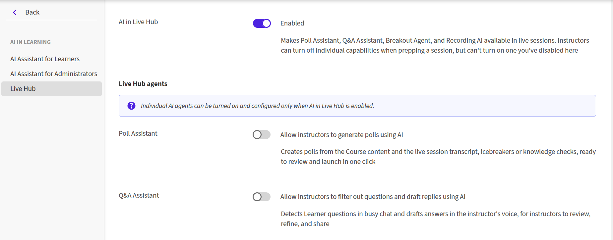

# 在Adobe Learning Manager中启用Live Hub (Beta)

管理员可以为Adobe Learning Manager帐户启用Live Hub，并配置AI支持的助理，以便在实时会话期间支持讲师。 启用Live Hub后，作者可以使用Live Hub虚拟培训工具创建和管理课程的虚拟教室模块。

启用Live Hub：

1. 以管理员身份登录Adobe Learning Manager。

1. 在左侧导览窗格中选择“学习中&#x200B;**”的** AI。

   
   *选择“学习中的AI”以启用Live Hub。*

1. 选择&#x200B;**实时中心**。  将打开&#x200B;**实时中心**&#x200B;页面。

   
   *实时中心设置显示了在ALM中启用实时中心的选项。*

1. 切换&#x200B;**为此帐户启用实时中心**。  此时会显示&#x200B;**将Live Hub设置为默认**&#x200B;对话框。

   
   *在弹出窗口中选择“设置为默认值”。*

1. 选择下列选项之一：

   1. **设置为默认**：使实时中心成为默认虚拟教室提供程序。 作者为课程创建虚拟教室模块时，会预先选择Live Hub。

   1. **暂不**：关闭对话框，而不更改默认虚拟教室提供程序。 您可以稍后从Live Hub页面启用此设置。

1. 在Live Hub **中打开** AI，以便在实时会话中提供AI支持的助理。

   
   *在Live Hub中启用AI以启用Live Hub代理。*

1. 从Live Hub代理启用助理：

   1. 投票助手

   1. 问答助手

   1. 分组监视助手

   1. 录制的主题生成器

   1. 讲师查找器助手

>[!NOTE]
>
> 仅在启用Live Hub中的AI时才能配置AI助理。 讲师可以在准备会话时禁用助理，但不能启用管理员已禁用的助理。

有关详细信息，请查看[Live Hub快速入门](../../getting-started-with-live-hub/getting-started-live-hub.md)。