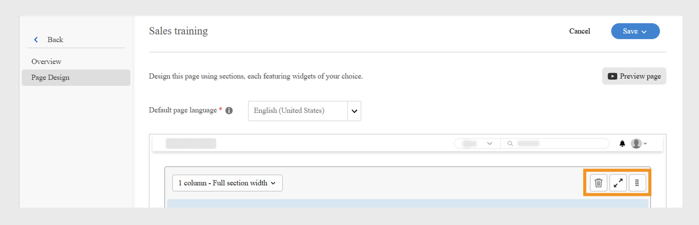
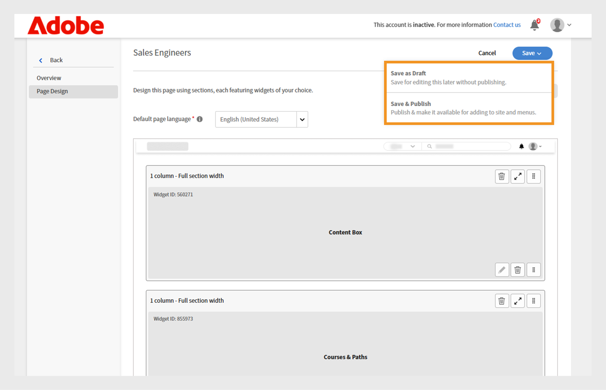

# 在Experience Builder中创建自定义页面

作为一家金融服务公司的管理员，您负责管理两个团队：销售团队和客户成功团队。 每个团队都有独特的学习要求，但都使用相同的标准学习门户。 这导致了困惑、混乱和学习者参与度低。
要在不投资无头构建或等待自定义开发人员解决方案的情况下解决此挑战，您可以使用Adobe Learning Manager中的Experience Builder。 借助页面、小组件和菜单，您只需几个步骤即可设计特定于角色的品牌门户，无需编码。

要在Adobe Learning Manager中为销售工程团队创建自定义页面，请执行以下操作：

1. 以管理员身份登录Adobe Learning Manager。
2. 在左侧导航窗格中选择&#x200B;**[!UICONTROL 品牌推广]**。
3. 选择&#x200B;**[!UICONTROL 自定义页面]**。
4. 选择&#x200B;**[!UICONTROL 创建页面]**。

   
   _显示“创建页面”选项的“自定义页面”屏幕，用于设计新的自定义学习体验_

5. 键入&#x200B;**[!UICONTROL 页面名称]**（例如，销售团队的销售培训）。
6. 键入&#x200B;**[!UICONTROL 页面描述]**。

   
   _Adobe Learning Manager中的销售培训页面设置，显示用于创建目标销售培训门户的页面名称、描述、类型、URL和图标配置字段_

7. 从以下选项中选择页面类型：

   * **[!UICONTROL 使用ALM小组件生成]**：管理员可以使用现有的Adobe Learning Manager小组件创建页面。 在“页面URL”字段中键入自定义字符串。 此字符串将附加到自定义页面的URL中。
   * **[!UICONTROL 外部页面]**：管理员可以为外部页面添加URL。 如果选择页面类型为外部，请在“页面URL”文本字段中键入外部页面URL。

8. 选择&#x200B;**[!UICONTROL 更改图标]**&#x200B;以更改页面图标。
9. 选择&#x200B;**[!UICONTROL 添加新语言]**&#x200B;以添加页面的默认语言。
10. 选择&#x200B;**[!UICONTROL “保存”]**。

已创建页面，并将其保存为“自定义页面”部分中的草稿。 管理员可以使用小组件编辑和设计草稿页面。

下一步是将布局添加到自定义页面，您可以在其中添加和配置小组件。

## Experience Builder中的页面布局

从下拉菜单中选择适当的章节布局，设计页面。 任何版面的最大宽度为1212像素。 根据要添加的小组件数量及其所需大小，从以下部分选项中进行选择：

* **[!UICONTROL 1列 — 整个节宽度]**：内容跨节的整个宽度，可提供最大空间。
* **[!UICONTROL 2列 — 每]**&#x200B;有1/2节宽度：将节均匀拆分为两个等宽列。
* **[!UICONTROL 2列 — 2/3和1/3节宽度]**：主要内容占据宽度的三分之二，而侧边内容占据三分之一。
* **[!UICONTROL 2列 — 1/3和2/3节宽度]**：侧边内容占三分之一，主内容占三分之二。
* **[!UICONTROL 3列 — 1/3节宽，每]**：节分为三个等宽列。

>[!NOTE]
>
>在所有版面中，最多可以添加10个构件，但1列 — 全部分宽版面除外。

要在Experience Builder中选择销售培训页面的布局，请执行以下操作：

1. 以管理员身份登录Adobe Learning Manager。
2. 在左侧导航窗格中选择&#x200B;**[!UICONTROL 品牌推广]**。
3. 选择“**[!UICONTROL 自定义页面]**”，然后选择所需的页面。
4. 选择&#x200B;**[!UICONTROL 页面设计]**。
5. 选择&#x200B;**[!UICONTROL “编辑”]**。

   
   _销售培训自定义页面的页面设计编辑屏幕，突出显示了用于添加页面部分、小组件和布局的“编辑”按钮_

6. 从&#x200B;**[!UICONTROL 选择分区布局]**&#x200B;下拉菜单中选择选项。

   
   _分区布局选择对话框允许管理员为自定义页面设计选择单列或多列Widget排列_

7. 选择&#x200B;**[!UICONTROL “继续”]**。

添加的版面具有以下选项：

* **[!UICONTROL 删除行]**：从布局中删除该行。
* **[!UICONTROL 适合屏幕宽度]**：调整布局，使其自动调整大小以适合您的屏幕，以提高可见性。
* **[!UICONTROL 重新排序]**：通过将版面拖放到所需位置来更改版面的顺序。

_显示布局选项的页面布局，可重新排序、扩展或删除章节_

下一步是在自定义页面上添加和配置小组件。

## 添加和配置小组件

根据要求将所需的小组件添加到销售培训自定义页面中。

要在销售培训自定义页面中配置小组件，请执行以下操作：

1. 在版面中选择&#x200B;**[!UICONTROL 添加构件]**。

   
   _页面设计屏幕允许管理员选择和添加小组件以自定义其课程页面_

2. 选择&#x200B;**[!UICONTROL 内容框构件]**，然后选择&#x200B;**[!UICONTROL 继续]**。

   
   _小组件选择屏幕，突出显示“内容框”小组件，用于显示自定义图像、文本和操作按钮，以增强学习者参与度_

3. 键入&#x200B;**[!UICONTROL 标题]**&#x200B;和&#x200B;**[!UICONTROL 描述]**。
4. 将文本键入到&#x200B;**[!UICONTROL 动作按钮标签]**&#x200B;中，并提供链接。
5. 配置其余选项。 查看此[部分](/help/migrated/administrators/feature-summary/experience-builder/add-a-widget.md#content-box-widget)，了解有关&#x200B;**[!UICONTROL 内容框构件]**&#x200B;的更多信息。

   
   _内容框小组件屏幕，显示配置小组件的选项_

6. 在面向销售工程师的&#x200B;**[!UICONTROL 内容框小组件]**&#x200B;配置屏幕中键入标题、描述和操作按钮标签
7. 选择&#x200B;**[!UICONTROL 添加小组件]**。
8. 选择“**[!UICONTROL 保存]**”，然后从以下选项中进行选择：
a. **[!UICONTROL 另存为草稿]**：页面将保存为草稿。 管理员稍后可以编辑该页面。
b. **[!UICONTROL 保存和Publish]**：将发布页面，管理员可以将此页面添加到“菜单”。

   
   _保存选项允许管理员选择将页面保存为草稿以供将来编辑还是发布以供学习者访问_

页面可以保存为草稿或已发布。 管理员可以在发布之前编辑草稿，还可以更新和重新发布已发布的页面。

按照相同的步骤为Customer Success Manager团队创建页面。

## 预览页面

要预览页面，请执行以下操作：

1. 以管理员身份登录Adobe Learning Manager。
2. 在左侧导航窗格中选择&#x200B;**[!UICONTROL 品牌推广]**。
3. 选择&#x200B;**[!UICONTROL 自定义页面]**。
4. 选择所需页面，然后选择&#x200B;**[!UICONTROL 页面设计]**。
5. 选择&#x200B;**[!UICONTROL 编辑]**，然后选择&#x200B;**[!UICONTROL 预览页面]**&#x200B;以查看门户的预览。

   
   _页面预览，显示带有横幅的自定义页面布局和特色课程_

6. 选择Inspect模式以查看小组件的高度和宽度。

   
   _Experience Builder中的“页面预览”屏幕，Inspect模式切换开关高亮显示，允许管理员查看和检查小组件_

## 创建不同语言的页面

管理员可以创建多个特定于区域设置的自定义页面，方法是在创建页面时在“添加新语言”中选择所需的语言。 添加多种语言后，必须在位于默认语言选项卡旁的相应选项卡中，为每种语言单独配置小组件详细信息。

_管理员除了添加默认语言之外，还可以添加其他语言（例如法语）的小组件详细信息_

## 管理页面生命周期

管理员可以使用“自定义页面”部分来编辑、删除和复制页面。

### 编辑页面

要编辑自定义页面，请执行以下操作：

1. 以管理员身份登录Adobe Learning Manager。
2. 在左侧导览窗格中选择“品牌推广” 。
3. 选择“自定义页面”。
4. 选择所需页面，然后选择编辑。
5. 选择“保存”。

页面将根据更改进行更新。

_编辑自定义页面，允许管理员更新页面名称、描述和类型_

### 删除页面

要删除页面，请执行以下操作：

1. 以管理员身份登录Adobe Learning Manager。
2. 在左侧导览窗格中选择“品牌推广” 。
3. 选择“自定义页面”。
4. 选择所需的页面。
5. 选择操作，然后选择删除。

_自定义页面屏幕显示用于删除为产品培训创建的自定义页面的选项_

### 复制页面

要复制页面，请执行以下操作：

1. 以管理员身份登录Adobe Learning Manager。
2. 在左侧导览窗格中选择“品牌推广” 。
3. 选择“自定义页面”。
4. 选择所需的页面。
5. 选择操作，然后选择复制。

_自定义页面屏幕显示用于复制为产品培训创建的自定义页面的选项_

## 下一步

创建页面后，根据您的培训需求，在自定义页面上添加和配置小组件。
