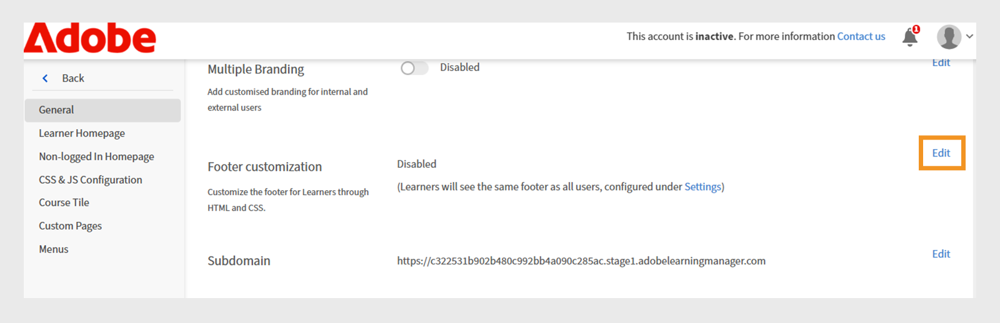

# 自定义Experience Builder

## 自定义页脚

页脚显示在学习者界面的底部，通常显示在管理员设置中配置的默认信息。 管理员可以将它替换为自定义页脚，以创建品牌化体验。 使用HTML和CSS，他们可以定义页脚的设计、布局和内容，以满足组织的要求。

作为财务公司的管理员，您可以使用自定义选项配置页脚。 通过此选项，您可以添加自己的HTML和CSS，从而可以非常灵活地设计页脚。

要自定义页脚，请执行以下操作：

1. 以管理员身份登录Adobe Learning Manager。
2. 选择“**[!UICONTROL 品牌]**”，然后选择“**[!UICONTROL 常规]**”。
3. 选择&#x200B;**[!UICONTROL 页脚自定义]**&#x200B;选项旁边的&#x200B;**[!UICONTROL 编辑]**。

   
   _Adobe Learning Manager中的“常规”设置屏幕，显示启用自定义页脚的选项_

4. 选择切换按钮以启用&#x200B;**[!UICONTROL 页脚自定义]**。

   
   _Adobe Learning Manager中的页脚自定义设置，显示启用自定义页脚和字段以添加HTML或CSS进行个性化品牌推广的切换开关_

5. 在相应的选项卡中键入您的&#x200B;**[!UICONTROL HTML]**&#x200B;和&#x200B;**[!UICONTROL CSS]**。

   
   _Adobe Learning Manager中的页脚自定义屏幕，显示用于添加、编辑学习者界面页脚或设置其样式的自定义HTML部分_

6. 选择“**[!UICONTROL 预览]**”以在保存自定义页脚之前查看它。

   
   _预览Adobe Learning Manager中带分类链接的自定义学习者界面页脚_

7. 选择&#x200B;**[!UICONTROL “保存”]**。

自定义页脚将显示给所有学习者。

## 自定义课程磁贴

在金融公司，管理员可以设置课程磁贴，决定学习者能看到的详细信息。 例如，它们可能显示合规性培训的课程描述和技能名称，但隐藏评级或作者姓名以专注于强制性要求。

要自定义课程磁贴，请执行以下操作：

1. 以管理员身份登录Adobe Learning Manager。
2. 选择“**[!UICONTROL 品牌]**”，然后选择“**[!UICONTROL 课程磁贴]**”。
3. 选择&#x200B;**[!UICONTROL “编辑”]**。

   
   _Adobe Learning Manager中的“课程磁贴设置”屏幕，显示“编辑”选项以自定义磁贴_

4. 选择以下选项以显示或隐藏与课程信息相关的详细信息：

   a. **[!UICONTROL 格式]**：混合/自学/教室/虚拟教室：学习对象的类型。
b. **[!UICONTROL 持续时间]**：学习对象的持续时间。
c. **[!UICONTROL 技能/产品]**：显示课程涵盖的关键技能或产品。
d. **[!UICONTROL 评分]**：显示课程的学习者评分。
e. **[!UICONTROL 作者姓名]**：显示课程作者的姓名
f. **[!UICONTROL 描述（悬停时显示）]**：当学习者将鼠标悬停在课程卡上时，显示课程的简短摘要。
g. **[!UICONTROL 发布日期/截止日期（悬停时显示）]**：显示课程发布的时间或完成截止日期。

5. 选择以下选项以显示或隐藏与课程操作相关的详细信息：

   a. **[!UICONTROL “添加到学习列表”按钮]**：允许学习者将课程保存到其个人学习列表，以供将来参考。
b. **[!UICONTROL 保存按钮]**：保存对课程设置或首选项所做的任何更改。
c. **[!UICONTROL 注册/继续按钮]**：允许学习者注册新课程或继续已开始的课程。 隐藏此选项也会删除它旁边显示的“不推荐”和“下载”操作。

   
   _Adobe Learning Manager中的课程磁贴配置屏幕，管理员可在其中选择要为学习者显示的信息和操作_

6. 屏幕右侧会显示课程磁贴的预览。

   
   _Adobe Learning Manager中的课程磁贴配置屏幕，突出显示课程磁贴的预览_

7. 选择&#x200B;**“保存”**。

自定义课程磁贴将显示给所有学习者。

**在自定义之前**


_自定义之前，Adobe Learning Manager中的课程磁贴_

**自定义后**


_自定义后Adobe Learning Manager中的课程磁贴_

## 使用JavaScript和CSS进行自定义

作为财务公司管理员，您可以通过注入CSS和JavaScript来自定义学习者应用程序，以满足公司的品牌和法规要求，进而完全控制应用程序的外观、布局和交互功能。

如需使用CSS和JS自定义学习者界面，请执行以下操作：

1. 以管理员身份登录Adobe Learning Manager。
2. 选择“**[!UICONTROL 品牌]**”，然后选择“**[!UICONTROL CSS和JS配置]**”。
3. 选择&#x200B;**[!UICONTROL “编辑”]**。
4. 在相应的选项卡中键入自定义CSS和JS。

   
   _Adobe Learning Manager中的“CSS和JS配置”屏幕，管理员可以在其中添加自定义CSS和JS_

5. 选择“保存”。

自定义设置会显示给所有学习者。

**自定义之前**

学习者主页菜单设计基于Adobe Learning Manager默认设置。


_自定义前Adobe Learning Manager学习者主页_

**自定义后**

添加以下CSS和JS后，学习者主页菜单已根据自定义项进行了更新。

示例CSS：

```
p{
display:block;
}

.withExtraMargin{
margin-right: 100px!important;
}
.alm-footer-extraMargin{
margin-top:0;
}

.alm-layout-almLayoutContainer{
margin: 0;
    margin-bottom: 5rem;
}
#page-756 #category-970151 .alm-category-card-cardLink
{
    height: 400px;

}
#page-756 #category-970151 .alm-category-card-header
{
height: 240px!important;
}
#page-656 .alm-category-card-cardLink{
    height: 380px;
background: white;
}
#page-656 .alm-category-card-header{
height: 200px!important;
}

#page-746 #html-636797 {
    background-color: #f7f9fc;
}

#page-746 .alm-layout-almLayoutContainer{
row-gap:0;
margin-bottom:0;
}

.alm-category-card-cardLink{
transition: border .3s ease;
}
.navText{
       font-size: 16px;
    cursor: pointer;
}
.submenuDownCaret{
display:none;}
.alm-catalog-container-pageContainer{
max-width: 1720px;
    width: 100%;
    padding: 0 40px;
    padding: 0 40px;
}


.pagenavbarcontainer.newNavbarContainer{
width: 1230px;
    margin: 0 auto;
}
div[automationid="learner-menu-inside-header"]{
margin-right:100px!important;
}
#searchScope,.searchSeparator,#searchInDropdown{
display:none!important;
}
#right-navbar{
    margin-right: 0;
}
#companyLogoImg{
cursor:pointer;
max-width:190px;
}
.alm-catalog-container-filtersContainer{
width:340px;
}
.alm-training-card-v2-imageFlipContainer{
border:none;
}
.newSearchBoxContainer{
border-radius: 5px !important;
    border-width: 2px !important;
    border-color: rgb(5, 32, 34) !important;
}
.searchBoxFlex{
width:250px!important;
flex-direction: row-reverse;
    padding-right: 10px;
}
.searchPlaceholderIcon svg{
    height: 16px;
    width: 16px;
}
.searchPlaceholderIcon svg path{
fill: black;
}
#page-656 .alm-layout-almLayoutContainer {
    padding-bottom: 5rem;
margin-bottom:0!important;
}
#page-656 .alm-strip-widget-header-stripHeaderContainer{
display:none;
}
#page-656 .content-wrapper{
padding-bottom:50px;
}
.myspan{
position: absolute;
    bottom: 10px;
    display: block;
    width: 85%;
    margin-left: 20px;
    margin-right: 20px;
    border-top: 1px solid #efefef !important;
    color: #5a697c !important;
    text-align: right;
    padding-top: 5px;
}
.alm-app-wrapperComponent{
padding-bottom:100px;}


@media (max-width: 768px) {
#page-656 .alm-category-widget-cardRow{
   flex-direction: column;
gap: 40px;
 }
#page-656 .alm-category-widget-stripCardContainerRow{
    width: 100%;
    display: flex;
    justify-content: center;
  }
}

@media (max-width: 768px) {
    .container2-right {
        display: none!important;
    }
.container-1 .content-wrapper{
    padding: 0 20px!important;
 }
}
```

示例JS：

```
console.error("Hello Error")

setTimeout(() =>{
// Step 1: Check if #category-284977 is present
const categoryElement = document.querySelector('#category-284977');

if (categoryElement) {
  // Step 2: Find all elements with .alm-category-card-cardLink
  const cardLinks = categoryElement.querySelectorAll('.alm-category-card-cardLink');

  // Step 3: Loop over them and append span with random calculation
  cardLinks.forEach((link, index) => {
    const span = document.createElement('span');


    // Calculate number = (index+1) * 5
    let number = (index + 1) * 5;
if(index === 2){
number = number +2;
}
if(index == 3){
number = number - 7;
}

    span.textContent = `${number} courses`;
    span.classList.add('myspan');
    link.appendChild(span);
  });
}

},2000)
```


_自定义后的Adobe Learning Manager学习者主页_

## 自定义小组件

管理员可以通过应用CSS类来自定义自定义页面上的小组件。 例如，他们可以对齐“内容框”小组件中的文本，或调整“课程和路径”小组件中课程拼贴之间的间距。

>[!TIP]
>
>Inspect“学习者”页面，确定要修改的样式。 复制相关的CSS类并将其粘贴到“CSS和JS配置”页面以应用您的自定义设置。

**自定义之前**

在添加CSS自定义项之前，以下屏幕为销售工程师培训页面。


自定义前_销售工程师学习者页面_

**自定义后**

添加以下CSS类后，学习者页面会根据在这些类中定义的样式进行更新。 根据CSS，“内容框”小组件中的文本已靠左对齐，课程拼贴之间的间距现已增加。

```
.alm-custom-content-box-center {
    align-items: baseline;
    text-align: initial;
}
.alm-training-card-v2-imageContainer {
    border: 14px solid var(--prime-color-white);
    border-radius: -1px;
    height: 106%;
    position: relative;
    transition: all .1s ease-in-out;
}
.alm-course-path-widget-cardRow {
    display: flex;
    gap: 135px;
    margin: 0 0 21px;
    padding: 10px;
}
```


_自定义后的销售工程师学习者页面_

### 小组件的预定义CSS类

以下是一些可用于小部件的预定义CSS类。

| 小组件名称 | 容器CSS |
|---|---|
| 日历 | alm-calendar-widget-container |
| 类别 | alm-category-widget-container |
| 类别卡 | alm-category-card-container |
| 合规性 | alm-compliance-container |
| 课程和路径 | alm-course-path-widget-container |
| 课程和路径学习卡 | alm-training-card-v2-card |
| 内容框 | alm-custom-content-box-container |
| 游戏 | alm-leaderboard-container |
| 社交学习 | alm-social-learning-container |


