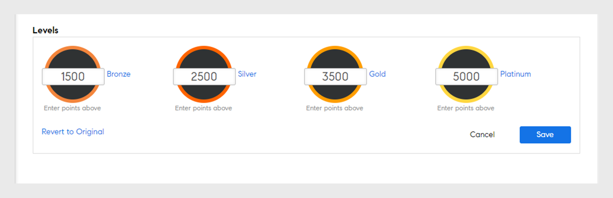

# 游戏

游戏是指在非游戏环境中通过使用游戏思维和游戏机制让用户在参与学习时获得点数。

## 概述 {#overview}

Adobe Learning Manager包含一项名为“游戏”的功能，旨在通过交互式游戏元素吸引学习者并促进学习。 它鼓励学习者通过奖励实现想要的学习行为，并允许学习者获得点数并与同行竞争。 此功能可增强用户在学习平台中的参与度和积极性。

默认情况下，用户可通过一些示例游戏点数和数据来了解模式。 您可以相应地修改点数。

<!--A sample illustration is provided below that shows all the tasks and points.

-->

## 游戏设置 {#gamificationsettings}

要访问设置，请按以下步骤操作：

1. 以管理员身份登录后，单击左侧窗格中的&#x200B;**[!UICONTROL “游戏”]**。
1. 创建新的 Adobe Learning Manager 帐户时，游戏默认处于禁用状态。 要启用游戏，请单击页面右上角的&#x200B;**[!UICONTROL “启用”]**。

## 设置点数 {#setuppoints}

管理员可以按照以下步骤为学习者设置游戏点数：

1. 以管理员身份登录后，单击“**[!UICONTROL 游戏]**”。\
   此时会出现一个页面，其中列有铜级、银级、金级和白金级，以及达到各个级别所需的点数。 显示任务列表和完成任务获得的相应点数。
1. 单击各项任务旁边的“编辑”图标以设置点数。
1. 修改任务出现的频率，例如每月、每季度或每年完成特定数量的课程。
1. 单击&#x200B;**[!UICONTROL “保存”]**。

*设置点数*

## 任务 {#tasks}

管理员可以为学习者的五个游戏任务设置点数。 以下插图介绍了所有学习者任务和点数:

>[!NOTE]
>
>单个任务内的学习者游戏点数不会累积。 但是，如果学习者通过不同的任务获得点数，则这些点数会累积到学习者帐户。

在将课程指定到点数时，管理员必须确保学习者能逐步获得点数。

**适用于快速学习者**

如果学习者在一个月/一个季度/一年内完成了指定数量的课程，则可适用该任务。此任务旨在鼓励学习进度较快的学习者。

您可以看到以下情况:

1. 学习者在一个月/一个季度/一年内完成两个课程，可获得 20 点。
1. 学习者在一个月/一个季度/一年内完成四个课程，可获得 100 点。
1. 学习者完成八个课程时，可获得 300 点。
1. 学习者完成十个课程时，可获得 500 点。

>[!NOTE]
>
>管理员可以修改时间段和获得相应点数所需完成的课程数量。

学习者多次完成同一任务不会重复获取点数。例如，假设学习者完成了两个课程并获得了 20 点。 那么当学习者完成了四个课程，就会获得 100 点，而原有 20 点将不会考虑在内。

**适用于自学者 (a)**

如果学习者注册了规定数量的课程，并在一个月/一个季度/一年内完成，则可适用该任务。 在这种情况下，管理员可以启用此任务并为其分配点数。

可能的情况为:

1. 学习者在一个月/一个季度/一年内注册了一个课程，可获得 50 点。
1. 学习者在一个月/一个季度/一年内注册了两个课程，可获得150点。

>[!NOTE]
>
>管理员可以修改时间段和课程数量。

**对于自学者(b)**

如果学习者在要求的一个月/一个季度/一年内注册并完成了超出规定数量的课程，则可适用该任务。在这种情况下，管理员可以启用该任务并为其分配点数。

学习者除规定的课程外，还注册了课程，其可能的情况为:

1. 学习者在一个月/一个季度/一年内注册了一个课程，可获得 20 点。
1. 学习者在一个月/一个季度/一年内注册了两个课程，可获得100点。
1. 学习者在一个月/一个季度/一年内注册了三个课程，可获得 300 点。
1. 学习者在一个月/一个季度/一年内注册了四个课程，可获得 500 点。

>[!NOTE]
>
>管理员可以修改时间段和课程数量。 例如，第三种情况可修改为五个课程而不是三个课程，才能获得 80 点。

**用于提升技能 (a)**

如果学习者完成了特定数量的能力，则可适用该任务。管理员可以选择此任务鼓励学习者尽可能多地获得相关能力。

提升能力可能的情况为：

1. 学习者获得一项能力时，得到100点。
1. 学习者获得两项能力时，得到300点。
1. 学习者获得三项能力时，得到600点。
1. 学习者获得四项能力时，得到900点。

>[!NOTE]
>
>时间段不适用于此任务。 管理员可以修改每种情况的课程数量。

**用于提升技能 (b)**

只要学习者在能力内完成较高级别，即可适用该任务。

特定能力中提升级别可能的情况为:

1. 学习者获得一个级别时，得到100点。
1. 学习者获得两个级别时，得到200点。
1. 学习者获得三个级别时，得到500点。

>[!NOTE]
>
>时间段不适用于此任务。 如果学习者在获得较高级别的能力后，获得了较低级别的能力，则他只会获得较高级别的点数。

**供参考**

此任务适用于在完成N天内返回其已完成课程的学习者。

可能的情况：
学习者在完成30天内提及已完成的课程时，可获得50点。

**提早完成点数**

如果学习者在N天内返回已添加书签的课程以完成课程，则可适用此任务。

可能的情况：\
前10个完成课程的学习者可获得100点。

**及时完成点数**

如果学习者在参加课程后的规定天数内完成课程，则可适用此任务。

可能的情况：\
学习者在课程开始后10天内完成课程，则可获得100点。

**综合学习者**

此任务适用于每月使用可选学习材料（如预习、资源和工作辅助）的学习者。

可能的情况为:

1. 学习者每个月完成一项学习时，可获得20点。
1. 学习者每个月完成两项学习时，可获得40点。
1. 学习者每个月完成三个学习时，可获得80点。

**持续学习**

此任务适用于每周、每月或每季度从事特定天数学习活动的学习者。 活动包括使用学习内容、下载资源和工作辅助。

可能的情况为:

1. 学习者参加每周一天的学习活动时，可获得20点。
1. 学习者参加每周两天的学习活动时，可获得40点。
1. 学习者参加每周一天的学习活动时，可获得80点。

**反馈**

这适用于提供课程反馈的学习者。

可能的情况为:

1. 对于开始评级反馈，可获得20点。
1. 反应反馈，得到20点。
1. 经理反馈可获得20点。

## 管理员操作 {#administratoractions}

管理员可以创建机密用户列表，重置游戏点数，并为学习者禁用/启用游戏功能。 在游戏页面中选择&#x200B;**[!UICONTROL 设置]**&#x200B;以查看以下快照中显示的操作。

*管理员的游戏选项*

## 保密性设置 {#confidentialitysettings}

如果需要，您可以将一些高层管理用户设为机密用户。 排行榜中的其他学习者看不到机密用户的游戏活动。

保密性设置适用于内部用户和外部用户。

1. 单击&#x200B;**[!UICONTROL 游戏]** > **[!UICONTROL 设置]** > **[!UICONTROL 保密性设置]**。

*查看保密性设置*

1. 在列出的用户中，单击用户名对应的复选框，然后单击“隐藏”，将用户设置为机密用户。

   >[!NOTE]
   >
   >您可以根据复选框中的用户名勾选标记来标识列出用户中的机密用户。

1. 单击“机密用户”选项卡以查看机密用户列表。 默认情况下，机密用户不可见。 单击下拉箭头图标以查看列表。
1. 单击机密用户列表中用户名对应的复选框，然后单击“添加”，将用户从机密列表中移除。

## 重置游戏 {#resetgamification}

您可以重置学习者获得的游戏点数和配置设置。 如果您选择重置用户分数，则用户获得的所有分数将被清除并重置为零。 如果您选择重置用户分数和配置设置，那么分配给级别和任务的所有默认点数则会被重置为零。

重置游戏设置适用于内部用户和外部用户。

要重置学习者分数和配置，请单击“重置游戏”，然后根据要求选择一个选项。 您可以选择仅“重置学习者分数”，也可以选择“重置学习者分数和配置设置”。 选中后，单击“确定”。

*重置游戏点数*

## 禁用游戏 {#disablegamification}

单击“[!UICONTROL **游戏**]”>“**[!UICONTROL 设置]**”>“[!UICONTROL **游戏功能**]”。 您可以通过此功能为学习者分别启用游戏功能和排行榜。 根据需要选择“为内部学习者启用”或“为外部学习者启用”，然后单击“确定”。 当您再次启用游戏时，所有点数都会保留。

*禁用游戏*

您可以针对内部用户和外部用户禁用游戏。

## 群组级别游戏 {#grouplevelgamification}

管理员可通过更改范围设置来定义游戏范围。您可以选择性地在个人资料相似的用户、组或位置之间启用游戏。

1. 在管理员登录中，单击左侧窗格中的&#x200B;**[!UICONTROL 游戏]**。
1. 打开&#x200B;**[!UICONTROL 游戏]** > **[!UICONTROL 设置]** > **[!UICONTROL 范围设置]**。 此时会显示[!UICONTROL 游戏范围设置]对话框。

   

   *查看“游戏范围设置”对话框*

1. 单击选项&#x200B;**[!UICONTROL “启用范围设置”]**。

1. 从下拉列表中选择“用户特征”。

   <!---->

1. 选择与所选用户特征对应的值。 例如，如果选择用户特征作为配置文件，则需要从下拉列表中选择值。 以下屏幕截图中显示了示例配置文件值，供您参考。

   <!---->

1. 单击&#x200B;**[!UICONTROL 保存]。**
