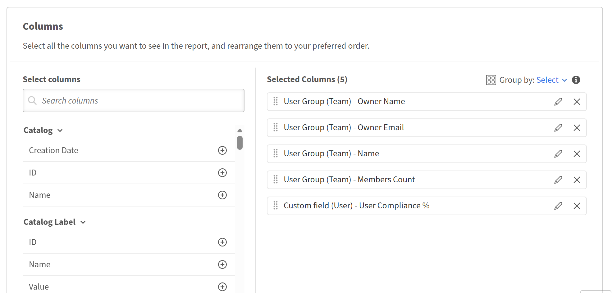

# Report Builder快速入门

## 概述

Report Builder包括15个预建模板，专为最常见的学习数据报告用例而设计。 每个模板都是一个现成的报告配置，其中已应用列、过滤器、分组依据设置和排序。 模板是只读的。 您可以预览或复制它们以创建可编辑的副本。

## 关于模板

模板是Adobe Learning Manager提供的现成的报告配置。 每个模板均针对特定的用例（如注册和完成跟踪、合规性报告或讲师表现）而设计。 模板显示在Report Builder的&#x200B;**模板**&#x200B;选项卡下。 每个模板均从一个或多个数据集构建并生成特定类型的输出。 要自定义模板，请选择&#x200B;**复制**&#x200B;以在&#x200B;**报告**&#x200B;选项卡中创建可编辑的副本，同时保持原始模板不变。

## 模板目录

### 用户学习成绩单

**类别：**&#x200B;成绩单、完成和进度跟踪

**描述：**&#x200B;完成每个学习者的学习历史记录，显示所有注册、状态、分数、截止日期以及所有学习对象类型所花费的时间。

**在以下情况下使用：**&#x200B;您需要完整的审核就绪型学习者活动导出，以用于合规性审核、学习者支持案例或将ALM数据集成到外部系统中。

**适用的受众：**&#x200B;客户教育、合作伙伴教育、员工教育、销售支持。

**使用的数据集：**&#x200B;用户、学习对象、成绩单（学习对象）

**键列：**&#x200B;用户ID、用户名、用户电子邮件、经理姓名、用户状态、学习对象名称、学习对象类型、注册日期、完成日期、状态、进度百分比、用户最高分数、完成截止日期、逾期、花费的时间（分钟）

已应用&#x200B;**个筛选器：**&#x200B;去年的注册日期；目录=默认目录

### 学习者进度摘要

**类别：**&#x200B;成绩单、完成和进度跟踪

**描述：**&#x200B;根据分配的学习路径和课程跟踪每个学习者的进度，包括通过父学习对象ID进行层次结构映射。

**使用时间：**&#x200B;您想要查看每个学习者在学习路径中的位置 — *哪些学习者正在进行中、哪些学习者已逾期、哪些学习者有错过截止日期的风险。

**适用的受众：**&#x200B;客户教育、合作伙伴教育、员工教育、销售支持。

**使用的数据集：**&#x200B;用户、学习对象、成绩单（学习对象）

**键列：**&#x200B;用户ID、用户名、用户电子邮件、经理姓名、学习对象ID、学习对象名称、学习对象类型、父学习对象ID、注册日期、完成截止日期、状态、进度百分比、逾期、开始日期、完成日期

**应用的过滤器：**&#x200B;去年内的注册日期；学习对象类型=学习路径或课程；目录=默认目录

### 活动学习者信息板

**类别：**&#x200B;学习者参与和平台使用情况

**描述：**&#x200B;每个学习者的平台参与情况的每月摘要，其中显示已访问的课程、完成情况以及花费的总时间。

**使用时间：**&#x200B;您想要确定过去一年中最投入、参与度最低的学习者，并查看参与度如何按月趋势。

**适用的受众：**&#x200B;客户教育、合作伙伴教育、员工教育、销售支持。

**使用的数据集：**&#x200B;用户，转录（学习对象）

**键列：**&#x200B;用户ID、用户名、用户电子邮件、经理姓名、用户状态、上次访问日期（月）、访问的唯一课程、已完成的注册、总时间（分钟）

**应用的筛选器：**&#x200B;用户上次访问日期在去年内；用户状态=活动；目录=默认目录

**分组依据：**&#x200B;个用户字段+上次访问日期的月份

**聚合：**&#x200B;学习对象ID上的唯一计数（访问的唯一课程）、状态=已完成（已完成注册）时的计数、花费时间总计（总花费时间）

### 非活动学习者报告

**类别：**&#x200B;学习者参与和平台使用情况

**描述：**&#x200B;标识去年没有平台访问权限的活动用户，显示其上次注册和完成日期。

**在以下情况下使用：**&#x200B;您需要查找休眠帐户以用于重新参与活动、许可证审阅或帐户清理。

**适用的受众：**&#x200B;客户教育、合作伙伴教育、员工教育、销售支持。

**使用的数据集：**&#x200B;用户，转录（学习对象）

**键列：**&#x200B;用户ID、用户名、用户电子邮件、经理姓名、用户创建日期、用户上次访问日期、上次注册日期、上次完成日期

**应用的筛选器：**&#x200B;用户上次访问日期不在去年内；用户状态=活动；目录=默认目录

**分组依据：**&#x200B;用户ID、用户名、用户电子邮件、经理姓名、用户创建日期、用户上次访问日期

**聚合：**&#x200B;注册日期上限（上次注册日期）、完成日期上限（上次完成日期）

### 新学习者收养

**类别：**&#x200B;学习者参与和平台使用情况

**描述：**&#x200B;跟踪去年创建的用户入门参与情况，例如，首次注册、完成和已访问的课程总数。

**在以下情况下使用：**&#x200B;您希望测量新用户从帐户创建到首次注册和完成的速度，这是一项关键的入门培训运行状况指标。

**适用的受众：**&#x200B;客户教育、合作伙伴教育、员工教育、销售支持。

**使用的数据集：**&#x200B;用户，转录（学习对象）

**键列：**&#x200B;用户ID、用户名、用户电子邮件、经理姓名、用户创建日期、用户上次访问日期、首次注册日期、首次完成日期、已访问的课程总数、已完成的课程

**应用的筛选器：**&#x200B;去年内的用户创建日期；用户状态=活动；目录=默认目录

>[!NOTE]
>
>此模板在用户数据集和转录文本数据集之间使用左联接，以便注册为零的用户仍显示在报告中。 这使识别尚未开始学习旅程的新用户成为可能。

**分组依据：**&#x200B;用户ID、用户名、用户电子邮件、经理姓名、用户创建日期、用户上次访问日期

**聚合：**&#x200B;注册日期（第一个注册日期）最小值、完成日期（第一个完成日期）最小值、学习对象ID唯一计数（已访问的课程总数）、状态为已完成计数（已完成的课程）

### 按用户组学习

**类别：**&#x200B;用户、组和组织结构

**描述：**&#x200B;比较组织分部之间的学习活动 — 活动学习者、访问的课程、完成情况以及每个组花费的时间。

**在以下情况下使用：**&#x200B;您希望跨部门、工作职能或任何活动的基于字段的用户组设定参与基准。

**适用的受众：**&#x200B;客户教育、合作伙伴教育、员工教育、销售支持。

**使用的数据集：**&#x200B;用户组（活动字段）、成绩单（学习对象）

**键列：**&#x200B;用户组ID、用户组名称、成员计数、活跃学习者、已访问唯一课程总数、已完成注册、总花费时间（分钟）

**应用的筛选器：**&#x200B;去年内的注册日期；目录=默认目录；用户组（活动字段）名称=配置文件（活动字段）

**分组依据：**&#x200B;用户组ID、用户组名称、成员计数

**聚合：**&#x200B;用户ID（活动学习者）唯一计数、学习对象ID唯一计数（已访问的唯一课程总数）、状态=已完成（已完成注册）时计数、花费时间总计（总花费时间）

### 按位置学习

**类别：**&#x200B;用户、组和组织结构

**描述：**&#x200B;比较不同地理位置的学习活动 — 活动学习者、访问的课程、完成情况以及每个位置花费的时间。

**在以下情况下使用：**&#x200B;您需要跨区域设定学习运行状况基准，无需手动数据分片。 对于具有地理位置分散的学习者的全球性组织非常有用。

**适用的受众：**&#x200B;客户教育、合作伙伴教育、员工教育、销售支持。

**使用的数据集：**&#x200B;用户组（活动字段）、成绩单（学习对象）

**键列：**&#x200B;用户组ID、用户组名称、成员计数、活跃学习者、已访问唯一课程总数、已完成注册、总花费时间（分钟）

**应用的筛选器：**&#x200B;去年内的注册日期；目录=默认目录；用户组（活动字段）名称包含“位置”

**分组依据：**&#x200B;用户组ID、用户组名称、成员计数

**聚合：**&#x200B;用户ID（活动学习者）唯一计数、学习对象ID唯一计数（已访问的唯一课程总数）、状态=已完成（已完成注册）时计数、花费时间总计（总花费时间）

### Learning by Manager

**类别：**&#x200B;用户、组和组织结构

**描述：**&#x200B;汇总了每个经理的完整团队层次结构的学习性能 — 活跃学习者、完成情况以及花费的时间。

**在以下情况下使用：**&#x200B;您想要比较不同经理之间的团队参与情况，并识别完成率或所花费时间相对于团队大小而言较低的团队。

**适用的受众：**&#x200B;员工教育、销售支持。

**使用的数据集：**&#x200B;用户组（团队）、成绩单（学习对象）

**键列：**&#x200B;经理ID、经理姓名、经理电子邮件、成员计数（整个团队）、活动学习者、访问的唯一课程总数、已完成的注册、花费的总时间（分钟）

已应用&#x200B;**个筛选器：**&#x200B;去年的注册日期；目录=默认目录

**分组依据：**&#x200B;所有者ID （经理ID）、所有者名称、所有者电子邮件、成员计数

**聚合：**&#x200B;用户ID（活动学习者）唯一计数、学习对象ID唯一计数（已访问的唯一课程总数）、状态=已完成（已完成注册）时计数、花费时间总计（总花费时间）

>[!NOTE]
>
>此模板使用用户组（团队）数据集，该数据集捕获每个经理下的整个团队层次结构。 无需其他用户组过滤器。

### 注册摘要

**类别：**&#x200B;成绩单、完成和进度跟踪

**描述：**&#x200B;按状态细分的课程级别注册计数 — 已完成、进行中以及未开始 — 针对每个学习对象。

**使用时间：**&#x200B;您希望快速查看每个课程的注册漏斗 — 有多少学习者已开始、有多少学习者正在进行、有多少学习者已完成。

**适用的受众：**&#x200B;客户教育、合作伙伴教育、员工教育、销售支持。

**使用的数据集：**&#x200B;学习对象、成绩单（学习对象）

**键列：**&#x200B;学习对象ID、学习对象名称、学习对象类型、学习对象状态、已注册学习者总数、已完成注册、进行中注册、未开始注册

已应用&#x200B;**个筛选器：**&#x200B;去年的注册日期；目录=默认目录

**分组依据：**&#x200B;学习对象ID、名称、类型、状态

**聚合：**&#x200B;用户ID上的唯一计数（已注册的学习者总数）、状态=已完成时的计数、状态=进行中时的计数、状态=未开始时的计数

### 注册趋势分析

**类别：**&#x200B;成绩单、完成和进度跟踪

**描述：**&#x200B;每个学习对象的月注册和完成计数，显示学习者接受情况随时间的变化。

**在以下情况下使用：**&#x200B;您希望查看每个课程的注册高峰和消失的时间，以及同一月注册课程后是否完成了注册。

**适用的受众：**&#x200B;客户教育、合作伙伴教育、员工教育、销售支持。

**使用的数据集：**&#x200B;学习对象、成绩单（学习对象）

**键列：**&#x200B;学习对象名称、学习对象类型、注册日期（月）、已注册的学习者总数、已完成的注册

已应用&#x200B;**个筛选器：**&#x200B;去年的注册日期；目录=默认目录

**分组依据：**&#x200B;学习对象名称、学习对象类型、注册月份

**聚合：**&#x200B;用户ID上的唯一计数（已注册的学习者总数），如果状态为已完成（已完成的注册），则计数

### 课程完成报告

**类别：**&#x200B;成绩单、完成和进度跟踪

**描述：**&#x200B;每个课程的完成情况细目，包括状态计数、上次完成日期、平均进度和平均花费时间。

**在以下情况下使用：**&#x200B;您希望识别表现不佳内容 — 注册率高但完成率低的课程，或平均进度低的课程（表示提早辍学）。

**适用的受众：**&#x200B;客户教育、合作伙伴教育、员工教育、销售支持。

**使用的数据集：**&#x200B;学习对象、成绩单（学习对象）

**键列：**&#x200B;学习对象ID、学习对象名称、学习对象类型、学习对象状态、已注册学习者总数、已完成注册、进行中注册、未开始注册、上次完成日期、平均进度%、平均花费时间（分钟）

已应用&#x200B;**个筛选器：**&#x200B;去年的注册日期；目录=默认目录

**分组依据：**&#x200B;学习对象ID、名称、类型、状态

**聚合：**&#x200B;用户ID上的唯一计数，状态=已完成/进行中/未启动时的计数，完成日期上的最大值，平均进度百分比，平均花费时间

### 完成趋势仪表板

**类别：**&#x200B;成绩单、完成和进度跟踪

**描述：**&#x200B;每个学习对象的每月完成计数（包括平均花费时间和进度）仅限定为已完成的注册。

**使用时间：**&#x200B;您想要跟踪完成率是否按月增长，以及完成学习者完成得是彻底还是匆忙。

**适用的受众：**&#x200B;客户教育、合作伙伴教育、员工教育、销售支持。

**使用的数据集：**&#x200B;学习对象、成绩单（学习对象）

**键列：**&#x200B;学习对象名称、学习对象类型、完成日期（月）、已完成的学习者总数、平均花费时间（分钟）、平均进度%

**应用的筛选器：**&#x200B;去年内的完成日期；状态=已完成；目录=默认目录

**分组依据：**&#x200B;学习对象名称、学习对象类型、完成月份

**聚合：**&#x200B;用户ID上的唯一计数（已完成的学习者总数）、平均花费时间、平均进度百分比

>[!NOTE]
>
>此模板会在分组之前筛选为“已完成”状态，确保仅包含具有有效完成日期的记录，并且空日期不会扭曲每月趋势。

### 完成时间

**类别：**&#x200B;成绩单、完成和进度跟踪

**描述：**&#x200B;测量完成每个课程实际花费的时间，包括平均值、最小值和最大值，以及设计时长。

**在以下情况下使用：**&#x200B;您希望确定学习者完成课程所需的时间比预期时间长或短，这可能表明内容长度或难度问题。

**适用的受众：**&#x200B;客户教育、合作伙伴教育、员工教育、销售支持。

**使用的数据集：**&#x200B;学习对象、成绩单（学习对象）

**关键列：**&#x200B;学习对象ID、学习对象名称、学习对象类型、持续时间（分钟、设计）、已完成的学习者总数、平均花费时间（分钟）、花费时间（分钟）、花费时间（分钟）、花费时间（分钟）

**应用的筛选器：**&#x200B;去年内的完成日期；状态=已完成；目录=默认目录

**分组依据：**&#x200B;学习对象ID、名称、类型、持续时间（分钟）

**聚合：**&#x200B;用户ID上唯一计数，所花费时间的平均值/最小值/最大值

**注意：**&#x200B;持续时间（设计的课程长度）包含在Group By中，因此它与实际花费的时间显示在同一行中 — 启用直接比较，无需计算字段。 最小和最大花费时间之间的巨大差距表明学习者体验不一致。

### 过期学习任务

**类别：**&#x200B;合规性和认证

**描述：**&#x200B;列出具有过期强制注册的活动用户，显示截止日期、当前状态以及每个用户的进度。

**在以下情况下使用：**&#x200B;您需要不符合学习者可操作列表，以升级至经理或触发重新注册工作流程。

**适用的受众：**&#x200B;合作伙伴教育、员工教育、销售支持。

**使用的数据集：**&#x200B;用户、用户组（活动字段）、学习对象、成绩单（学习对象）

**键列：**&#x200B;用户ID、用户名、用户电子邮件、经理姓名、用户组（活动字段）名称、学习对象ID、学习对象名称、学习对象类型、注册日期、完成截止日期、状态、进度百分比、逾期

**应用的筛选器：**&#x200B;过期=是；状态=进行中或未开始；去年内的完成截止日期；目录=默认目录；用户状态=活动；用户组（活动字段）名称=配置文件（活动字段）

**未应用任何组**&#x200B;输出为每个逾期注册一行，保留完整的学习者和课程详细信息以供升级。

>[!NOTE]
>
>状态过滤器（“进行中”或“未开始”）可作为一项安全措施，用于排除尽管已完成但被错误地标记为逾期的记录。

### 必修培训状态

**类别：**&#x200B;合规性和认证

**描述：**&#x200B;具有完成截止日期的所有注册的完整合规性视图，包括所有状态，而不仅仅是过期状态。

**在以下情况下使用：**&#x200B;您需要完整的合规性描述，而不仅仅是违规（例如，向领导层报告整体强制培训完成率）。

**适用的受众：**&#x200B;员工教育、销售支持。

**使用的数据集：**&#x200B;用户、用户组（活动字段）、学习对象、成绩单（学习对象）

**键列：**&#x200B;用户ID、用户名、用户电子邮件、经理姓名、用户组（活动字段）名称、学习对象ID、学习对象名称、学习对象类型、注册日期、完成截止日期、完成日期、状态、进度百分比、逾期

**应用的筛选器：**&#x200B;完成截止日期不为空；注册日期在去年的范围内；目录=默认目录；用户状态=活动；用户组（活动字段）名称=配置文件（活动字段）

**未按应用分组**&#x200B;包括所有状态（已完成、进行中、未开始、过期），提供了完整的合规性描述。

**注意：**&#x200B;过滤“完成截止日期不为空”是在所有课程类型中一致识别必修培训的关键逻辑，而不管如何配置必修状态。

## 模板快速参考

| **#** | **模板名称** | **类别** | **内部教育** | **外部（客户/合作伙伴）教育** |
|--------|------------------------------|-------------------------------------|------------------|-------------------------------------|
| 1 | 用户学习成绩单 | 成绩单、完成和进度 | ✓ | ✓ |
| 2 | 学习者进度摘要 | 成绩单、完成和进度 | ✓ | ✓ |
| 3 | 活动学习者信息板 | 学习者参与和平台使用 | ✓ | ✓ |
| 4 | 非活动学习者报告 | 学习者参与和平台使用 | ✓ | ✓ |
| 5 | 新学习者收养 | 学习者参与和平台使用 | ✓ | ✓ |
| 6 | 按用户组学习 | 用户、组和组织结构 | ✓ | ✓ |
| 7 | 按位置学习 | 用户、组和组织结构 | ✓ | ✓ |
| 8 | Learning by Manager | 用户、组和组织结构 | ✓ | ✗ |
| 9 | 注册摘要 | 成绩单、完成和进度 | ✓ | ✓ |
| 10 | 注册趋势分析 | 成绩单、完成和进度 | ✓ | ✓ |
| 11 | 课程完成报告 | 成绩单、完成和进度 | ✓ | ✓ |
| 12 | 完成趋势仪表板 | 成绩单、完成和进度 | ✓ | ✓ |
| 13 | 完成时间 | 成绩单、完成和进度 | ✓ | ✓ |
| 14 | 过期学习任务 | 合规性和认证 | ✓ | ✓ |
| 15 | 必修培训状态 | 合规性和认证 | ✓ | ✗ |

## 使用Report Builder模板

通过自定义用于常见报告用例的预构建Report Builder，快速开始使用Adobe Learning Manager模板。

1. 以管理员身份登录Adobe Learning Manager。
2. 在左侧窗格中选择&#x200B;**报表**，然后选择&#x200B;**Report Builder**。

3. 选择“**模板**”选项卡。
4. 浏览可用模板。 每个模板均根据其用例命名。

   

5. 选择模板名称以打开其只读预览。 在此示例中，为用户团队&#x200B;**选择**&#x200B;合规性% 。 查看列、应用的筛选器和排序顺序。
6. 选择&#x200B;**复制**。

   

复制模板时，Report Builder会打开一个可编辑的副本，并预加载模板的现有配置。 在保存之前，报告名称、说明、列、筛选器和排序均可编辑。

## 命名并描述报告

1. 在&#x200B;**名称**&#x200B;字段中，将报告的默认名称（例如，*用户团队合规性%的副本*）替换为唯一名称。 需要名称。
2. 在&#x200B;**描述**&#x200B;字段中，输入报告所包含内容的简短摘要。 这有助于其他管理员在查看或编辑报告时了解报告的用途。

## 添加和配置列

**列**&#x200B;部分有两个面板：左侧&#x200B;**选择列**，右侧&#x200B;**选择列**。

### 添加列

1. 在&#x200B;**选择列**&#x200B;面板中，通过选择数据集名称展开数据集。 例如，**目录**&#x200B;或&#x200B;**活动字段用户组**。
2. 选择要添加的列旁边的&#x200B;**+**&#x200B;图标。 该列显示在右侧的&#x200B;**所选列**&#x200B;面板中。

   

3. 多次添加同一列。 例如，将两个不同的聚合应用于同一字段。 再次为该列选择&#x200B;**+**。

### 重新排列列

拖动“**所选列**”面板中任何列行左侧的手柄，以将其移动到其他位置。 面板中的列顺序与下载的报告中的列顺序一致。

### 重命名列

1. 在列行上选择&#x200B;**编辑**（铅笔）图标。

   

2. 输入别名。 该别名在下载的报告中显示为列标题，而不是默认的字段名。

   

### 删除列

在列行上选择&#x200B;**x**&#x200B;图标以将其从报表中删除。

## 应用分组依据

**分组依据**&#x200B;控件显示在&#x200B;**所选列**&#x200B;面板的顶部。

1. 选择&#x200B;**分组依据：选择**。

   

2. 选择要作为分组依据的列。 您可以选择多个。 在屏幕截图中，报告按用户组（团队）名称和用户组（团队）所有者名称分组。
3. 每个选定的“分组依据”列均在&#x200B;**“分组依据”**&#x200B;控件下显示为标记。 要删除分组依据列，请在其标记上选择&#x200B;**x**。

>[!NOTE]
>
>应用group by时，每个不是group-by列的列都必须应用聚合函数。 没有聚合的列将导致错误。

### 将聚合应用于列

1. 在&#x200B;**所选列**&#x200B;面板中的任何非分组依据列上，选择&#x200B;**聚合依据**。
2. 从下拉列表中选择函数。 在屏幕截图中，**学习对象计数**&#x200B;使用别名count_of_courses的&#x200B;**Count Distinct**。

   

可用的集合函数：

| **函数** | **返回的内容** |
|--------------------|---------------------------------------------|
| **计数** | 组中的总行数 |
| **非重复计数** | 组中的唯一值数 |
| **计数If** | 与指定值匹配的行数 |
| **和** | 整个组中的数字字段总数 |
| **分钟** | 组中最低值 |
| **最大** | 组中的最高值 |
| **平均** | 组的平均值 |

## 应用过滤器

**筛选器**&#x200B;部分位于&#x200B;**列**&#x200B;部分下方。 过滤器可限制报告中显示的行。

1. 要添加筛选器，请选择筛选器部分右侧的&#x200B;**+**&#x200B;图标。
2. 选择要筛选的字段。

   

3. 选择一个运算符并输入或选择一个值。

要编辑现有筛选器，请在筛选器行上选择&#x200B;**铅笔**&#x200B;图标。 要添加嵌套筛选器组，请选择筛选器行右侧带有括号的&#x200B;**+**&#x200B;图标。

## **配置排序**

**排序**&#x200B;部分位于&#x200B;**筛选器**&#x200B;部分下方。

1. 选择“**+添加排序**”以添加排序。
2. 选择要排序的列，然后选择&#x200B;**升序**&#x200B;或&#x200B;**降序**。

   

3. 重复此步骤以添加辅助排序。 拖动每个排序行左侧的手柄以更改优先级。

>[!TIP]
>
>始终至少应用一种排序。 如果不排序，同一报告的下载之间的行顺序可能会不同。

## 保存报告

选择右上角的&#x200B;**保存报告**。 报告已保存到您的&#x200B;**报告**&#x200B;选项卡中，可供下载。

## 最佳实践

* 在每列上使用别名，以使下载的报告具有有意义的标题，而不是如“学习对象 — 学习对象ID”等字段名称。
* 例如，当需要唯一的记录时，请使用&#x200B;**非重复计数**&#x200B;而非&#x200B;**计数**。

* 保存前应用排序，尤其是要共享或订阅的报告。
* 使描述保持最新。 其他管理员依赖它来了解报告的范围，而无需打开报告。
