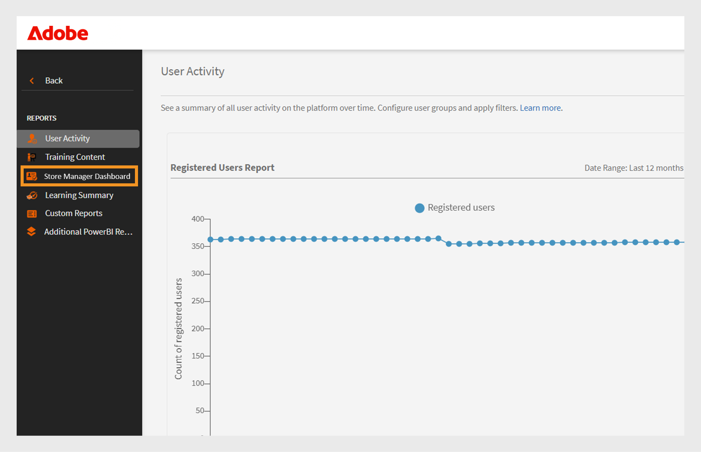

# 组成功信息板

## 组成功信息板概述

Adobe Learning Manager中的组成功信息板(GSD)允许管理员和经理跨部门或用户组近乎实时地监控学习者进度（从注册、进度或完成到在信息板中反映延迟60分钟）。 它支持主动追踪课程完成、注册和待处理操作，从而更轻松地为团队管理学习。 查看此[文章](/help/migrated/administrators/feature-summary/add-users-user-groups.md)，了解有关用户组的更多信息。

## 关键用例

组成功信息板提供以下功能：

* **简化了学习者进度跟踪**：组成功仪表板提供了学习者数据的友好、实时视图，从而减少了基于Excel的成绩单需求。 经理和管理员可以快速查看学习者注册和课程进度，以支持关键场景，例如：

   * **绩效考核准备情况**：经理可以在评估周期之前为团队成员评估课程进度。
   * **合规性监控**：识别尚未完成必修培训的学习者。
   * **团队级跟踪**：特许经营、商店或区域经理可确保其团队按时完成所需的学习。

* **方便团队管理**：对于拥有小型团队（50人以下）的经理，如商店经理、加盟经理、经销商经理或内部团队，组成功信息板非常有用。 它提供了团队视图，使经理可以快速查看其团队是否完成了达成业务目标所需的课程集。

## 如何使用组成功信息板

管理员可以为信息板指定名称、选择用户组并选择课程或学习路径，从而启用和创建信息板。 可以与其他管理员或经理共享仪表板。

### 启用组成功信息板

管理员必须为帐户启用组成功信息板。 要启用组成功信息板，请执行以下步骤：

1. 以管理员身份登录。
2. 选择&#x200B;**[!UICONTROL 设置]**&#x200B;然后选择&#x200B;**[!UICONTROL 报表]**。
3. 选择&#x200B;**[!UICONTROL 仪表板可见性]**&#x200B;切换。
4. 键入仪表板名称（例如，**[!UICONTROL 商店经理仪表板]**）。
   
   _仪表板名称、用户组和学习路径选择的字段_
5. 选择&#x200B;**[!UICONTROL 概述可见性]**&#x200B;以在仪表板中启用概述部分。 您可通过此部分查看最多50名学习者的进度。
6. 对于&#x200B;**[!UICONTROL 学习者成绩单]**&#x200B;部分，请选择您想要查看的所需列。

   * 学习者无法注册此类课程。
   * 路径和课程
   * 状态
   * 注册日期
   * 最近访问日期
   * 完成日期

启用此功能后，管理员可以在&#x200B;**[!UICONTROL 报告]**&#x200B;部分中查看组成功信息板。

### 创建组成功信息板

管理员最多可创建100个信息板以查看学习者的进度。 要创建仪表板，请执行以下步骤：

1. 以管理员身份登录并选择&#x200B;**[!UICONTROL 报告]**&#x200B;页面。

   
   _在管理员主页中选择报告_

2. 选择“组成功”仪表板。 仪表板名称为&#x200B;**[!UICONTROL 存储管理器仪表板]**。

   
   _选择商店经理仪表板_

   >[!NOTE]
   >
   >启用组成功信息板时设置的名称将显示为信息板名称。

3. 从“选择仪表板”下拉列表中选择&#x200B;**[!UICONTROL 创建新仪表板]**。

   
   _选择创建GSD的选项_

4. 键入仪表板的名称。
5. 选择要显示在仪表板中的用户组。
6. 搜索课程或学习路径并从结果中选择它们。

   
   _选择用户组和课程_

7. 选择&#x200B;**[!UICONTROL 创建仪表板]**。

对于大型团队，请在&#x200B;**[!UICONTROL 学习者成绩单]**&#x200B;选项卡中选择&#x200B;**默认目录**&#x200B;和&#x200B;**所有学习者**&#x200B;用户组来创建信息板。 其中包括&#x200B;**[!UICONTROL “学习者成绩单”]**&#x200B;视图中的所有课程和学习者，可以更轻松地搜索和跟踪每个学习者的进度。

### 查看组成功信息板

创建信息板后，管理员可以按照以下步骤查看信息板：

1. 以管理员身份登录。
2. 选择&#x200B;**[!UICONTROL 报告]**，然后选择&#x200B;**[!UICONTROL 组成功仪表板]**。
仪表板名称为“商店经理仪表板”。
3. 在&#x200B;**[!UICONTROL 您的仪表板]**&#x200B;部分中，从&#x200B;**[!UICONTROL 选择仪表板]**&#x200B;下拉菜单中选择创建的仪表板。
4. 仪表板分为：
   * **[!UICONTROL 概述]**：您可以快速查看学习者在各个课程或学习路径上的进度。 您可以同时查看最多50个课程或学习路径的进度，以及50个学习者。 如果要查看特定学习者的进度，请选择&#x200B;**[!UICONTROL 学习者成绩单]**&#x200B;部分。

   
   _商店经理团队中学习者的学习状态_

   * **[!UICONTROL 学习者成绩单]**：通过选择特定的学习者或课程查看学习者进度。 在信息板中搜索学习者以查看其学习进度。 如果您已使用默认目录创建信息板并包含所有学习者，则可以搜索任何学习者以轻松查看其进度。

   
   _包含注册和完成列的详细学习者成绩单视图_

>[!NOTE]
>
>若要下载详细的学习者成绩单，请在&#x200B;**[!UICONTROL 学习者成绩单]**&#x200B;选项卡中选择&#x200B;**[!UICONTROL 转到报告]**。

### 共享组成功信息板

管理员可以与其他管理员或经理共享信息板。 按照以下步骤共享信息板：

1. 选择&#x200B;**[!UICONTROL 报告]**，然后选择&#x200B;**[!UICONTROL 组成功仪表板]**。 仪表板名称为&#x200B;**[!UICONTROL 存储管理器仪表板]**。
2. 在&#x200B;**[!UICONTROL 您的仪表板]**&#x200B;选项中选择&#x200B;**[!UICONTROL 共享]**。

   
   _选择“共享”按钮_

3. 按名称搜索用户或用户组并选择它们。

   
   _与用户或用户组共享仪表板_

4. 选择“**[!UICONTROL 继续]**”以共享仪表板。

您可以在&#x200B;**[!UICONTROL 报告]**&#x200B;下查看共享仪表板详细信息，选择&#x200B;**[!UICONTROL 组成功仪表板]** （商店经理仪表板），然后选择&#x200B;**[!UICONTROL 共享仪表板]**。

_查看共享仪表板_

>[!NOTE]
>
>经理或自定义管理员只能看到由管理员共享的组成功信息板上的已启用目录。

### 组成功信息板的限制

以下是组成功信息板的限制：

* 仪表板中不支持循环证书。
* **[!UICONTROL 学习者成绩单]**&#x200B;选项卡中的&#x200B;**[!UICONTROL 上次访问日期]**&#x200B;列当前显示学习路径和认证的数据。 计划在将来的更新中支持课程。

## 跨多个用户组选择学习者

当您选择多个用户组时，Adobe Learning Manager会使用特定规则来确定应包含哪些学习者：

* **具有相同活动字段的用户组**：如果用户组使用相同的字段（例如，位置），则系统包含来自两个组的所有学习者。 那个把数值合并起来。 例如： **Location = Bangalore**&#x200B;和&#x200B;**Location = Chennai**。 其中包括来自两个地点的学习者。
* **具有不同活动字段的用户组**：如果用户组使用不同的字段（例如，位置和角色），则系统仅包含符合所有条件的学习者。 例如： **Location = Bangalore或Chennai**&#x200B;和&#x200B;**Role = Manager**。 其中仅包括担任经理职务且位于班加罗尔或钦奈的学习者。

**摘要：**

* 相同的活动字段：学习者被组合（或逻辑）
* 不同活动字段：学习者必须符合所有条件（AND逻辑）

此方法可帮助您根据所选条件确定合适的学习者。
