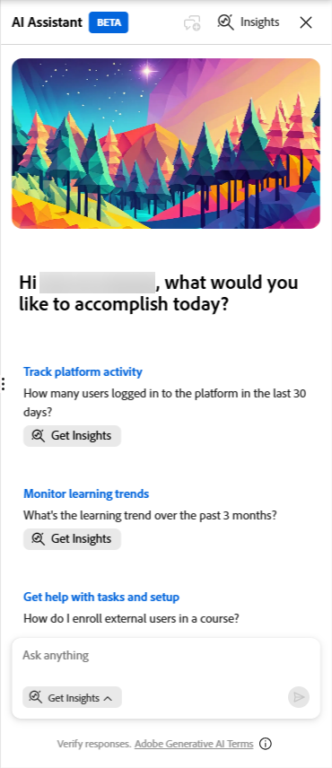

# 什么是Insights代理

Insights代理是Adobe Learning Manager中一项由AI支持的功能，管理员可使用自然语言查询学习数据。 无需下载报告和处理电子表格，只需键入一个问题，如“过去3个月在帐户中创建了多少课程？ 提供月度报告。”，Insights客服专员将直接检索并显示数据。 您可以用文本、项目符号或表格式查看结果，也可以用CSV文件格式下载结果。

Insights Agent旨在减少从提出数据问题到获得答案的步骤。 当前依赖Excel数据透视、BI团队或多个组合报告的管理员可以使用Insights代理更快地获得答案。

## Insights客服专员可以做些什么

您可以使用Insights代理执行以下操作：

- 按区域、部门或用户组检查完成情况和合规性指标
- 分析课程或学习路径的注册趋势
- 查看特定课程或学习路径的进度数据

每个查询都会返回一个格式化表或可下载的CSV文件，以及关于如何计算结果的浅显语言说明。

## Data Insights代理不支持的功能

以下数据类型不在此版本的范围内：

- 反馈和调查数据
- 游戏点数和徽章
- 审核历史记录和更改日志

引用这些数据类型的查询将不会返回结果。 例如，“上一季度奖励了多少个游戏点数？” 或“哪些学习者已获得合规性徽章？” 将返回错误或不完整的数据。

## Insights代理的工作原理

当您输入问题时，Insights客服专员会分四个阶段处理它：

1. **解释**：代理会分析您的问题以确定需要什么数据。 如果问题的任何部分不明确，客服专员在继续操作之前会向您询问澄清问题

2. **方法**：代理描述了查找您的答案的步骤。 本节帮助您验证数据是否按预期方式检索，特别是对于复杂查询。

3. **结果**：代理根据结果的性质，以文本、项目符号或表格形式呈现您的数据。 结果中包含简单明了的摘要。 当结果包含50行或更少行时，摘要将包含有关数据的分析见解。 当结果包含50行以上时，摘要将提供列级统计信息。

4. **下载**：您可以将结果下载为CSV文件。 大型报告可能需要额外的时间；代理会在文件准备就绪时通知您。

**方法**&#x200B;部分对于复杂查询特别有用。 它显示了客服专员使用的逻辑，类似于BI分析师在手动运行查询时解释的逻辑。 查看该方法有助于在操作之前确认输出是否可靠。

## 使用Insights代理提出问题

使用Adobe Learning Manager中的Insights代理查询包含纯语言问题的学习数据，并以文本、表格或可下载CSV文件的形式获得结果。

管理员可从Learning Manager的AI Assistant面板中使用见解代理。 面板可以调整大小。 您可以对其进行扩展，以便更易于阅读。 默认情况下，当您打开面板时，将选择&#x200B;**获取Insights**&#x200B;模式。 另外，还提供了一个单独的&#x200B;**学习**&#x200B;模式用于回答有关如何使用该产品的指导性问题。 **学习**&#x200B;模式回答有关如何使用Learning Manager的指导性问题。 例如，“如何创建学习路径？” 它不查询学习者数据。

### 提出问题

默认选择&#x200B;**获取Insights**&#x200B;模式后，您可以立即开始查询学习数据，无需在每次访问助理时调整模式。 但是，如果您切换到&#x200B;**学习**&#x200B;模式来提出指导性问题，请确保在提交查询之前重新选择&#x200B;**获取Insights**。

1. 选择Learning Manager中的AI Assistant图标以打开“助理”面板。 默认情况下，**获取Insights**选项已处于选中状态。
   

2. 在文本字段中输入问题。 使用纯语言。 例如： **过去3个月创建了多少门课程？**

3. 选择&#x200B;**发送**&#x200B;或按&#x200B;**Enter**&#x200B;以提交您的问题。

### 查看回复

提交您的问题后，Insights客服专员会处理您的请求，并返回最多包含四个部分的答复：

1. **消除歧义（如果需要）：**如果您的问题包含不明确的术语，例如“学习活动”、“绩效”或“提供过去3个月的绩效数据”，则助理会显示选项列表，并要求您在继续操作之前选择一个选项。 选择与您要查找的内容最匹配的选项。 在最初的问题之后，您无法键入其他说明。 在使用查询界面启动新查询之前，从提供的选项中选择是唯一可用的交互。 您只能通过从提供的选项中进行选择来响应消除歧义；此版本中未提供自由文本跟进。
   

2. **方法：** **方法**&#x200B;部分介绍了代理检索数据时采取的步骤。 该面板在问题下方显示为可滚动面板。 选择“展开”图标以查看完整方法。 查看本节可帮助您确认逻辑是否与您的意图相匹配，特别是对于复杂查询。 例如，如果您要求“去年注册的所有学习者”，客服专员可能会返回每个学习者最近的注册，而不是每个注册记录。 **方法**部分说明了代理在检索数据时做出的决定。 如果逻辑与您的意图不符，请使用更具体的术语开始新查询。
   

3. **结果：** Insights代理以文本或表形式生成结果。 对于最好以表格格式解释的数据点，Insights代理会返回一个表。 Insights代理不生成图表或图形。 要可视化数据，请下载CSV并在您首选的工具中将其打开。 结果中包含简单明了的摘要。 当结果包含50行或更少行时，摘要将包含有关数据的分析见解。 当结果包含50行以上时，摘要将提供列级统计信息。 例如，“哪些课程的注册人数不少于过去1年创建的5名，哪些课程是作者？”
   

响应包含以下摘要：

***摘要***

- *匹配的课程：102*
- *注册计数范围：24到2019*
- *每个匹配课程的平均注册数：589.6*
- *每个匹配课程的中值注册数：553.5*

*导出准备就绪后，将提供完整报告的下载链接。*

>[!NOTE]
>
>摘要的格式因数据的性质而异。 以下是摘要响应的一个示例。 实际摘要将因查询而异。

>[!NOTE]
>
>Insights Agent是概率代理。 如果同一查询运行两次，则响应短语或结果排序可能会略有不同。

### 下载报告

选择&#x200B;**下载报告**&#x200B;以将结果导出为CSV文件。 对于大型结果集，下载可能需要额外的时间。 当文件准备就绪时，代理会显示一条消息；您也会收到通知。

## 启动新查询

每个Insights客服专员会话一次只能处理一个问题。 在查看结果后，选择&#x200B;**新问题**&#x200B;以询问其他问题。 如果想放弃当前查询并重新开始，还可以随时选择&#x200B;**新建聊天**，包括在收到响应之前。 您不能在同一会话中键入跟进问题，也不能让客服专员根据返回的结果进行优化或展开。

>[!TIP]
>
>如果要浏览相关数据，请启动一个新的查询，其中包含您从第一个查询中学到的内容。 例如，在查看按区域列出的登记合计之后，开始一个新查询，以深入了解表现不佳的区域。

## 提出反馈

每次响应后，选择拇指向上或拇指向下图标对结果进行评分。 您还可以指定输出是否不准确、难以理解或返回所用时间过长。 此反馈有助于逐渐改善客服专员。

## 最佳实践

- 从一个具体的问题开始，而不是一个宽泛的问题。 “北美用户组的安全培训课程完成率是多少？” 返回比“显示完成数据”更有用的结果。
- 命名内容和学习者组时，请使用准确的Adobe Learning Manager术语。 查询编写指南列出了要使用的正确术语。
- 如果客服专员询问澄清问题，请将其作为下次优化原始查询的信号。 您的问题越具体，所需的说明就越少。
- 在操作结果以确认代理的逻辑与您的意图相符之前，请查看&#x200B;**方法**&#x200B;部分。
- **指定是包含还是排除轮候学习者**。 默认情况下，注册计数查询包括轮候表上的学习者以及已确认的有效注册。 如果仅需要活跃参与者，请在查询中明确排除轮候学习者。 例如：“除了轮候学习者外，有多少学习者直接注册了安全培训课程？” 客服专员将在“方法”部分中披露已应用此排除。 如果没有此说明，注册总数可能包括相当大比例的轮候学习者尚未开始内容。
- **直接和间接注册计数**：当您查询课程或学习路径的注册或完成数据时，Insights代理会区分直接注册（专门注册该课程或学习路径的学习者）和间接注册（在学习路径或认证中访问相同内容的学习者）。 如果您专门要求直接或间接注册，客服专员将返回每种类型的正确计数。 如果您的查询没有直接或间接指定，客服专员可能会返回合并计数。 要获取分隔计数，请在查询中明确包含区分。 例如：“直接注册还是间接注册安全培训课程，有多少学习者？”

## Insights客服专员与Report Builder的差异

这两种功能使用相同的基础学习数据，但作用不同。 Insights客服专员可对话。 你描述你想要什么，客服专员就会拿到。 Report Builder结构化。 可以选择数据集、列和筛选器来构建可重复使用的报告。

| **用例** | **推荐** |
|---|---|
| 快速提出数据问题 | Insights代理 |
| 在不了解架构的情况下浏览数据 | Insights代理 |
| 构建结构化、可重复的报告 | Report Builder |
| 使用自定义连接合并多个数据集 | Report Builder |
| 计划报告订阅 | Report Builder |
| 将数据集与自定义联接或高级数据建模相结合 | Report Builder |

## 为Insights客服专员编写有效的查询

查询的质量直接影响Insights客服专员返回结果的质量。 格式良好的查询包括三个要素：上下文（例如）内容、学习者、范围（例如，状态、时间范围和用户状态）和列（例如，您希望在输出中显示的确切字段）。 了解如何使用正确的术语、查询结构和示例查询作为起点。

### 由三部分组成的查询公式

每个有效的Insights代理查询都包含以下三个组件：

| **组件** | **什么可能意味着** | **示例** |
|---|---|---|
| **上下文** | 您正在询问的内容和学习者 | “……位置101中面向销售助理学习者的新员工入门培训学习路径……” |
| **作用域** | 注册状态、时间范围和用户状态 | “……在过去90天内已注册但尚未完成的人员……” |
| **列** | 输出中所需的每个字段 | “……显示姓名、电子邮件、位置和注册日期” |

缺少其中任何一种成分可能导致不明确的结果或试剂的澄清问题。

### 使用正确的ALM条款

Insights代理会将您的查询与Adobe Learning Manager的数据模型匹配。 使用错误的术语可能会返回不正确或没有结果。 使用下面左栏中的术语。

| **使用此术语** | **不是** |
|---|---|
| **学习路径** | 计划/轨道/课程 |
| **课程** | 模块/课程/课程 |
| **认证** | 徽章/证书 |
| **学习者** | 学生/员工 |
| **会话** | 课程/计划日期 |
| **用户组** | 团队/部门/同类群组 |
| **活动字段** | 自定义字段/属性 |
| **注册** | 登记/转让 |
| **完成** | 已完成/完成/通过 |
| **目录标签** | 类别/标记组 |

Insights Agent不区分大小写，但精确术语匹配可提高准确性。

### 定位内容

提供内容锚点可帮助客服专员了解要查看哪些学习项目。 您可以通过以下任一方式定位：

| **锚点类型** | **示例** |
|---|---|
| 姓名 | “……新员工入门培训学习路径” |
| 目录 | “……入门目录中的所有学习路径” |
| 目录标签 | “……目录标签区域=北方的全部课程” |
| 标签 | “……所有已标记为‘合规性’的课程” |
| 技能 | “……所有映射到客户服务技能的课程” |
| 合规性标签 | “……所有带有合规性标签的认证” |
| 内容类型 | “……所有已发布的课程”/“……所有认证” |

### 定位学习者

如果查询与学习者相关，请使用以下方法之一：

- **活动字段值** — “活动字段职称=销售助理的学习者”或“活动字段位置= 101的学习者”
- **用户组** — “Sales Associates用户组中的学习者”
- **讲座** — “已注册6月15日工作场所安全课程的学习者”

### 定义范围

忽略范围细节可能会导致比预期更广泛的结果。

| **作用域类型** | **选项** |
|---|---|
| 注册状态 | 已注册/已完成/未注册/逾期 |
| 时间范围 | 所有时间/过去30天/过去90天/特定日期范围 |
| 用户状态 | 仅限活动用户（默认）/为非活动用户添加“包括已删除的用户” |

### 为每个输出列命名

如果您未指定列，则Insights代理会为您选择这些列。 为输出中所需的每个字段命名。

| **模糊** | **特定** |
|---|---|
| “显示库位编号” | “对于每个位置：学习者总数、已注册计数、未注册计数” |
| 显示完成率 | “对于每个学习路径：名称、已注册总数、已完成总数、完成百分比” |
| “让我看看谁失败了” | “显示失败的学习者的姓名、电子邮件、课程名称和完成状态” |

### 查询示例

使用这些作为起点。 通过替换适用于您的帐户的内容名称、用户组和时间范围来调整它们。

**完成和合规**

- “北美用户组的安全培训课程完成率是多少？”
- “显示所有合规性课程按用户组的完成率。 包括用户组名称、已注册总数、已完成总数和完成百分比。”
- “如果活动字段“职务”为“VP”，则所有学习者的合规率是多少？”

**注册分析**

- “有多少学习者按位置注册了新员工入门培训学习路径？”
- “按区域显示过去90天的注册人数。 包括区域名称和注册计数。”
- “列出所有已注册安全生产课程但尚未完成的学习者 — 包括姓名、电子邮件和注册日期。”

**计划和课程进度**

- “领导力发展学习路径的完成状态细分是多少？显示已完成、进行中和未开始计数？”
- “上个月有多少学习者完成了数据隐私课程？”

**组织视图**

- “显示所有符合性类型标签认证的完成率，按部门分组。 包括部门名称、总注册人数和完成比例。”
- “过去30天按地区列出的注册分布情况如何？”

### 要避免的常见错误

| **避免** | **改为执行此操作** |
|---|---|
| 无内容锚点（“显示全部内容”） | 为特定路径、课程、目录、标签或技能命名 |
| 模糊指标（“为什么完成率低？”） | 问一个可衡量的问题：“按位置划分，哪些学习路径的完成率低于30%？” |
| 未指定用户状态 | 明确添加“仅限活动用户”或“包含已删除的用户” |
| 询问预测 | 询问当前数据显示哪些内容，而不是将发生什么 |
| 询问不支持的数据（反馈、技能、徽章） | 使用报告部分中的现有报告 |
| 在一个查询中提出多个问题（“按区域显示注册并列出未完成安全培训的人员”） | 每个查询询问一个重点问题。 客服专员只能回答复合查询的一部分，不能保证其余部分得到处理。 |

## 版本中的限制

**不支持在非拉丁语脚本中提交的查询**

Insights客服专员支持以英语和拉丁字母语言（如法语和西班牙语）编写的查询。 无法处理使用非拉丁语脚本（包括日语、中文、阿拉伯语、韩语、印地语和俄语）提交的查询，客服专员会显示一条消息，指示无法完成查询。 如果您使用其中一种语言提交查询，请启动新查询并使用英语重新设置其短语。
