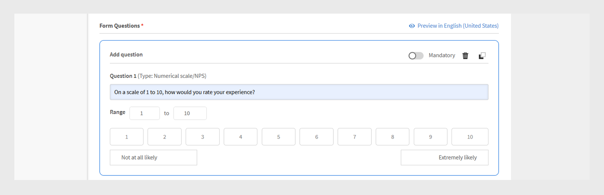

# L1反馈表单

>[!IMPORTANT]
>
>增强的L1反馈功能正在向部分客户推出。 如果您的帐户中未看到此功能，请查看[添加L1和L3反馈](/help/migrated/administrators/feature-summary/courses.md#add-l1-and-l3-feedback)，了解有关现有反馈功能的更多信息。
>
>请联系您的客户成功经理(CSM)团队，以启用新的反馈系统并了解迁移时间线。

学习者可以在完成课程或学习路径后，利用Adobe Learning Manager中的级别1 (L1)反馈功能，共享其反馈。 此反馈可帮助管理员评估课程质量、讲师效果和整体学习体验。

管理员现在可以创建和管理多个可重复使用的反馈表单，并将它们分配给特定的课程和学习路径。

该功能允许管理员：

* 创建可重复使用的反馈表单
* 自定义不同课程或学习路径的反馈
* 根据需要分配定制的表单

**[!UICONTROL L1反馈报告]**&#x200B;和&#x200B;**[!UICONTROL 反馈报告]**（自定义报告）现在包含两个新列：反馈表单名称和反馈版本。 这些列提供有关使用的反馈表单的详细信息。

## 创建L1反馈表单

管理员可以在帐户级别创建多个L1反馈表单，并为课程、学习路径或认证分配正确的表单。

要创建L1反馈表单，请执行以下操作：

1. 以管理员身份登录Adobe Learning Manager。
2. 选择&#x200B;**[!UICONTROL 反馈表单]**。

   
   _显示“反馈表单”选项的管理员主页，用于创建和管理反馈表单_
3. 选择&#x200B;**[!UICONTROL 添加表单]**。

   
   _反馈表单屏幕，显示“添加表单”按钮以创建反馈表单_
4. 选择&#x200B;**[!UICONTROL 默认模板语言]**，然后选择&#x200B;**[!UICONTROL 保存]**。

   
   _添加新模板提示，显示选择默认语言的选项_
5. 键入表单标题和说明。

   
   _添加反馈表单页面，显示选项键入“表单标题”和“表单说明”_
6. 从&#x200B;**[!UICONTROL 添加问题]**&#x200B;菜单中，从以下选项中选择问题类型：

   a. **[!UICONTROL 自由文本]**：允许学习者使用自己的语言提供答案。

   * 在&#x200B;**[!UICONTROL 问题]**&#x200B;文本字段中键入您的问题。
   * 要将问题设为必填，请选择&#x200B;**[!UICONTROL 必填]**切换开关。
     
     _向反馈表单中添加自由文本问题_

   b. **[!UICONTROL 数值等级/NPS]**：学习者可以使用数值等级（通常为1至10）评定课程满意度或推荐课程的可能性。

   * 在&#x200B;**[!UICONTROL 问题]**&#x200B;文本字段中键入您的问题。
   * 选择评分范围（1至10）。
   * 要将问题设为必填，请选择&#x200B;**[!UICONTROL 必填]**切换开关。
     \
     _向反馈表单添加数字/NPS比例问题_

   c. **[!UICONTROL 李克特量表]**：学习者可以指定自己对陈述的同意程度，从“强烈不同意”到“强烈同意”。

   * 在&#x200B;**[!UICONTROL 问题]**&#x200B;文本字段中键入您的问题。
   * 要将问题设为必填，请选择&#x200B;**[!UICONTROL 必填]**切换开关。
     
     _向反馈表单添加Likert比例问题_

   d. **[!UICONTROL 课程效果分数]**：使用相对评分系统衡量课程对学习者影响程度的比率。

   * 反馈表单中将添加一个李克特评分为1至10的预定义问题。
   * 您只能添加一个&#x200B;**[!UICONTROL 课程效果分数]**问题，且无法编辑
     
     _向反馈表单添加课程效果分数问题_
7. 选择&#x200B;**[!UICONTROL 保存]**。 您可以在反馈Forms部分中查看创建的表单。

### 预览反馈表单

您可以通过选择“预览英语（美国）”来预览反馈表单。 如果您创建了多种语言的表单，您还可以使用每种语言预览表单。 查看此[部分](/help/migrated/administrators/feature-summary/l1-feedback-form.md#add-feedback-forms-in-other-languages)，了解如何添加其他语言的反馈表单。

_反馈表单屏幕，显示“预览”选项，可按默认语言查看反馈表单_

### 添加其他语言版本的反馈表单

在反馈表单中用多种语言为问题创建翻译。 但是，您只能添加或删除使用默认语言（如英语）的问题。 对于其他语言，您只能翻译最初以默认语言添加的问题。 无法在已翻译版本中直接添加或删除问题。

1. 在反馈表单中选择&#x200B;**[!UICONTROL 添加新语言]**。

   
   _向反馈表单添加新语言版本_
2. 选择所需语言，然后选择&#x200B;**[!UICONTROL 保存]**。
3. 导航到所添加语言的选项卡。
4. 选择每个问题旁边的&#x200B;**[!UICONTROL 翻译]**&#x200B;以添加您的翻译。

   
   _反馈表单屏幕，显示“翻译”选项，可将问题翻译为相应的语言_

   >[!NOTE]
   >
   >课程效果分数问题会自动转换。

5. 添加翻译后，选择&#x200B;**[!UICONTROL 保存]**。

## 将反馈表单设置为默认表单

管理员可以为自学课程、教室课程、虚拟教室课程和混合课程建立默认反馈表单。 配置完成后，学习者完成课程后，会自动看到此默认表单。 除非管理员为特定课程分配不同的反馈表单，否则此默认表单会应用于所有课程。

_反馈表单屏幕显示选项，用于设置默认反馈表单_

## 配置学习者反馈设置

管理员可以在“学习者反馈”部分中配置以下设置：

* **[!UICONTROL 启用表单以捕获学习者对此课程的反馈]**：启用此选项以收集学习者对该课程的反馈。 启用后，学习者将在完成课程后收到提供反馈的提示。
* **[!UICONTROL 表单设置]**：启用后，学习者完成课程后会自动打开反馈表单，方便学习者及时收集反馈。

_显示学习者反馈设置的“学习者反馈”屏幕_

>[!NOTE]
>
>课程实例使用课程级别的默认反馈表单。 创建新实例时，还使用课程级别的默认表单，而不是帐户级别。

### 更改课程的默认反馈形式

默认反馈表单适用于所有课程。 作为管理员，您可以创建一个新表单，也可以从现有列表中选择一个。 要更改默认反馈表单，必须为此课程启用学习者反馈。

要更改默认反馈表单，请执行以下操作：

1. 在管理员主页上选择&#x200B;**[!UICONTROL 课程]**。
2. 在&#x200B;**[!UICONTROL 课程]**&#x200B;部分中选择任何课程。
3. 选择&#x200B;**[!UICONTROL 查看课程]**，然后选择&#x200B;**[!UICONTROL 学习者反馈]**。

   
   _学习者反馈屏幕显示“编辑”选项以更改表单_
4. 在&#x200B;**[!UICONTROL 学习者反馈]**&#x200B;部分选择&#x200B;**[!UICONTROL 编辑]**。
5. 选择&#x200B;**[!UICONTROL 更改表单]**。

   
   _学习者反馈屏幕显示“更改表单”选项，可用于更改课程的反馈表单_
6. 从菜单中选择其他反馈表单或选择&#x200B;**[!UICONTROL 从空白表单开始]**&#x200B;以创建一个新表单。

   
   _添加一个表单屏幕，显示从可用模板中选择或创建新表单的选项_
7. 选择&#x200B;**[!UICONTROL 保存]**&#x200B;以应用更改。

如果课程使用默认反馈表单并在帐户级别更新默认表单，则所有此类课程都会自动反映新表单。 但是，如果管理员在课程级别更改表单或分配新表单，未来对默认表单的更改不会影响该课程的反馈表单。

该实例将使用课程级反馈表单作为默认值。 如果管理员在课程级别更改反馈表单，则不会影响已在实例级别设置的表单。 但是，在更改后创建的任何新实例默认情况下都将使用更新后的课程级别反馈表单。

按照相同的步骤更改学习路径的默认反馈表单。

>[!NOTE]
>
>如果不更改表单，课程将使用默认反馈表单。

