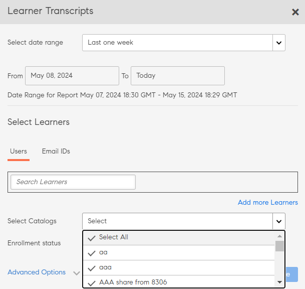

# 学习者成绩单

使用 Adobe Learning Manager 下载学习者成绩单并管理报告。

公司的管理员可通过 Adobe Learning Manager 生成与学习者相关联的成绩单。

## 生成学习者成绩单 {#generatelearnertranscripts}

1. 若要生成学习者成绩单，请单击管理员登录左侧窗格中的&#x200B;**[!UICONTROL 报告]**。

   管理员导航到&#x200B;**[!UICONTROL 报告]**&#x200B;页面内的&#x200B;**[!UICONTROL 自定义报告]** > **[!UICONTROL Excel报告]**&#x200B;选项卡。

1. 单击链接&#x200B;**[!UICONTROL 学习者成绩单]**。

   显示&#x200B;**[!UICONTROL 学习者成绩单]**&#x200B;历史记录页面，并显示以下消息： **尚未生成任何学习者成绩单**，或者显示“学习者成绩单”历史记录页面实施后触发的下载列表。

   <!---->

   此时会显示学习者成绩单对话框。选择要在其中生成成绩单的日期范围。

   >[!NOTE]
   >
   >默认情况下，“开始日期”是学习者的注册日期，“结束日期”始终是当前日期。 您仅可以修改所需数据的起始日期。

1. 从&#x200B;**[!UICONTROL 选择学习者]**&#x200B;字段中选择学习者姓名，然后单击&#x200B;**[!UICONTROL 生成]。**
1. 您可以选择单个学习者或一组学习者。若要添加多个学习者，请单击&#x200B;**[!UICONTROL 添加更多学习者]**。

   

   *添加更多学习者*

1. 您可以通过启用复选框来选择特定目录。 仅下载指定目录的成绩单。 您可以通过从&#x200B;**[!UICONTROL 选择目录]**&#x200B;下拉列表中选择目录来选择特定目录。

   

1. 导出学习者成绩单时，会有一个&#x200B;**[!UICONTROL 注册状态]**&#x200B;的选项。 此下拉菜单包含以下选项：

   * 全选
   * 已完成
   * 正在进行
   * 未开始
   * 未注册

   

   *选择目录*

1. 您还可以为已从帐户中删除的学习者下载成绩单。

   若要下载已删除用户的学习者成绩单，请单击&#x200B;**[!UICONTROL 高级选项]**&#x200B;箭头，然后启用&#x200B;**[!UICONTROL 包含已删除学习者的数据]**&#x200B;复选框。

   

   *下载已删除学习者的学习者成绩单*

1. 您可以通过启用“**[!UICONTROL 启用模块级别信息]**”复选框来选择在学习者成绩单中下载模块级别信息。 如果启用此选项，则会提取相关模块名称和每个模块所花费的时间，并显示在成绩单中。
1. 您可以通过启用“**[!UICONTROL 包括技能数据和摘要表]**”复选框来选择下载技能数据和摘要表。

   如果未包含技能数据，则会生成成绩单并将其作为.zip文件下载到您的计算机。 如果启用了技能数据复选框，则会生成成绩单并将其作为 .xls 文件下载。

## 使用复制粘贴功能生成学习者成绩单

由于一次只能为一个学习者或用户组获取学习者成绩单，以致整个提取过程变得繁琐而冗长。 在此，您可以使用复制粘贴功能，复制学习者电子邮件 ID 列表并一次性粘贴。

1. 以&#x200B;**[!UICONTROL 管理员]**&#x200B;或&#x200B;**[!UICONTROL 经理]**&#x200B;的身份登录。
1. 转到&#x200B;**[!UICONTROL 管理]**&#x200B;下的&#x200B;**[!UICONTROL 报告]**，它将加载&#x200B;**[!UICONTROL 用户活动]**&#x200B;页面。
1. 单击左侧窗格中的&#x200B;**[!UICONTROL 自定义报告]**，然后从列表中选择&#x200B;**[!UICONTROL 学习者成绩单]**。
1. 在&#x200B;**[!UICONTROL 学习者成绩单]**&#x200B;页面，单击左上角的&#x200B;**[!UICONTROL 生成新报告]**&#x200B;按钮。
1. 在&#x200B;**[!UICONTROL 选择日期范围]**&#x200B;下拉列表中单击以选择所需日期。 单击&#x200B;**[!UICONTROL 电子邮件ID]**&#x200B;选项卡以输入复制的唯一电子邮件ID列表。

   

   *复制粘贴电子邮件ID*

1. 使用&#x200B;**[!UICONTROL 验证电子邮件ID]**&#x200B;验证输入的ID是否正确。

   

   *验证电子邮件ID*

   如果输入的电子邮件 ID 不正确，系统会以红色高亮显示并显示如上验证消息。

   除非输入的所有电子邮件ID均正确，否则“**[!UICONTROL 生成]**”按钮将不可用。

   

   *生成学习者成绩单*

1. 单击&#x200B;**[!UICONTROL 生成]**&#x200B;按钮，为所有涉及的电子邮件ID生成学习者成绩单。 您将收到如下确认消息，说明生成报表。

   

   *正在生成报告的确认消息*

   可以针对&#x200B;**[!UICONTROL 用户]**&#x200B;和&#x200B;**[!UICONTROL 电子邮件ID]**&#x200B;选项卡下输入的电子邮件ID，组合生成学习者成绩单。

## 学习者成绩单下载历史记录 {#ltdownload}

在&#x200B;**[!UICONTROL “学习者成绩单”]**&#x200B;下载页面，要生成报告，请单击&#x200B;**[!UICONTROL “生成新报告”]**&#x200B;按钮，将显示“学习者成绩单”对话框。

*生成所有学习者成绩单的报告*

单击&#x200B;**[!UICONTROL 高级选项]**&#x200B;并展开面板。

选择用户及其所属目录。 单击&#x200B;**[!UICONTROL “生成”]**&#x200B;按钮后，将显示一个对话框，提示下载报告大约需要的时间。要生成报告，单击&#x200B;**[!UICONTROL “生成”]**。

*选择“生成”按钮*

系统会在后台生成成绩单，您可在 Adobe Learning Manager 中继续执行任务。成绩单生成后，您可从列表中下载成绩单。

管理员可查看系统中任何人生成的所有成绩单。

*查看下载历史记录*

下载列表显示以下属性：

* **学习者：**&#x200B;待下载成绩单所属的学习者/学习者群组。
* **包含的其他数据：**&#x200B;取决于管理员要从“添加学习者成绩单”模块的“高级”选项中下载的其他数据
* **状态：**&#x200B;已下载、已排队或进行中。
* **开始时间**&#x200B;和&#x200B;**结束时间**：待下载成绩单的起止时间。
* **已应用过滤器：**&#x200B;是否已对“注册状态”应用过滤器。
* **生成者：**&#x200B;请求下载的Learning Manager用户的用户ID。
* **状态：**&#x200B;已下载、已排队或进行中。

您可以随时取消下载。如果管理员取消作业，Adobe Learning Manager 会向触发学习者成绩单的用户发送应用内通知。

*学习者成绩单下载队列*

您可以随时&#x200B;**取消**&#x200B;下载。 如果作业被取消，Learning Manager会向取消作业的用户发送应用程序内通知。

## 已删除学习者的数据 {#dataofdeletedlearners}

您可在“学习者成绩单”列表中包含已删除学习者的数据。 在“学习者成绩单”对话框中，启用&#x200B;**[!UICONTROL 包含已删除学习者的数据]**&#x200B;选项。

启用该选项并单击&#x200B;**[!UICONTROL “生成”]**&#x200B;后，“学习者成绩单”下载页面中已删除学习者的数据功能如下所示：

*查看已删除学习者的数据*

## 自定义列 {#customize-columns-lt}

管理员可以自定义在“学习者成绩单”报告中导出的列。 管理员、自定义管理员和经理可以在导出报告之前配置列。

在&#x200B;**[!UICONTROL 学习者成绩单]**&#x200B;对话框中，单击&#x200B;**[!UICONTROL 高级选项]**。 在&#x200B;**[!UICONTROL 配置导出格式]**&#x200B;部分，选择要导出的列。

*自定义要导出的列*

仅当用户下载 .CSV 格式的“学习者成绩单”时，才允许自定义。 以 .XLSX 格式下载时，系统会忽略所选的列首选项，并导出所有默认列。

## 学习者成绩单文件内容 {#learnertranscriptfilecontent}

典型的学习者成绩单文件在单个文件中包含六张表。在学习者成绩单中可总览各类数据，包括每个课程已登记的学习者数量、学习者技能、课程或学习者的完成度百分比以及合规性信息板。 以下是学习者成绩单中可用的信息板：

**学习者成绩单**

在学习者成绩单 Excel 表中，除有关学习者的详细信息外，还包括学习对象的其他具体信息，例如注册日期、开始日期、获得的等级以及测试分数。如果课程属于任何学习计划，则会在各个课程详细信息之外单独列出。

**1- 学习活动信息板**

在此学习对象特定信息板上，可以查看每门课程的学员数、学习计划或认证。您可以查看学习者的某个特定学习对象进度表。此表显示的数据主要包括已完成课程或学习计划的学习者数量、正在学习的学习者数量以及学习者的课程到期日期。

特定课程的用户进度会根据“输入字段”进行计算，您在此字段中指定了截止日期和进度百分比阈值。例如，如果在“输入字段”中将值指定为 7 天和 70%，则会显示将在 7 天后结束的课程的进度，以及进度超过 70% 的课程。您也可以更改此图表中的时间段，修改后的数据会自动显示在此信息板内。

**2- 学习活动信息板**

此学习信息板会显示具体学员的数据。您可以在此信息板上查看某个具体学习者已注册的课程、学习计划或认证。该表格还会显示用户的其他数据，包括已完成的学习对象、正在学习的课程以及近期到期日期。

每个课程的用户进度都会根据您指定的输入内容来计算。即截止日期和进度百分比值。例如，如果在“输入字段”中将值指定为 7 天和 70%，则会显示将在 7 天后结束的不同课程的进度，以及进度超过 70% 的课程。

**技能**

技能表中提供了技能名称、技能级别、必修积分、已修积分、完成百分比和其他详细信息。在下方提供了技能表的示例供您参考。

*技能Excel表单示例*

**1- 技能信息板**

在此信息板中，您可以查看您所在的组织是否设置了各种技能。对于特定技能，您可以查看组织中应具备该技能的用户数与实际掌握技能的用户数。此信息板还指出了必需更新其技能的用户。此值会根据您在“输入字段”中输入的内容进行计算。例如，如果输入 50 天，则信息板会提供需要在 50 天后刷新其技能的用户的数据。

**2- 技能信息板**

此技能信息板更加针对用户。您可以筛选特定用户或多个用户，并以信息板形式查看其技能级别。此表可帮助经理和管理员追踪每个学习者对技能的掌握程度，并与其预期掌握程度进行比较。技能信息板还会指出需要重新温习技能的学习者。学习者刷新列表会根据您在“输入字段”中输入的天数进行计算。

**合规性信息板**

合规性信息板包含两部分内容 - 学员合规性报告和培训合规性报告。对于用户报告，您可以使用合规性信息板跟踪近期有重要合规性任务即将截止的用户。对于培训报告，您可以按学习计划或认证进行筛选。

对于这两种报告，您都可以按截止日期查看相关数据。

### 成绩单中的时间和日期列 {#datetime}

在以下各列中的值中，分钟值均舍入到最近的分钟，秒值则为 00：

* 注册日期（UTC 时区）
* 开始日期（UTC 时区）
* 完成日期（UTC 时区）

*Excel工作表上的“时间”和“日期”列*

### 成绩单中的模块持续时间和 ID 列 {#moduledurationandidcolumnsinthetranscript}

学习者成绩单还会显示&#x200B;**[!UICONTROL “模块持续时间”]**&#x200B;和&#x200B;**[!UICONTROL “ID”]**&#x200B;列。

*成绩单中的模块持续时间和ID列*

### 成绩单中的其他列 {#ModuledurationandIDcolumnsinthetranscript-1}

| **列** | **描述** |
|---|---|
| 之后 | 在输入（值）的需要重新温习技能的天数之前习得技能的学习者数 |
| 技能 | 分配给学习者的技能名称 |
| 经理姓名 | 要在“技能摘要”表中显示其下属技能学习数据的经理姓名 |
| 行标签 | 分配了技能列表的学习者姓名 |
| 每个用户应具备的技能数 | 向学习者分配的技能数 |
| 每个用户具备的技能数 | 学习者习得的技能数 |
| 需要重新温习的技能数 | 需要重新温习技能的学习者数 |
| 合规性百分比 | 已分配技能的进度百分比 |
| 嵌入式路径 | 这些行将显示嵌入式学习计划的名称 |
| 嵌入式路径 ID | 这些行将显示嵌入式学习计划的ID |
| 嵌入式路径语言 | 这些行将显示创建学习计划时使用的语言 |
