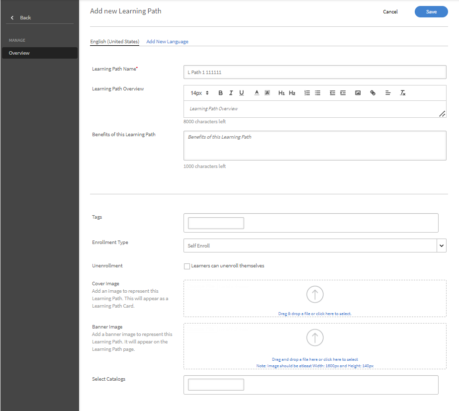

# 学习路径

## 什么是学习路径？

管理员通常希望构建详细的课程表，以提供对特定主题或专业领域的深入了解。 它也可以是员工或客户需要完成的一系列培训课程。 为此，需要将一组课程和计划相结合，形成完整的培训包。

学习路径应运而生。 学习路径是学习者为逐渐掌握某个主题而必须经历的一段旅程。 学习者可以自行掌控培训体验，以更有效的自学方式掌握并牢记知识。

例如，在新员工入职时，公司会对其进行政策和程序、文化、历程等方面的培训。 学习路径根据员工的需求设置课程，以便员工可以根据为其设置的学习路径注册课程。 您可以选择，也可以在此路径上注册用户，以便他们可以在完成一门课程后继续学习另一门课程。

## 创建和配置学习路径

在本培训中，您将学习如何创建学习路径、添加课程、发布和弃用学习路径以及配置学习路径中的实例。

如果您无法启动培训，请写入<almacademy@adobe.com>。

## 学习路径的优势

通过学习路径，可以便捷无忧地实施培训计划。 学习路径有以下主要优点：

1. 直接向学习路径分配技能和技能级别。 无需与技能积分匹配。 学习者完成学习路径后，即可达到上述技能级别。
1. 能够向新学习路径中嵌入现有学习路径。 嵌入功能仅适用于1级嵌入。 因此，已包含嵌入路径的学习路径无法嵌入到新路径中。
1. 能够在学习路径级别添加先决条件、工作辅助和资源。
1. 能够创建章节。 每个章节均有一个标题。
1. 能够将章节设为必修并设置完成标准。

## 在Learning Manager中添加学习路径

在Learning Manager管理员应用中，单击左侧面板上的&#x200B;**[!UICONTROL 学习路径]**。

在&#x200B;**[!UICONTROL 学习路径]**&#x200B;页面中，单击&#x200B;**[!UICONTROL 添加]**。 输入详细信息。

*添加新学习路径*

在&#x200B;**注册类型**&#x200B;选项中，选择&#x200B;**自助注册**&#x200B;或&#x200B;**管理员注册**。

>[!NOTE]
>
>如果选择&#x200B;**管理员注册**&#x200B;选项，学习者将只能看到经理指派或经理批准的课程。 学习者将无法在“推荐”部分中查看学习路径。

创建“学习路径”后，选择新创建的“学习路径”，并在路径中添加课程。

您可以添加技能并为“学习路径”分配徽章。 要添加技能，请从&#x200B;**[!UICONTROL 挑选技能]**&#x200B;下拉列表中选择所需技能。 然后选择一项或多项技能的级别。

*添加技能*

为“学习路径”分配徽章。 从可用徽章列表中挑选一枚徽章。

从&#x200B;**[!UICONTROL 推荐给]**&#x200B;部分中选择产品、角色和角色级别，向对这些产品和角色表示感兴趣的用户推荐此学习路径。

*推荐*

选择章节和培训的排序类型，根据个人喜好选择“有序”或“无序”。

如果选择“有序”，课程将按照创建的先后顺序显示。如果选择“无序”，则课程不会排序。学习者可以按任何顺序完成课程。

要在“学习路径”中添加课程，请单击&#x200B;**[!UICONTROL “添加课程或学习路径”]**。

在出现的对话框中，选择要添加到“学习路径”的培训。

*将培训添加到学习路径*

您可以根据分配的技能、修改日期和课程效果进一步对课程进行排序。

选择课程或学习路径后，单击“**[!UICONTROL 保存]**”。

在“学习路径”中，您可以执行以下操作：

**创建并配置章节：**&#x200B;创建章节是为了根据培训的领域或重要组成部分将多个培训课程进行分组。 每个章节均有一个标题。 每个章节也可标记为“必修”，并具有特定的完成要求。

**将各个章节的课程设为必修：**&#x200B;如果您希望/不希望在“学习路径”中将培训设为必修，请启用或禁用“必修”复选框。 如果启用此复选框，您可以将所有培训设为必修，也可以将部分培训设为必修。

*将课程设为每一节的必修课程*

**重新排列顺序：**&#x200B;您可以上下移动课程并更改其顺序。

*重新排列培训顺序*

**删除课程：**&#x200B;在课程卡上，单击X并从学习路径中删除该课程。

*从学习路径中删除课程*

完成更改后，要发布学习路径，请单击Publish。

## 嵌套式或增强式学习路径

嵌套或增强学习路径是一种包含多个学习路径的学习路径。 要插入学习路径，请按照在“学习路径”中添加课程相同的过程操作。

*嵌套或增强的学习路径*

## 学习路径设置

在“设置”部分，您可以添加学习者在开始学习路径之前必须具备的先决条件和工作辅助。 您还可以添加对学习者有帮助的资源。

*更改学习路径的设置*

## 实例

“学习路径”实例中显示&#x200B;**[!UICONTROL “学习路径”]**&#x200B;附加磁贴。 该磁贴可显示 在学习路径中添加的学习计划的数量。

在&#x200B;**课程**&#x200B;磁贴中，您可以看到对已注册此实例的学习者可见的课程实例。

**[!UICONTROL 支持学习者选择实例（灵活学习路径）]**&#x200B;复选框仅适用于课程。 所有子学习路径均提供一个选项，用于将学习计划实例与学习路径映射。 默认情况下，映射设置为“默认实例”。

*学习路径实例*

## 通知

有以下三个选项：

1. **[!UICONTROL 所有技能级别的课程和学习路径（默认情况下处于选中状态）]：**&#x200B;无论在学习路径中的级别如何，只要存在未完成的课程，学习者就会收到相应通知。
1. **[!UICONTROL 根学习路径]：**&#x200B;如果父学习路径下存在任何未完成的课程，学习者便会收到相应通知。
1. **[!UICONTROL 学习路径+仅限第一个技能级别子项]：**&#x200B;如果课程是父学习路径的第一个子项，且尚未完成，则学习者会收到由该课程发送的通知。

系统会根据上述选项触发通知提醒。 默认情况下，实例已启用&#x200B;**[!UICONTROL 所有级别的课程和学习路径]**&#x200B;选项。

## 订阅

您可以订阅各个学习路径，以直接在您的收件箱中接收包括测验分数和学习者状态在内的完整数据。

请执行以下步骤：

1. 转到“任何学习路径”>“订阅”。
1. 选择“添加更多”。
1. 选择详细信息，并键入接收报告的电子邮件ID。

*订阅单个学习路径*

## 重要说明

请注意，发布之后，现有的“学习计划”功能将更名为“学习路径”。 如果您希望继续将其称为“学习计划”，我们建议您使用“术语”功能应用所需术语。 您可以此种方式继续使用“学习计划”一词。

学习路径为您提供一系列功能。 其中一些功能在发布后立即可用。 管理员/作者现可使用这些功能。 系统已禁用“章节”、“在另一路径中添加学习路径”等扩展功能， 可选中下述复选框启用这些功能。

学习者可以继续使用“学习计划”（现称“学习路径”），作者/管理员也可以继续创建学习计划（或学习路径）。 为利用上述学习路径的扩展功能，管理员应启用以下设置。 启用后，“学习路径”的所有新扩展功能均可用。

“**[!UICONTROL 设置]**”>“**[!UICONTROL 常规]**”页面有一个启用学习路径的新选项。 如果启用此选项，您可以在学习路径中添加课程和学习计划。 此选项一经启用，便无法更改。

<!-- ## Other Learning Path-related details 

### Learning Path option is disabled/unchecked in Admin Settings

**Accounts using Native Web apps**

**Learners**

* By default, learners will notice a change in terminology from "Learning Program" to Learning Path". This has been done to make the interface more intuitive. If you do not want this change, refer to the below points.  

* This change however will not be reflected in the UI if you have already used the 'Custom Terminology" function to replace the terminology "Learning Programs" with some custom text. 
* In case you had not used the Custom Terminology function yet but now wish to retain "Learning Programs" as the terminology, you can do so via the 'Custom Terminology' feature post the release.

* The overall cosmetic look and feel of erstwhile 'Learning Programs' will get updated to a more visually rich look and feel.

**Authors and Admins**

* The terminology within the Admin/Author apps is the same as that of learners.
* The UI for Authors and Admins to create, update the erstwhile 'Learning Program' objects will now be updated to the new UI. There is no loss of functionality, just that the User Interface to do the operation will be much more intuitive. These UI changes will reflect in your account, even if you have chosen not to enable 'Extended Features of Learning Path', with no loss in functionality. 

* Note that any existing Learning Program objects will not change so there is no impact on learners (other than the terminology point noted above). Authors/Admins might notice a default grouping called "Section" within their existing objects, which would be of no material impact as far as functionality goes. Authors/Admins will also see added functionalities like Skills, Job Aids etc. But as you haven't used it yet, it will not create any impact on the learner side till you actually start using it.

**Reporting**

* If you do not enable the option, Learning Path , there are no changes in the Learner Transcript report structure due to Learning Path. But as communicated in earlier notice (refer to the table shared in earlier communication); one new column will get added to the extreme right of the Learner Transcript immediately after the release.

**Accounts using Headless LMS**

**Learners**

* There are no changes for learners in headless interface. APIs as well that are used to generate the reports does not have immediate changes. 

**Authors and Admins**

* Same changes as that of Authors/Admins stated above.

**Reporting**

* Same changes as that of Reporting stated above.

### Learning Paths option is enabled/checked in Admin Settings

**Accounts using Native Web apps**

**Learners**

* Same changes as that of Learners when the option is disabled.
* As you start using the extended functionality of Learning Paths, Learners will benefit from seeing more elaborate paths with embedded paths and sections, Skills and badges being earned on path completion, resources at path level, and other benefits.

**Authors and Admins**

* Same changes as that of Authors and Admins when the option is disabled.

* Users will get more functionality in crafting elaborate paths. You can define Skill-Levels that would automatically be achieved by a learner on completion of path (not have to focus on the arithmetic of Credits for the levels). Resources can be added at the path level (Not possible as of today). Sections can be created with each section having the ability to have X of Y options. One can embed a Learning Path within another Learning Path (one level of hierarchy supported)

**Reporting**

* A few new columns will get added to the 'Learner Transcript' and 'Content Report' structures to incorporate the new feature of embedding of paths within paths. This may impact integration code that you may have written to export this data to your custom data warehouse/DB outside Learning Manager. This information is communicated in the table provided in earlier communication.

**Accounts using Headless LMS**

**Learners**

* There is no change for your learners, unless you make changes to your headless LMS implementation, as the APIs on which you have built your headless interface will not be changing.
* If you do start using the extended features of Learning Paths by creating new Learning Paths, however you will have to make changes to the headless LMS implementation to reflect those on your learner app. The Learning Manager APIs will allow you to do that.

**Authors and Admins**

* Same changes as that of Authors/Admins stated above.

**Reporting**

* Same changes as that of Reporting stated above. -->
