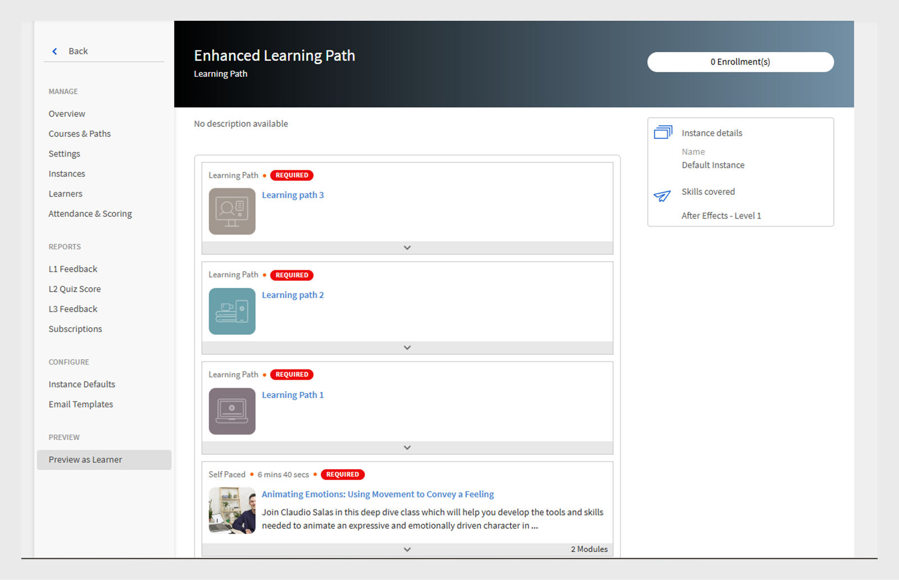

# 学习路径

## 什么是学习路径？

管理员通常希望构建详细的课程表，以提供对特定主题或专业领域的深入了解。 它也可以是员工或客户需要完成的一系列培训课程。 为此，需要将一组课程和计划相结合，形成完整的培训包。

学习路径应运而生。 学习路径是学习者为逐渐掌握某个主题而必须经历的一段旅程。 学习者可以自行掌控培训体验，以更有效的自学方式掌握并牢记知识。

例如，在新员工入职时，公司会对其进行政策和程序、文化、历程等方面的培训。 学习路径根据员工的需求设置课程，以便员工可以根据为其设置的学习路径注册课程。 您可以选择，也可以在此路径上注册用户，以便他们可以在完成一门课程后继续学习另一门课程。

## 创建和配置学习路径

在本培训中，您将学习如何创建学习路径、添加课程、发布和弃用学习路径以及配置学习路径中的实例。

如果您无法启动培训，请写信至 <almacademy@adobe.com>.

## 学习路径的优势

通过学习路径，可以便捷无忧地实施培训计划。 学习路径有以下主要优点：

1. 直接向学习路径分配技能和技能级别。 无需与技能积分匹配。 学习者完成学习路径后，即可达到上述技能级别。
1. 能够向新学习路径中嵌入现有学习路径。 嵌入功能仅适用于1级嵌入。 因此，已包含嵌入路径的学习路径无法嵌入到新路径中。
1. 能够在学习路径级别添加先决条件、工作辅助和资源。
1. 能够创建章节。 每个章节均有一个标题。
1. 能够将章节设为必修并设置完成标准。

## 在Learning Manager中添加学习路径

在Learning Manager管理员应用程序中，单击 **[!UICONTROL 学习路径]** 在左侧面板上。

在 **[!UICONTROL 学习路径]** 页面，单击 **[!UICONTROL 添加]**. 输入详细信息。

*添加新学习路径*

创建“学习路径”后，选择新创建的“学习路径”，并在路径中添加课程。

您可以添加技能并为“学习路径”分配徽章。 要添加技能，请从中选择所需技能 **[!UICONTROL 挑选技能]** 下拉列表。 然后选择一项或多项技能的级别。

为“学习路径”分配徽章。 从可用徽章列表中挑选一枚徽章。

选择章节和培训的排序类型，根据个人喜好选择“有序”或“无序”。

如果选择“有序”，课程将按照创建的先后顺序显示。如果选择“无序”，则课程不会排序。学习者可以按任何顺序完成课程。

要在“学习路径”中添加课程，请单击 **[!UICONTROL 添加课程或学习路径]**.

在出现的对话框中，选择要添加到“学习路径”的培训。

*在“学习路径”中添加培训*

您可以根据分配的技能、修改日期和课程效果进一步对课程进行排序。

选择课程或学习路径后，单击 **[!UICONTROL 保存]**.

在“学习路径”中，您可以执行以下操作：

**创建和配置分区：** 创建章节是为了将完成培训的领域或重要组成部分的多个培训课程进行分组。 每个章节均有一个标题。 每个章节也可标记为“必修”，并具有特定的完成要求。

**将各个章节的课程设为必修：** 如果您希望/不希望在“学习路径”中将培训设为必修，请启用或禁用“必修”复选框。 如果启用此复选框，您可以将所有培训设为必修，也可以将部分培训设为必修。

*将各个章节的课程设为必修*

**重新排列顺序：** 您可以上下移动课程并更改其顺序。

*重新排列培训顺序*

**删除课程：** 在课程卡上，单击X，然后从“学习路径”中删除该课程。

*从“学习路径”中删除课程*

完成更改后，要发布学习路径，请单击“发布”。

## 嵌套式学习路径

您可以在学习路径中加入新的学习路径，但至多只能在其中嵌套一个学习路径。

像插入课程一样插入学习路径。

*在学习路径中添加学习路径*

## 学习路径设置

在“设置”部分，您可以添加学习者在开始学习路径之前必须具备的先决条件和工作辅助。 您还可以添加对学习者有帮助的资源。

*更改学习路径的设置*

## 实例

“学习路径”实例中显示&#x200B;**[!UICONTROL “学习路径”]**&#x200B;附加磁贴。 该磁贴可显示 在学习路径中添加的学习计划的数量。

在 **课程** 磁贴，您可以看到对已注册学习者可见的课程实例。

该 **[!UICONTROL 支持学习者选择实例（灵活学习路径）]** 复选框仅适用于课程。 所有子学习路径均提供一个选项，用于将学习计划实例与学习路径映射。 默认情况下，映射设置为“默认实例”。

*学习路径实例*

## 通知

有以下三个选项：

1. **[!UICONTROL 所有级别的课程和学习路径（默认情况下处于选中状态）]：** 无论在学习路径中的级别如何，只要存在未完成的课程，学习者就会收到相应通知。
1. **[!UICONTROL 根学习路径]：** 如果父学习路径下存在任何未完成的课程，学习者便会收到相应通知。
1. **[!UICONTROL 学习路径且只能进行一级嵌套]：** 如果课程是父学习路径的第一个子项，且尚未完成，则学习者会收到由该课程发送的通知。

系统会根据上述选项触发通知提醒。 默认情况下，选项 **[!UICONTROL 所有级别的课程和学习路径]** 已为实例启用。

## 重要说明

请注意，发布之后，现有的“学习计划”功能将更名为“学习路径”。 如果您希望继续将其称为“学习计划”，我们建议您使用“术语”功能应用所需术语。 您可以此种方式继续使用“学习计划”一词。

学习路径为您提供一系列功能。 其中一些功能在发布后立即可用。 管理员/作者现可使用这些功能。 系统已禁用“章节”、“在另一路径中添加学习路径”等扩展功能， 可选中下述复选框启用这些功能。

学习者可以继续使用“学习计划”（现称“学习路径”），作者/管理员也可以继续创建学习计划（或学习路径）。 为利用上述学习路径的扩展功能，管理员应启用以下设置。 启用后，“学习路径”的所有新扩展功能均可用。

该 **[!UICONTROL 设置]** > **[!UICONTROL 常规]** 页面中存在启用“学习路径”的新选项。 如果启用此选项，您可以在学习路径中添加课程和学习计划。 此选项一经启用，便无法更改。

## 其他与学习路径相关的详细信息

### “学习路径”选项在“管理员设置”中禁用/取消选中

**使用本机 Web 应用的帐户**

**学习者**

* 默认情况下，学习者会注意到术语从“学习计划”变为“学习路径”。 这一改动的目的是为了让界面更加直观。 如果您不想进行此更改，请参阅以下要点。

* 但是，如果您已使用“自定义术语”功能将术语“学习计划”替换为自定义文本，则UI中不会反映此更改。
* 如果您尚未使用“自定义术语”功能，但现在希望保留“学习计划”这一术语，则可以通过发布后的“自定义术语”功能实现。

* 昔日“学习计划”的整体观感如今更富视觉效果，令人耳目一新。

**作者和管理员**

* 管理员/作者应用中的术语与学习者应用中的术语一致。
* 作者和管理员创建、更新昔日“学习计划”对象的UI现已焕然一新。 功能没有任何缺失，只是执行操作的用户界面更为直观。 即使您选择不启用“学习路径的扩展功能”，您的帐户中也会反映这些UI更改，而功能不会有任何缺失。

* 请注意，任何现有的“学习计划”对象都不会发生变化，因此不会对学习者产生影响（上述术语点除外）。 作者/管理员可能会注意到其现有对象中名为“章节”的默认分组，就功能而言，该分组不会产生任何实质性影响。 作者/管理员还会看到如技能、工作辅助等新增功能。 但是您尚未使用这些功能，在您实际使用这些功能之前，并不会对学习者端产生任何影响。

**报告的角色**

* 如果未启用“学习路径”选项，则“学习者成绩单”报告结构不会因“学习路径”发生任何变化。 但是，如先前通知中所述（请参阅先前通信中共享的表格）；发布之后，“学习者成绩单”的最右端会立即添加一个新列。

**使用无头LMS的帐户**

**学习者**

* 无头界面中的学习者没有任何变化。 用于生成报告的API也没有直接变化。

**作者和管理员**

* 与上述作者/管理员所做变动相同。

**报告的角色**

* 与上述报告所做变动相同。

### “学习路径”选项在“管理员设置”中启用/选中

**使用本机 Web 应用的帐户**

**学习者**

* 与禁用该选项后学习者所做变动相同。
* 当您开始使用学习路径的扩展功能时，具有嵌入式路径和章节的更复杂路径、完成路径时所获得的技能和徽章、路径级别的资源等优势，均对学习者大有裨益。

**作者和管理员**

* 与禁用该选项后作者/管理员所做变动相同。

* 用户可在精心设计路径时获得更多功能。 您可以定义学习者在完成路径时自动达到的技能级别（不必关注级别积分的计算过程）。 可以在路径级别添加资源（暂不可用）。 可以创建章节，每个章节可包括共 Y 个选项中的 X 个选项。 可以将学习路径嵌入到另一学习路径中（支持一个层次结构级别）

**报告的角色**

* “学习者成绩单”和“内容报告”结构中会新增几列，以加入在路径中嵌入路径的新功能。 这可能会影响您为将此数据导出到 Adobe Learning Manager 之外的自定义数据仓库/数据库而编写的集成代码。先前通信中提供的表格已传达此信息。

**使用无头LMS的帐户**

**学习者**

* 用于构建无头界面的 API 不会发生变化，因此，若不更改无头 LMS 实现，则学习者不会发生任何变化。
* 如果您创建新的学习路径，并开始使用学习路径的扩展功能，则必须对无头 LMS 实现进行更改，以在学习者应用中反映这些改动。 您可以利用 Adobe Learning Manager API 执行此操作。

**作者和管理员**

* 与上述作者/管理员所做变动相同。

**报告的角色**

* 与上述报告所做变动相同。
