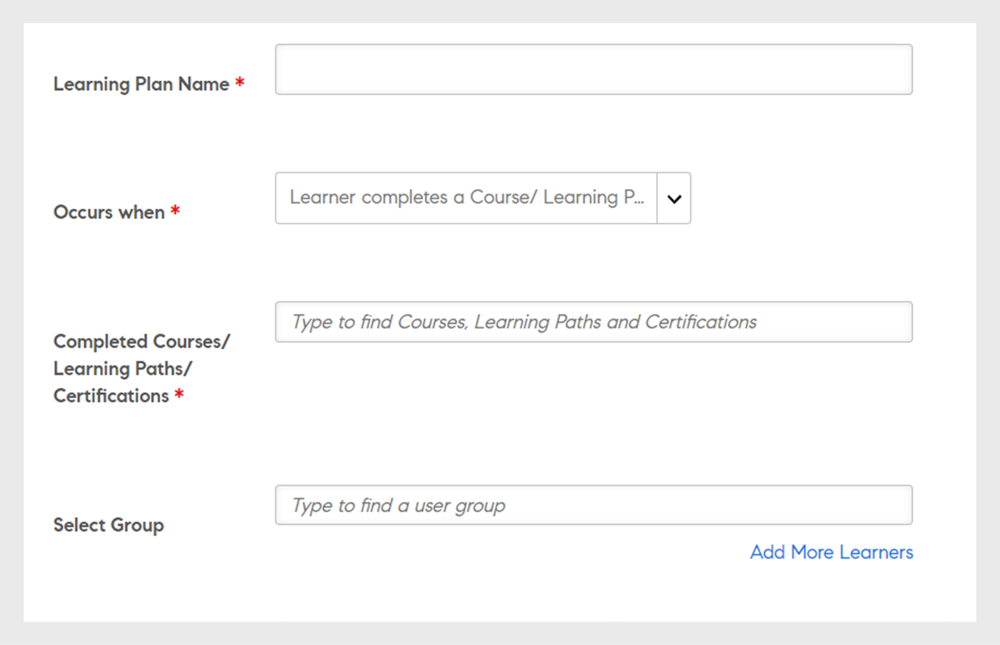
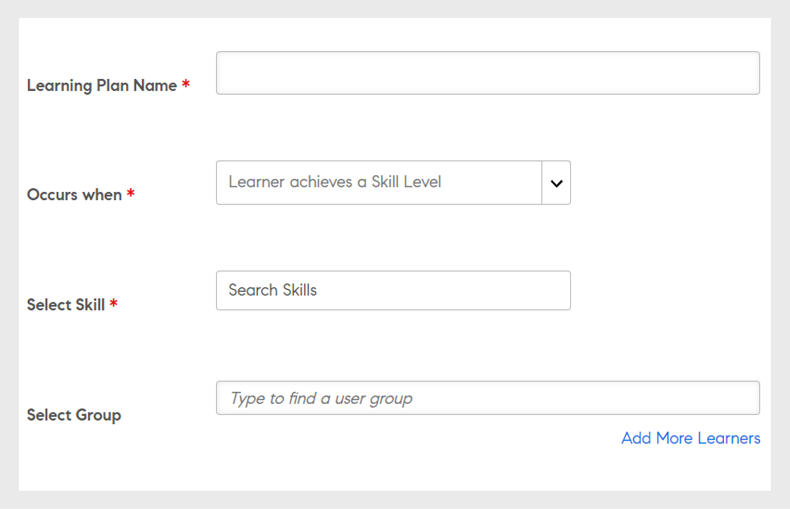
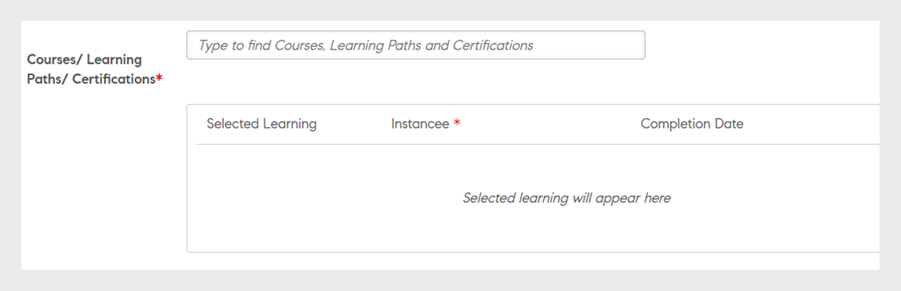

# 学习方案

在 Adobe Learning Manager 中为管理员创建学习计划。

## 概述 {#overview}

学习计划是一套规则，可根据特定条件将学习者注册到指定的培训。

管理员可通过学习计划基于某些事件（如新员工入职或更改员工职位或位置）自动分配课程、学习方案或认证。

例如，当某个员工入职后，“新员工入职计划”会自动分配给该员工。同样，如果某个员工被提升为经理，则系统会自动向该员工分配“新经理入职计划”。

您可以根据预定义的事件集自动将学习者注册到任何课程和学习方案。如要创建学习者的学习路径，只要在学习者完成技能、课程或学习方案后自动分配跟进学习活动即可。

## 创建学习计划 {#createlearningplans}

要创建学习计划，您必须以管理员身份登录。

1. 在左侧窗格中，单击&#x200B;**[!UICONTROL “学习计划”]**。如果存在任何现有事件，则这些事件将列在页面上。但是，如果您是第一次设置学习计划功能，请继续执行下一步。
1. 在页面右上角，单击&#x200B;**[!UICONTROL “添加”]**。在&#x200B;**[!UICONTROL “添加学习计划”]**&#x200B;对话框中，输入员工必须参加的学习计划的名称。

   

1. 在&#x200B;**[!UICONTROL “Occurs when（执行时间）”]**&#x200B;下拉列表中，选择所需的事件。这些选项决定了学习者参加课程的时间。 选择活动类型后，请选择相应的培训、课程、学习计划或认证。

   **注：** 管理员和作者都可以创建自动注册事件。

   事件包括：

   **1 — 已添加新学习者：** 当新用户或员工加入组织时。

   

   **2 — 将学习者添加到组：** 当新用户或员工加入组时。  输入并选择此事件适用的下拉列表中的用户组。 您可以选择多个组。此外，您可以选择相应选项，将此事件分配给这些组的所有现有成员。

   

   此学习计划专门面向&#x200B;***自定义组***&#x200B;用户。在字段中输入组的名称，并使用预键入搜索执行搜索，然后选择一个或多个组。

   **3 — 学习者完成学习对象：** 当学习者完成任何学习对象（如课程、学习计划等）时，会触发该事件。 选择此事件适用的学习对象。选择事件的完成状态。或者，您也可以选择此学习者所属的用户组。完成学习对象后，输入天数，即可触发此事件。如果要将此事件分配给已完成此学习对象的现有用户，请选择此选项。

   

   **4 — 学习者达到相应的技能级别：** 输入技能名称并选择技能级别。 您也可以选择此学习者所属的用户组。这是可选项。达到相应技能后，输入天数，即可触发此事件。如果希望将此事件分配给已达到此技能的现有学习者，请选择该选项。

   

   此外，设置必须分配学习计划前需要经过的天数。

   

   **5 — 在特定日期：** 事件必须在特定日期发生。 选择必须对事件进行分配的日期。选择需要将事件自动分配到的用户组。选择需分配的实例，并（可选）输入触发事件前需要经过的天数。

   

1. 对于所有事件，您可从&#x200B;**[!UICONTROL “实例”]**&#x200B;下拉列表选择该实例。您还可以为任何事件选择所分配学习的实例。

   

   在 Adobe Learning Manager 中，学习计划将创建自己的实例“Auto”。在您选择组（例如，所有学习者）时，默认情况下，学习计划中的所有学习者都将注册到实例“Auto”中。

   保存学习计划后，实例“Auto”显示为课程“学习者”部分&#x200B;**[!UICONTROL “选择实例”]**&#x200B;下拉列表中的选项。

1. 要保存学习计划，请单击&#x200B;**[!UICONTROL “保存”]**。

## 取消培训注册 {#unenroll-training}

添加学习计划时，管理员可以根据某些触发器将用户取消注册参加特定培训。

在管理员应用程序上，单击 **[!UICONTROL 学习方案]** > **[!UICONTROL 添加]**.

接下来的部分表示触发选项 **[!UICONTROL 取消培训注册]** 已添加。

## 从组中删除学习者 {#learnergetsremovedfromagroup}

1. 添加一个或多个用户组。 如果选择了多个组，那么在从上述任一组中删除学习者时会触发计划。
1. 选择操作作为 **[!UICONTROL 取消培训注册]**.

   1. 从用户组中删除用户时，管理员可以选择要将用户从中取消注册的培训。
   1. 在这种情况下，实例和完成日期不适用。

## 学习者完成了一次培训 {#learnercompletesatraining}

1. 添加一个或多个用户组。 如果选择了多个组，那么在学习者完成指定培训时会触发计划。
1. 选择操作作为 **[!UICONTROL 取消培训注册]**.

   1. 从用户组中添加用户时，管理员可以选择要将用户从中取消注册的培训。
   1. 在这种情况下，实例和完成日期不适用。

## 学习者被添加到组 {#learnergetsaddedtoagroup}

1. 添加一个或多个用户组。 如果选择了多个组，那么在从上述任一组中添加学习者时会触发计划。
1. 请选择“取消培训注册”的操作。

   1. 从用户组中添加用户时，管理员可以选择要将用户从中取消注册的培训。
   1. 在这种情况下，实例和完成日期不适用。

## 学习者达到相应的技能级别 {#learnerachievesaskilllevel}

1. 指定要习得的技能。
1. 添加一个或多个用户组。 如果选择了多个组，那么在学习者习得所选技能时会触发计划。

## 在特定日期 {#onaspecificdate}

1. 选择取消注册学习者的日期。
1. 添加一个或多个用户组。 如果选择了多个组，那么在取消注册所选组的用户的当天会触发计划。
1. 请选择“取消培训注册”的操作。

   1. 在指定日期取消注册用户时，管理员可以选择要将用户从中取消注册的培训。
   1. 在这种情况下，实例和完成日期不适用。

## 编辑学习计划 {#editalearningplan}

创建学习计划后，管理员可以随时编辑/更新学习计划。要进行编辑，请单击学习计划的名称，并在显示的&#x200B;**[!UICONTROL “编辑学习计划”]**&#x200B;弹出对话框中修改值。单击&#x200B;**[!UICONTROL “保存”]**。

## 启用学习计划 {#enablealearningplan}

默认情况下，您创建的所有新学习计划处于禁用状态。您必须为要分配的学习者启用计划。 启用该复选框时 **[!UICONTROL 当前学习者]**，则事件将自行启用。

要启用学习计划：

1. 从“学习计划”列表中，选择要启用的计划。

   

1. 在页面右上角，单击 **[!UICONTROL 动作]** > **[!UICONTROL 启用]**. 这将启用学习计划。

## 删除学习计划 {#deletealearningplan}

要删除学习计划：

1. 从“学习计划”列表中，选择要删除的计划。
1. 在页面右上角，单击 **[!UICONTROL 动作]** > **[!UICONTROL 删除]**.

## 禁用学习计划 {#disablealearningplan}

要禁用学习计划：

1. 单击&#x200B;**[!UICONTROL “已启用”]**&#x200B;选项卡。
1. 从“学习计划”列表中，选择要禁用的计划。
1. 在页面右上角，单击 **[!UICONTROL 动作]** > **[!UICONTROL 禁用]**. 这会将计划移至&#x200B;**[!UICONTROL “已禁用”]**&#x200B;选项卡。

## 过滤学习计划 {#filteralearningplan}

您可以根据创建学习计划时使用的事件类型过滤学习计划。单击&#x200B;**[!UICONTROL “类型”]**，然后选择任意选项以禁用该选择匹配的“学习计划”。

## 常见问题解答 {#frequentlyaskedquestions}

1. 如何设置Learning Manager以配置新员工入职的自动注册？

   在 **[!UICONTROL 发生于]** 从下拉列表中，选择选项 **[!UICONTROL 已添加新学习者]**. 然后为学习者分配学习对象、实例以及完成日期。管理员和作者都可以创建自动注册事件。 创建事件后将其启用。

1. 如何为教室和虚拟教室课程设置学习计划/自动注册？

   建议您使用所需的会话详细信息设置课程实例。然后设置学习计划并将其映射到已创建的课程实例。

1. 如何查看注册特定学习计划的学习者列表？

   创建实例“自动”后，单击 **[!UICONTROL 课程]** > **[!UICONTROL 学习者]**，然后从中选择所需的实例 **[!UICONTROL 实例]** 下拉列表。
