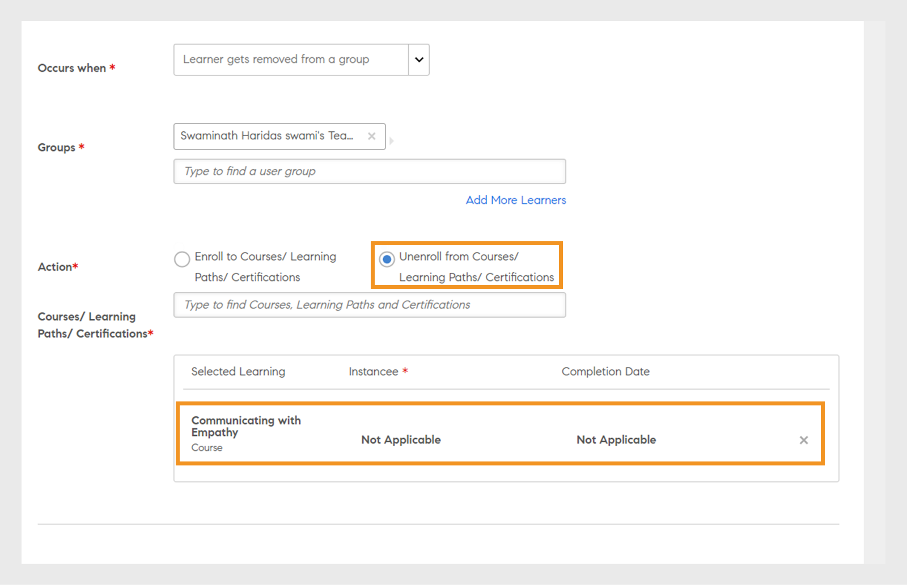

# 学习方案

在Learning Manager中为管理员创建学习计划。

## 概述 {#overview}

学习计划是一组规则，用于根据特定条件将学习者注册到指定的培训。

学习计划允许管理员根据某些事件的发生自动分配课程、学习计划或认证，例如新员工入职或员工职称或位置变更。

例如，当员工加入组织时，“新员工入职指导计划”会自动分配给员工。 同样，如果员工被提升为经理，则会自动为该员工分配新的经理指导计划。

您可以根据预定义的一组事件自动将学习者注册到任何课程和学习计划。 您可以为学习者创建学习路径，方法是在学习者完成技能、课程或学习计划后自动分配后续学习活动。

## 创建学习计划 {#createlearningplans}

要创建学习计划，您必须以管理员身份登录。

1. 在左侧窗格中，单击 **[!UICONTROL 学习方案]**. 如果存在任何现有事件，它们将在页面上列出。 但是，如果您是第一次设置学习计划功能，请继续执行下一步。
1. 在页面右上角，单击 **[!UICONTROL 添加]**. 在 **[!UICONTROL 添加学习计划]** 对话框中，输入员工必须参加的学习计划的名称。

   

1. 在 **[!UICONTROL 发生于]** 从下拉列表中，选择所需的事件。 这些选项决定了学习者参加课程的时间。 选择活动类型后，请选择相应的培训、课程、学习计划或认证。

   **注：** 管理员和作者都可以创建自动注册事件。

   这些事件包括：

   **1 — 已添加新学习者：** 当新用户或员工加入组织时。

   

   **2 — 将学习者添加到组：** 当新用户或员工加入组时。  输入并选择此事件适用的下拉列表中的用户组。 您可以选择多个组。 此外，通过选择此选项，您可以将此事件分配给这些组的所有现有成员。

   

   本学习计划专为以下用户而设计 ***自定义 — 组*** 用户。 在字段中键入组的名称，然后使用预键入搜索来选择一个或多个组。

   **3 — 学习者完成学习对象：** 当学习者完成任何学习对象（如课程、学习计划等）时，会触发该事件。 选择此事件适用的学习对象。 选择事件的完成状态。 或者，您也可以选择此学习者所属的用户组。 输入天数，系统将在完成学习对象后触发此事件。 如果要将此事件分配给已完成此学习对象的现有用户，请选择此选项。

   

   **4 — 学习者达到相应的技能级别：** 输入技能名称并选择技能级别。 您还可以选择此学习者所属的用户组。 它是可选的。 输入天数，在习得技能后，此事件将触发。 如果要将此活动分配给已习得此技能的现有学习者，请选择该选项。

   

   此外，设置必须在几天后为学习者分配学习计划。

   

   **5 — 在特定日期：** 事件必须在特定日期发生。 选择必须分配事件的日期。 选择要自动为其分配事件的用户组。 选择需要分配的实例，并根据需要在多少天后输入事件需要触发的时间。

   

1. 对于所有事件，您可以从 **[!UICONTROL 实例]** 下拉列表。 您还可以为任何事件选择已分配学习的实例。

   

   在Learning Manager中，学习计划会创建自己的实例“自动”。 当您选择组时，例如所有学习者，则默认情况下，学习计划中的所有学习者都会注册到实例“自动”中。

   保存学习计划后，实例“自动”会作为选项显示在 **[!UICONTROL 选择实例]** 课程中“学习者”部分的下拉列表。

1. 要保存学习计划，请单击 **[!UICONTROL 保存]**.

## 取消培训注册 {#unenroll-training}

添加学习计划时，管理员可以根据某些触发器将用户取消注册参加特定培训。

在管理员应用程序上，单击 **[!UICONTROL 学习方案]** > **[!UICONTROL 添加]**.

接下来的部分表示触发选项 **[!UICONTROL 取消培训注册]** 已添加。

## 从组中删除学习者 {#learnergetsremovedfromagroup}

1. 添加一个或多个用户组。 如果选择了多个组，那么在从上述任一组中删除学习者时会触发计划。
1. 选择操作作为 **[!UICONTROL 取消培训注册]**.

   1. 从用户组中删除用户时，管理员可以选择要将用户从中取消注册的培训。
   1. 在这种情况下，实例和完成日期不适用。

## 学习者完成了培训 {#learnercompletesatraining}

1. 添加一个或多个用户组。 如果选择了多个组，那么在学习者完成指定培训时会触发计划。
1. 选择操作作为 **[!UICONTROL 取消培训注册]**.

   1. 将用户添加到用户组时，管理员可以选择要将用户从中取消注册的培训。
   1. 在这种情况下，实例和完成日期不适用。

## 将学习者添加到组 {#learnergetsaddedtoagroup}

1. 添加一个或多个用户组。 如果选择了多个组，那么在从上述任一组中添加学习者时会触发计划。
1. 请选择“取消培训注册”的操作。

   1. 将用户添加到用户组时，管理员可以选择要将用户从中取消注册的培训。
   1. 在这种情况下，实例和完成日期不适用。

## 学习者达到相应的技能级别 {#learnerachievesaskilllevel}

1. 指定要习得的技能。
1. 添加一个或多个用户组。 如果选择了多个组，那么在学习者习得所选技能时会触发计划。

## 在特定日期 {#onaspecificdate}

1. 选择取消注册学习者的日期。
1. 添加一个或多个用户组。 如果选择了多个组，那么在取消注册所选组的用户的当天会触发计划。
1. 请选择“取消培训注册”的操作。

   1. 在指定日期取消注册用户时，管理员可以选择要将用户从中取消注册的培训。
   1. 在这种情况下，实例和完成日期不适用。

## 编辑学习计划 {#editalearningplan}

创建学习计划后，管理员可以随时编辑/更新学习计划。 如要编辑，请单击学习计划的名称，然后修改 **[!UICONTROL 编辑学习计划]** 此时会显示弹出对话框。 点击 **[!UICONTROL 保存]**.

## 启用学习计划 {#enablealearningplan}

默认情况下，您创建的所有新学习计划均处于禁用状态。 您必须为要分配的学习者启用计划。 启用该复选框时 **[!UICONTROL 当前学习者]**，则事件将自行启用。

要启用学习计划，

1. 从“学习计划”列表中，选择要启用的计划。

   

1. 在页面右上角，单击 **[!UICONTROL 动作]** > **[!UICONTROL 启用]**. 这样将启用学习计划。

## 删除学习计划 {#deletealearningplan}

要删除学习计划，

1. 从“学习计划”列表中，选择要删除的计划。
1. 在页面右上角，单击 **[!UICONTROL 动作]** > **[!UICONTROL 删除]**.

## 禁用学习计划 {#disablealearningplan}

要禁用学习计划，

1. 单击选项卡 **[!UICONTROL 已启用]**.
1. 从“学习计划”列表中，选择要禁用的计划。
1. 在页面右上角，单击 **[!UICONTROL 动作]** > **[!UICONTROL 禁用]**. 这会将计划移至 **[!UICONTROL 已禁用]** 选项卡。

## 筛选学习计划 {#filteralearningplan}

您可以根据创建学习计划时使用的事件类型筛选学习计划。 点击 **[!UICONTROL 类型]** 然后选择任何选项以显示与所选内容匹配的学习计划。

## 常见问题解答 {#frequentlyaskedquestions}

1. 如何设置Learning Manager以配置新员工入职的自动注册？

   在 **[!UICONTROL 发生于]** 从下拉列表中，选择选项 **[!UICONTROL 已添加新学习者]**. 然后为学习者分配学习对象、实例和完成日期。 管理员和作者都可以创建自动注册事件。 创建事件后将其启用。

1. 如何为教室和虚拟教室课程设置学习计划/自动注册？

   建议您使用所需的会话详细信息设置课程实例。 然后设置学习计划并将其映射到已创建的课程实例。

1. 如何查看注册特定学习计划的学习者列表？

   创建实例“自动”后，单击 **[!UICONTROL 课程]** > **[!UICONTROL 学习者]**，然后从中选择所需的实例 **[!UICONTROL 实例]** 下拉列表。
