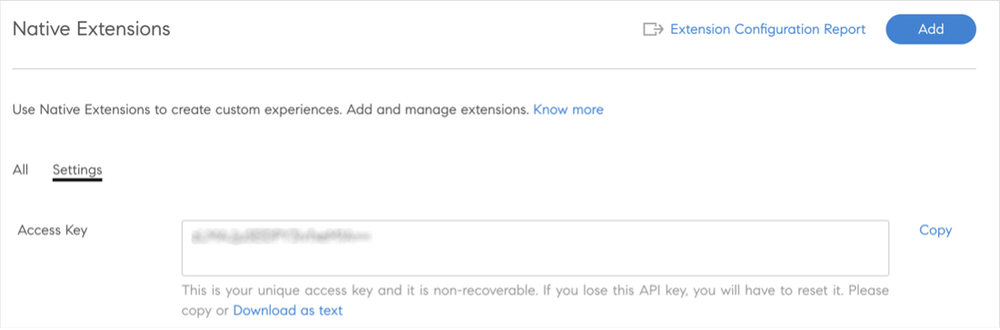

# 本机可扩展性

您可以在AdobeLearning Manager本机版本中设置自定义体验，对于不太复杂的案例不使用无头工具。 您还可以创建自定义应用程序，并将其放置在学习者、经理、管理员、作者或讲师工作流程的本机版本中的各个位置。

AdobeLearning Manager在管理员、作者、学习者、经理和讲师应用程序中支持15个调用点。

## 创建扩展

1. 以管理员身份在左侧面板中选择 **[!UICONTROL 本机扩展]**.
1. 选择添加扩展。
1. 在 **[!UICONTROL 名称]** 字段。
1. 在 **[!UICONTROL 描述]** 字段。
1. 选择一个调用点。 调用点是指在AdobeLearning Manager中链接或按钮可以插入自定义应用程序的任何位置。 可使用以下调用点：

   在此示例中，选择 **[!UICONTROL 管理员]**， **[!UICONTROL 作者：课程]**， **[!UICONTROL 学习路径]** - **[!UICONTROL 实例]** - **[!UICONTROL 实例行]**.

   
   *选择调用点*

1. 键入将在UI上显示的扩展标签 **[!UICONTROL 扩展名标签]** 字段。
1. 键入要在其中托管扩展的URL **[!UICONTROL URL]** 字段。
1. 在打开方式下拉列表中，选择是在模式中还是在新选项卡中启动扩展。
1. 选择模态的大小。 如果您已选择 *应用程序内* 模态。

   要保持弹出窗口内的辅助功能，扩展应用程序在其网站上的最后一个可聚焦元素上后，必须发送至事件，然后用户选择TAB键。 需要将焦点保持在弹出窗口中，以支持辅助功能。

   ```
   window.parent.postMessage({*}
   
   { type: 'ALM_EXTENSION_APP', eventType: 'trapFocusInModal' }
   
   ,{}'');
   ```

1. 设置扩展的范围。 可以使用以下范围：

   * **[!UICONTROL 所有课程、学习路径和认证]**：此扩展支持所有课程、学习路径和认证。 作者可以与管理员一起禁用某些课程、学习路径和认证的此功能。
   * **[!UICONTROL 选定的课程、学习路径和认证]**：所有课程、学习路径和认证均禁用此扩展。 作者可以与管理员一起为某些课程、学习路径和认证启用此设置。

1. 选择 **[!UICONTROL 激活]** 切换以使扩展处于活动状态。 激活后，扩展会根据作用域显示在指定的调用点上。
1. 选择 **[!UICONTROL 保存]** ，以创建扩展程序。

## 以管理员身份访问扩展

1. 以管理员身份选择 **[!UICONTROL 学习路径]** 左侧工具栏中。
1. 选择课程> **[!UICONTROL 查看学习路径]**.
1. 选择 **[!UICONTROL 实例]** 左侧面板中。
1. 选择 **[!UICONTROL 更多]** 在“实例”部分中。 该扩展名将出现在“实例”部分中。

   
   *选择扩展*

   选取扩展后，该扩展将显示在模态中。

## 以“作者”身份访问扩展

1. 以管理员身份选择 **[!UICONTROL 学习路径]** 左侧工具栏中。
1. 选择课程> **[!UICONTROL 查看学习路径]**.
1. 选择 **[!UICONTROL 实例]** 左侧面板中。
1. 选择 **[!UICONTROL 更多]** 在“实例”部分中。 该扩展名将出现在“实例”部分中。

   
   *作者身份访问扩展*

   选取扩展后，该扩展将显示在模态中。

## 查看所有扩展

作为管理员，您可以在“本机扩展”页面上查看所有扩展。 要查看此列表，请选择应用程序左侧面板中的“本机扩展” 。


*查看所有扩展*

## 启用或禁用扩展

作者可以在课程的“设置”页面启用或禁用课程、认证或学习路径的扩展。


*激活扩展*

## 共享访问密钥

如果要配置注册扩展，则必须共享Access密钥。

这一点很重要，因为如果不生成此密钥并在其中共享，注册身份验证将失败，学习者将无法自行注册课程。

必须共享访问密钥才能注册课程或学习路径和证书。

在“设置”选项卡中，生成密钥。


*共享访问密钥*

## 下载扩展报告

有两种下载此报告的方法。

**扩展配置报告**

1. 在“本机扩展”页面中，选择 **[!UICONTROL 扩展配置报告]**.

   
   *下载扩展报告*

   生成报告。

1. 选择“确定”。

   
   *生成报告*

   该报告包含以下字段：

   * 扩展名
   * 调用点
   * 标签
   * 在URL中打开
   * 范围
   * 激活
   * 学习对象唯一ID
   * 培训ID
   * 培训类型
   * 培训名称

**“报告”页面**

1. 向内 **[!UICONTROL 报告]** > **[!UICONTROL 自定义报告]**，选择 **[!UICONTROL 扩展配置报告]**.

   
   *从报告页面下载报告*

状态必须在范围内 **0 - 4294967295**，同时配置注册状态。
