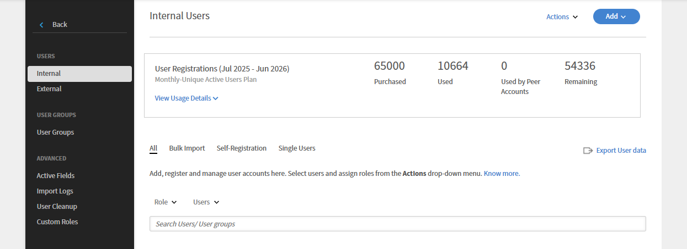

# 配对帐户

阅读本文，了解如何在 Adobe Learning Manager 中创建和管理配对帐户。

Adobe Learning Manager 已推出配对帐户功能，可让您共享已购买的名额。 借助 Adobe Learning Manager 中的配对帐户，管理员可以与自己关联的配对帐户共享已购买的名额。 此外，发起共享名额的管理员还能够查看配对帐户报告。

## 添加配对帐户 {#addapeeraccount}

1. 在管理员信息板中，单击&#x200B;**[!UICONTROL 设置]** > **[!UICONTROL 配对帐户]**。
1. 在右上角单击&#x200B;**[!UICONTROL “添加”]**。

   

   *添加配对帐户*

1. 在&#x200B;**[!UICONTROL 帐户子域]**&#x200B;字段中，指定要与之建立配对帐户的子域。

   

   *添加子域*

>[!NOTE]
>
>要查找另一个帐户的子域，请检查该帐户的URL。 子域显示在主域之前，可帮助识别特定帐户。
>
>例如：
>
>在URL [https://www.learningmanager.com/accountname](https://www.learningmanager.com/accountname)中，子域为&#x200B;**帐户名称**。
>
>在URL [https://www.accountname.learningmanager.com](https://www.accountname.learningmanager.com)中，子域也是&#x200B;**帐户名称**。
>
>子域对于每个帐户是唯一的，用于访问相应的Learning Manager实例。

1. 输入接受或拒绝配对帐户请求的管理员的电子邮件 ID。
1. 指定要与配对帐户共享的名额数。 当您与配对帐户共享名额时，配对帐户将进入“活动”状态，其中包含已接收的名额，或包含配对帐户自己购买的名额。

   如果您输入的数字大于可用名额数，系统将显示警告。

1. 如果您要查看配对帐户的注册报告和共享目录报告，请选中相应的复选框。
1. 单击“添加”以添加配对帐户。

   如果管理员与配对帐户共享名额，那么配对帐户无法与其他任何人共享这些名额。 但是，配对帐户可单独购买并共享一些名额。

## 查看配对帐户共享的名额

管理员可以在管理员界面上查看配对帐户共享的名额数。

要查看配对帐户共享的名额，请执行以下操作：

1. 以管理员身份登录Adobe Learning Manager。
2. 选择&#x200B;**[!UICONTROL 用户]**，然后选择&#x200B;**[!UICONTROL 内部]**。

_显示配对帐户共享名额数的用户部分_

## 查看与配对帐户关联的报告 {#viewreportsassociatedwithpeeraccounts}

在建立配对帐户后，您还可以绘制配对帐户的报告。 作为管理员，如果您发起配对帐户请求，则可以查看配对帐户的报告。

如果配对帐户也想查看管理员报告，则配对帐户必须向管理员发送单独的配对帐户请求。

如需了解如何生成和查看配对帐户的共享目录，请参阅[查看配对帐户报告](reports.md#main-pars_header_894271250)。

## 删除配对帐户 {#deletingpeeraccounts}

如果您不希望再与帐户共享已有名额或购买的名额，可以删除配对帐户。

1. 在 Adobe Learning Manager 管理员应用程序中，单击“设置”>“配对帐户”。
1. 选择要删除的配对帐户。
1. 执行以下任一操作：

   * 在页面右上角单击“删除”。
   * 单击要删除的配对帐户旁边的“删除”图标。

   删除配对帐户后，已接收的名额将不再可用。 如果配对帐户只接收了名额而没有购买名额，那么帐户将进入“非活动”状态。

## 配对帐户的用户报告 {#download-peer-account}

管理员可查看配对帐户的用户报告。 父级帐户管理员可以请求访问报告，配对帐户管理员接受请求后，父级帐户管理员将能够查看配对帐户中已注册的用户数，并且能够下载配对帐户的用户报告。

1. 在“配对帐户”页面上，单击&#x200B;**[!UICONTROL “添加”]**。
1. 启用&#x200B;**[!UICONTROL “请求权限下载整个帐户的用户报告”]**&#x200B;选项。

*查看配对帐户的用户报告*

若要下载配对帐户的报告，请单击&#x200B;**[!UICONTROL 下载]**。

## 共享课程（包括之前获取的课程）的作者姓名显示

对于通过配对帐户共享或获取的课程，Adobe Learning Manager会显示&#x200B;**原始作者的姓名**。

以前，从配对帐户获取的课程通常显示作者名称为&#x200B;**外部作者**。 此功能已得到增强，改进了内容归因和清晰度。

### 工作原理

* 从配对帐户共享课程后，Learning Manager会立即解析并显示源帐户中的&#x200B;**实际作者姓名**。
* 此行为适用于：
   * 新共享的课程
   * 在引入此增强功能之前获取的课程

### 追溯行为

**已追溯应用此增强功能**。\
在此更改之前已从配对帐户获取的课程会自动显示正确的作者姓名。

管理员或作者无需执行任何操作：

* 您无需重新共享课程
* 您无需重新发布或编辑课程
* 现有学习者注册和进度保持不变

### 不变内容

* 课程的所有权和权限保持不变
* 仅更新&#x200B;**显示的作者姓名**
* 报告、注册和课程结构不受影响

这可以确保在所有共享内容（包括通过配对帐户获得的历史课程）中一致和准确的作者归因。

## 常见问题解答 {#frequentlyaskedquestions}

+++如何将名额从一个帐户共享到另一个帐户？

添加配对帐户时，请指定可与其他配对帐户共享的名额数。

*将名额从一个帐户共享到另一个帐户*
+++
