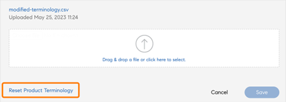

# 产品术语

>[!IMPORTANT]
>
>产品术语仅适用于英语版本的 Adobe Learning Manager。

## Adobe Learning Manager 中的产品术语是什么

Adobe Learning Manager 的用户界面使用的是一套标准术语。 作为管理员，您可以修改术语以符合公司的需要。

使用“产品术语”功能，您可以重命名这些术语，并与您组织的学习标准保持一致。

## 下载 CSV 文件的术语

要更改术语，请按以下步骤操作：

1. 以管理员身份选择 **[!UICONTROL 设置]** > **[!UICONTROL 常规]**.
1. 在 **[!UICONTROL 产品术语]**，选择 **[!UICONTROL 编辑]**.

   
   _产品术语_

1. 选择 **[!UICONTROL 在此下载]** 并下载术语模板。

   
   _下载模板_

## 更改术语

1. 下载 CSV 后，在第二列中更改所需的术语。 例如，您可以将“模块”更改为“培训”，或将“排行榜”更改为“排名”。

   
   _编辑csv_

1. 保存更改。

## 上传更新后的 CSV

1. 在 **[!UICONTROL 产品术语]** 部分，选择用于上传CSV的链接。

   
   _上传csv_

1. 上传更新后的 CSV。
1. 选择&#x200B;**[!UICONTROL “保存”]**。

术语的更改现在反映了该帐户的作者、学习者、经理、讲师或自定义管理员。

## 重置术语

上传包含新术语的 CSV 后，您可以将术语重置为默认术语。

选择&#x200B;**[!UICONTROL “重置产品术语”]**。

_重置产品术语_

单击该链接后，您会看到一条弹出的确认消息。

_确认提示_

术语将还原为初始名称。

## 不会更改的内容

术语更改不适用于：

* 电子邮件模板(**[!UICONTROL 管理员]** > **[!UICONTROL 电子邮件模板]**)

* 报告(**[!UICONTROL 管理员]** > **[!UICONTROL 报告]**)

