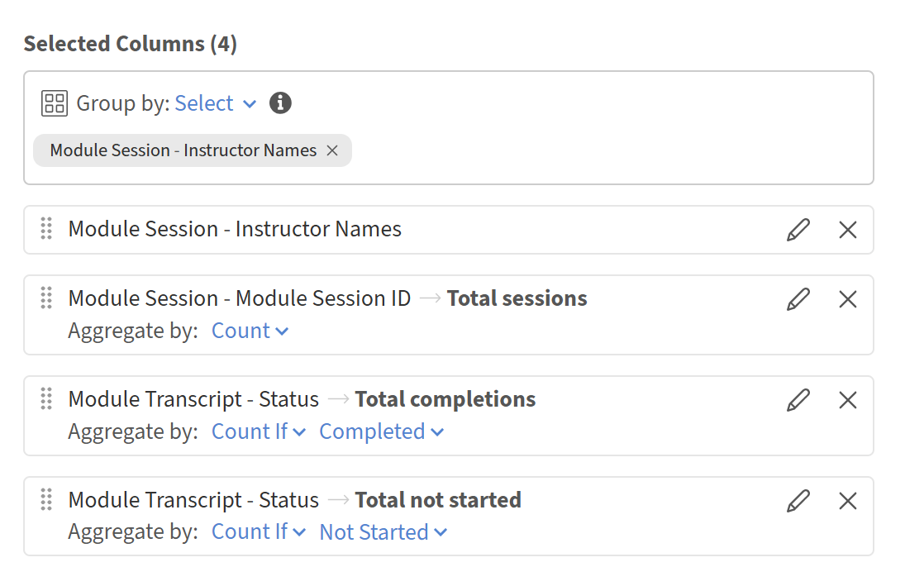

# 通过Report Builder查看讲师表现

## 概述

此报告可帮助培训经理确定哪些讲师最活跃、他们联系了多少名学习者以及多少学习者完成了他们提供的课程。

## 生成讲师效率报告

1. 启动Report Builder并选择&#x200B;**创建报告**。
2. 键入名称，例如&#x200B;**讲师效率**。
3. 从&#x200B;**模块**&#x200B;数据集中添加&#x200B;**讲师姓名**。
4. 从&#x200B;**模块**&#x200B;数据集添加&#x200B;**模块ID**。 你将汇总此信息以统计会话。
5. 从&#x200B;**模块成绩单**&#x200B;数据集添加&#x200B;**状态**。 计算完成数，则使用计数。
6. 选择&#x200B;**讲师姓名**&#x200B;上的&#x200B;**分组依据**。
7. 将&#x200B;**计数**&#x200B;应用于&#x200B;**模块ID**。 键入别名“会话总数”。
8. 将&#x200B;**计数if**&#x200B;应用于&#x200B;**状态**，选择已完成。 键入别名&#x200B;**总完成数**。
9. 若要同时显示注册总数，请再次添加&#x200B;**状态**。 应用&#x200B;**Count if**&#x200B;以不启动。 键入别名Total enrollments。

   

10. 将&#x200B;**讲师姓名**&#x200B;筛选为不为空。

    

11. 按&#x200B;**总完成数**&#x200B;排序，降序以首先呈现表现最好的讲师。

    

12. 选择&#x200B;**保存报告**&#x200B;并选择&#x200B;**操作** > **下载**&#x200B;以下载报告。

下载的报告通过比较每个讲师的培训课程总量、学习者完成情况和未开始注册情况，汇总了讲师效率，有助于评估参与情况、完成情况以及潜在的培训后续需求。

## 最佳实践

* 使用目录标签将讲师报告限定于特定的业务部门、地点或计划。 这比仅按目录名称过滤更精确。
* 添加日期筛选器（如过去90天中的&#x200B;**注册日期**），将报告范围限定为最近的期间而不是所有时间数据。
* 按有意义的度量排序，如&#x200B;**总完成数**，而不是按讲师姓名排序，因此性能差异立即可见。
