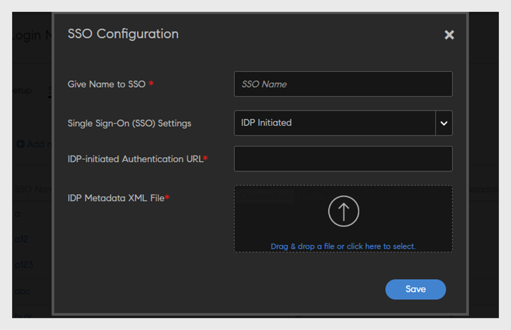

# 通过SAML设置界面语言

Adobe Learning Manager (ALM)现在接受语言的SAML属性。 然后将该属性映射到用户的界面和内容语言设置，确保以首选语言与LMS进行流畅的交互。 这些语言设置的配置通过身份和访问管理(IAM)平台进行管理，该平台利用用于单点登录(SSO)的SAML。 这同时支持由服务提供商(SP)发起和身份提供商(IdP)发起的登录，从而允许用户使用他们选择的语言查看界面和内容。 工作流程如下：

1. 在Okta中创建应用程序
2. 在Okta中添加用户
3. 在ALM中配置SSO

## 在Okta中创建应用程序

要在Okta中创建应用程序，请执行以下步骤：

1. 使用公司电子邮件在Okta中创建开发人员帐户，然后登录到您的帐户。
2. 选择&#x200B;**[!UICONTROL 应用程序]** > **[!UICONTROL 创建应用程序集成]**。
3. 选择&#x200B;**[!UICONTROL SAML 2.0]**，然后选择&#x200B;**[!UICONTROL 下一步]**。
4. 键入应用程序的名称，然后选择下一步。
5. 配置以下字段：

   * **[!UICONTROL 单点登录URL]**：键入要将应用程序链接到的特定域URL(例如，[https://learningmanagerstage.adobe.com/saml/SSO](https://learningmanagerstage.adobe.com/saml/SSO))。 如有必要，请更改环境URL。
   * **[!UICONTROL 受众URI （SP实体ID）]**：使用与上述相同的环境URL。
   * **[!UICONTROL 名称ID格式]**：选择电子邮件地址。
   * **[!UICONTROL 应用程序用户名]**：选择Okta用户名。

6. 在“属性语句”下，添加以下（或根据需要添加其他字段）：
   * **名称**：区域设置
   * **名称格式**：未定义
   * **值**： user.locale

7. 选择下一步，然后选择完成。
8. 完成后，向下滚动到“SAML签名证书”：

   * 查找状态为&#x200B;**[!UICONTROL 活动]**&#x200B;的行。
   * 选择&#x200B;**[!UICONTROL 操作]** > **[!UICONTROL 查看IdP元数据]**。
   * 这将在新选项卡中打开XML文件。 复制XML代码并在本地将其保存为.xml文件。

## 在Okta中添加用户

要在Okta中创建用户，请执行以下步骤：

1. 选择“**[!UICONTROL 目录]**”>“**[!UICONTROL 人物]**”，然后选择“**[!UICONTROL 添加人物]**”。
2. 键入用户的必要详细信息，然后选择&#x200B;**[!UICONTROL 保存]**。
3. 搜索并选择新用户的用户名。
4. 选择&#x200B;**[!UICONTROL 分配应用程序]**。
5. 选择您之前创建的应用程序，然后选择&#x200B;**[!UICONTROL 保存]**。
6. 导航到用户的配置文件，然后选择&#x200B;**[!UICONTROL 编辑]**。
7. 在“区域设置”字段中，键入所需的值（例如，fr_FR、en_US），然后选择&#x200B;**[!UICONTROL 保存]**。

## 在ALM中配置SSO

要在ALM中配置SSO，请执行以下步骤：

1. 以管理员身份登录。
2. 选择&#x200B;**[!UICONTROL 设置]** > **[!UICONTROL 登录方法]**。
3. 转到&#x200B;**[!UICONTROL 单点登录(SSO)配置]**&#x200B;选项卡。
4. 选择&#x200B;**[!UICONTROL 添加新的SSO配置]**。

   
   _在ALM中添加SSO_

5. 配置以下详细信息并选择保存。
   * 键入配置名称。
   * 从&#x200B;**[!UICONTROL 单点登录(SSO)设置]**&#x200B;下拉列表中选择&#x200B;**[!UICONTROL IDP Initiated]**。
   * 对于&#x200B;**[!UICONTROL IDP启动的身份验证URL]**：

      * 打开之前下载的元数据XML文件。
      * 搜索位置值并复制它。
      * 将此值粘贴到“IDP启动的身份验证URL”字段中。

   * 对于&#x200B;**[!UICONTROL 元数据XML文件]**：上载您之前下载的.xml文件。

6. 返回&#x200B;**[!UICONTROL 设置]**&#x200B;选项卡。
7. 从下拉列表中，选择&#x200B;**[!UICONTROL 单点登录配置]**。
8. 在&#x200B;**[!UICONTROL SSO设置]**&#x200B;下拉列表中，选择您之前创建的配置名称。
9. 选择&#x200B;**[!UICONTROL “保存”]**。

## 用户登录和语言设置

当用户通过SSO使用凭据登录时，从IDP传递的语言属性将映射到ALM中的用户界面和内容语言字段。 语言设置将立即反映在用户界面和内容中，而不需要任何缓存时间。

用户可以在用户配置文件部分中手动更新其语言设置。 这些手动更新的语言首选项将保持有效，并且不会在将来登录期间被IDP设置覆盖。

如果从ALM中软删除用户，则语言设置将保留在数据库中。 再次添加同一用户时，将恢复之前设置的语言。

管理员可以检查“用户活动”、“学习摘要”和“合规性信息板”报告，以了解特定语言的详细信息。

