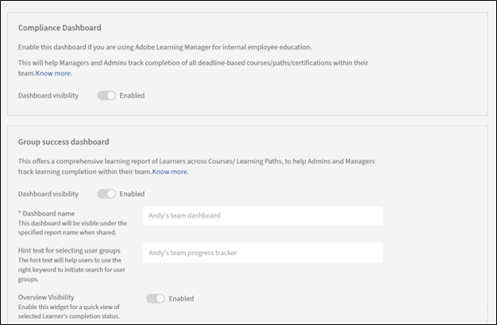

# Adobe Learning Manager中的高级设置

## 目录标签

Adobe Learning Manager中的目录标签用于标记学习对象（课程、认证、学习路径等） 具有特定字段和值。 这些标签可帮助您和作者有效地对内容进行分类和整理，从而更好地进行过滤、跟踪和报告。

有关详细信息，请参阅[Adobe Learning Manager中的目录标签](/help/migrated/administrators/feature-summary/catalog-labels.md)。

>[!NOTE]
>
>* 强制性标签：您可以选择在创建课程期间将目录标签设为作者必须使用的标签。
>* 作者工作流程：作者必须在创建或编辑课程时添加合规性标签以确保正确分类。

## 内容文件夹

内容文件夹允许您通过创建专用或公用文件夹来组织和管理内容。 此功能确保只有特定的作者或组才能访问内容，从而更好地控制内容的可视性和管理。

**关键点：**

文件夹是内容存储库，也是帐户中具有以下属性的整个内容库的子集：

* 只有您（管理员）才能创建、编辑或删除文件夹。
* 您只能在定义自定义管理员角色时控制对文件夹的访问。
* 内容必须始终与至少一个文件夹关联。 首先，所有内容都将与公用文件夹关联，以后可以更改公用文件夹。
* 您可在创建文件夹内容时将其与多个文件夹关联，此操作也可通过复制实现
* 所有文件夹名称在帐户中必须唯一，否则命名文件夹时会出错。

文件夹仅控制内容的可见性，而不会创建内容副本。 因此，因此编辑后的内容会反映在所有关联的文件夹中。

**公用文件夹**

公共文件夹始终存在于帐户中，并且所有内容最初都将属于此文件夹。 稍后，作者可以将内容从此文件夹移动到其他文件夹。 公共文件夹具有以下属性：

* 默认情况下，所有类型的作者都可以访问与此文件夹关联的所有内容。
* 公共文件夹中包含的任何内容都不能归入任何其他文件夹。 反之亦然。

此文件夹不能为可配置角色定义的一部分。 因此，可配置角色定义中不含公共文件夹将不会限制公共文件夹的访问权限。

**专用文件夹**

您创建的任何文件夹都是专用文件夹。

**添加内容文件夹**

要添加内容文件夹，请执行以下步骤：

1. 选择&#x200B;**[!UICONTROL 设置]** > **[!UICONTROL 内容文件夹]**。
2. 选择&#x200B;**[!UICONTROL 添加]**&#x200B;以创建新文件夹。
3. 键入要创建的文件夹的名称和说明。

   

4. 选择&#x200B;**[!UICONTROL 保存]**&#x200B;以创建文件夹。

**文件夹操作**

* **[!UICONTROL 添加文件夹]**：要添加文件夹，请选择该文件夹，然后选择屏幕右上角的&#x200B;**[!UICONTROL 添加]**。
* **[!UICONTROL 删除文件夹]**：要删除文件夹，请选择要删除的文件夹，选择&#x200B;**[!UICONTROL 操作]**&#x200B;菜单，然后选择&#x200B;**[!UICONTROL 删除文件夹]**。

## 教室位置

创建和管理物理或虚拟教室位置库。 作者和管理员可以使用这些位置来设置讲师主导的培训(ILT)事件。 该功能可确保预先配置并轻松访问教室详细信息，例如名额限制和位置信息。

有关详细信息，请参阅[在Adobe Learning Manager中添加教室位置](/help/migrated/administrators/feature-summary/classroom.md)。

## 报告

通过此部分，您可以配置合规性和组成功信息板。

有关更多信息，请参阅以下内容：

* [合规性信息板](/help/migrated/administrators/feature-summary/reports.md#compliance-dashboard)
* [组成功信息板](/help/migrated/administrators/feature-summary/group-success-dashboard.md)

