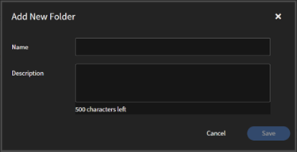

# Adobe Learning Manager中的高级设置

## 目录标签

Adobe Learning Manager中的目录标签用于标记学习对象（课程、认证、学习路径等） 具有特定字段和值。 这些标签可帮助您和作者有效地对内容进行分类和整理，从而更好地进行过滤、跟踪和报告。

有关详细信息，请参阅[Adobe Learning Manager中的目录标签](/help/migrated/administrators/feature-summary/catalog-labels.md)。

>[!NOTE]
>
>* 强制性标签：您可以选择在创建课程期间将目录标签设为作者必须使用的标签。
>* 作者工作流程：作者必须在创建或编辑课程时添加合规性标签以确保正确分类。

## 内容文件夹

Adobe Learning Manager中的内容文件夹控制哪些作者可以查看和访问内容库中的内容。 使用分层内容文件夹，管理员可以将大型内容库组织为最多三个级别的嵌套专用文件夹，从而更轻松地在整个组织内查找、管理和重复使用内容。

### 什么是内容文件夹

内容文件夹是对相关内容进行分组的容器，它确定谁可以访问它。 Adobe Learning Manager中的每个内容文件都始终属于至少一个文件夹。

内容文件夹有两种类型：

默认情况下，**公用文件夹** — 存在于每个帐户中。 公用文件夹具有以下属性：

* 帐户中的所有作者都可以访问公共文件夹中的内容。
* 公用文件夹中的内容不能位于任何专用文件夹中。 反之亦然。 专用文件夹中的内容不能位于公用文件夹中。
* 公用文件夹不是基于角色的访问配置的一部分。 将自定义角色限制为特定的专用文件夹不会限制对公用文件夹的访问。

**私有文件夹** — 由管理员创建。 专用文件夹支持三级层次结构，其访问通过角色配置进行控制。

**了解文件夹层次结构级别**

私人内容文件夹最多支持三个嵌套级别：

* **1级文件夹** — 位于内容库根目录下的顶层文件夹

* **2级文件夹** — 嵌套在1级文件夹中的子文件夹

* **3级文件夹** — 嵌套在2级文件夹内的子文件夹

此结构使企业可以灵活地按主题区域、交付类型、受众或团队来镜像真实的内容组织，而不是管理平面列表中的数千个文件。

>[!NOTE]
>
>只有管理员才能创建、编辑或删除任何级别的文件夹。 有权访问任何根级别文件夹的自定义管理员可以创建、编辑或删除该根文件夹下的文件夹。

### 文件夹命名规则

同一父文件夹下的同一层中的文件夹名称必须是唯一的。 具体包括：

| **方案** | **允许？** |
|----------------------------------------------------------------------------------------------|--------------------------|
| 两个同名的1级文件夹 | 否 |
| 位于同一“1级”文件夹下的两个同名的“2级”文件夹 | 否 |
| 位于同名的不同级别1文件夹下的两个级别2文件夹 | 是 |
| 同名的2级文件夹和3级文件夹 | 是。 级别不同 |
| 同一2级文件夹下的3级文件夹和另一个3级文件夹，名称相同 | 否 |

### 文件夹路径如何显示

内容库将显示每个内容文件的完整文件夹路径。 例如，**培训方案** / **入职** / **SCORM资源**。 此路径显示内容的完整位置。

如果文件存在于多个文件夹中，则所有路径都以逗号分隔。 如果路径很长，则会从开头以省略号(...)截断它，并且始终显示最深的文件夹名称。

### 基于角色访问文件夹

仅在&#x200B;**级别1**&#x200B;分配对专用文件夹的访问权限。 向自定义角色授予对1级文件夹的访问权限后，该访问权限会自动级联到其中的所有2级和3级子文件夹。 没有在子文件夹级别单独授予访问权限的选项。

下表介绍了每个角色可以对文件夹层次结构执行哪些操作。

| **角色** | **他们能做什么** |
|-----------------|-----------------------------------------------------------------------------------------------------------------------------------------------------------|
| 管理员 | 创建、重命名和删除1级、2级和3级专用文件夹；为自定义角色配置1级文件夹访问权限 |
| 自定义管理员 | 管理可访问的级别1分支中的文件夹，具体取决于为其分配的权限 |
| 作者 | 浏览文件夹、按文件夹过滤内容、向文件夹添加内容、在文件夹之间复制和移动内容、向课程添加模块时选择内容 |
| 自定义作者 | 与作者相同，但仅限通过他们分配的1级权限访问的文件夹 |

### 文件夹结构限制

| **限制** | **值** |
|---------------------------------------|-----------|
| 每个帐户的1级文件夹 | 无限制 |
| 每个1级文件夹的2级子文件夹 | 25 |
| 每个2级文件夹的3级子文件夹 | 25 |
| 最大文件夹深度 | 3级 |

### 何时使用分层文件夹结构

当您的组织管理许多内容文件并需要一种结构化的方法来导航、重用和控制对它们的访问时，分层内容文件夹尤其有用。

常见情景包括：

* **大型内容库**：当您拥有数千个内容文件时，作者可以使用三级层次结构直接导航到他们需要的内容，而不是滚动浏览平面列表。

* **多个团队或项目**：级别1文件夹可以分隔团队或项目区域；级别2文件夹可以按交付类型组织；级别3文件夹可以容纳单个资源。

* **基于角色的内容分离**：当不同的作者团队应仅访问与其工作相关的内容时，级别1文件夹访问分配会使每个团队的内容保持私密。

### 分层内容文件夹的真实使用案例

**用例1 — 具有特定于管辖区的内容的合规性培训**

一家全球公司跨多个区域运行强制性合规性培训。 每个地区都有适用于每个人的核心模块，以及一些特定于司法辖区的法律附录，例如数据隐私法规、当地劳动法、财务披露要求，这些要求因国家或地区而异。

如果没有分层文件夹，所有合规性资源都将位于一个平面列表中，这使得区域内容团队很难了解哪些文件属于哪个计划或管辖区。

采用三层结构：

* 级别1：合规性培训

* 第2级：欧洲、中东和非洲/亚太地区/美洲（每个区域一个子文件夹）

* 第3级：每个区域的特定模块或资产（隐私法规PDF、本地政策工具包、评估文件）

如果区域作者是自定义角色，则在创建自定义角色期间只能选择1级文件夹。 无法选择2级文件夹。 他们只能查找、更新和重复使用与其管辖范围相关的资源，而不会看到或不小心修改了其他区域的内容。

**用例2 — 有许多角色的大型入门计划**

一个组织每年将数千名员工纳入董事会中，这些员工分别担任以下不同角色：个人贡献者、经理、承包商和技术专家。 每个角色都有自己的入门培训方向，包括共享的基础内容和特定于角色的模块。

采用三层结构：

* 第1级：入职

* 第2级：角色（个人投稿人/经理/承包商/技术专家）

* 第3级：模块类型（ SCORM包/ ILT工具包/活动指南/评估）

为各个角色构建课程的作者可直接导航至第2级，并找到该培训课程的确切文件。 在跨角色（如公司价值视频）重复使用模块时，可以将模块复制或链接至多个文件夹，而无需创建重复项。 内容将保持单一来源，但将显示在所有相关分支中。

**用例3 — 包含多个内容团队的大量技术技能库**

一家技术公司维护着一个内部技能培训库，其中包含跨产品线、云基础架构、开发人员工具、安全性和数据工程的数千个内容文件。 多个作者团队贡献内容，每个团队负责一个产品领域。 课程模块每个课程可以运行40-60个文件。

如果没有层次结构，数千个文件将位于几个顶级文件夹中，并且来自不同团队的作者会频繁选择错误的文件版本或不小心覆盖共享资源。

采用三层结构：

* 第1级：产品领域（云/开发工具/安全性/数据工程）

* 2级：课程名称

* 级别3：资源类型（视频/PDF/SCORM/测验）

每个产品团队仅被授予对其1级文件夹的访问权限。 要找到特定课程的特定测验，需要导航至恰到好处的3级文件夹，而不是在数千个文件中搜索。 当安全团队更新SCORM包时，他们知道该包位于“安全性”>“[课程名称]”>“SCORM”中，并且无法意外降落到其他团队的分支中。

### 以管理员身份管理内容文件夹

作为Adobe Learning Manager中的管理员，您可以创建和维护内容文件夹层次结构、控制哪些自定义角色有权访问特定文件夹以及管理文件夹名称和删除。 作者可以将内容添加到文件夹并在层次结构中整理内容，但只有管理员才能创建、重命名或删除文件夹。

#### 创建内容文件夹

>[!NOTE]
>
>同一父级下同一级别的两个文件夹不能共享名称。 同一名称允许用于不同的分支或不同的级别。

1. 以管理员身份登录Adobe Learning Manager 。
2. 在左侧导航栏中，选择&#x200B;**配置** > **设置**。
3. 在&#x200B;**高级**&#x200B;部分下，选择&#x200B;**内容文件夹**。
4. 选择页面右上角的&#x200B;**添加**。 将打开&#x200B;**添加新文件夹**&#x200B;对话框。
5. 为文件夹输入名称和说明（可选）。
6. 选择&#x200B;**“保存”**。 文件夹即创建并显示在文件夹列表中。

#### 创建子文件夹

1. 在&#x200B;**内容文件夹**&#x200B;页面上，找到父文件夹。
2. 选择文件夹名称旁边的&#x200B;**创建子文件夹**&#x200B;选项。
3. 输入子文件夹的名称和说明（可选）。
4. 选择&#x200B;**“保存”**。 子文件夹在文件夹列表中以缩进形式显示在父文件夹下方。

>[!NOTE]
>
>每个文件夹最多可包含25个直接子文件夹。 级别3是最大深度。 不能在3级文件夹内创建子文件夹。

#### 重命名文件夹

1. 在&#x200B;**内容文件夹**&#x200B;页面上，选择要重命名的文件夹。 该文件夹将在编辑模式下打开。
2. 更新文件夹名称和（如果需要）说明。
3. 选择&#x200B;**“保存”**。 该文件夹将使用新名称保存。

#### 删除文件夹

在删除之前，请注意以下规则：

* 您可以在任何级别删除空文件夹。
* 只能删除空文件夹。 无法删除包含内容的文件夹，无论该内容是否链接到其他文件夹。
* 如果父文件夹及其所有子文件夹都为空，则删除父文件夹会删除其所有子文件夹。 选择父文件夹将自动选择其所有子文件夹。

#### 删除父文件夹

1. 在&#x200B;**内容文件夹**&#x200B;页面上，选中要删除的每个文件夹旁边的复选框。
2. 选择页面右上角的&#x200B;**操作** > **删除文件夹**。
3. 出现提示时，确认删除。 父文件夹中的所有子文件夹也将被删除。

#### 删除子文件夹

1. 在&#x200B;**内容文件夹**&#x200B;页面上，选中要删除的子文件夹旁边的复选框。
2. 选择页面右上角的&#x200B;**操作** > **删除文件夹**。
3. 出现提示时，确认删除。 子文件夹即被删除。

#### 配置自定义角色的文件夹访问权限

您可以将自定义角色限制为特定的1级文件夹，以便具有这些角色的自定义管理员和作者仅查看与其相关的内容。

仅在&#x200B;**1级文件夹级别**&#x200B;设置访问权限。 向级别1文件夹授予自定义角色访问权限时，该角色将自动获得对其中所有级别2和级别3子文件夹的访问权限。 您不能在子文件夹级别上单独分配访问权限。

1. 在左侧导航栏中，选择&#x200B;**用户** > **自定义角色**。
2. 打开要配置的自定义角色或创建新角色。
3. 在&#x200B;**帐户权限**&#x200B;下，找到&#x200B;**内容文件夹**&#x200B;部分。
4. 选择&#x200B;**所选文件夹**。
5. 选择此角色应有权访问的1级文件夹。
6. 选择&#x200B;**确定**。

具有此角色的用户只能看到所选的1级文件夹及其子文件夹中的内容。 他们仍无法访问其他专用文件夹和公共文件夹中的内容。

#### 最佳实践

以下做法可帮助您构建可扩展性好且易于导航的文件夹结构。

1. **在创建文件夹之前规划结构。** 一旦将内容组织到层次结构中，重组就要求移动大量内容。 在开始之前，确定第1级类别，如产品线、部门或培训计划。

2. **对有意义的分组使用三个级别。** 常见的模式是：范围较广的域或计划为级别1，交付类型或团队为级别2，单个资源为级别3。 例如：

   * 第1级：销售培训

   * 第2级：自学模块

   * 第3层：PDF资源

3. **在其父级中保持名称简短、描述性和唯一性。** 避免使用“Module 1”或“Content”等通用名称。 使用对浏览库的作者有意义的标识符。

4. **仅分配级别1的自定义角色访问权限。** 由于访问自动级联，因此在1级分配就足够了，而且使访问管理保持简单。 添加级别2或级别3子文件夹时，无需更新访问权限。

<!--

**Key points:**

A folder is a repository of content, which is a subset of the entire content library available in an account with the following properties:

* Only you (administrator) can create, edit, or delete a folder.
* You can control access to folders as part of defining roles only for custom administrators.
* Content must at all times be associated with at least one folder. To start with, all content will be associated with the public folder, which can later be changed.
* Content can be associated with multiple folders at the time of creation, which will also be possible by a copy operation
* All folder names must be unique within the account, otherwise there will be an error in naming a folder.

Folders only control visibility of content and don't create copies of content. Therefore, editing content will reflect in all the associated folders.

**Public folder**

A public folder is always present in an account and initially, all content will be part of this folder. Later, authors can move content out of this folder into other folders. A public folder has the following properties:

* All content associated with this folder will be accessible to all types of authors, by default.
* Any content that is a part of a public folder, cannot be part of any other folder. The converse also holds true.

This folder cannot be part of configurable role definition. Consequently, not having a public folder in configurable role definition doesn't restrict access to a public folder.

**Private folder**

Any folder created by you is a private folder.

**Add a content folder**

To add a content folder, follow the steps:

1. Select **[!UICONTROL Settings]** > **[!UICONTROL Content Folder]**.
2. Select **[!UICONTROL Add]** to create a new folder.
3. Type the name and description of the folder to be created.
 
    

4. Select **[!UICONTROL Save]** to create the folder.

**Folder operations**

* **[!UICONTROL Add a folder]**: To add a folder, select the folder, and then select **[!UICONTROL Add]** on the upper-right corner of the screen.
* **[!UICONTROL Delete a folder]**: To delete a folder, select the folder to delete, select the **[!UICONTROL Actions]** menu, and then select **[!UICONTROL Delete Folder]**.
-->

## 假日

Adobe Learning Manager中的&#x200B;**节假日**&#x200B;设置允许您定义整个组织的节假日。 讲师日历上会显示假日作为非工作日，这种情况会在安排实时讲师时影响讲师的可用性
中心会话。

### 要点

节假日是在帐户级别维护的一组非工作日，包括以下属性：

&#x200B;- 只有管理员才能添加、编辑或删除假日。

&#x200B;- 节假日适用于整个组织，并作为非工作日出现在每个讲师的日历上。

&#x200B;- 由于节假日会将讲师标记为不可用，因此无法在这些日期安排实时中心会话。

&#x200B;- 每个假日都需要一个日期和名称；说明是可选的。

&#x200B;- 您可以一次添加一个假日，也可以使用CSV文件一次导入多个假日。

&#x200B;- 添加假期后，假期会出现在&#x200B;**假期**&#x200B;页面上，您可以在其中查看、搜索和管理假期。

有关详细信息，请查看[管理假日](../../../getting-started-with-live-hub/manage-holidays.md)。

## 教室位置

创建和管理物理或虚拟教室位置库。 作者和管理员可以使用这些位置来设置讲师主导的培训(ILT)事件。 该功能可确保预先配置并轻松访问教室详细信息，例如名额限制和位置信息。

有关详细信息，请参阅[在Adobe Learning Manager中添加教室位置](/help/migrated/administrators/feature-summary/classroom.md)。

## 报告

通过此部分，您可以配置合规性和组成功信息板。

有关更多信息，请参阅以下内容：

* [合规性信息板](/help/migrated/administrators/feature-summary/reports.md#compliance-dashboard)
* [组成功信息板](/help/migrated/administrators/feature-summary/group-success-dashboard.md)
