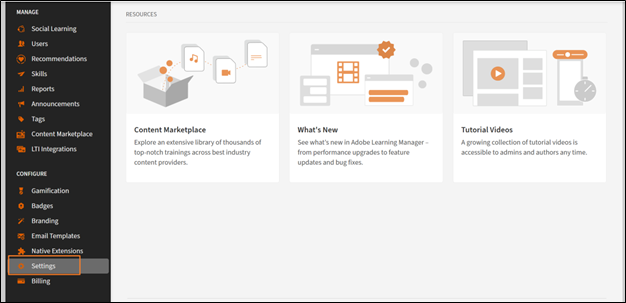

# Adobe Learning Manager中的基本设置

## 概述

基本信息部分是Adobe Learning Manager设置的基础，其中包含基本组织参数，这些参数定义了学习平台在不同区域、语言和业务上下文中的运行方式。

## 主要优点

* 提供特定于区域的内容交付和用户体验。
* 标准化时间显示、日期格式和货币表示形式。
* 为选定的时区提供自动的夏令时调整。
* 减少跨平台手动调整的需要。

## 配置基本设置

### 访问基本信息设置

1. 以管理员身份登录Adobe Learning Manager。
2. 在左侧导航栏中选择&#x200B;**[!UICONTROL 设置]**。

   

3. 在&#x200B;**[!UICONTROL 基本信息]**&#x200B;类别中选择&#x200B;**[!UICONTROL 基本信息]**。

   

4. 选择“**[!UICONTROL 更改]**”以修改基本设置。

### 更改基本设置

**国家/地区**

Adobe Learning Manager管理员设置中的国家/地区下拉列表允许您指定与其组织关联的国家或地区。 此设置用于本地化目的，可确保平台与区域首选项、合规性要求和时区保持一致。

**时区**

“时区”下拉菜单允许您定义平台的默认时区。 这可确保所有对时间敏感的活动（如课程表、截止日期和报告）都准确地与公司或学习者的当地时间保持一致。

**区域设置**

区域设置是指帐户的语言和区域设置。 区域设置下拉列表允许管理员配置向用户显示平台界面和内容时使用的语言。 此选项可确保学习者和管理员能以首选语言与平台交互。

**财政年度开始日期：**

通过此选项，您可以定义组织财务年度的开始月份。 例如，如果组织的财政年度从12月开始，则可以将该选项设置为12月。 然后，报告和分析将与这个财政期间保持一致。

**货币**

“币种”选项允许您定义帐户的默认币种。 此货币用于为学习对象（例如课程、学习路径和认证）定价。 例如，如果您的组织在美国运营，则可以将货币设置为USD ($)。 同样地，对于欧洲地区的运营，您也可以选择EUR (€)。

### 更改反馈设置

Adobe Learning Manager中的反馈设置为管理员提供了收集和管理学习者(L1)和经理(L3)反馈的工具。 这些设置可确保课程和学习目标得到有效评估，从而实现持续改进。

在开始从学习者那里收集有价值的见解之前，您需要启用L1反馈功能并设置其参数。 第一步包括导航到“反馈设置”区域，为所有新课程打开该功能，并为反馈表单选择主要语言。

### 启用L1反馈

在“L1反馈”选项卡上，找到标有“为新创建的课程和学习路径启用L1反馈”的切换开关。 选择开关以将其打开。 针对您创建的任何新课程，系统都会自动附上L1反馈表单。

**选择默认语言**

使用语言下拉列表为您的反馈表单选择默认语言。 这样可确保以正确的语言向学习者显示问题。

**配置不同课程类型的调查表**

Adobe Learning Manager允许您根据课程是自学模块还是讲师主导的教室会话自定义问题。 这将确保您收到的反馈具有特定性和相关性。 在此步骤中，您将选择并优化“自学课程”和“教室课程”的问题，以收集最有意义的数据。

**自学课程**：

* **必修问题**：调查表包含必修问题：“您向同事推荐此课程的可能性有多大？”。 这是一个标准的“净促进者得分”(NPS)问题，它提供了总体课程满意度的一项关键指标。
* **自定义问题**：查看所提供问题的列表。 要在反馈表单中包含问题，请确保其旁边的切换开关设置为“是”。 要删除问题，请将开关切换到“否”。
* **添加自定义问题**：如果您有其他特定于自学内容的问题，请选择“添加更多”链接，以创建新的自定义陈述式并将其添加到调查表。

**教室课程**：

* **自定义问题**：查看为基于课堂的培训定制的问题列表。 将每个问题旁的开关切换为“是”以包含该问题，或切换为“否”以将其从反馈表单中排除。
* **添加自定义问题**：若要添加特定于您的课堂环境或简化风格的新问题，请选择“添加更多”链接以创建这些问题并将其添加到列表中。

**设置反馈提醒**

为了最大限度地提高响应率，最好配置自动提醒。 此步骤向您介绍如何设置和计划这些提醒，并定义发送时间、重复频率以及持续时间。 通过主动提醒学习者，您可以显着增加收集的反馈。

1. **添加新提醒**：在&#x200B;**[!UICONTROL L1反馈提醒]**&#x200B;部分，选择&#x200B;**[!UICONTROL 添加新提醒]**。

   

2. **定义提醒计划**：在显示的&#x200B;**提醒设置**&#x200B;面板中，使用下拉菜单和输入字段配置提醒：

   a. **[!UICONTROL 发送时间]**：选择是在课程完成&#x200B;**[!UICONTROL 时]**&#x200B;发送提醒，还是在课程完成&#x200B;**[!UICONTROL 后]**&#x200B;发送提醒。
b. **[!UICONTROL 重复周期]**：选择提醒的频率（例如，每周）。
c. **[!UICONTROL 期限]**：指定发送提醒的总持续时间（以周为单位）（例如，4周）。

3. **[!UICONTROL 保存提醒]**：选择蓝色的复选标记图标以保存新的提醒配置。 如果需要，您可以重复此过程以添加更多提醒。

   

4. 选择页面右上角的&#x200B;**[!UICONTROL 保存]**&#x200B;以应用L1反馈设置。

### 启用L3反馈

在收集学习者经理的反馈之前，您需要配置L3反馈设置。 第一步是导航到“反馈设置”页面，然后选择“L3反馈”选项卡。 在此处，您可以设置反馈请求的语言，并查看将发送给经理的主要问题。

**选择“L3反馈”选项卡**

选择“反馈设置”页面上的“L3反馈”选项卡。

**查看反馈陈述**

学习者的经理可请求L3反馈作为他们同意或不同意的单一声明。 提供的默认语句为：“参加培训后，员工的表现有了明显的改善。” 您可以编辑此声明以更好地满足组织的需求。

**选择默认语言**

选择语言下拉列表以选择反馈请求的默认语言。

**设置反馈提醒**

为确保经理及时提供反馈，您需要设置自动提醒。 此步骤涉及配置发送这些提醒的时间以及这些提醒的重复频率。 屏幕截图显示，可以将L3反馈提醒配置为在课程完成后发送一次，但您可以根据需要添加更多提醒。

1. **[!UICONTROL 添加新提醒]**：要创建新提醒，请选择&#x200B;**[!UICONTROL 添加新提醒]**&#x200B;链接。
2. **[!UICONTROL 定义提醒计划]**：在&#x200B;**[!UICONTROL 提醒设置]**&#x200B;面板中，选择下拉菜单和输入字段以配置提醒：
a. **[!UICONTROL 发送时间]**：选择发送提醒的时间。 选项为&#x200B;**[!UICONTROL 在课程完成时]**&#x200B;和&#x200B;**[!UICONTROL 在课程完成后]**。
b. **[!UICONTROL 重复周期]**：选择提醒的频率。 如果周期为&#x200B;**[!UICONTROL 一次]**，则表示经理将收到一个提供反馈的通知。 可用的选项有“一次”、“每天”、“每周”和“每月”。
3. 设置计划后，选择蓝色的复选标记图标以保存提醒配置。 提醒会显示在现有提醒列表中。

   

4. 选择页面右上角的&#x200B;**[!UICONTROL 保存]**&#x200B;以应用L3反馈设置。

## 常规设置

### 概述

Adobe Learning Manager中的常规设置让管理员能够集中配置整体学习者体验和管理流程。 这些设置允许您启用或禁用各种功能，以根据您组织的特定需求定制平台。

可配置的关键常规设置包括：

* **课程效果和审阅：**&#x200B;选择向学习者显示课程效果评级，并启用需要管理员审批才能审阅所有课程更改的功能。
* **学习者参与功能：**&#x200B;您可以启用或禁用以下功能：用于课程评论的&#x200B;**讨论区**、学习者来自外部源的技能以及&#x200B;**摘要电子邮件**，以便让学习者了解新内容和进度。
* **内容和课程管理：**&#x200B;设置允许为交互式电子学习配置&#x200B;**多次尝试**、向内容添加&#x200B;**唯一学习对象ID**&#x200B;以及设置&#x200B;**模块版本更新**&#x200B;的默认行为。
* **用户管理：**&#x200B;启用&#x200B;**自动注册用户**&#x200B;以自动向系统中添加新用户和&#x200B;**自动删除已处于非活动状态达指定时间的内部用户**。
* **自定义和显示**：您可以控制学习者看到的内容，例如启用或禁用&#x200B;**筛选面板**&#x200B;以进行搜索、显示&#x200B;**目录标签**&#x200B;以及自定义最多三个&#x200B;**页脚链接**。

### 课程审阅

课程审核允许您监督和管理作者对课程所做的更新。 这可确保管理员在将课程内容的任何更改发布给学习者之前审查并批准这些更改。 选择“课程审阅”要求作者在发布他们对课程所做任何更改的课程时征求管理员的批准。

作者更新课程，例如添加或删除模块并尝试发布课程时，

1. 只要作者重新发布包含更改的课程，您就会收到通知。
2. 选择通知以查看作者所做的更改。
3. 比较新旧内容。
4. 批准或拒绝更改：
a. 批准更改以重新发布更新后的课程。
b. 拒绝更改以保持课程的前一版本处于活动状态。
5. 无论决定是批准还是拒绝，作者都会收到您的决定的通知。

### 讨论区

学习者可通过Adobe Learning Manager中的“讨论区”选项参与与课程、模块或学习计划相关的讨论。 您可以启用和管理此功能以促进学习者之间的协作和知识共享。 讨论区与特定课程或模块相关联，从而使其具有上下文相关性。

作为学员，您可以使用“讨论”选项卡与其他学员以及您的讲师进行互动。 您可以流量与您查看或注册的任何课程相关的帖子。 如果管理员启用了课程讨论，您可以查看该课程的“备注”选项卡旁边的“讨论”选项卡。

选择课程的“讨论”选项卡后，您可以看到该课程中现有的帖子以及评论。 如果您已经注册了该课程，也可以发布帖子或评论让其他用户看见。 输入消息后，单击“发布”。 您的帖子必须至少包含10个字符。

帖子会立即显示在“讨论”选项卡中。 您可以按“最新在前”或“最早在前”的顺序对帖子进行排序，以及删除您自己发布的帖子。 即使在取消课程注册后，您仍可查看所有帖子以及删除您编写的帖子。

作为管理员，您可以主持讨论以确保相关性和适当性。 学习者会收到所属讨论中的回复或更新通知。

### 多次尝试

选择此选项后，作者可以在课程或模块级别设置可能的重复尝试次数。 学习者可以在完成后重新参加课程或评估。  对于包含测验、测试或需要评估的课程类型的课程，此设置很有用。

### 技能、标签、产品和角色的可见性

该选项决定学习者是否只能看到已分配的技能或标签，或属于学习者可见目录的技能或标签，或者所有技能和标签。 其中包括与课程或学习路径相关的技能、标签、产品和角色。

选择“**[!UICONTROL 编辑]**”以限制学习者可以看到的内容：

然后，学习者会探索他们可见的技能和标签，并订阅他们选择的技能。

### 学习对象的唯一 ID

您可使用该选项为每个学习对象（如课程、学习路径、认证或工作辅助）分配唯一标识符。 这可确保每个学习对象都有一个独特的ID，对于跟踪、报告以及与外部系统的集成非常有用。

启用后，作者会在创建学习对象时看到一个用于添加学习对象ID的字段。 他们可以相应地添加ID。 唯一ID适合与第三方系统集成，包括学习记录商店(LRS)和学习管理系统(LMS)。 凭借唯一的ID，您或作者还可以更轻松地搜索特定学习对象并通过学习者成绩单进行跟踪。

### 显示过滤器面板

通过此选项，您可以控制学习者应用程序中学习者可使用哪些过滤器选项。 这些过滤器可帮助学习者在学习者的“我的学习”和“目录”部分中优化搜索结果。 您可以选择以下筛选器选项：

* 群组
* 目录
* 类型
* 格式
* 持续时间
* 技能
* 技能级别
* 标签
* 价格
* 价格范围
* 位置
* 产品
* 推荐级别

>[!NOTE]
>
>默认情况下，**[!UICONTROL 格式]**&#x200B;和&#x200B;**[!UICONTROL 持续时间]**&#x200B;处于关闭状态，不会立即向学习者显示。 您必须明确选择它们。

### 产品术语

Adobe Learning Manager使用某些产品术语来定义学习对象，例如课程、学习路径或工作辅助。 您可以根据自己的喜好自定义英语和法语术语。 下载“产品术语”模板，然后将（例如）学习计划替换为“规定规则”。 同样，更改法语中类似的条目。 然后，上传修改后的模板，并选择“保存”以更新产品中的术语。

有关更多信息，请参阅Adobe Learning Manager中的产品术语。

### 模块版本更新

此选项允许管理员更新模块内容，而不会中断已注册包含该模块的课程的学习者的进度。 这样可确保学习者顺畅地继续学习旅程，同时作者也可以使内容保持最新。 启用该选项后，作者可以上传模块的新版本（例如，SCORM、AICC或xAPI包）以替换现有版本。

* 已开始该模块的学习者将继续使用他们注册的版本。
* 新学习者将自动访问更新后的版本。
* Adobe Learning Manager会跟踪模块的不同版本，以便进行报告和审核。

### 自动注册用户

将用户添加到系统后，您可使用此选项自动将用户注册到特定目录或学习内容。 这可确保用户无需手动干预即可立即访问相关学习材料。

* 新用户添加到系统后，会自动注册到预定义的目录或课程。
* 管理员可以定义规则，以根据角色、组或其他条件等用户属性，确定用户自动注册的目录或课程。 请参阅[Adobe Learning Manager中的学习计划](/help/migrated/administrators/feature-summary/learning-plans.md)或[在注册时自动将外部用户组注册到课程](https://elearning.adobe.com/2024/05/automatically-enroll-external-user-groups-in-courses-upon-registration/)，了解更多信息。

### 自动删除内部用户

如果用户未在指定持续时间内访问Adobe Learning Manager，此选项将删除用户。  指定用户无需登录Adobe Learning Manager即可访问的天数。 使用此选项，您还可以在指定时段后自动从系统中删除非活动内部用户。 这有助于通过删除不再处于活动状态的用户，维护干净有序的用户数据库。

* 系统会自动删除在定义持续时间内处于非活动状态的内部用户。
* 用户在删除之前会收到通知，因此可以登录并防止删除。
* 要恢复其访问权限，已删除的用户必须联系帐户管理员。

### 显示目录标签

作者可通过此选项在创建学习对象时设置目录标签。 然后，学习者会在学习者应用程序的“目录”部分中看到目录标签。 这些标签可帮助学习者识别并区分可用的各种目录。 如果取消选择该选项，课程或学习对象会移至默认目录。

### 自定义合规性类型

作者可利用此选项定义和管理根据其公司的特定要求定制的合规性类型，同时还能创建学习对象。 作者可以向他们创建的课程添加合规性标签和截止日期。
这对于根据独特的组织策略跟踪和强制执行员工合规性培训尤其有用。

### 学习者可以查看自己的成绩

选择此选项可确保学习者能够在其学习者成绩单中查看其测验分数。 成绩单中的Quiz_score、Quiz_score_max、Highest_Quiz_score和Highest_Quiz_score_max列可帮助学习者查看其测验分数。 这些分数可帮助学习者跟踪其进度并了解其表现。

如果取消选择该选项，则测验分数不会显示在学习者成绩单中。

### 摘要电子邮件

您可使用此选项向学习者发送摘要电子邮件，提供有关其学习活动、进度和近期截止日期的更新。 这些电子邮件旨在向学习者通知最新信息并参与其培训方案。 这些电子邮件会捕获学习者的活动，例如已完成的课程。

您可以在“电子邮件模板”设置中更改电子邮件的频率。 此外，您还可以自定义摘要电子邮件的内容，以包含与学习者相关的特定详细信息。

>[!NOTE]
>
>* 对于活跃帐户，系统默认禁用摘要电子邮件，您可以手动启用该功能。
>* 对于试用帐户，摘要电子邮件选项将保持禁用状态，且您无法启用该选项。

### 启用课程/学习路径/认证/工作辅助卡图标

该选项允许作者为不同类型的学习内容，在学习者的课程卡片上添加封面图像。 这些图像可帮助学习者轻松快速识别内容类型（例如，课程、学习路径、认证或工作辅助）。 创建学习对象时，作者可以将封面图像添加到课程中。

如果未选择该选项，卡片将不会显示任何图标。

### 页脚链接

使用此选项，您可以通过添加指向外部资源、公司网站或其他相关页面的链接来自定义学习者应用程序的页脚部分。 这些链接显示在学习者应用程序界面的底部，可用于快速访问重要信息。 这些链接可将学习者引导至外部网站、帮助页面或公司政策。 通过它们，学习者可以直接从应用程序轻松访问其他资源。

以下是自定义页脚链接的方法：

1. **[!UICONTROL 添加链接]**：选择&#x200B;**[!UICONTROL 添加更多]**&#x200B;并在指定字段中输入名称和URL或电子邮件ID。 确保URL以http://或https://开头。
2. **[!UICONTROL 跨区域设置复制]**：选择&#x200B;**[!UICONTROL 复制]**&#x200B;以跨所有区域设置级联更改，确保所有语言获得相同的名称和URL。
3. 选择&#x200B;**[!UICONTROL 保存]**&#x200B;以应用更改。

**其他选项：**

* 重置默认值：选择“重置”图标可恢复为“帮助”和“联系管理员”字段中的默认值。
* 为所有语言自定义：从下拉列表中选择一种语言，然后添加该语言的名称和URL。 保存更改以更新选定语言的页脚链接。

### 报告时区

您可使用此选项设置帐户级首选项，以在特定时区导出“学习成绩单”和“会话摘要”报告。 可用选项包括：

* UTC（默认行为）
* 帐户级时区首选项

此选项还可确保使用作业API下载的学习者成绩单反映所选时区。

### Badgr 集成

选择该选项后，学习者可以：

* 将其徽章上传到Badgr网站。
* 在社交媒体上分享徽章。

工作原理：

* 在Badgr集成部分选择该选项。
* 学习者从Adobe Learning Manager中登录其Badgr帐户。
* 在Adobe Learning Manager中获得的徽章会自动上传到Badgr帐户。

>[!NOTE]
>
>* 在集成过程中，Adobe Learning Manager不提供Badgr帐户。 学习者必须创建自己的Badgr帐户。
>* 学习者可以直接从学习者应用程序的“徽章”页面配置其Badgr帐户。

有关详细信息，请参阅[Badgr支持](/help/migrated/learners/feature-summary/badges.md#support-for-badgr-badges)徽章。

### 显示评级

通过此选项，您可以在学习者应用程序中启用或禁用课程分级的显示。 启用后，学习者可以查看课程评分，这有助于他们在知情的情况下决定是否注册课程。

* 如果选择“课程效果”选项，学习者将只能看到课程效果值。 课程效果会根据学习者反馈(L1)、测验分数(L2)和经理反馈(L3)计算。
* 如果选择“星级评分”选项，学习者将只能查看平均星级和已对课程进行评级的学习者人数。 星级评分是学习者完成课程后给出的所有评分的平均值。

对于新帐户， “显示评级”部分将默认启用“星级评分”选项。

对于现有帐户，如果帐户以前启用了“课程效果”选项，则将启用“显示评级”部分，并选择“课程效果”选项。 如果禁用“课程效果”选项，则“显示评级”部分也将禁用。 启用“显示评级”部分后，默认情况下将启用“星级评分”选项。

### 默认视图（学习者角色）

该选项是指学习者对课程目录的视图。 选中列表视图复选框，将学习者的视图从默认网格视图更改为列表视图。

### 学习路径

如果选择&#x200B;**[!UICONTROL “启用学习路径的扩展功能”]**，则可以在学习路径中加入学习路径，并将这些学习路径与课程相结合。 该选项不可逆。

### 讲师管理

此选项可确保作者可以从预先确定的列表中选择虚拟教室或教室会话的讲师。

**主要功能：**

* 限制讲师选择：只能将具有讲师角色的用户分配给会话。
* 对迁移工作流程的影响：此限制不适用于迁移工作流程。

### 模块预览

如果选择“启用”，作者在创建课程后即可以学习者身份预览课程。

### 启用课程/学习路径/认证的定价

您可使用此选项启用课程、学习路径和认证的电子商务功能。 此功能主要用于将Adobe Learning Manager与Adobe Commerce集成，使企业能够将其培训产品盈利。
启用该功能后，“货币”字段即会显示在“基本信息”页面上。

如果课程收费，作者可以指定课程、学习路径或认证价格。 学习者可以直接从Adobe Learning Manager或[自定义构建的AEM站点](/help/migrated/integrate-aem-learning-manager.md)购买培训。

>[!NOTE]
>
>某些类型的培训无法购买，例如循环认证和经理批准的课程。

### 启用多物料SKU购物车

通过此选项，学习者可以将多个培训项目（课程、学习路径、认证）添加到购物车并一起购买。 此功能是与Adobe Commerce集成的电子商务功能的一部分。

对于销售多个培训项目并希望简化学习者购买流程的组织，此功能尤为有用。

**主要功能：**

* 多次购买：学习者可以将多项商品添加到其购物车中，并在同一笔交易中进行购买。 有关更多信息，请参阅Multi-item cart。
*简化的结帐流程：减少学习者购买每个培训项目的需求。
* SKU管理：管理员可以管理课程、学习路径和认证的SKU，以确保正确跟踪和报告。

### 播放器设置

此选项允许作者在课程级别为不同课程自定义流体播放器。 作者可以配置培训内容在播放器中向学习者显示的方式。 这包括与内容语言、界面首选项和播放选项相关的设置。

### 经理可将内容标记为“完成”

经理可利用此选项标记其员工的课程、认证或学习路径的完成情况。 如果学习者已完成平台外的培训或需要手动干预以更新其进度，此功能非常有用。
经理可以通过以下方式标记课程完成情况：

* 清单模块：清单模块允许经理根据特定任务或标准评估学习者的表现。 作者必须在创建课程期间启用此模块，并将经理分配为审阅人。
* 课程页面：在课程页面上：
a.    选择左侧窗格中的&#x200B;**[!UICONTROL 学习者]**&#x200B;选项卡。
b.    选择要标记出勤情况的学习者。
c.    选择&#x200B;**[!UICONTROL 操作]** > **[!UICONTROL 标记完成]**。

**其他注释：**

* 经理还可以导出学习者列表以供报告。
* 如果课程包含多个实例，经理可以分别查看和管理每个实例的学习者。

### 弃用

该选项允许作者弃用不再相关或不再需要的培训内容（课程、学习路径、认证）。 已停用内容将从学习者目录中删除，但仍可在报告和历史数据中访问以用于跟踪。 您有两种选择：

1. 弃用后，已注册的学习者可以查看和执行操作，但尚未注册的学习者将失去访问权限：
a. 已注册的学习者：
i. 已注册已弃用课程或学习路径的学习者仍可访问内容。
ii. 他们可继续执行操作，如完成课程或查看材料。
b. 尚未注册的学习者：
i. 课程或学习路径弃用前未注册的学习者将无法再在目录中看到内容。
ii. 他们将完全无法访问已弃用的内容。
2. 弃用后，已注册和未注册的学习者都将失去访问权限：
a. 已注册的学习者：
i. 课程或学习路径中已注册的学习者将无法再访问停用的内容。
ii. 他们将无法再查看已停用内容或对已停用内容执行任何操作。
b. 尚未注册的学习者：
i. 尚未注册课程或学习路径的学习者也将失去访问权限，因为内容将不再出现在目录中。

### 自动弃用

作者可利用此选项为课程设置自动弃用的特定日期。 课程停用后，新注册人员将无法再使用该课程，但已注册的学习者仍然可以访问并完成课程。

主要注意事项：

* 设置“自动弃用”日期后，课程将在指定日期自动切换到“弃用”状态。
* 已弃用的课程在新学习者的课程目录中不可见，但现有学习者仍然可以访问和完成这些课程。

### 在搜索结果中显示所有已注册的课程

即使学习者属于已注册的学习路径或认证，也可使用此选项在搜索结果中查看课程。

### 技能导入

此选项允许您使用各自的连接器从外部来源（例如LinkedIn Learning和Go1）导入技能。 此功能将外部技能云和人才管理系统集成到Adobe Learning Manager中，增强了平台有效管理和利用技能的能力。

来自外部内容提供商的技能将会添加到Adobe Learning Manager中管理员定义的技能存储库中。 作者可在课程创建工作流程中使用这些技能。

1. 选择&#x200B;**[!UICONTROL 启用]**。

   

2. 从&#x200B;**[!UICONTROL 选择技能源]**&#x200B;下拉菜单中选择内容提供方。
3. 选择&#x200B;**[!UICONTROL “保存”]**。
请注意，启用该选项后，操作不可逆。 以后无法禁用或更改为其他源。

