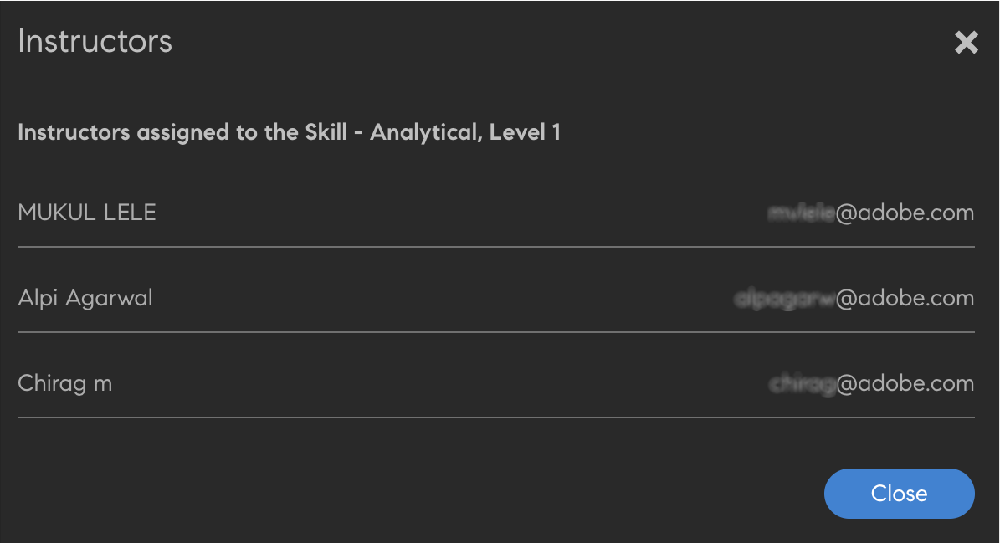

# 创建、修改技能和级别

创建、分配和修改技能和级别。

技能图是公司中员工的一组技能集、知识和特质。这些技能图能帮助公司对其员工设置或提升预期表现。技能可让员工将自身表现符合公司的期望。

Adobe Learning Manager 能让您使用技能图根据学习者的技能集来查看其表现。学习者完成参加课程后，可以查看技能图了解其对于每个技能的立场。

在 Adobe Learning Manager LMS 中，技能的根本目的是为管理员提供一种将学习与业务目标进行对应的工具。

## 添加技能 {#addaskill}

管理员可以执行以下操作：

* 映射域到技能。
* 添加多个技能级别。
* 添加级别徽章。

要添加技能，请执行以下步骤：

1. 在左侧窗格中，单击&#x200B;**[!UICONTROL “技能”]**。为技能命名并添加描述。

   

   *添加技能的名称和描述*

1. 为技能分配域。 创建技能时，可将其映射到Learning Manager支持的最相关技能域。 有关更多信息，请参阅&#x200B;[***映射域到技能***](/help/migrated/administrators/feature-summary/curation-skills.md)。

   在字段中键入域，即可以看到相应的建议。选择与技能相关的选项。

   

   *添加域*

1. 为技能分配级别。要添加级别，请单击&#x200B;**[!UICONTROL “添加”]**。

   您可以创建技能并分配给学习者。每项技能可有多个不同级别，每个级别都需要获得一定数量的积分。

   每项技能最多可以分配三个级别。学习路径是指将学习者注册到各种学习对象，然后转化成各种技能级别所要求的一定数量的积分。

   在完成这些学习对象和相应级别后，学习者即可具备比以前更高的效率水平。

   

   *添加技能级别*

   添加技能时，可以同时向积分分配小数。积分最多显示两位小数。

   小数支持仅在英文版中提供。

1. 选择级别对应的徽章。从&#x200B;**[!UICONTROL “徽章”]**&#x200B;下拉列表中，选择该级别徽章必须使用的图像。
1. 要保存更改，请单击&#x200B;**[!UICONTROL “保存”]**。

   创建技能后，您可以在&#x200B;**[!UICONTROL “技能”]**&#x200B;页面上找到新创建的技能。还可以查看该技能的域和简要描述。您还可以查看相关级别以及每个级别所分配的积分。

   

   *查看OIF技能列表*

## 向学习者分配技能 {#assigntheskilltolearners}

管理员可以向学习者分配相应的技能。

创建并保存技能后，它们即会显示在技能页面中。现在，您可以按以下步骤向学习者分配这些技能：

1. 在&#x200B;**[!UICONTROL “技能”]**&#x200B;页面上，单击包含该技能注册学习者人数的超链接。对于新创建的技能，所有级别的学习者人数均为零。

   

   *查看已分配给技能的学习者*

   在此例中，为级别 1 添加学习者。单击“级别 1”旁边的超链接。

1. 在“学习者”对话框中，单击&#x200B;**[!UICONTROL 添加学习者]**。

   

   *添加学习者*

1. 搜索并添加相应的学习者。您也可添加用户组。

   

   *搜索并添加学习者*

1. 要保存更改，请单击&#x200B;**[!UICONTROL “保存”]**。

   分配完学习者后，默认情况下，用户组中的所有学习者（如有）将会自动注册该技能。您可以单击&#x200B;**[!UICONTROL “自动注册”]**&#x200B;按钮使学习者选择退出自动注册。

   

   *禁用自动注册*

   个别学习者可以自行自动注册，或由管理员注册学习计划。

1. 单击&#x200B;**[!UICONTROL “关闭”]**&#x200B;后，您可以查看分配到您所创建技能的学习者总数。

   在此例中，共有两名个人学习者和三名位于用户组中的学习者。

   

   *分配给某项技能的学习者数*

## 向课程分配技能 {#assignskilltocourse}

在您创建技能后，作者可以创建课程，并将该技能分配给其课程。

*为课程分配技能*

在作者发布课程后，您可在&#x200B;**[!UICONTROL “技能”]**&#x200B;页面上查看与某一技能级别相关的课程计数，您将此技能分配到新课程时，该计数会增加。

*与技能级别关联的课程数*

## 为技能分配工作辅助 {#assignajobaidtotheskill}

工作辅助是学习者无需注册任何学习对象（例如课程或学习计划）即可访问的培训内容。

在创建工作辅助时，作者可以将某一技能级别与其相关联。创建一个不含技能的工作辅助并将其与包含技能的课程相关联，并不会将此技能与此工作辅助关联到一起。

*创建工作辅助*

在&#x200B;**[!UICONTROL “技能”]**&#x200B;页面上，您可以查看与该技能级别相关的工作辅助数量。

*技能的工作辅助数*

## 搜索技能 {#searchskill}

键入技能名称并从当前选项中选择技能，以搜索任何技能。 预键入搜索也同样适用。

您可以在“技能”页面的&#x200B;**[!UICONTROL “活动”]**&#x200B;和&#x200B;**[!UICONTROL “弃用”]**&#x200B;部分中搜索技能。

## 编辑技能 {#editaskill}

在&#x200B;**[!UICONTROL “技能”]**&#x200B;页面上，单击需要修改的技能。在 **[!UICONTROL 编辑技能]** 进行必要的更改，例如，

* 添加或删除技能域。
* 编辑技能的名称和描述。
* 添加技能级别或修改现有级别。
* 添加或删除某一技能的徽章。

完成相应更改后，单击&#x200B;**[!UICONTROL “保存”]**。

## 弃用技能 {#retireaskill}

要弃用技能，在&#x200B;**[!UICONTROL “技能”]**&#x200B;页面上，选择需要弃用的技能。

在页面右上角的&#x200B;**[!UICONTROL “操作”]**&#x200B;菜单中，单击&#x200B;**[!UICONTROL “弃用”]**。

弃用某项技能后，该技能即不再显示在课程中。

弃用某项技能后，它无法与任何课程或工作辅助相关联，也无法分配给学习者，直到其重新发布为止。现有的关联和分配关系不会受技能弃用的影响。

## 重新发布技能 {#republishaskill}

弃用某项技能后，所弃用的技能会显示在&#x200B;**[!UICONTROL “已弃用”]**&#x200B;选项卡中。该选项卡会显示所有已弃用技能的列表。

要重新发布弃用的技能，请选择该技能，然后从&#x200B;**[!UICONTROL “操作”]**&#x200B;菜单中单击&#x200B;**[!UICONTROL “重新发布”]**。

这样将恢复该技能，您可在&#x200B;**[!UICONTROL “活动”]**&#x200B;选项卡中再次看到该技能。

## 删除技能 {#deleteaskill}

您只能删除之前已弃用的技能。

在&#x200B;**[!UICONTROL “已弃用”]**&#x200B;选项卡中，选择需要删除的技能，然后从&#x200B;**[!UICONTROL “操作”]**&#x200B;菜单中单击&#x200B;**[!UICONTROL “删除”]**。

您仅可删除未与任何学习者、课程或工作辅助相关联的技能。

## 向讲师分配技能

添加包含讲师技能的 CSV 文件。 然后，这些技能会添加到技能列表中。

1. 在屏幕右上角，选择 **[!UICONTROL 添加]** > **[!UICONTROL 向讲师分配技能]**.
1. 上传csv。 CSV中的列包括：

   * 技能名称
   * 技能级别
   * 讲师电子邮件或讲师UUID

   对于启用了UUID的帐户，请将“讲师电子邮件”列替换为讲师UUID。

   单击“保存”。

   

   *通过CSV添加讲师技能*

1. 您会看到一条确认弹出消息。

   注意：如果CSV的字段不正确，则会弹出以下错误消息。

   

   *错误字段的错误消息*

### “技能”页面

在“技能”页面上，有一个名为“讲师”的列，它表示分配给某项技能的讲师数量。 如果单击讲师数量，则会看到一个弹出窗口，其中显示已分配到该技能的讲师。

*“技能”页面*

### 下载技能分配CSV

1. 在“技能”页面上，单击 **[!UICONTROL 添加]** > **[!UICONTROL 为讲师分配技能]**.
1. 在对话框中，单击 **[!UICONTROL 以前添加的分配]**.
1. 将会下载您上次上传的CSV。

>[!NOTE]
>
>我们建议您先下载技能分配 CSV、进行编辑，然后再上传文件。

## 常见问题解答 {#frequentlyaskedquestions}

+++如何从技能中删除学习者？

您无法从技能中删除学习者。但您可以向该技能添加新的学习者或用户组。
+++

+++如何自动将学习者注册到技能？

自动注册功能仅适用于用户组。 将用户组（例如“所有作者”）注册至某技能并保存时，默认情况下会启用自动注册。 因此，任何添加到用户组“所有作者”的新用户也将获得该技能。

如果停止为“所有作者”自动注册该技能级别，则不会为“所有作者”用户组的新用户分配该技能。
+++

+++如何重新启动自动注册？

将同一用户组再次注册至已停止“自动注册”的技能级别。

这样会重新启用“自动注册”，在此功能关闭期间添加到该组的学习者现在也将获得相应技能。

也就是说，每当您重新注册用户组以启用“自动注册”时，都会刷新用户组成员，并将技能分配给所有当前成员。
+++

+++如何为课程分配技能？

查看[向课程分配技能](skills-levels.md#assignskilltocourse)了解更多流程信息。
+++

+++如何更改技能级别？

要更改某项技能的一个或多个级别，请编辑该技能并修改现有级别的属性。
+++

+++如何启用徽章和技能，使之与课程完成情况紧密关联？

作者在创建课程时，即可将相关技能与课程完成情况相关联。在“设置”部分，您可以设置课程完成的技能标准。

要为课程完成启用徽章，请在“作者”应用程序的&#x200B;**[!UICONTROL “实例”]**部分启用所需的徽章。
+++

+++即使徽章显示“In Progress”（正在处理），管理员是否仍可以将徽章标记为“Complete”（完成）？

管理员可将学习对象标记为完成。技能和徽章与该学习对象相关联，无法单独标记为&#x200B;**[!UICONTROL 完成]**。

换言之，要获得徽章，**必须完成相关的学习对象**。
+++

### 更多此类内容

* [技能和AdobeLearning Manager](https://elearning.adobe.com/2018/11/skills-captivate-prime/)
