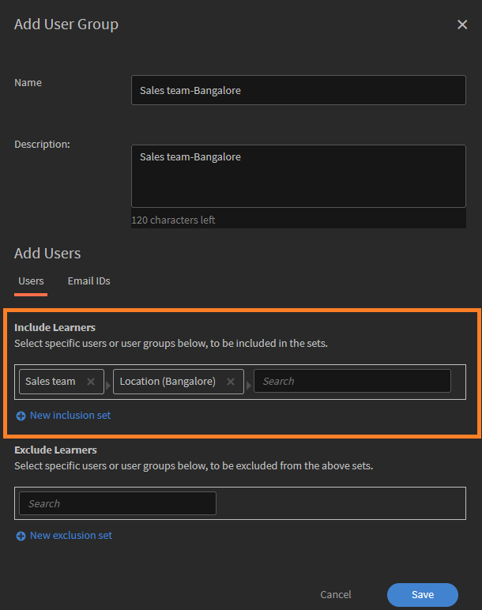

# Adobe Learning Manager中的用户组

Adobe Learning Manager中的用户组可帮助您根据部门、位置或角色等常见属性来组织学习者。 将用户分组可以更轻松地同时为多个用户分配课程、管理权限和跟踪学习进度。

>[!INFO]
>
>观看这次ALM学院培训，了解如何按姓名、电子邮件ID创建用户组，并将多个自动生成的用户组组合。   

## 用户组的类型

Adobe Learning Manager支持以下用户组：

1. **自动生成的用户组：**&#x200B;在Adobe Learning Manager中，系统会根据用户角色和属性自动创建某些用户组。 这些系统定义的组包括“所有作者”、“所有管理员”、“所有学习者”和“所有经理”。 Adobe Learning Manager会生成这些组，以帮助按角色组织用户。 不能重命名或删除这些系统定义的组。

2. **自定义用户组：**&#x200B;在Adobe Learning Manager中，管理员可以创建自定义用户组，以根据特定条件组织学习者。 这些组是动态的，可自动添加满足所定义条件的用户。 自定义组可帮助分配目标学习路径、应用自定义品牌推广并生成重点报告。 它们是管理和个性化学习体验的灵活工具。

## 创建自定义用户组

管理员手动创建用户组以根据定义的属性整理用户。 这些组可以是动态的，可自动添加符合指定条件的用户。 用户组可简化分配学习路径、应用自定义品牌和生成目标报告等任务。

要创建自定义用户组，请执行以下操作：

1. 在管理员主页上，选择&#x200B;**用户**。
2. 选择“**用户组**”，然后选择“**添加**”。

   
   _用于在“用户组”页面中添加新用户组的按钮_

3. 键入组名称和说明。

   
   _输入字段以输入组名和可选说明_

## 将用户添加到用户组

管理员可以通过两种方式将用户添加到用户组：

### “用户”部分

管理员可以使用包含和排除集在“用户”部分中添加或删除用户或用户组。

* **包含集**&#x200B;将用户添加到自定义用户组。 您可以包含一个或多个用户组，Adobe Learning Manager使用逻辑(AND/OR)来决定包含哪个用户。 请参阅此[部分](#_Inclusion_and_exclusion)，了解有关AND/OR逻辑的详细信息。
* **排除集**&#x200B;从组中删除用户，即使这些用户是包含集的一部分。 这样将优化组的用户列表。

要将用户添加到组，请执行以下操作：

1. 在&#x200B;**包含学习者**&#x200B;字段中搜索并选择用户或现有用户组。

_包含设置，用于将特定用户或组添加到自定义用户组_

### “电子邮件ID”部分

1. 以逗号分隔、分号或换行符格式键入用户电子邮件地址，将用户添加到组。

2. 选择&#x200B;**验证电子邮件Id**。

   
   _选择“验证电子邮件ID”以验证输入的电子邮件ID_

   如果Adobe Learning Manager没有电子邮件ID或电子邮件ID不正确，您将看到错误。

   
   _用于手动输入多个电子邮件地址以将用户添加到组的字段_

3. 选择&#x200B;**保存**&#x200B;以创建组。

## 从组中排除用户

管理员可以将特定用户从用户组中排除，即使他们符合该组的条件。 当您想要进行例外处理时，例如防止某些用户接收指定的课程或出现在链接到该组的报告中，此功能非常有用。

要在创建自定义用户组时排除特定用户或整个用户组，请执行以下操作：

1. 选择任何&#x200B;**用户组**，然后选择&#x200B;**添加**。
2. 导航至&#x200B;**“排除学习者”**&#x200B;部分。
3. 选择要排除的用户或组。

_用于从自定义组中删除用户或组的排除设置_

## 查看组成员

管理员可以查看用户组中用户的列表，包括名称、电子邮件ID和状态等详细信息。 要查看用户列表，请执行以下操作：

1. 选择&#x200B;**用户**，然后选择&#x200B;**用户组**。
2. 选择一个组，然后选择&#x200B;**No中的值。 人员**&#x200B;列。

_当前包含在所选用户组中的用户列表_

_所选用户组上可用的用户列表_

## 下载组成员

管理员可以下载组成员列表以查看用户详细信息，包括名称、电子邮件、状态、添加日期（UTC时区）、删除日期（UTC时区）和上次登录日期（UTC时区）。 这有助于跟踪、报告和审核组成员资格。

1. 选择&#x200B;**用户**，然后选择&#x200B;**用户组**。
2. 选择组旁边的下载图标以将报告导出为CSV文件。

_下载图标以将组成员数据导出为CSV文件_

以下是组成员报表的列：

* **名称**：用户的名称
* **电子邮件**：使用的电子邮件ID
* **状态**：用户的状态（“已注册”或“未注册”）。
* **添加日期（UTC时区）**：以UTC时区添加用户的日期。
* **删除日期（UTC时区）**：以UTC时区删除用户的日期。
* **上次登录日期（UTC时区）**：用户上次登录UTC时区的日期。

_示例CSV包含用户详细信息_

## 编辑用户组

管理员可以编辑组以更改其名称、描述或其他详细信息。

要编辑用户组，请执行以下操作：

1. 在管理员主页上选择&#x200B;**用户**。
2. 选择&#x200B;**用户组**。
3. 选择要编辑的用户组。
4. 进行必要的更改，例如更新名称、描述或其他详细信息。
5. 选择&#x200B;**保存**&#x200B;以应用更改。 更改将应用于用户组。

_用于修改用户组名称、描述或成员资格规则的字段_

## 删除用户组

管理员可以删除不再需要的用户组，以保持组列表井井有条且保持最新。

要删除用户组，请执行以下操作：

1. 选择&#x200B;**用户**，然后选择&#x200B;**用户组**。
2. 选择要删除的组。
3. 选择&#x200B;**操作**，然后选择&#x200B;**删除**。

   
   _“操作”菜单中的“删除”选项可删除用户组_

4. 出现提示时，确认删除。 将从Adobe Learning Manager中删除用户组。

## 下载用户组报告

Adobe Learning Manager的用户组报告为管理员和经理提供了对不同用户组（如部门、角色或外部合作伙伴）表现的洞察。 这些报告允许按组进行比较，以评估学习进度、课程完成率和参与级别。

要下载报告，请执行以下操作：

1. 选择&#x200B;**用户**，然后选择&#x200B;**用户组**。
2. 选择&#x200B;**操作**，然后选择&#x200B;**下载用户组报告**。

_从“操作”菜单下载组级别信息和元数据的选项_

此报告包括：

| 列 | 描述 |
|---|---|
| 用户组类型 | 用户组的类别，如自动生成或自定义组。 |
| 名称 | 分配给用户组的名称。 |
| 描述 | 有关用户组用途或范围的简要说明。 |
| 创建者（名称） | 创建组的管理员的全名。 |
| 创建者（电子邮件） | 创建组的管理员的电子邮件地址。 |
| 创建时间（UTC时区） | 创建组的日期和时间，以协调世界时(UTC)显示。 |
| 用户数 | 组中当前包含的用户总数。 |

_用户组报告包含所有字段_

## 用于创建自定义用户组的包含和排除规则

通过添加自动生成或现有用户组创建&#x200B;**自定义用户组**&#x200B;时，Adobe Learning Manager会根据&#x200B;**AND/OR逻辑**&#x200B;应用特定的&#x200B;**包含和排除规则**。 这些规则取决于用户组在包含和排除集中的组合方式。

您可以将一个或多个自动生成的用户组添加到包含集中。 应用的逻辑取决于您选择这些组的方式：

### 在用户组中使用AND逻辑

如果在同一包含集中选择多个用户组，则用户必须满足要包含的所有条件。

例如，

* 销售团队组：120个用户
* 地点（班加罗尔）组：80个用户
* **两个**&#x200B;组中的常见用户：40个用户

Adobe Learning Manager使用AND逻辑创建只有40个用户的组。 这些用户是销售团队的成员，并且也位于班加罗尔，同时满足两个条件。

_使用AND逻辑显示多个组的示例_

### 在用户组中使用OR逻辑

如果在单独的包含集中添加用户组，则会包含满足任何条件的用户。 例如：

* 销售团队组：120个用户
* 地点（班加罗尔）组：80个用户
* 任一组中的用户总数：160个用户（某些用户可能同时位于两个组中）

使用OR逻辑时，Adobe Learning Manager将添加销售团队中或位于班加罗尔的用户。 这意味着它包括匹配两个条件中任意一个的用户。 因此，该组在删除重复项后包括160个用户。

_显示使用OR逻辑合并多个组的示例_
