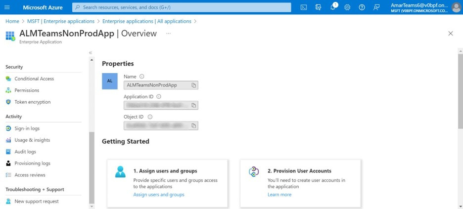

# 适用于 Microsoft Teams 的 Adobe Learning Manager 应用程序

## 设置方式

要在 MS Teams 上设置 ALM，您需要执行三个步骤，并寻求 ALM 管理员和 Microsoft Azure 管理员的协助。 在某些组织中，Azure 管理员与 MS Teams 管理员并不相同，因此还需要额外的 MS Teams 管理员。

**ALM管理员 — 集成管理员角色可审批团队应用程序**

在集成管理员批准MS Teams应用程序后，即可在MS Teams应用商店中使用AdobeLearning Manager应用程序，并且学习者可以访问它。 但是，该应用程序将不会发送通知和允许无提示登录，并且 MS Teams 不会为其学习者置顶该应用程序。

**Microsoft Azure管理员在Azure仪表板中批准ALM应用程序的权限**

Azure 管理员必须批准 ALM 应用程序所需的权限。 这将让 ALM 应用程序可以向 MS Teams 发送通知并允许无提示登录。 无提示登录时，用户无需在浏览器上单独登录 Adobe Learning Manager。

**MS Teams管理员为ALM团队创建策略**

MS Teams 管理员应在 Admin Center 中为所有用户置顶 ALM 应用程序，并允许将其作为全局策略。 如果 ALM 仅由公司中的某个组使用，则 MS Teams 管理员必须选择自定义策略，并将其仅应用于该特定组。

## 集成管理员角色可审批团队应用程序

请按以下步骤操作：

1. 在集成管理员应用程序上，选择 **[!UICONTROL 应用程序]** > **[!UICONTROL 特色应用程序]**，然后选择 **[!UICONTROL ALM Teams应用程序]**.

   
   *选择ALM Teams应用程序*

1. 在屏幕右上角，选择 **[!UICONTROL 批准]**.

   
   *在应用程序设置页面上选择批准*

1. 选择 **[!UICONTROL 确定]** 在出现的对话框中，执行以下操作。

   
   *批准后选择确定*

1. 获得批准后，即可在“外部应用程序”部分中看到“ALM Teams应用程序”。

   
   *ALM Teams应用程序将显示在应用程序页面上*

现在，用户可以在MS Teams上访问ALM应用程序。

## Microsoft Azure 管理员在 Azure 信息板中批准 ALM 应用程序的权限

请按以下步骤操作：

1. 以Azure管理员身份，导航到Azure仪表板中的“管理Azure Active Directory”部分。

   
   *启动Azure仪表板*

1. 将以下链接粘贴到单独的浏览器窗口中：

   `https://login.microsoftonline.com/<tenantIdTobeReplaced>/oauth2/authorize?client_id=8d349d9f-bf59-4ece-8022-a41e87d81903&response_type=code&redirect_uri=https://learningmanager.adobe.com`

1. 在上方链接中，将 `<tenantIdTobeReplaced>` 租户ID处于可用状态，请参阅下面的“概述”页面。 输入新的URL。

1. 将AdobeLearning Manager应用程序添加到您的Azure应用程序。

   
   *添加到Azure*

1. 选择“企业应用程序”选项卡，然后选择“所有应用程序”。 您将看到此处列出了ALMTeamsApp。

   
   *查看ALM应用程序*

1. 单击该应用程序，然后导航到“权限”选项卡。

   
   *查看“权限”选项卡*

1. 在“权限”选项卡中，选择“ **[!UICONTROL 授予MSFT管理员许可]**&#39;以授予ALM Teams应用程序权限。

   
   *选择权限*

1. 选择 **[!UICONTROL 接受]**.

   
   *选择接受*

1. 授予这些权限后，ALM应用程序将允许静默登录，并在MS Teams应用程序中将通知发送给学习者。

   
   *已授予访问权限*

## MS Teams 管理员为 Teams 应用程序创建策略

请按以下步骤操作：

1. 作为MS Teams管理员，请在管理中心创建用于将Teams应用程序添加到学习者Teams应用程序的策略。

   
   *创建策略*

1. 导航到“设置策略”部分。 创建全局策略并选择 **[!UICONTROL 添加应用程序]** 在固定的应用程序子部分中。

   
   *添加策略*

1. 在随后出现的对话框中，搜索&#x200B;**[!UICONTROL “Adobe Learning Manager”]**，然后添加该应用程序。 此操作会在“已安装的应用程序”部分添加AdobeLearning Manager。

   
   *安装应用程序*

1. 保存此策略。 这使该应用程序可供组织中的所有人使用。

或者，管理员可以创建自定义策略而非全局策略。 将AdobeLearning Manager添加到该自定义策略，然后仅将自定义策略应用于需要访问AdobeLearning Manager的用户组。
