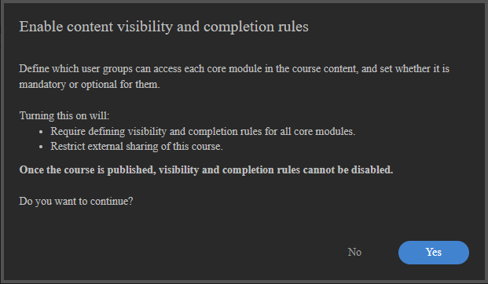
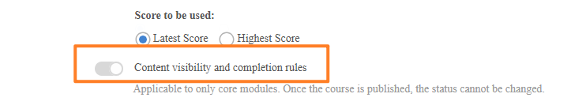

# 面向作者的自适应课程

## 创建和配置自适应课程

使用按模块可见性和完成规则构建课程，以便不同学习者根据其用户组看到并完成不同的内容。

>[!NOTE]
>
>只有在为您的帐户启用了&#x200B;**可见性和完成规则**&#x200B;时，自适应课程类型才可用。 如果看不到创建自适应课程的选项，请让管理员启用自适应学习。

### 创建自适应课程

1. 以作者身份登录Adobe Learning Manager 。

   

2. 在左侧导航栏中选择&#x200B;**课程**。 然后选择&#x200B;**添加**。
3. 输入课程名称、描述和其他详细信息。
4. 选择&#x200B;**内容可见性和完成规则**&#x200B;切换开关。

   

5. 在确认对话框中选择&#x200B;**是**。

   

   **将模块添加到自适应课程**

   添加所需的模块。 通过上传内容、从内容库中选择或者添加教室或虚拟教室会话来添加内容模块。

   **支持自适应规则的模块类型（内容模块）：**

   * 自学电子教学
   * 教室授课
   * 虚拟教室会话
   * 活动模块

   **不支持自适应规则的模块类型：**

   * **准备工作模块：**&#x200B;在核心内容开始之前向所有学习者显示。 不能设置可见性或完成规则。
   * **测试模块：**&#x200B;适用于所有学习者。 无论内容模块状态如何，完成测试都会完成整个课程。 不能设置可见性或完成规则。
   * **工作辅助：**&#x200B;始终对所有已注册的学习者可见。

6. 选择&#x200B;**添加**。

### 为每个模块配置可见性和完成规则

添加内容模块后，配置其自适应规则：

1. 选择要配置的模块。
2. 在模块设置中，找到&#x200B;**可见性和完成规则**&#x200B;部分。

   

3. 选择&#x200B;**添加规则**&#x200B;以添加可查看此模块的用户组。

   

   

   这些组中的学习者可以在课程中看到该模块，但他们无需完成该模块，除非他们也处于必修状态。

4. 选择&#x200B;**“保存”**。
5. 对课程中的每个内容模块重复此操作。

**键规则：**

* 如果有任何组将模块设为必修，则该学习者为必修。
* 在可以发布之前，您必须为至少一个用户组将至少一个模块配置为&#x200B;**必修**。 在满足该条件之前，系统会阻止发布。

### 处于草稿状态的课程

课程处于草稿状态时，表示整个自适应结构可以在锁定学习者之前进行充分设计、配置和优化。 在此阶段，作者可以定义课程是应该作为自适应课程还是常规课程运行，并且在课程发布之前，此决定始终可逆。 这使草稿阶段变得至关重要，因为这是能够确立或更改课程的核心适应性质的唯一方面。

在草稿中，作者可以完全控制课程结构。 他们可以自由添加、删除和重新排序模块，以塑造预期的学习流程。 同时，他们可以通过为每个模块定义可见性规则来配置精细级别的自适应行为。 这些规则确定哪些用户组可以访问特定模块，使课程能够在以后提供个性化的学习体验。 除了可见性之外，作者还可以定义完成规则，将模块标记为不同用户组的必需或可选模块。 系统要求至少必须有一个模块，以确保达到有意义的完成标准。

草稿状态还允许不受限制地编辑自适应逻辑。 作者可以迭代添加、修改或删除规则，而无需任何系统限制，从而使在完成课程之前尝试不同的配置成为可能。 除了自适应设置外，所有标准课程元素均保持可编辑状态，包括课程元数据（如标题和描述），以及基础学习内容（包括SCORM模块或其他资源）。

了解草稿中的自适应配置仅适用于核心课程模块非常重要。 其他组件（如预习或测试内容）不支持自适应规则，并且不受可见性或完成配置的影响。

最后，草稿状态是在发布之前验证课程设置的最后机会。 课程发布后，自适应配置将永久保留且无法恢复。

### 学习者预览

选择&#x200B;**“学习者预览”**&#x200B;将显示课程中的所有模块，而不考虑用户组规则。 这可以为作者和管理员提供课程结构的完整视图。 生产环境中的学习者只能看到其用户组显示的模块。

### Publish自适应课程

发布自适应课程的工作流程与发布常规课程的工作流程相同。

配置完所有模块及其规则后，选择&#x200B;**Publish**。

课程发布后，即可注册课程。 学习者在打开课程时只能看到为其用户组配置的模块。

>[!IMPORTANT]
>
>发布后，您无法将课程从“自适应”切换为“常规”，反之亦然。 在发布之前验证您的配置。

### 目录共享行为

当包含自适应课程的目录在外部共享到配对帐户时，适用以下行为：

* **直接共享的自适应课程：**&#x200B;自适应课程从共享目录中排除。 它们不会出现在接收帐户中。
* **学习路径或认证中的自适应课程：**&#x200B;如果共享包含自适应课程的学习计划或认证，则会将学习计划或认证本身复制到接收帐户。 其中的自适应课程已复制为&#x200B;**常规课程** — 自适应配置（包括所有可见性和完成规则）不会被复制。 接收帐户中的作者可将课程视为常规课程，所有模块均对所有学习者可见。
* **设为先决条件的自适应课程：**&#x200B;如果将自适应课程配置为正在共享的常规课程、学习路径或认证的先决条件，则先决条件关系不会传播到接收帐户。 父课程或学习对象无需先决条件即可进入接收帐户。

>[!NOTE]
>
>由于在目录共享期间不会复制自适应配置，因此请在外部共享目录之前查看所有先决条件关系和LP/认证结构。 接收帐户中的学习者将不会遇到与源帐户中的学习者相同的自适应行为。

### 更新已发布的自适应课程

您可以随时更新已发布的自适应课程。 更改对注册的学习者近乎实时生效。

请注意，您无法再更改自适应课程中的可见性设置。 不能将课程设置为非自适应课程。

>[!NOTE]
>
>无法在切换实例时轮候学习者，注册将被阻止。

### 添加或修改模块

1. 打开已发布的课程。
2. 选择&#x200B;**“编辑”**。
3. 添加、编辑或删除模块并调整其可见性和完成规则。
4. 重新发布课程。

**影响：**

| 更改 | 对已注册的“进行中”学习者的影响 |
|---|---|
| 添加了新的必修模块（学习者的用户组可见） | 模块被添加到他们的完成要求中。 如果模块为教室或虚拟教室会话，且没有剩余名额，则学习者会在该模块中轮候。 |
| 模块对学习者的用户组已移除或隐藏 | 模块已从其完成要求中移除。 如果这是最后一个必修模块，则课程会为学习者自动完成。 |
| 学习者用户组的模块已从“必填”更改为“可选” | 模块仍然可见；学习者无需完成模块即可完成课程。 |
| 已添加新的必修模块（学习者已完成课程） | 模块对学习者可见，但不会自动获得名额或访问它。 仅当触发刷新完成时，才能访问新模块。 |

>[!NOTE]
>
>**有序学习路径：**&#x200B;当有序学习路径中包含自适应课程时，在自适应课程中没有可见模块的学习者将无法完成该课程。 这样会阻止有序学习路径中的所有后续项目变得可访问。 确保注册学习路径的每个学习者都至少属于一个用户组，从而使至少一个模块在路径中的每个自适应课程中均可见。

>[!NOTE]
>
>**常规学习路径 — 自动取消注册：**&#x200B;当学习者因用户组更改移除了其所有可见模块而自动取消注册常规学习路径中的自适应课程时，父级学习路径仍处于注册状态。 学习路径不会自动取消注册。 即使不再提供自适应课程，学习者仍会在成绩单中看到学习路径已注册。 如果您的用例要求在自适应课程注册时也取消注册学习路径，请使用&#x200B;**自适应学习路径**&#x200B;而不是常规学习路径。

### 实例切换行为

切换自适应课程实例的学习者可以延续其学习进度：

* 他们已完成的模块在新实例中保持已完成。
* 名额仅对新实例中未完成的可见模块使用。
* 当实例无可用名额时，他们不能进行轮候。 将阻止注册。

## 管理自适应课程中的名额限制和轮候表

Adobe Learning Manager中的自适应课程会在单个教室或虚拟教室会话级别上实施名额限制。 与常规课程不同（常规课程中的完整会话会阻止整个注册），自适应课程会立即注册学习者，仅在没有名额的特定会话中轮候。 学习者可以不间断地访问所有其他模块。

### 自适应课程中席位限制的作用方式

当学习者注册包含教室或虚拟教室模块的自适应课程时，系统会根据用户组仅对学习者可见的会话检查席位的可用性。

* 如果所有可见教室或虚拟教室会话都有名额，则学习者会注册并立即拥有完全访问权限。
* 如果一个或多个可见会话没有可用名额，则学习者注册并立即仅轮候这些特定会话。 他们可以立即开始并完成所有其他模块。

### 轮候表限制

在常规课程中，讲师可以配置&#x200B;**轮候表限制**，即可以列入会话轮候表的学习者数量上限。

在自适应课程中，**轮候表限制**&#x200B;设置在讲师应用程序中禁用，无法配置。 在自适应课程中，可以轮候会话的学习者数量没有上限。 会话已满时，尝试注册的所有学习者会不受限制地轮候。

下表介绍了适应性课程的所有名额和轮候表情景。

| 注册时的条件 | 结果 |
| --- | --- |
| 所有可见的CR/VC会话都有可用席位 | 注册并完全访问所有模块 |
| 一个或多个可见的CR/VC会话已满 | 已注册；仅轮候完整的会话；可立即访问所有其他模块 |
| 学习者已注册；作者添加了新的强制性CR/VC会话，无席位 | 新会话中轮候的学习者；现有进度和访问权限不受影响 |
| 学习者取消注册 | 所有名额会立即释放；按注册日期顺序清除下一个轮候学习者 |
| 用户组更改会从学习者的可见组中删除会话 | 立即释放座位 |
| 学习者完成课程；新的强制CR/VC会话变为可见 | 模块可见，但未自动分配座席。 学习者必须触发刷新完成才能访问会话。 |
| 管理员或讲师分配席位 | 该学习者的所有轮候CR/VC会话将被同时清除 |

>[!NOTE]
>
>**Flex学习路径行为：**&#x200B;当自适应课程是Flex学习路径的一部分时，轮候行为不同于直接注册。 如果学习者在Flex LP中选择了自适应课程实例，但该实例无可用名额，则学习者将为该特定实例轮候。 此方案的轮候学习者信息仅在&#x200B;**管理员> [自适应课程] >轮候表**&#x200B;中可见，它不会显示在&#x200B;**管理员>学习路径**&#x200B;中。 选中自适应课程自己的“轮候表”选项卡，以管理通过Flex学习计划轮候的学习者。

当您下载属于Flex学习PDF一部分的自适应课程中的&#x200B;**出席情况报告**&#x200B;时，轮候学习者会显示在该PDF的&#x200B;**活动**&#x200B;部分下。 这是因为“学习路径”界面没有单独的“轮候表”部分。 使用&#x200B;**“管理员”>“[自适应课程]”>“轮候表**”识别轮候学习者，并在标记出席情况之前将其与确认的与会者区分开来。

### 查看轮候表

1. 在管理员视图中打开自适应课程。
2. 选择&#x200B;**学习者**。
3. 选择“**轮候表**”选项卡。

轮候表选项卡列出了已轮候一个或多个模块的学习者。 对于自适应课程，该报告属于课程实例模块级别而不是课程实例级别，因为学习者可能正在学习某些模块，同时在其他模块上轮候。

### 清除轮候表并分配名额

当由于学习者取消注册、名额限制增加或手动分配而导致有名额可用时，会在注册日期顺序（最早注册日期优先）中清除轮候学习者。

要为一个或多个学习者手动分配名额，请执行以下操作：

1. 打开自适应课程。
2. 选择“**学习者**”>“**轮候表**”选项卡。
3. 选中要为其分配名额的一个或多个学习者旁边的复选框。
4. 选择&#x200B;**分配席位**。

选择“分配名额”会同时从轮候表清除所有轮候会话上的选定学习者，而不仅是目前查看的会话。 系统假定已为学习者实际或虚拟地安排了座位。

**轮候表清除触发器：**

出现以下任一情况时，会自动处理轮候表：

* 学习者取消课程注册（释放其在所有会话中的席位）
* 增加会话的名额限制
* 学习者切换实例
* 由管理员或讲师分配席位

>[!NOTE]
>
>当您创建自适应课程的新实例时，**通知轮候学习者**&#x200B;选项不可用。 这是预期行为，与常规课程不同。

在常规课程中，轮候表会在实例级别进行跟踪，因此系统可以在打开新实例时提示您通知轮候学习者。 在自适应课程中，轮候表在单个教室或虚拟教室&#x200B;**会话**&#x200B;级别而不是实例级别进行跟踪。 创建新实例时，没有要通知的实例级别轮候表，因此不会显示提示，也不会发送自动通知。

## 为自适应课程触发刷新完成

Adobe Learning Manager中的刷新完成情况允许学习者在学习要求发生变化时，重新评估其自适应课程完成情况。 在学习者的用户组发生更改、作者更新模块规则或学习者希望根据当前配置文件重新学习自适应课程时，此功能相关。

### 刷新完成的功能

在自适应课程中，学习者完成课程时其用户组决定的必修模块集。 如果学习者的用户组以后发生变化，或者作者添加了新的必修模块，则学习者可能需要完成其他内容，以满足其新配置文件的要求。

刷新完成执行两项操作：

1. 如果学习者现在有未完成的新必修模块，可回退其现有的课程完成情况。
2. 在学习者成绩单中创建一个新记录，表示更新后的完成要求。

学习者成绩单上的原始完成记录会作为历史条目保留。 以前完成的模块仍然已完成。 学习者无需重复上述步骤，除非这些模块为以前不可见或未完成的特定新必修模块。

### 刷新完成时

**场景1：用户组更改会添加新的必修模块**

学习者完成了一门自适应课程。 以后会更改其用户组，并且新的用户组会将以前隐藏的模块或可选模块设为必修模块。

* 现有完成条目将保留在学习者成绩单中。
* 如果学习者有新的未完成必修模块，则会创建新的“学习者成绩单”行，并且课程显示为“进行中”。
* 学习者必须完成新的必修模块，才能达到新的完成状态。

**场景2：用户组更改导致没有新的必修模块**

学习者完成了一门自适应课程。 其用户组会更改，但新用户组的要求已由其现有完成满足。

* 课程仍处于完成状态。
* 未创建新的学习者成绩单行。
* 学习者无需执行任何操作。

**场景3：学习者发起的重新拍摄**

已完成自适应课程的学习者可以选择重新参加以在其当前用户组配置文件下完成该课程。 当学习者的角色在最初完成之后发生更改时，此功能非常有用。

1. 学习者打开已完成的自适应课程。
2. 学习者选择重新参加或重新启动课程的选项。
3. 将使用当前用户组重新评估课程，以确定新的必修模块集。
4. 此时将创建新的学习者成绩单行。

**场景4：测试模块行为**

如果学习者在触发刷新完成之前完成了测试模块，则测试完成在刷新之后仍然有效。 系统评估课程完成情况（由任何模块完成或学习者操作触发）后，如果测试已经完成，课程将再次自动完成，除非课程包含其他现在需要且未完成的必需内容模块。

>[!NOTE]
>
>如果在学习者通过测试完成自适应课程后，向自适应课程中添加了新的教室或虚拟教室会话，并且随后触发了刷新完成，则学习者可能无法自动在新会话的&#x200B;**出席情况与得分**&#x200B;选项卡或&#x200B;**轮候表**&#x200B;中显示。 发生这种情况的原因在于，测试完成操作会使课程保持已完成状态，并且不会重新触发名额分配逻辑。 如果需要跟踪测试学习者在新添加会话中的出勤情况，请从&#x200B;**轮候表**&#x200B;选项卡手动分配他们的名额。 请注意，建议不要使用测试模块来进行适应性课程。

**情形5：管理员触发的刷新**

如果学习者的个人资料发生更改，而管理员确定现有完成记录不再反映当前要求，则管理员可以代表学习者触发刷新完成。

>[!CAUTION]
>
>如果自适应课程是循环认证的一部分，则刷新完成仅适用于学习者在根认证周期中的注册。 后续的递归周期包含不受刷新影响的自适应课程的单独实例。 注册了循环周期的学习者看不到模块更新，也不会回滚其完成情况。 如果您的组织在循环认证中使用自适应课程，请在触发刷新完成之前将此限制告知管理员

1. 在管理员视图中打开学习者配置文件或课程的“学习者”选项卡。
2. 查找学习者注册。
3. 选择&#x200B;**刷新可见性和完成**。

ALM会根据学习者的当前用户组重新评估必修模块，如果存在新的必修模块，则会回退完成结果。
